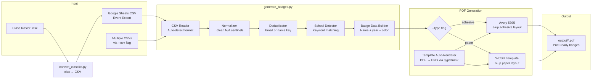

This tool produces **print-ready name badge PDFs** for the WCSU Alumni Association Meet & Greet event. You provide one or more CSV files exported from Google Sheets (or converted from class rosters), and the script reads registrant names, school affiliations, and graduation years — then lays out color-coded badges on standard Avery 5395 adhesive sheets or a branded WCSU paper template. No design software, no manual formatting, and no guesswork about which school color a badge should be.

The entire system runs as a single Python script — [generate_badges.py](generate_badges.py) — backed by five lightweight dependencies. Template PDFs and the WCSU Alumni Association logo are committed to the repository so everything works out of the box on a fresh clone. A companion utility, [convert_classlist.py](convert_classlist.py), handles the common case where attendee names live in an `.xlsx` class roster rather than a Google Sheets export.

Sources: [README.md](README.md#L1-L10), [CLAUDE.md](CLAUDE.md#L1-L8), [requirements.txt](requirements.txt#L1-L7)

## How It Works: The End-to-End Pipeline

The badge generator follows a straightforward data-in, PDF-out pipeline. A CSV file is the single input; a print-ready PDF is the single output. Between those two points, the script normalizes data, detects school affiliations, builds badge content dictionaries, and renders them onto the chosen template. The diagram below shows the full flow at a glance.



Each stage in the pipeline handles a specific concern. The **CSV reader** auto-detects whether a file uses the Google Sheets "event export" column names (e.g., `Attendee (First Name)`) or a simpler "class roster" format (e.g., `First Name`), so you never need to reformat your data. The **normalizer** collapses common N/A sentinels like `"N/A"`, `"None"`, `"TBD"`, and `"-"` into empty strings so they don't leak onto printed badges. The **deduplicator** prevents the same person from appearing twice — even across multiple input files — by matching on email address first, then falling back to first+last name.

Sources: [generate_badges.py](generate_badges.py#L241-L284), [generate_badges.py](generate_badges.py#L286-L338), [generate_badges.py](generate_badges.py#L339-L379)

## Two Badge Formats: Adhesive Labels and Paper Cards

The generator supports two physically different badge formats, selected with the `--type` command-line flag. **Adhesive is the default** because it's the fastest on event day — print onto Avery 5395 sheets, peel, and stick. The paper format produces larger, more visually prominent badges on WCSU-branded cardstock templates.

| Feature | Adhesive (default) | Paper |
|---|---|---|
| **Template** | Avery 5395 adhesive labels | WCSU branded paper template |
| **Badges per page** | 8 (2 columns × 4 rows) | 6 (2 columns × 3 rows) |
| **Badge dimensions** | 3-3/8″ × 2-1/3″ (243 × 168 pt) | 4-1/4″ × 3-2/3″ (306 × 264 pt) |
| **Media** | Avery 5395 label sheets | Letter-size cardstock (65–80 lb) |
| **Color indicator** | Full-width header band at top | Colored circle (24 pt radius) |
| **Logo** | WCSU AA logo below header | Included in template background |
| **Cutting required** | No — peel and stick | Yes — cut along grid lines |
| **CLI flag** | `--type adhesive` (or omit) | `--type paper` |

Both formats share the same data pipeline, school detection logic, and name rendering engine. The only difference is the layout geometry and visual design of the final PDF page.

Sources: [generate_badges.py](generate_badges.py#L7-L10), [generate_badges.py](generate_badges.py#L68-L70), [generate_badges.py](generate_badges.py#L98-L118), [CLAUDE.md](CLAUDE.md#L70-L82)

## Automatic School Color Assignment

Every badge is color-coded by the attendee's WCSU school affiliation. The script determines this automatically by scanning the `Class / Major` and `Community Business/Organization` fields for subject keywords — no manual categorization needed. Faculty/Staff and Community registrants are routed by their `Registration Options` value directly.

| Color | School / Group | Hex Code | Example Keywords |
|---|---|---|---|
| 🟠 Orange | Ancell School of Business | `#E8702A` | accounting, finance, marketing, MBA |
| 🔵 Navy | School of Arts & Sciences | `#1B3A6B` | biology, psychology, nursing, computer science |
| 🟣 Purple | School of Visual & Performing Arts | `#8E44AD` | graphic design, theater, music, film |
| 🟢 Green | School of Professional Studies | `#27AE60` | education, counseling, health administration |
| 🟡 Dark Gold | Faculty / Staff | `#D4AC0D` | (detected via Registration Options) |
| ⬜ Gray | Community Guest | `#7F8C8D` | (detected via Registration Options) |

If no keywords match, the badge falls back to light gray (`#95A5A6`). This usually means the `Class / Major` field in the CSV is blank or contains a value the keyword lists don't recognize — a situation covered in the [Fixing Gray (Unmatched) Badges by Updating CSV Major Fields](25-fixing-gray-unmatched-badges-by-updating-csv-major-fields) troubleshooting page.

Sources: [generate_badges.py](generate_badges.py#L119-L145), [generate_badges.py](generate_badges.py#L148-L183)

## Project Structure

The repository is intentionally flat — two Python scripts, one requirements file, and a handful of asset directories. Template PDFs and the logo are committed so the project works immediately after cloning. Generated outputs and registrant data (which contains PII) are gitignored and never committed.

```
wcsu-badge-generator/
├── generate_badges.py          ← Main badge generation script (791 lines)
├── convert_classlist.py        ← xlsx → CSV converter for class rosters
├── requirements.txt            ← 6 Python dependencies
├── CLAUDE.md                   ← AI assistant context (architecture reference)
├── README.md                   ← User-facing documentation
│
├── template/                   ← Committed assets (auto-renders PNGs on first run)
│   ├── badge_template.pdf      ← WCSU paper badge template (single page)
│   ├── wcsu_aa_logo.png        ← Alumni Association logo (258×75 px)
│   ├── template_blank.png      ← [auto-generated] rendered from badge_template.pdf
│   └── avery_blank.png         ← [auto-generated] rendered from Avery PDF
│
├── docs/                       ← Reference assets and sample images
│   ├── Avery5395AdhesiveNameBadges.pdf  ← Avery 5395 blank template
│   ├── sample_badge.png                ← Example adhesive badge
│   ├── sample_badge_adhesive.png       ← Adhesive badge color legend
│   ├── sample_badge_paper.png          ← Example paper badge
│   ├── badge_color_legend.png          ← All 6 school colors (paper)
│   └── badge_color_legend_adhesive.png ← All 6 school colors (adhesive)
│
├── data/                       ← Input CSVs (gitignored — PII)
│   └── registrants.csv         ← Main registrant export from Google Sheets
│
└── output/                     ← Generated PDFs (gitignored — regenerated each run)
    ├── 2026_MeetGreet_NameTags_Adhesive.pdf
    └── 2026_MeetGreet_NameTags_Paper.pdf
```

The `template/` directory deserves special attention. Two PNG files — `template_blank.png` and `avery_blank.png` — are **auto-generated on first run** from their corresponding source PDFs using the pypdfium2 library at 3× render scale. They exist so ReportLab can composite badge content onto a pixel-perfect background without re-rendering the PDF every time. If you ever replace a source PDF, simply delete the corresponding PNG and it regenerates on the next run.

Sources: [.gitignore](.gitignore#L1-L49), [CLAUDE.md](CLAUDE.md#L14-L32), [generate_badges.py](generate_badges.py#L561-L575)

## Technology Stack

The project uses a minimal, well-tested Python toolchain:

| Package | Version | Role |
|---|---|---|
| **reportlab** | 4.2.5 | PDF generation engine — draws text, shapes, and images onto pages |
| **pypdfium2** | 4.30.0 | Renders template PDFs to PNG at high resolution for background compositing |
| **Pillow** | 11.1.0 | Image handling — provides `ImageReader` for ReportLab's `drawImage` |
| **openpyxl** | 3.1.5 | Reads `.xlsx` class roster files in the companion converter script |
| **pypdf** | 4.3.1 | General PDF utilities |
| **pdfplumber** | 0.11.4 | Extracted precise Avery 5395 cell measurements from the template PDF |

Python 3.10 through 3.13 is supported, with **3.13 recommended**. The standard library's `csv`, `re`, `os`, and `textwrap` modules handle all data processing — no database, no web framework, no external API calls.

Sources: [requirements.txt](requirements.txt#L1-L7), [README.md](README.md#L70-L72)

## Three Core Workflows

Depending on your role and what data you have, the generator supports three primary workflows:

**1. Standard Event Run** — Export registrants from Google Sheets to CSV, run the script with default settings, and print adhesive badges on Avery 5395 sheets. This is the most common path for event coordinators.

**2. Paper Badge Generation** — Same CSV input, but add `--type paper` to produce larger branded badges on cardstock. Use this when you want a more formal look or don't have Avery labels on hand.

**3. Blank Walk-In Sheets** — Run with `--blank` to generate pre-printed sheets (one page per school color) with colored headers but no attendee names. Volunteers hand-write names for walk-in guests directly on the badges at the registration table. No CSV file is needed for this workflow.

All three workflows are covered step-by-step in the following Getting Started pages.

Sources: [README.md](README.md#L90-L175), [generate_badges.py](generate_badges.py#L742-L791)

## Where to Go Next

This overview introduced the project's purpose, pipeline architecture, and key features. The Getting Started section below walks you through each workflow with concrete commands and expected output. If you prefer to understand the internal mechanics before running anything, the Deep Dive section breaks down every subsystem — from CSV parsing to pixel-level layout math — in dedicated pages.

**Getting Started** (recommended reading order):

1. [Quick Start: Environment Setup and First Badge Run](2-quick-start-environment-setup-and-first-badge-run) — Install dependencies, place your CSV, and generate your first badges
2. [Generating Adhesive Badges from Google Sheets CSV](3-generating-adhesive-badges-from-google-sheets-csv) — The standard event-day workflow, step by step
3. [Generating Paper Badges on WCSU Branded Template](4-generating-paper-badges-on-wcsu-branded-template) — When you need larger, cardstock-based badges
4. [Preparing Blank Walk-In Badge Sheets for On-Site Registration](5-preparing-blank-walk-in-badge-sheets-for-on-site-registration) — Pre-printed sheets for unregistered walk-in guests

**Key Deep Dive references** (for when you need to customize behavior):

- [Understanding the Two Badge Formats: Avery 5395 Adhesive vs. WCSU Paper Template](6-understanding-the-two-badge-formats-avery-5395-adhesive-vs-wcsu-paper-template) — Detailed layout comparison and pixel coordinates
- [School Color Coding System and Visual Legend](7-school-color-coding-system-and-visual-legend) — Full color reference with visual diagrams
- [CLI Interface: All Command-Line Flags and Output Path Resolution](22-cli-interface-all-command-line-flags-and-output-path-resolution) — Complete `--csv`, `--type`, `--blank`, `--name`, and `--output` reference
- [Fixing Gray (Unmatched) Badges by Updating CSV Major Fields](25-fixing-gray-unmatched-badges-by-updating-csv-major-fields) — Troubleshooting when school detection misses a major