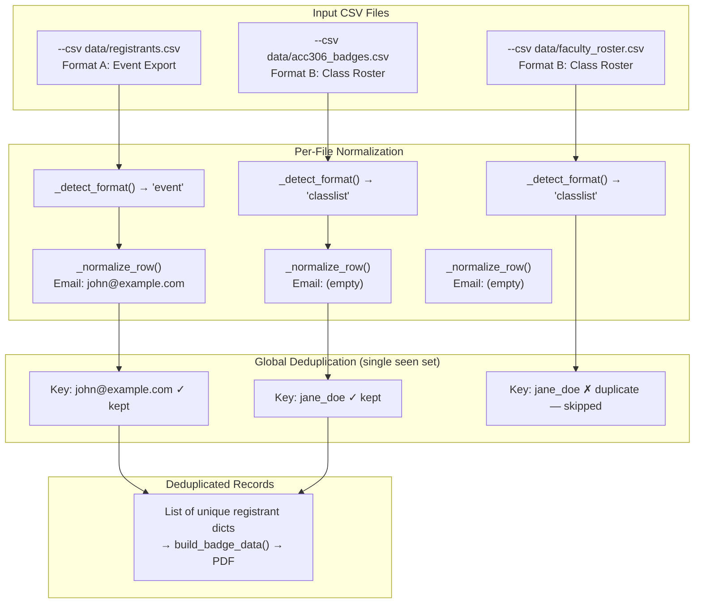

When the WCSU Meet & Greet event draws registrants from multiple sources — a Google Sheets export, individual class rosters, and manually compiled lists — the badge generator must produce exactly one badge per person. This page explains how `load_registrants()` performs global deduplication across arbitrarily many CSV files, the identity key it uses, and the practical implications for event organizers combining disparate data sources.

## The Problem: One Person, Many Sources

A single attendee can appear in multiple CSVs. For example, an Accounting student registered through the Google Sheets event form *and* listed in the ACC 306 class roster file would generate two badges unless deduplicated. The badge generator solves this by loading all files into a single pipeline and maintaining a global identity set that rejects rows already seen from earlier files or earlier rows within the same file. The `--csv` CLI flag uses `action="append"` so it naturally accumulates a list of paths ([generate_badges.py](generate_badges.py#L689-L697)), and the main block passes this list directly to `load_registrants()` ([generate_badges.py](generate_badges.py#L776-L778)).

## Identity Key: Email First, Name Fallback

The deduplication key is generated per-row inside `load_registrants()` using a two-tier strategy ([generate_badges.py](generate_badges.py#L326-L329)). The system checks whether the normalized `Email` field is non-empty; if so, it uses the lowercased email address as the unique identifier. When email is absent — common in class roster exports that omit contact information — the system falls back to a composite key of `{first_name_lower}_{last_name_lower}`.

```python
email = row["Email"]
fname = row["Attendee (First Name)"]
lname = row["Attendee (Last Name)"]
key = email if email else f"{fname.lower()}_{lname.lower()}"
```

This design choice reflects the reality of the two supported CSV formats. The event registrant export (Format A) includes an optional `Email` column that serves as a reliable, globally unique identifier. The class roster format (Format B) has no email field at all, so name-based deduplication is the only option available. The normalization step in `_normalize_row()` ensures the email is lowercased before comparison, preventing mismatches caused by casing differences in the source data ([generate_badges.py](generate_badges.py#L289)).

## First-Occurrence-Wins: No Field Merging

The deduplication system uses a strict **first-occurrence-wins** policy ([generate_badges.py](generate_badges.py#L330-L333)). When a duplicate key is detected, the row is silently discarded — there is no field-level merging between the original and subsequent records. This means if "Jane Doe" appears first in a class roster (no email, no occupation) and again later in the event export (with email and occupation), the badge will reflect the class roster's sparser data, not the richer event record.

```python
if key in seen:
    continue        # silently skip duplicate
seen.add(key)
rows.append(row)   # keep first occurrence only
```

The practical consequence is straightforward: **file order matters**. If you want the most complete data to win, place the CSV with richer fields first on the command line.

## Mixed-Format Loading: Global Seen Set Across Files

The `load_registrants()` function iterates through each CSV path in sequence, but a single `seen` set spans all files ([generate_badges.py](generate_badges.py#L317-L336)). Each file is auto-detected for its format — event export or class roster — and its rows are normalized into the same canonical internal dictionary structure. Deduplication happens after normalization, so the comparison operates on clean, standardized values regardless of which format the source file used.

The following diagram illustrates the complete flow from multiple input files through normalization to a single deduplicated record list:



## Deduplication Key Summary

| Scenario | Key Used | Collision Risk |
|---|---|---|
| Event export with email | `john.doe@example.com` (lowercased) | Very low — email is globally unique |
| Event export without email | `john_doe` | Moderate — same-named individuals collide |
| Class roster (no email column) | `john_doe` | Moderate — same-named students collide |
| Person in both event export *and* class roster | Email key ≠ name key | **High — no cross-format dedup** |

The cross-format gap is the most important edge case to understand. If "John Doe" appears in `registrants.csv` with email `john.doe@example.com` and also in `acc306_badges.csv` without email, the deduplication keys will be `john.doe@example.com` and `john_doe` respectively. These are different strings, so both records pass through and generate two separate badges. The system cannot perform cross-key matching — it has no way to know that `john.doe@example.com` belongs to `john_doe`.

## Console Output: Tracking What Was Added

During a multi-file load, the generator prints per-file diagnostics so you can verify deduplication is working as expected ([generate_badges.py](generate_badges.py#L319-L335)):

```
  registrants.csv: detected format 'event'
  registrants.csv: 42 registrants added
  acc306_badges.csv: detected format 'classlist'
  acc306_badges.csv: 28 registrants added
  mis260_badges.csv: detected format 'classlist'
  mis260_badges.csv: 25 registrants added
Loaded 85 unique registrants
```

If the total unique count is lower than the sum of per-file counts, duplicates were removed. The difference reveals how many rows were skipped. Currently, the generator does not print a separate duplicate count — you infer it from the arithmetic.

## Practical Guidance for Combining CSVs

When preparing for a print run that merges multiple sources, follow these ordering rules to get the best badge data:

1. **Put the event export first.** The Google Sheets / Eventbrite export (Format A) typically contains the richest data: email for reliable dedup, occupation, organization, and registration type. Placing it first ensures this data wins over sparser class roster records.

2. **Add class rosters second.** Files generated by `convert_classlist.py` (Format B) have no email, so they use name-based keys. Any student who already appeared in the event export with email will have a different key and won't be caught by dedup — which is actually desirable if the class roster serves as a *supplement* for students not in the event list.

3. **Audit the total count.** After running the generator, compare `Loaded N unique registrants` against the sum of per-file `added` counts. A significant gap suggests many duplicates are being removed, which may warrant investigation.

4. **For true single-badge-per-person guarantees**, consolidate all registrants into one Format A CSV with email addresses before running the generator. Cross-format dedup is not supported by the current architecture.

## Related Pages

- [CSV Format Reference: Event Registrant Export vs. Class Roster](8-csv-format-reference-event-registrant-export-vs-class-roster) — detailed column layouts for both input formats
- [Auto-Detection, Normalization, and N/A Sentinel Handling](9-auto-detection-normalization-and-n-a-sentinel-handling) — how `_clean()` and `_normalize_row()` prepare data before deduplication
- [Class List Converter: Transforming Xlsx Rosters to Badge-Generator CSV](21-class-list-converter-transforming-xlsx-rosters-to-badge-generator-csv) — converting xlsx rosters into Format B CSVs
- [CLI Interface: All Command-Line Flags and Output Path Resolution](22-cli-interface-all-command-line-flags-and-output-path-resolution) — using `--csv` flags for multi-file loading
- [Known Edge Cases: Long Names, Duplicate Entries, Multi-Line Occupations, and Ambiguous Majors](26-known-edge-cases-long-names-duplicate-entries-multi-line-occupations-and-ambiguous-majors) — broader edge case catalog including duplicate handling