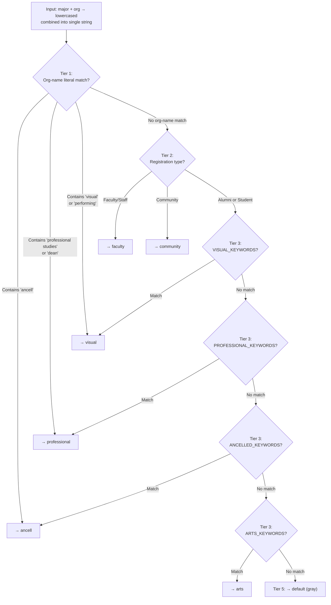
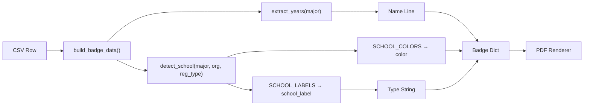

Every badge's school color is determined by a single function: `detect_school(major, org, reg_type)`. This function receives the raw `Class / Major` field, the `Community Business/Organization` field, and the `Registration Options` value from the CSV, then walks a five-tier priority chain to produce one of seven school keys. The algorithm is deliberately simple — pure substring containment on lowercased text — but the ordering of its tiers and keyword lists encodes important domain knowledge about WCSU's academic structure.

This page traces the algorithm from entry to exit, explains why each tier exists in its position, and catalogs every keyword that triggers a school assignment.

Sources: [generate_badges.py](generate_badges.py#L141-L172)

## The Five-Tier Priority Chain

The `detect_school` function evaluates registrants through a strict waterfall of five tiers. Each tier is a gate: once a match is found, the function returns immediately and no lower tiers execute. This design means that a Faculty/Staff member who lists "School of Visual & Performing Arts" in their organization field will be assigned to Visual rather than the generic "faculty" key — the org-name check runs first and short-circuits the rest.

Sources: [generate_badges.py](generate_badges.py#L141-L172)

## Tier 1: Organization-Name Literal Match

Before any keyword logic runs, the algorithm performs three literal substring checks against the **combined** `major` + `org` text (already lowercased). This tier exists to handle two distinct use cases with a single mechanism.

The first use case is **faculty and staff** whose `Community Business/Organization` field contains their WCSU department or school affiliation. For example, Tom Zarecki has `org = "Ancell School of Business"`, which contains `"ancell"` and routes him to the Ancell school key before the generic `Faculty/Staff` registration type would trigger Tier 2.

The second use case is **class roster CSVs** where the `Class / Major` field contains the full school name rather than a specific discipline. The class roster converter and many Google Sheets exports populate this field with values like `"Ancell School of Business"` or `"School of Visual & Performing Arts"`. The three literal checks — `"ancell"`, `"professional studies"` or `"dean"`, and `"visual"` or `"performing"` — capture these school-name patterns directly.

| Substring | Assigned School Key | Example Data |
|-----------|-------------------|--------------|
| `"ancell"` | `ancell` | `major = "Ancell School of Business"`, `org = "Ancell School of Business"` |
| `"professional studies"` or `"dean"` | `professional` | `org = "School of Professional Studies"`, `org = "Dean of Students"` |
| `"visual"` or `"performing"` | `visual` | `major = "School of Visual & Performing Arts"`, `org = "Performing Arts Center"` |

Notice that there is **no** literal check for `"arts"` — the substring `"arts"` is too generic and would false-positive on `"start"`, `"parts"`, `"cart"`, etc. Instead, Arts & Sciences is assigned exclusively through Tier 3 keyword matching.

Sources: [generate_badges.py](generate_badges.py#L145-L151)

## Tier 2: Registration-Type Routing

If the combined text contains no org-name literal, the algorithm checks the `reg_type` string for two non-academic categories.

| Registration Type | Assigned School Key | Rationale |
|-------------------|-------------------|-----------|
| `"Faculty/Staff"` | `faculty` | Faculty whose org field didn't match a specific school get the generic gold color |
| `"Community"` | `community` | Community guests (non-alumni, non-student) get gray |

The remaining registration types — `"Alumni"` and `"Student"` — are not handled here. They fall through to Tier 3 where keyword matching determines their school assignment based on the discipline listed in their `Class / Major` field.

The order matters: a faculty member with `org = "Ancell School of Business"` was already caught by Tier 1. Only faculty with blank or non-matching org fields reach Tier 2 and receive the generic `faculty` key. This is intentional — a department-identified faculty member should wear their school's color, not the generic gold.

Sources: [generate_badges.py](generate_badges.py#L153-L156)

## Tier 3: Keyword Matching — The Core Detection Engine

This is the heart of the algorithm. For Alumni and Student registrants, the function iterates through **four keyword lists in a fixed order**, checking whether any keyword is a substring of the combined lowercased `major + org` text. The first list that produces a match wins, and the function returns immediately.

The matching is pure Python substring containment: `kw in txt`. No regex, no word-boundary checks, no fuzzy matching. This simplicity has an important consequence: keywords can match **anywhere** within the text, including across word boundaries. The trailing spaces on certain keywords (detailed below) are the only mechanism to constrain partial matches.

### Why the Lists Are Ordered VISUAL → PROFESSIONAL → ANCELL → ARTS

The ordering is not alphabetical and not arbitrary. Each position solves a specific ambiguity problem.

**VISUAL first** because its keywords are the most specific — multi-word phrases like `"graphic design"` and `"digital interactive"` that uniquely identify visual arts disciplines. Placing them first ensures they're caught before single-word terms in other lists that could accidentally match (e.g., `"film"` could theoretically appear in a media studies context, but no other list contains it, so this is mainly defensive).

**PROFESSIONAL second** because education-related keywords like `"education"`, `"teaching"`, and `"counseling"` could be ambiguous with Arts & Sciences if PROFESSIONAL were checked later. An `"Elementary Education"` major should route to Professional Studies, not Arts & Sciences. The `"mat "` keyword (Master of Arts in Teaching) is similarly education-focused and must not fall through to the ARTS catch-all.

**ANCELLED third** because business-related keywords like `"management"`, `"science"` (as in Management Science), and `"applied"` (as in Applied Mathematics) could overlap with Arts & Sciences if checked in the wrong order. By placing ANCELL before ARTS, a `"Business Management"` major is correctly routed to Ancell even though `"management"` also exists as a standalone concept.

**ARTS last** as the intentional **catch-all** bucket. The School of Arts & Sciences is WCSU's largest school, encompassing natural sciences, social sciences, humanities, nursing, and computing. Its keyword list is the longest and contains many broad terms (`"science"`, `"applied"`, `"interdisciplinary"`). Placing it last means any registrant whose discipline doesn't match the three more-specific schools lands in Arts & Sciences — which is statistically the most likely correct answer.

Sources: [generate_badges.py](generate_badges.py#L158-L170)

## Tier 5: Default Fallback

If no keyword list produces a match, the function returns `"default"`. This key maps to a light gray color (`#95A5A6`) and an empty school label. Registrants who trigger this fallback will appear with a gray badge circle (paper format) or a gray header band (adhesive format) and no school name text.

Common causes of default fallback include a blank `Class / Major` field, a year-only entry like `"2027"` with no discipline, or a discipline not yet present in any keyword list. The troubleshooting guide at [Fixing Gray (Unmatched) Badges by Updating CSV Major Fields](25-fixing-gray-unmatched-badges-by-updating-csv-major-fields) covers remediation strategies.

Sources: [generate_badges.py](generate_badges.py#L172)

## Complete Keyword Reference

Each keyword list is defined as a Python list of strings. The combined search text is `f"{major} {org}".lower()` — a single space joins the two fields before lowercasing.

### ANCELL_KEYWORDS — Ancell School of Business (Orange `#E8702A`)

| Keyword | What It Catches |
|---------|----------------|
| `"accounting"` | Accounting, B.S. Accounting, etc. |
| `"finance"`, `"financial"` | Finance, Financial Planning, Financial Management |
| `"business"` | Business Administration, International Business, BBA |
| `"management"` | Business Management, Sports Management, Supervisory Management |
| `"marketing"` | Marketing, Digital Marketing |
| `"economics"` | Economics, B.A. Economics |
| `"mba"` | MBA (without periods; note: `"M.B.A."` lowered is `"m.b.a."` which does **not** contain `"mba"`) |
| `"bba"` | Bachelor of Business Administration |
| `"mis "` | MIS with trailing space — matches "MIS major" but not "mission" or "misfire" |
| `"management information"` | Management Information Systems (explicit multi-word match) |
| `"real estate"` | Real Estate |
| `"banking"` | Banking |
| `"commercial"` | Commercial Arts, Commercial Music (note: broad match) |
| `"entrepreneur"` | Entrepreneurship, Entrepreneur |

### ARTS_KEYWORDS — School of Arts & Sciences (Navy `#1B3A6B`)

| Keyword | What It Catches |
|---------|----------------|
| `"biology"` | Biology, Pre-Biology, Marine Biology |
| `"chemistry"` | Chemistry, Biochemistry |
| `"physics"` | Physics |
| `"mathematics"`, `"math"` | Mathematics, Applied Mathematics, Math Education (but `"mat "` in PROFESSIONAL catches MAT degree first) |
| `"computer science"` | Computer Science |
| `"cybersecurity"` | Cybersecurity, BBA Cybersecurity (if no `"bba"` / `"mba"` match earlier) |
| `"psychology"` | Psychology, Clinical Psychology |
| `"sociology"` | Sociology |
| `"anthropology"` | Anthropology |
| `"history"` | History |
| `"political science"`, `"political"` | Political Science, Political Science (note: `"political"` alone catches any "political" substring) |
| `"english"` | English, Secondary Ed English (if `"education"` in PROFESSIONAL didn't match first) |
| `"communications"`, `"communication"` | Communication Studies, Mass Communications (both singular and plural forms) |
| `"nursing"`, `"bsn"`, `"rn"` | Nursing, BSN, RN |
| `"public health"` | Public Health |
| `"social work"` | Social Work |
| `"justice"`, `"jla"`, `"criminology"` | Criminal Justice, Justice & Law Administration (JLA), Criminology |
| `"science"` | Applied Science, Health Science, Data Science (broad catch-all) |
| `"applied"` | Applied Mathematics, Applied Computing (broad catch-all) |
| `"liberal arts"` | Liberal Arts |
| `"interdisciplinary"` | Interdisciplinary Studies |

### VISUAL_KEYWORDS — School of Visual & Performing Arts (Purple `#8E44AD`)

| Keyword | What It Catches |
|---------|----------------|
| `"graphic design"`, `"graphic"` | Graphic Design (multi-word checked first, then single-word fallback) |
| `"digital interactive"` | Digital & Interactive Media Arts (DIMA) |
| `"theater"`, `"theatre"` | Theater / Theatre (both American and British spellings) |
| `"performing arts"` | Performing Arts |
| `"music"` | Music, Music Education |
| `"dance"` | Dance |
| `"film"` | Film, Film Studies |
| `"photography"` | Photography |
| `"visual art"` | Visual Art |
| `"dima"` | DIMA program acronym |
| `"art "` | Art with trailing space — matches "Art History" but **not** "cart", "start", "smart", "apartment" |
| `"arts "` | Arts with trailing space — matches "Media Arts " but **not** "parts", "starts" |

### PROFESSIONAL_KEYWORDS — School of Professional Studies (Forest Green `#27AE60`)

| Keyword | What It Catches |
|---------|----------------|
| `"education"` | Elementary Education, Secondary Education, Special Education |
| `"health administration"` | Health Administration |
| `"mha"` | Master of Health Administration |
| `"counseling"` | Counseling, Mental Health Counseling |
| `"mat "` | Master of Arts in Teaching with trailing space — matches "MAT " but **not** "material", "mathematics", "format" |
| `"teaching"` | Teaching, Teaching Certification |
| `"doctoral"` | Doctoral programs |
| `"literacy"` | Literacy Studies, Reading & Literacy |

Sources: [generate_badges.py](generate_badges.py#L118-L139)

## The Trailing-Space Disambiguation Technique

Several keywords include a trailing space character — `"mis "`, `"art "`, `"arts "`, and `"mat "`. This is not accidental and serves a critical purpose given the algorithm's pure substring matching strategy.

Without the trailing space, `"art"` would match inside words like `"cart"`, `"smart"`, `"apartment"`, `"chart"`, and `"departure"`. A registrant with `major = "Pre-nursing Freshman"` would not trigger `"art"`, but one with `major = "Department of History"` would incorrectly match `"art"` inside `"department"`. Similarly, `"arts"` without a trailing space would match `"parts"`, `"starts"`, and `"hearts"`.

The trailing space acts as a lightweight word-boundary constraint. Since the combined text contains spaces between the major and org fields and between words within each field, a trailing space ensures the keyword matches at the **end of a word**. This isn't perfect — it won't catch "Art" at the very end of the string where there's no trailing space — but in practice, registrant data almost always includes multiple words, making this technique sufficient.

| Keyword | Prevents False Positive On | Example Safe Match |
|---------|--------------------------|-------------------|
| `"mis "` | "mission", "miscellaneous", "misfire" | "MIS degree " → `"mis "` found |
| `"art "` | "cart", "apartment", "smart", "department" | "Art History " → `"art "` found |
| `"arts "` | "parts", "starts", "hearts" | "Media Arts " → `"arts "` found |
| `"mat "` | "material", "format", "mathematics" | "MAT program " → `"mat "` found |

Sources: [generate_badges.py](generate_badges.py#L120), [generate_badges.py](generate_badges.py#L134), [generate_badges.py](generate_badges.py#L138)

## Tracing Registrants Through the Algorithm

Walking through specific entries from the sample data illustrates how the priority chain produces its results. Each trace shows the combined search text, which tier fires, and the final school key.

**Daniel Rothwell** — `major = "Applied Mathematics"`, `reg_type = "Student"`, `org = ""`
→ Combined text: `"applied mathematics "`
→ Tier 1: No org-name literal match
→ Tier 2: `reg_type` is "Student" — falls through
→ Tier 3: VISUAL → no match. PROFESSIONAL → no match. ANCELL → no match. ARTS → `"applied"` matches → **arts** (Navy)

**Madeline Arias** — `major = "2026 / Accounting"`, `reg_type = "Student"`, `org = ""`
→ Combined text: `"2026 / accounting "`
→ Tier 1: No org-name literal match
→ Tier 2: Falls through
→ Tier 3: VISUAL → no match. PROFESSIONAL → no match. ANCELL → `"accounting"` matches → **ancell** (Orange)

**Tom Zarecki** — `major = ""`, `reg_type = "Faculty/Staff"`, `org = "Ancell School of Business"`
→ Combined text: `" ancell school of business"`
→ Tier 1: `"ancell"` found in text → **ancell** (Orange)
→ Tiers 2–5: Never reached

**Erin Lowenadler** — `major = "Secondary Ed English 2025"`, `reg_type = "Alumni"`, `org = ""`
→ Combined text: `"secondary ed english 2025"`
→ Tier 1: No org-name literal match
→ Tier 2: Falls through
→ Tier 3: VISUAL → no match. PROFESSIONAL → `"education"` would need to be checked — but the text is `"secondary ed english 2025"`. The substring `"education"` does **not** appear (it's abbreviated to `"ed"`). So PROFESSIONAL → no match. ANCELL → no match. ARTS → `"english"` matches → **arts** (Navy). Note: if the major had been written as "Secondary Education English 2025", the `"education"` keyword in PROFESSIONAL would have fired first, routing to Professional Studies.

**Tyler Catania** — `major = "M.B.A. Cybersecurity"`, `reg_type = "Student"`, `org = ""`
→ Combined text: `"m.b.a. cybersecurity"`
→ Tier 1–2: No match
→ Tier 3: VISUAL → no match. PROFESSIONAL → no match. ANCELL → `"mba"` is **not** a substring of `"m.b.a."` (the dots break it) — no match. ARTS → `"cybersecurity"` matches → **arts** (Navy). This is a known edge case where the period-separated MBA abbreviation evades the `"mba"` keyword.

**Sophia Gartland** — `major = "BFA Illustration Class of 2028"`, `reg_type = "Student"`, `org = ""`
→ Combined text: `"bfa illustration class of 2028"`
→ Tier 1–2: No match
→ Tier 3: VISUAL → none of the explicit keywords match "illustration" or "bfa" → no match. PROFESSIONAL → no match. ANCELL → no match. ARTS → no match. → **default** (gray). This registrant's discipline is not in any keyword list and would produce a gray badge.

Sources: [data/registrants.csv](data/registrants.csv#L2-L59)

## How the Algorithm Handles Input Variation

The `Class / Major` field in real registrant data is wildly inconsistent. The same underlying concept appears in dozens of formats: `"Accounting"`, `"2026 / Accounting"`, `"BBA in Accounting"`, `"B.S. Accounting"`, `"Junior/Accounting"`, and `"Accounting and Finance"`. The algorithm handles this variation through three properties of its design.

First, **substring containment** is inherently permissive. `"accounting"` matches regardless of surrounding text, year prefixes, degree suffixes, or formatting inconsistencies. A user writing `"Senior/Finance & Accounting"` will match `"accounting"` (and `"finance"`, though ANCELL would be the result either way).

Second, **the combined search text** concatenates both `major` and `org`, doubling the surface area for keyword matching. A faculty member with `org = "Ancell School of Business"` and a blank `major` still gets detected at Tier 1 because the org field contributes to the search text.

Third, **lowercasing before matching** normalizes case differences. `"MBA"`, `"mba"`, `"Mba"`, and `"MBA"` all produce the same lowered text, though as noted above, `"M.B.A."` with periods is a distinct string that evades the `"mba"` keyword.

Sources: [generate_badges.py](generate_badges.py#L143), [generate_badges.py](generate_badges.py#L158-L171)

## Preprocessing: Normalization Before Detection

Before `detect_school` runs, the CSV data passes through the normalization pipeline described in [Auto-Detection, Normalization, and N/A Sentinel Handling](9-auto-detection-normalization-and-n-a-sentinel-handling). The `_clean()` function strips whitespace and collapses sentinel values like `"N/A"`, `"None"`, and `"TBD"` into empty strings. This means a registrant with `major = "N/A"` receives a blank search text and reliably falls through to the `"default"` key rather than matching some unexpected keyword fragment.

Sources: [generate_badges.py](generate_badges.py#L248-L259), [generate_badges.py](generate_badges.py#L338-L361)

## Where Detection Fits in the Badge Pipeline

School detection is a single step within `build_badge_data()`, which constructs the full badge dictionary. The returned school key drives three downstream effects: the **color** (looked up in `SCHOOL_COLORS`), the **label** (looked up in `SCHOOL_LABELS`), and the **type string** format (alumni/student badges show the school name; faculty badges show the department). Understanding the detection algorithm is therefore essential for troubleshooting color assignments.

Sources: [generate_badges.py](generate_badges.py#L338-L385)

## Known Limitations and Edge Cases

The algorithm's simplicity produces several characteristic edge cases that are worth understanding when debugging unexpected badge colors.

**Period-separated abbreviations** — `"M.B.A."`, `"B.S."`, `"B.A."`, and `"Ph.D."` do not match their keyword equivalents (`"mba"`, `"science"`, `"art "`) because the periods break substring containment. A registrant with `major = "M.B.A. Cybersecurity"` will be detected by `"cybersecurity"` in ARTS_KEYWORDS (since ANCELL's `"mba"` doesn't match), producing a navy badge instead of orange.

**Ambiguous disciplines not in any list** — Programs like "Illustration", "Exercise Science", "Social Justice", or "Data Analytics" have no keyword and fall to `"default"`. The page [Extending Keyword Lists and Adding New School Mappings](13-extending-keyword-lists-and-adding-new-school-mappings) covers how to add them.

**Cross-school overlaps** — Some disciplines span school boundaries at WCSU (e.g., cybersecurity degrees exist in both Ancell and Arts & Sciences). The keyword ordering resolves this deterministically but may not reflect every student's actual school affiliation. The `"bba"` and `"mba"` keywords in ANCELL_KEYWORDS are positioned before `"cybersecurity"` in ARTS_KEYWORDS to route Ancell-branded cyber degrees correctly, but `"M.B.A. Cybersecurity"` (with periods) evades this.

**Blank major fields** — A registrant with `major = ""` and `reg_type = "Alumni"` or `"Student"` will always fall to `"default"` since no keyword can match an empty string. This is the most common cause of gray badges.

Sources: [generate_badges.py](generate_badges.py#L141-L172)

## Next Steps

- **[Registration Type-Based Routing: Alumni, Student, Faculty, Community](12-registration-type-based-routing-alumni-student-faculty-community)** — how the school key interacts with the registration type to format the badge's second line
- **[Extending Keyword Lists and Adding New School Mappings](13-extending-keyword-lists-and-adding-new-school-mappings)** — step-by-step instructions for adding new keywords or disciplines to the detection engine
- **[Fixing Gray (Unmatched) Badges by Updating CSV Major Fields](25-fixing-gray-unmatched-badges-by-updating-csv-major-fields)** — troubleshooting guide for registrants who receive the default gray color
- **[Known Edge Cases: Long Names, Duplicate Entries, Multi-Line Occupations, and Ambiguous Majors](26-known-edge-cases-long-names-duplicate-entries-multi-line-occupations-and-ambiguous-majors)** — broader catalog of edge cases including the ambiguous majors discussed here