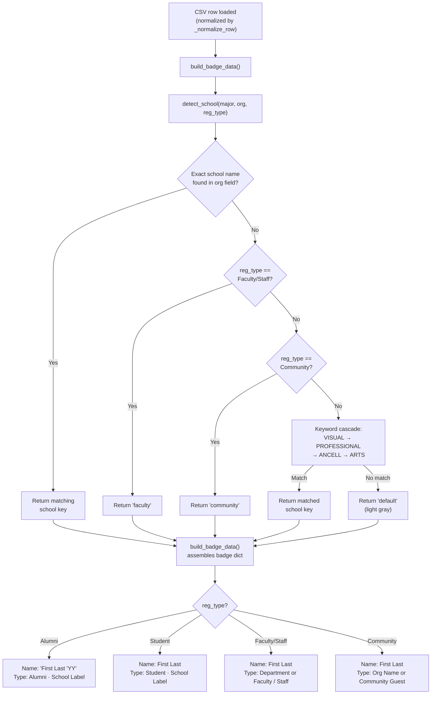

Every registrant in the CSV carries a `Registration Options` value — one of four canonical strings: `Alumni`, `Student`, `Faculty/Staff`, or `Community`. This single field acts as the top-level dispatch key that determines which detection path the badge generator follows, which school color is assigned, how the name line is formatted, and what text appears on the second badge line. Understanding this routing is essential for predicting badge output and diagnosing why a particular registrant received an unexpected color or label.

Sources: [generate_badges.py](generate_badges.py#L141-L172)

## The Four Registration Types at a Glance

The `Registration Options` column is the only required categorical field in both CSV formats. It is read directly from the CSV during normalization — no case folding or alias resolution is performed, so the value must match exactly. The four accepted values and their behavioral differences are summarized below.

| Registration Type | School Detection Path | Name Line Suffix | Type Line Format | Fallback Color |
|---|---|---|---|---|
| `Alumni` | Keyword match on `Class / Major` + `org` | `'YY` graduation year(s) extracted from major | `Alumni · {School Label}` | Light Gray (unmatched) |
| `Student` | Keyword match on `Class / Major` + `org` | None | `Student · {School Label}` | Light Gray (unmatched) |
| `Faculty/Staff` | Org-name check first, then `faculty` gold | None | Department from org, or `Faculty / Staff` | Dark Gold |
| `Community` | Immediate `community` gray | None | Organization name, or `Community Guest` | Gray |

Sources: [generate_badges.py](generate_badges.py#L338-L385)

## Routing Architecture: The Decision Cascade

The routing logic lives in two functions that execute in sequence for each registrant. First, `detect_school()` receives the normalized `major`, `org`, and `reg_type` fields and returns a school key. Then, `build_badge_data()` consumes that school key along with the registration type to assemble the three text lines and the badge color.

The critical architectural insight is that `Faculty/Staff` and `Community` are **terminal branches** in the detection cascade — they are checked *before* the keyword lists are consulted. This means a faculty member's major field is completely ignored for school detection unless their organization field contains a school name. Conversely, Alumni and Student registrants always fall through to the full keyword matching engine described in [Keyword-Based School Assignment Algorithm and Priority Rules](11-keyword-based-school-assignment-algorithm-and-priority-rules).

Sources: [generate_badges.py](generate_badges.py#L141-L172)

## Faculty/Staff: Org-Based Override Before Keyword Fallback

Faculty routing is the most nuanced of the four types. The `detect_school()` function first scans the combined `major + org` text for exact school-name substrings — specifically `"ancell"`, `"professional studies"`, `"dean"`, `"visual"`, and `"performing"` — *before* it even examines the `reg_type` field. This design allows faculty who are formally affiliated with a specific school to receive that school's color instead of the generic dark gold.

The org-override logic operates at lines 146–152 of `generate_badges.py`. If a faculty member's `Community Business/Organization` field contains `"Ancell"`, for instance, they receive the orange Ancell color and the Ancell school label — even though they registered as Faculty/Staff. Only when no school name is found in the org field does the function fall through to the `reg_type == "Faculty/Staff"` check at line 153, which returns the generic `"faculty"` key.

| Org Field Content | Returned School Key | Badge Color | Badge Label |
|---|---|---|---|
| `Ancell School of Business` | `ancell` | Orange `#E8702A` | Ancell School of Business |
| `School of Professional Studies` | `professional` | Green `#27AE60` | School of Professional Studies |
| `Dean, School of Visual Arts` | `visual` | Purple `#8E44AD` | School of Visual & Performing Arts |
| `WCSU` (or empty) | `faculty` | Dark Gold `#D4AC0D` | Faculty / Staff |

After school detection, the type line in `build_badge_data()` applies one additional filter: if the org value is non-empty and does *not* contain `"wcsu"`, the raw org string is used as the type line; otherwise, it falls back to the static string `"Faculty / Staff"`. This prevents redundant labels like "WCSU · Faculty / Staff" while still displaying meaningful department names when available.

Sources: [generate_badges.py](generate_badges.py#L146-L154), [generate_badges.py](generate_badges.py#L365-L367)

## Community: Immediate Routing, Org-First Display

Community registrants receive the simplest routing path. When `reg_type == "Community"`, `detect_school()` immediately returns `"community"` (gray) at line 155 without examining any keyword lists or the major field. This is a deliberate design choice — community guests typically have no WCSU major or school affiliation, so keyword matching would produce noise rather than useful signal.

The type line for community badges is similarly straightforward: if the `Community Business/Organization` field is populated, that value is displayed verbatim (truncated to 85 characters if necessary). If the org field is empty, the badge shows the generic label `"Community Guest"`. This makes organization name the single most important field for community registrants — it is the only data that differentiates their badges.

Sources: [generate_badges.py](generate_badges.py#L155-L156), [generate_badges.py](generate_badges.py#L368-L369)

## Alumni and Student: Shared Keyword Engine, Different Name Formatting

Alumni and Student registrants share the same school detection path — the full keyword cascade through `VISUAL_KEYWORDS`, `PROFESSIONAL_KEYWORDS`, `ANCELL_KEYWORDS`, and `ARTS_KEYWORDS`. The only behavioral difference between the two types occurs in `build_badge_data()` during name line assembly.

For Alumni, the `extract_years()` function scans the `Class / Major` field for graduation year patterns (both `'71` apostrophe-style and `1971` four-digit formats) and appends them to the name line. Single years become `'71`; multiple years are joined with `, ` and `& '`. For Students, no year suffix is added — the name line is simply `First Last`.

| Registration Type | Example Major | Name Line Output | Type Line Output |
|---|---|---|---|
| Alumni | `'71 Accounting` | `Jane Doe '71` | `Alumni · Ancell School of Business` |
| Alumni | `'15 & '18 MBA/Biology` | `Jane Doe '15 & '18` | `Alumni · Ancell School of Business` |
| Student | `Accounting` | `Jane Doe` | `Student · Ancell School of Business` |
| Student | `Ancell School of Business` | `Jane Doe` | `Student · Ancell School of Business` |

The type line format for both Alumni and Student follows the same template: `{reg_type}  ·  {school_label}`. If keyword matching fails and the school resolves to `"default"`, the school label is empty, so the type line degrades gracefully to just `"Alumni"` or `"Student"` with no trailing separator. For the full details of year extraction patterns, see [Graduation Year Extraction: Apostrophe and Four-Digit Format Parsing](18-graduation-year-extraction-apostrophe-and-four-digit-format-parsing).

Sources: [generate_badges.py](generate_badges.py#L158-L171), [generate_badges.py](generate_badges.py#L347-L356), [generate_badges.py](generate_badges.py#L363-L364)

## How Routing Affects Badge Rendering

The school key returned by `detect_school()` flows into both the color and text systems of the badge generator. In the `build_badge_data()` function, three values are derived from this key:

1. **`color`** — looked up from `SCHOOL_COLORS` dict; applied to the colored circle (paper format) or the header band (adhesive format).
2. **`school_label`** — looked up from `SCHOOL_LABELS` dict; embedded in the type line for Alumni and Student badges.
3. **`school`** — the raw key string (`"ancell"`, `"arts"`, etc.); stored in the badge dict for potential downstream use.

Both the paper badge renderer (`generate_badges_pdf`) and the adhesive badge renderer (`generate_adhesive_badges_pdf`) consume the same `badge["color"]` value, applying it to their respective visual elements. Neither renderer has any conditional logic based on registration type — all type-specific behavior is resolved upstream in `build_badge_data()`. This clean separation means adding a new registration type only requires changes to `detect_school()` and `build_badge_data()`, with zero modifications to the PDF rendering layer.

Sources: [generate_badges.py](generate_badges.py#L359-L385), [generate_badges.py](generate_badges.py#L86-L104)

## Walk-In Blank Sheets: The Static Six-Category Spectrum

The `--blank` flag bypasses CSV-based routing entirely and instead generates one full page of blank badges for each of the six categories defined in `SCHOOLS_ORDERED`. This list intentionally excludes the `"default"` (light gray) entry because walk-in registrants are always assigned to a real category at the check-in desk — there is no scenario where a hand-written badge should display the "unmatched" fallback color.

The six blank-sheet categories, in order, are:

| Page | School Key | Color | Label |
|---|---|---|---|
| 1 | `ancell` | Orange `#E8702A` | Ancell School of Business |
| 2 | `arts` | Navy `#1B3A6B` | School of Arts & Sciences |
| 3 | `visual` | Purple `#8E44AD` | School of Visual & Performing Arts |
| 4 | `professional` | Green `#27AE60` | School of Professional Studies |
| 5 | `faculty` | Dark Gold `#D4AC0D` | Faculty / Staff |
| 6 | `community` | Gray `#7F8C8D` | Community Guest |

Both `generate_blank_adhesive_pdf()` and `generate_blank_paper_pdf()` iterate over this same `SCHOOLS_ORDERED` list, producing one page per category with the colored visual element and school label pre-printed, leaving the name area blank for hand-writing. See [Preparing Blank Walk-In Badge Sheets for On-Site Registration](5-preparing-blank-walk-in-badge-sheets-for-on-site-registration) for the full walk-in workflow.

Sources: [generate_badges.py](generate_badges.py#L106-L115), [generate_badges.py](generate_badges.py#L559-L651)

## Edge Cases and Interaction Effects

Several behaviors emerge from the interaction between registration type routing and the broader normalization pipeline. The `_clean()` function collapses N/A-like sentinels to empty strings *before* registration type reaches `detect_school()`, so a CSV cell containing `"N/A"` in the Registration Options column is treated as an empty string — which causes the registrant to fall through all type-specific checks and land on the keyword cascade, exactly as if they were an Alumni or Student with no explicit type. This is covered in detail in [Auto-Detection, Normalization, and N/A Sentinel Handling](9-auto-detection-normalization-and-n-a-sentinel-handling).

Another interaction effect concerns faculty with school-specific org fields. The org-override check in `detect_school()` scans the *combined* `major + org` text, so a faculty member with `major="English"` and `org="Ancell School of Business"` would match the `"ancell"` substring and receive orange — even though their major has nothing to do with business. This is intentional: for faculty, organizational affiliation takes absolute precedence over academic background. However, for Student and Alumni registrants the same combined text flows into the keyword cascade, where `"English"` would correctly route to Arts & Sciences regardless of any org content — because org is only consulted as an override path for faculty, not as a general-purpose keyword source.

Sources: [generate_badges.py](generate_badges.py#L141-L144), [generate_badges.py](generate_badges.py#L248-L259)

## Next Steps

- **[Keyword-Based School Assignment Algorithm and Priority Rules](11-keyword-based-school-assignment-algorithm-and-priority-rules)** — the full keyword cascade that Alumni and Student registrants pass through after type-based routing.
- **[Registration Type Display Logic: Name, School, and Occupation Formatting](20-registration-type-display-logic-name-school-and-occupation-formatting)** — deeper treatment of how `build_badge_data()` assembles the three badge text lines per registration type.
- **[Fixing Gray (Unmatched) Badges by Updating CSV Major Fields](25-fixing-gray-unmatched-badges-by-updating-csv-major-fields)** — troubleshooting when keyword matching fails and Alumni/Student badges fall to the default gray.