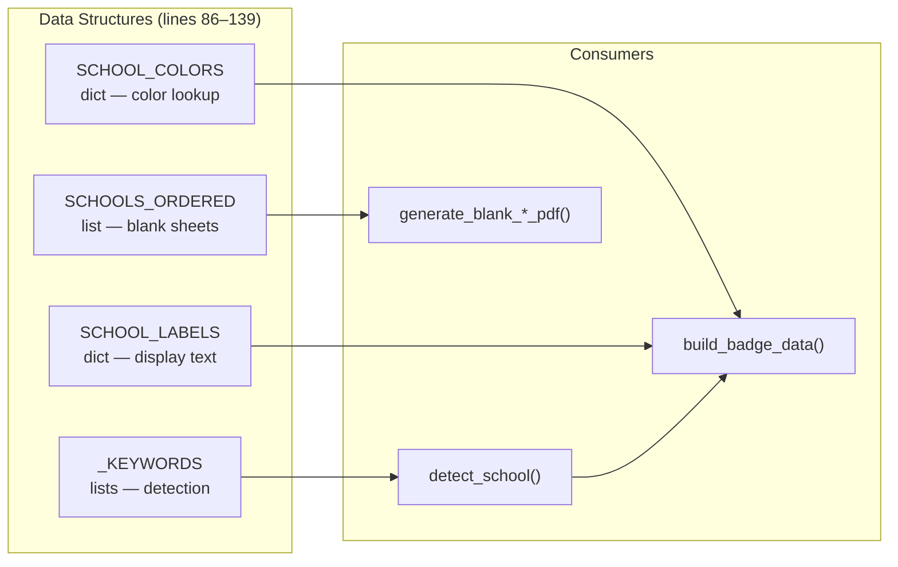
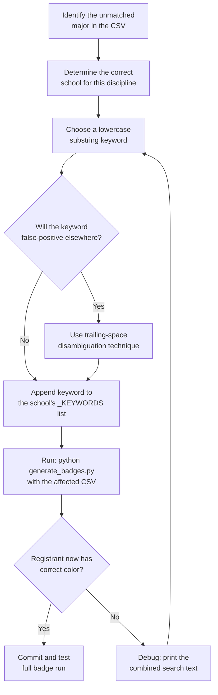

The school detection engine is governed by four parallel data structures in `generate_badges.py`: the keyword lists, the `SCHOOL_COLORS` dictionary, the `SCHOOL_LABELS` dictionary, and the `SCHOOLS_ORDERED` list. Any modification to the detection vocabulary — whether adding a single keyword or introducing an entirely new school — requires coordinated edits across these structures to maintain behavioral consistency. This page provides the exact edit sites, the dependency chain, and the validation procedures for each class of change.

Sources: [generate_badges.py](generate_badges.py#L86-L172)

## The Four-Structure Contract

Every school recognized by the badge generator is represented in four distinct locations, each serving a different consumer within the pipeline. Adding a new school or modifying an existing one requires updating all four in lockstep. The following diagram shows where each structure is consumed.



The `SCHOOLS_ORDERED` list is deliberately decoupled from the other three — it drives blank walk-in sheet generation and intentionally excludes the `"default"` key. The keyword lists feed `detect_school()` exclusively. Both `SCHOOL_COLORS` and `SCHOOL_LABELS` are consumed by `build_badge_data()` to assemble each badge's visual and textual properties. If any structure is updated in isolation, the badge generator will produce silently incorrect results: a new keyword with no matching color entry yields a `KeyError`, a new school key absent from `SCHOOLS_ORDERED` simply won't appear on walk-in sheets.

Sources: [generate_badges.py](generate_badges.py#L86-L115)

## Edit Site Reference Map

All school-mapping data lives in a contiguous 53-line block at the top of `generate_badges.py` (lines 86–139). The following table pinpoints each structure's exact location and the specific lines you must modify for each change type.

| Structure | Location | Purpose | Modify When |
|-----------|----------|---------|-------------|
| `SCHOOL_COLORS` | Lines 86–94 | HexColor mapping for PDF rendering | Adding a school, changing a color |
| `SCHOOL_LABELS` | Lines 96–104 | Human-readable school name for badge text | Adding a school, renaming a school |
| `SCHOOLS_ORDERED` | Lines 108–115 | `(key, color, label)` tuples for blank sheets | Adding a school, reordering blank pages |
| `ANCELL_KEYWORDS` | Lines 118–122 | Business discipline substrings | Adding a business-related keyword |
| `ARTS_KEYWORDS` | Lines 123–130 | Liberal arts / science substrings | Adding an A&S-related keyword |
| `VISUAL_KEYWORDS` | Lines 131–135 | Visual / performing arts substrings | Adding a visual arts keyword |
| `PROFESSIONAL_KEYWORDS` | Lines 136–139 | Education / health admin substrings | Adding a professional studies keyword |
| `detect_school()` | Lines 141–172 | The priority chain function itself | Adding a new keyword list / new school tier |
| Tier 1 org checks | Lines 146–151 | Literal substring checks for faculty org fields | Adding org-name patterns for a new school |

Sources: [generate_badges.py](generate_badges.py#L86-L172)

## Adding Keywords to an Existing School List

This is the most common and lowest-risk modification. When a new academic discipline appears in registrant data that doesn't match any existing keyword, you append the appropriate substring to the corresponding keyword list.

### Step-by-step Procedure

The process is a single edit to one keyword list, followed by a validation run. No other structures need modification because the school key, color, and label already exist.



### Practical Example: Adding "Data Science"

Suppose a new registrant has `Class / Major = "Data Science"` and receives a gray badge because no keyword currently matches. Data Science belongs to the School of Arts & Sciences at WCSU, so you would edit `ARTS_KEYWORDS`:

**Before** ([generate_badges.py#L123-L130](generate_badges.py#L123-L130)):
```python
ARTS_KEYWORDS = [
    "biology", "chemistry", "physics", "mathematics", "math",
    "computer science", "cybersecurity", "psychology", "sociology",
    "anthropology", "history", "political science", "political",
    "english", "communications", "communication", "nursing", "bsn", "rn",
    "public health", "social work", "justice", "jla", "criminology",
    "science", "applied", "liberal arts", "interdisciplinary",
]
```

**After**:
```python
ARTS_KEYWORDS = [
    "biology", "chemistry", "physics", "mathematics", "math",
    "computer science", "cybersecurity", "psychology", "sociology",
    "anthropology", "history", "political science", "political",
    "english", "communications", "communication", "nursing", "bsn", "rn",
    "public health", "social work", "justice", "jla", "criminology",
    "data science", "science", "applied", "liberal arts", "interdisciplinary",
]
```

In this particular case, `"data science"` may already be partially covered by the existing `"science"` keyword at the end of the list — `"data science"` contains the substring `"science"`. However, `"science"` is checked after all other lists in the priority chain, so a `"Data Science"` entry that also happened to contain `"graphic"` (unlikely but illustrative) would be incorrectly routed to Visual. Adding the explicit `"data science"` keyword to ARTS_KEYWORDS is still valuable for clarity and defensive routing, even when the existing `"science"` catch-all would technically handle it.

### Keyword Selection Guidelines

The algorithm uses pure substring containment (`kw in txt`), not word-boundary matching. This imposes specific constraints on keyword choice:

| Guideline | Rationale | Example |
|-----------|-----------|---------|
| **Prefer multi-word phrases over single words** | Reduces false-positive surface area | `"health administration"` over `"health"` |
| **Use trailing space to disambiguate short words** | Prevents matching inside longer words | `"mat "` instead of `"mat"` |
| **Place the keyword in the narrowest appropriate list** | The priority chain checks VISUAL → PROFESSIONAL → ANCELL → ARTS; a keyword in an earlier list blocks later lists | `"graphic"` in VISUAL_KEYWORDS, not ARTS_KEYWORDS |
| **Lowercase all keywords** | The search text is lowercased before matching | `"Computer Science"` becomes `"computer science"` |
| **Consider existing keywords that might overlap** | A new keyword should not introduce routing regressions for already-matched registrants | Test that existing CSV entries still produce correct colors |

For the complete list of existing keywords and the trailing-space disambiguation technique, see [Keyword-Based School Assignment Algorithm and Priority Rules](11-keyword-based-school-assignment-algorithm-and-priority-rules).

Sources: [generate_badges.py](generate_badges.py#L118-L139)

## Adding a Completely New School

This is a structural change that touches all four data structures and requires a new keyword list. WCSU currently has four academic schools plus two non-academic categories. If the university adds a fifth school or if you need to split an existing school's keyword coverage, the following procedure ensures every consumer is updated.

### The Seven-Edit Checklist

Adding a new school key (e.g., `"engineering"`) requires modifications in seven specific locations. Missing any one of these will produce a broken or inconsistent result.

| # | Edit Site | Lines | What to Add | Why |
|---|-----------|-------|-------------|-----|
| 1 | `SCHOOL_COLORS` | 86–94 | `"engineering": HexColor("#..."),` | Color for badge rendering; missing entry causes `KeyError` |
| 2 | `SCHOOL_LABELS` | 96–104 | `"engineering": "School of Engineering",` | Display text on badge type line |
| 3 | `SCHOOLS_ORDERED` | 108–115 | `("engineering", HexColor("#..."), "School of Engineering"),` | Blank walk-in sheet generation; missing = no blank page for this school |
| 4 | New keyword list | After 139 | `ENGINEERING_KEYWORDS = [...]` | Detection vocabulary |
| 5 | `detect_school()` loop | 158–170 | New `for kw in ENGINEERING_KEYWORDS:` block | Priority chain entry |
| 6 | Tier 1 org checks (optional) | 146–151 | New `if "engineering" in txt:` line | Faculty/staff org-name literal match |
| 7 | `build_badge_data()` type line (optional) | 363–364 | No change needed if `"Alumni"` / `"Student"` routing is used | Only needed if the new school has special type-line formatting |

### Structural Example: Adding "Engineering"

**Step 1 — Color mapping** ([generate_badges.py#L86-L94](generate_badges.py#L86-L94)):

```python
SCHOOL_COLORS = {
    "ancell":       HexColor("#E8702A"),
    "arts":         HexColor("#1B3A6B"),
    "visual":       HexColor("#8E44AD"),
    "professional": HexColor("#27AE60"),
    "faculty":      HexColor("#D4AC0D"),
    "community":    HexColor("#7F8C8D"),
    "engineering":  HexColor("#2980B9"),   # ← NEW
    "default":      HexColor("#95A5A6"),
}
```

**Step 2 — Label mapping** ([generate_badges.py#L96-L104](generate_badges.py#L96-L104)):

```python
SCHOOL_LABELS = {
    "ancell":       "Ancell School of Business",
    "arts":         "School of Arts & Sciences",
    "visual":       "School of Visual & Performing Arts",
    "professional": "School of Professional Studies",
    "faculty":      "Faculty / Staff",
    "community":    "Community Guest",
    "engineering":  "School of Engineering",   # ← NEW
    "default":      "",
}
```

**Step 3 — Blank sheet ordering** ([generate_badges.py#L108-L115](generate_badges.py#L108-L115)):

```python
SCHOOLS_ORDERED = [
    ("ancell",       HexColor("#E8702A"), "Ancell School of Business"),
    ("arts",         HexColor("#1B3A6B"), "School of Arts & Sciences"),
    ("visual",       HexColor("#8E44AD"), "School of Visual & Performing Arts"),
    ("professional", HexColor("#27AE60"), "School of Professional Studies"),
    ("engineering",  HexColor("#2980B9"), "School of Engineering"),   # ← NEW
    ("faculty",      HexColor("#D4AC0D"), "Faculty / Staff"),
    ("community",    HexColor("#7F8C8D"), "Community Guest"),
]
```

**Step 4 — Keyword list** (insert after line 139):

```python
ENGINEERING_KEYWORDS = [
    "engineering", "mechanical", "electrical", "civil engineering",
    "biomedical", "industrial", "manufacturing",
]
```

**Step 5 — Priority chain insertion** ([generate_badges.py#L158-L170](generate_badges.py#L158-L170)):

```python
# Keyword match (order matters — most specific first)
for kw in VISUAL_KEYWORDS:
    if kw in txt:
        return "visual"
for kw in PROFESSIONAL_KEYWORDS:
    if kw in txt:
        return "professional"
for kw in ENGINEERING_KEYWORDS:    # ← NEW
    if kw in txt:
        return "engineering"
for kw in ANCELL_KEYWORDS:
    if kw in txt:
        return "ancell"
for kw in ARTS_KEYWORDS:
    if kw in txt:
        return "arts"
```

### Priority Chain Positioning

The position of the new `for` loop within the priority chain is a design decision with concrete consequences. Placing the new list **higher** (closer to VISUAL) means its keywords take precedence over everything below — useful if the new school's disciplines could be misinterpreted by other lists. Placing it **lower** (closer to ARTS) makes the new school a broader catch-all that only fires when nothing more specific matched.

For the engineering example, placing it between PROFESSIONAL and ANCELL is appropriate because `"engineering"` as a substring could appear in org fields (e.g., `"School of Engineering"`) and should be caught before the broad ANCELL or ARTS lists. If the keyword `"mechanical"` existed in ARTS_KEYWORDS (it doesn't), the positioning would matter for disambiguation.

Sources: [generate_badges.py](generate_badges.py#L86-L172)

## Tier 1 Org-Name Pattern Extension

The three literal substring checks at the top of `detect_school()` (lines 146–151) handle faculty/staff whose `Community Business/Organization` field contains a school name. When adding a new school, you should also add a corresponding org-name check so that faculty affiliated with that school receive the correct color instead of the generic `"faculty"` gold.

The current Tier 1 patterns and the rationale for each are:

| Pattern | School Key | Also Catches |
|---------|-----------|--------------|
| `"ancell"` | `ancell` | "Ancell School of Business", "Ancell" |
| `"professional studies"` | `professional` | Full school name in org |
| `"dean"` | `professional` | "Dean of Students", "Dean, College of..." |
| `"visual"` | `visual` | "Visual Arts", "Visual & Performing Arts" |
| `"performing"` | `visual` | "Performing Arts Center", "Performing Arts" |

For a new engineering school, you would add:

```python
if "engineering" in txt:
    return "engineering"
```

This should be placed **before** the existing `"professional studies"` check to maintain the principle of most-specific-first. The combined text (`major + org`) is already lowercased at line 143, so the pattern should be lowercase.

A critical subtlety: Tier 1 runs *before* registration type is checked. This means that if a faculty member's **major** field happens to contain the org-pattern substring (e.g., `major = "Engineering Management"`), they would be routed to the engineering school even though they might be an Ancell professor teaching a cross-listed course. This is the designed behavior — org-name patterns are intentionally broad in Tier 1, and the tradeoff is documented in [Registration Type-Based Routing: Alumni, Student, Faculty, Community](12-registration-type-based-routing-alumni-student-faculty-community).

Sources: [generate_badges.py](generate_badges.py#L141-L156)

## Validation and Testing Workflow

After any keyword or school mapping change, a systematic validation process catches regressions before badges are printed. The following checklist covers both the normal and blank generation modes.

### Step 1: Named Badge Regression Test

Generate badges from the same CSV used in the previous event run and visually compare the output. Every registrant who previously had a correct color must retain it.

```bash
python generate_badges.py --csv data/registrants.csv --output output/test_run.pdf
```

### Step 2: Targeted Single-Registrant Test

Create a minimal CSV with only the registrant(s) affected by your change. This isolates the new keyword from noise.

| Attendee (First Name) | Attendee (Last Name) | Registration Options | Class / Major |
|-----------------------|---------------------|---------------------|---------------|
| Test | User | Alumni | Data Science |

Save as `data/test_keyword.csv` and run:

```bash
python generate_badges.py --csv data/test_keyword.csv --output output/test_single.pdf
```

Verify the badge color matches the expected school.

### Step 3: Blank Sheet Verification

If you added a new school, verify that the blank sheet generator produces the correct number of pages (original 6 + any new schools).

```bash
python generate_badges.py --blank --output output/test_blank.pdf
```

Open the PDF and confirm that the new school's page appears in the expected position within `SCHOOLS_ORDERED`.

### Step 4: Cross-Keyword Collision Audit

After adding a keyword, search the keyword lists for potential substring collisions. The `detect_school()` function's combined search text is `f"{major} {org}".lower()`, so a keyword like `"com"` would match inside `"communication"`, `"community"`, `"computer"`, and `"company"`. Manual review of all four lists is the current safeguard — there is no automated collision detection.

The practical test is to search each keyword list for any existing keyword that **contains** your new keyword as a substring, or any existing keyword that **is contained in** your new keyword. If such overlap exists, verify that the priority ordering produces the correct result for registrants who would match both.

Sources: [generate_badges.py](generate_badges.py#L141-L172)

## The `convert_classlist.py` Side Channel

The class roster converter does **not** share keyword lists with `generate_badges.py`. It relies on the `--major` flag passed by the operator to populate the `Class / Major` field, which is then interpreted by `detect_school()` at badge generation time. This means that keyword changes in `generate_badges.py` are automatically picked up by class-converted CSVs — no changes to `convert_classlist.py` are needed.

However, the converter's help text ([convert_classlist.py#L14-L24](convert_classlist.py#L14-L24)) contains a static reference table of example `--major` values per school. If you add a new school, updating this help text ensures operators know which `--major` values to pass:

```
    School                          Example --major values
    ──────────────────────────────  ──────────────────────────────────────────
    Engineering (Blue)              Mechanical, Electrical, Civil Engineering  ← NEW
    Ancell (Orange)                 Accounting, Finance, Marketing, Management, MIS
    ...
```

This is a documentation-only change — it has no runtime effect but prevents operator confusion during badge generation runs.

Sources: [convert_classlist.py](convert_classlist.py#L14-L24)

## Common Pitfalls and Antipatterns

Several recurring mistakes emerge when modifying the detection vocabulary. Understanding these patterns prevents subtle routing bugs that are difficult to catch by visual inspection alone.

**Adding a keyword to the wrong list.** Because the priority chain is fixed-order and short-circuits on the first match, placing a keyword in VISUAL_KEYWORDS when it belongs in ARTS_KEYWORDS will steal matches from Arts & Sciences. For instance, adding `"digital"` to VISUAL_KEYWORDS would capture `"Digital Forensics"` (which should be Arts & Sciences) before the ARTS_KEYWORDS list is consulted. Always verify that the keyword's semantic domain matches the school's actual academic scope.

**Duplicating a keyword across lists.** If `"management"` exists in both ANCELL_KEYWORDS and ARTS_KEYWORDS, only the ANCELL entry would ever fire because ANCELL is checked before ARTS in the priority chain. The duplicate in ARTS is dead code. While not functionally harmful, it creates maintenance confusion about which school "owns" the keyword.

**Forgetting to add `"default"` handling.** The `"default"` key in `SCHOOL_COLORS` and `SCHOOL_LABELS` is the fallback for unmatched registrants. It should never be removed — doing so would cause a `KeyError` at runtime for any registrant whose major doesn't match any keyword. The `SCHOOLS_ORDERED` list intentionally omits `"default"`, but both dictionaries must retain it.

**Case-sensitivity assumptions.** The search text is lowercased at line 143 (`txt = f"{major} {org}".lower()`), and all keywords are defined in lowercase. Adding a keyword with uppercase characters (e.g., `"MBA"`) would never match because the comparison is `kw in txt` where `txt` is already lowercase. Always define keywords in lowercase.

**Overly broad single-word keywords.** A keyword like `"science"` in ARTS_KEYWORDS is already very broad — it matches `"Computer Science"`, `"Health Science"`, `"Political Science"`, and `"Management Science"`. Adding a similarly broad keyword (e.g., `"studies"` or `"arts"`) to any list should be done only with full awareness that it will capture entries across multiple schools. The trailing-space technique (`"arts "`) is the standard mitigation, but it doesn't catch word-start positions.

Sources: [generate_badges.py](generate_badges.py#L118-L172)

## Next Steps

- **[Keyword-Based School Assignment Algorithm and Priority Rules](11-keyword-based-school-assignment-algorithm-and-priority-rules)** — the theoretical foundation behind keyword ordering and the trailing-space disambiguation technique that this page references.
- **[Changing School Colors in the SCHOOL_COLORS Dictionary](24-changing-school-colors-in-the-school_colors-dictionary)** — if your modification requires updating a school's color value rather than its keyword coverage.
- **[Fixing Gray (Unmatched) Badges by Updating CSV Major Fields](25-fixing-gray-unmatched-badges-by-updating-csv-major-fields)** — the non-code-change alternative when a registrant's major simply doesn't contain a recognizable discipline keyword.
- **[Class List Converter: Transforming Xlsx Rosters to Badge-Generator CSV](21-class-list-converter-transforming-xlsx-rosters-to-badge-generator-csv)** — how `--major` flag values flow through the converter into the detection engine.