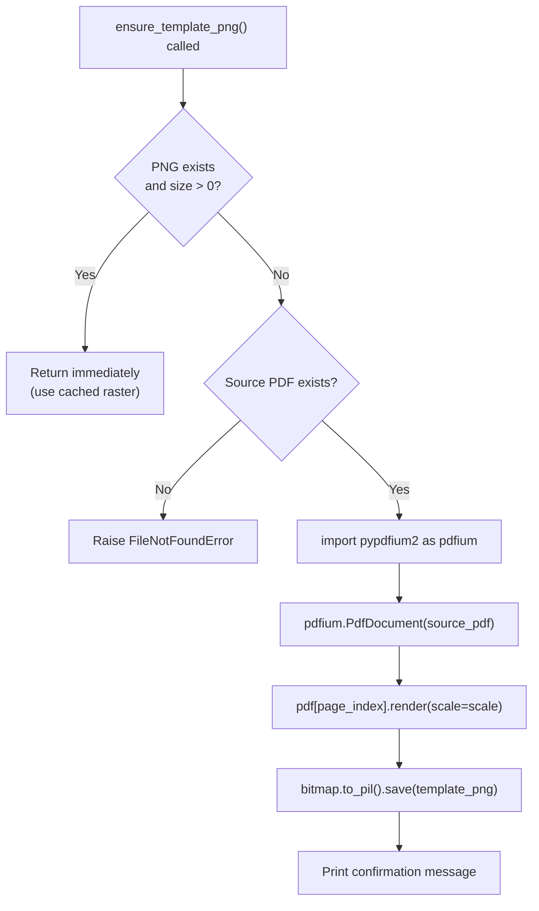
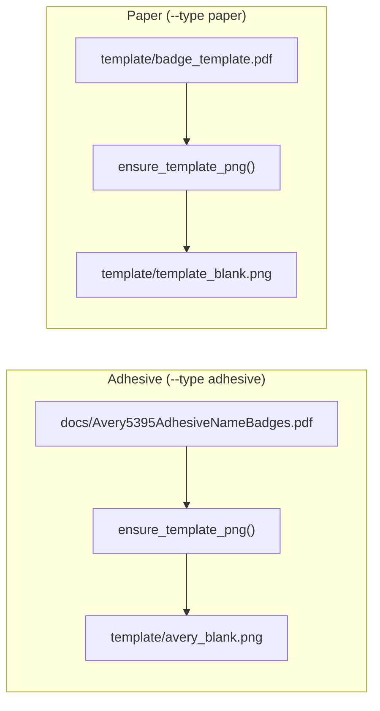
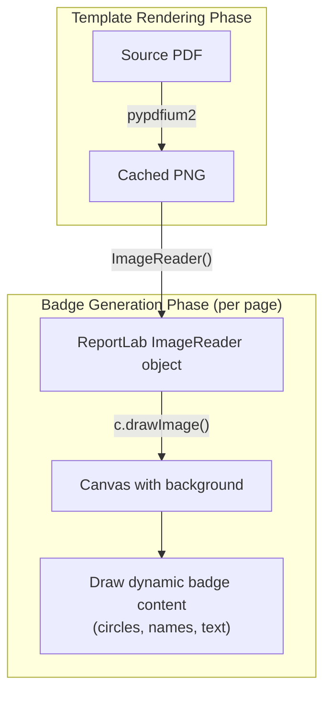

The badge generator cannot stamp text directly onto a PDF template file — ReportLab's `canvas` object draws primitives (lines, circles, text) but has no mechanism for compositing an existing PDF as a background layer. The project solves this by pre-rendering each template PDF into a high-resolution PNG using **pypdfium2**, then embedding that PNG as a full-page background image via ReportLab's `ImageReader`. This conversion happens automatically on the first run and is skipped on subsequent runs if the PNG already exists.

## Why a Raster Intermediate?

The two badge formats both require a branded background that was designed in an external tool (Adobe Illustrator, InDesign, etc.) and saved as a PDF. ReportLab's `drawImage` method can embed PNG or JPEG images natively, but it cannot layer an arbitrary source PDF beneath vector-drawn content. Converting the template PDF to a raster image at the start of each pipeline creates a compositable background that ReportLab can place on every output page before drawing the dynamic badge content on top.

Sources: [generate_badges.py](generate_badges.py#L542-L557), [generate_badges.py](generate_badges.py#L345-L347)

## The `ensure_template_png` Function

All template rendering flows through a single function — `ensure_template_png` — defined at the boundary between the PDF generation logic and the badge layout sections of [generate_badges.py](generate_badges.py#L542-L557).

```python
def ensure_template_png(template_png, source_pdf, page_index=0, scale=3.0):
```

The function implements a **lazy evaluation pattern**: it checks whether the output PNG already exists and has a non-zero file size. If so, it returns immediately without any work. This means the expensive PDF rendering step runs only once — on the very first execution after a fresh clone — and every subsequent run reuses the cached raster.

Sources: [generate_badges.py](generate_badges.py#L543-L557)

### Function Parameters

| Parameter | Type | Default | Purpose |
|---|---|---|---|
| `template_png` | `str` | — | Output path for the rendered PNG (e.g. `template/avery_blank.png`) |
| `source_pdf` | `str` | — | Input PDF path to rasterize (e.g. `docs/Avery5395AdhesiveNameBadges.pdf`) |
| `page_index` | `int` | `0` | Which page of the source PDF to render (zero-indexed) |
| `scale` | `float` | `3.0` | Pixel scaling factor relative to 72 DPI (see Resolution section below) |

Sources: [generate_badges.py](generate_badges.py#L543)

### Execution Flow



The lazy import of `pypdfium2` on [line 553](generate_badges.py#L553) (inside the function body rather than at module level) is intentional. Since template rendering is a one-time operation, there is no benefit to loading the library at startup for runs that already have the cached PNG. This keeps the cold-start import footprint minimal for the common case.

Sources: [generate_badges.py](generate_badges.py#L553-L556)

## Resolution and Scale Factor

The `scale` parameter controls the output resolution. pypdfium2's `.render(scale=N)` method produces a bitmap at `N × 72 DPI`. With the default `scale=3.0`, the US Letter page (612 × 792 pt at 72 DPI) renders to a **1836 × 2376 pixel** PNG — effectively 216 DPI, which exceeds the typical 150 DPI threshold for acceptable print quality from consumer laser printers.

| Scale Factor | Effective DPI | Pixel Dimensions (Letter) | Approx. File Size | Print Quality |
|---|---|---|---|---|
| `1.0` | 72 | 612 × 792 | ~50 KB | Screen preview only |
| `2.0` | 144 | 1224 × 1584 | ~200 KB | Acceptable for draft printing |
| **`3.0`** (default) | **216** | **1836 × 2376** | **~500 KB** | **Production quality** |
| `4.0` | 288 | 2448 × 3168 | ~900 KB | High-fidelity (larger output files) |

The PNGs are saved losslessly by pypdfium2's `.to_pil().save()` call, which defaults to PNG's lossless compression. This preserves the sharp edges of the cut guide outlines in the Avery template and the WCSU branding elements in the paper template.

Sources: [generate_badges.py](generate_badges.py#L543-L556)

## Two Template Paths

The badge generator supports two distinct badge formats, each with its own source PDF and output PNG. The `main()` block in [generate_badges.py](generate_badges.py#L761-L790) routes to the correct template based on the `--type` CLI flag.



| Badge Type | Source PDF | Output PNG | Page Used | Content |
|---|---|---|---|---|
| Adhesive | `docs/Avery5395AdhesiveNameBadges.pdf` | `template/avery_blank.png` | Page 1 | Avery 5395 cut-guide outlines |
| Paper | `template/badge_template.pdf` | `template/template_blank.png` | Page 1 | WCSU branded background with logo |

Both PNGs are listed in [.gitignore](.gitignore#L20-L23) under the comment "Auto-generated template renders — rebuilt from source PDFs on first run." This ensures they are never committed to version control, since they can be deterministically regenerated from the committed source PDFs.

Sources: [generate_badges.py](generate_badges.py#L763-L789), [.gitignore](.gitignore#L20-L23)

## How the PNG Is Consumed Downstream

Once `ensure_template_png` has produced (or skipped) the cached PNG, the badge generator functions receive the PNG path as their `template_png` argument. Both `generate_badges_pdf` (paper format, [line 345](generate_badges.py#L345)) and `generate_adhesive_badges_pdf` (adhesive format, [line 438](generate_badges.py#L438)) wrap the file in ReportLab's `ImageReader`, then call `canvas.drawImage` on every page to stamp the full-page background before overlaying the dynamic badge content (colored circles, names, school labels, etc.).



The `ImageReader` class from `reportlab.lib.utils` ([line 16](generate_badges.py#L16)) acts as a thin adapter that allows ReportLab to read PNG files (and other image formats) efficiently. It handles the file I/O internally and can even accept in-memory bytes, though in this project it always receives a file path string.

Sources: [generate_badges.py](generate_badges.py#L345-L347), [generate_badges.py](generate_badges.py#L402-L404), [generate_badges.py](generate_badges.py#L16)

## Error Handling

The function raises a `FileNotFoundError` with a descriptive message if the source PDF is missing and the cached PNG does not exist. This covers the scenario where a developer clones the repository but the template directory is incomplete. The error message directs the user to place the correct PDF file and re-run.

The existence check also verifies `os.path.getsize(template_png) > 0` rather than just `os.path.exists()`. This guards against a corrupted or truncated PNG file — if a previous render was interrupted (e.g., by a Ctrl+C during the `.save()` call), the zero-byte or partial file is treated as missing and a fresh render is triggered.

Sources: [generate_badges.py](generate_badges.py#L545-L551)

## Dependency Context

pypdfium2 (version 4.30.0) is declared in [requirements.txt](requirements.txt#L2). It is a Python binding for Google's PDFium library, which is the same rendering engine that powers Chromium's built-in PDF viewer. This makes it significantly faster and more accurate than pure-Python PDF renderers. The library bundles its own PDFium binary, so there are no external system dependencies to install — `pip install pypdfium2` handles everything.

Notably, pypdfium2 is **not used for any other purpose** in this project. The only other PDF-related dependency is `pypdf` (for reading/merging PDFs), and `pdfplumber` (for extracting measurements from the Avery template). pypdfium2's sole role is the rasterization step described on this page.

Sources: [requirements.txt](requirements.txt#L2)

## Next Steps

- **[Avery 5395 Adhesive Badge Layout: 8-Up Grid Coordinates and Header Band Design](15-avery-5395-adhesive-badge-layout-8-up-grid-coordinates-and-header-band-design)** — how the `avery_blank.png` background is used to position the 8 adhesive badge cells.
- **[WCSU Paper Badge Layout: 6-Up Grid, Colored Circles, and Template Background](16-wcsu-paper-badge-layout-6-up-grid-colored-circles-and-template-background)** — how the `template_blank.png` background provides the WCSU branded backdrop for paper badges.
- **[Text Rendering: Auto-Scaling Names, Word Wrapping, and Font Management](17-text-rendering-auto-scaling-names-word-wrapping-and-font-management)** — the `fit_text` and `wrap_and_draw` functions that render dynamic content on top of the template PNG.