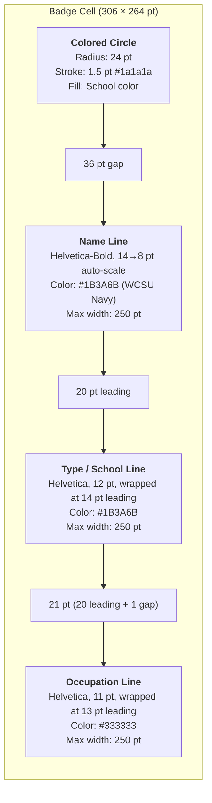
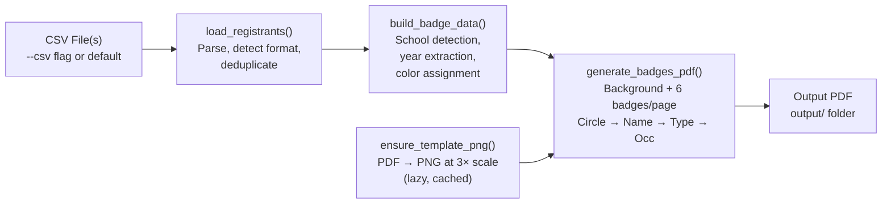

The paper badge format produces print-ready PDFs on WCSU-branded cardstock, arranging six name badges per US Letter page in a 2-column × 3-row grid. Each badge is anchored by a **school-colored circle** positioned above the attendee's name, with registration type and occupation lines flowing beneath it — all rendered atop a pre-designed template background that carries the WCSU Alumni Association branding. This page deconstructs every geometric constant, rendering pass, and coordinate system that makes the layout work.

For the sibling adhesive format, see [Avery 5395 Adhesive Badge Layout: 8-Up Grid Coordinates and Header Band Design](15-avery-5395-adhesive-badge-layout-8-up-grid-coordinates-and-header-band-design). For the mechanism that converts the source PDF into a PNG background, see [Template Auto-Rendering: PDF-to-PNG Conversion via pypdfium2](14-template-auto-rendering-pdf-to-png-conversion-via-pypdfium2).

Sources: [generate_badges.py](generate_badges.py#L7-L8)

## Page Geometry and the 2×3 Grid

The paper badge format targets a standard US Letter page (612 × 792 pt in reportlab's bottom-left-origin coordinate system). The page divides cleanly into a **2-column × 3-row grid** where each cell measures exactly half the page width by one-third the page height: 306 pt wide × 264 pt tall. These raw cell boundaries are defined by two layout constants at the top of the script, though the actual badge content area is smaller because the WCSU template PDF embeds its own margins (~17.7 pt left/right, ~73 pt top/bottom), leaving an effective content region of approximately 576 pt × 648 pt — or roughly 288 pt × 216 pt per badge cell.

```python
PAGE_W, PAGE_H = 612, 792
CELL_W = PAGE_W / 2          # 306
CELL_H = PAGE_H / 3          # 264
```

The column x-centers were derived from the template's actual content boundaries. The template's margins yield true column centers at **162 pt** (left column) and **450 pt** (right column), not the naive midpoint of 306 pt. This offset accounts for the asymmetric margin space in the WCSU design.

Sources: [generate_badges.py](generate_badges.py#L19-L21), [generate_badges.py](generate_badges.py#L26-L32)

## Per-Badge Slot Coordinates (BADGE_SLOTS)

Each of the six badge positions is described by a dictionary in the `BADGE_SLOTS` list, storing three values: `cx` (horizontal center), `cy` (circle center from page bottom), and `text_top_rl` (baseline y-coordinate for the first text line). The slots are ordered **top-to-bottom, left-to-right** — row 2 first (top), then row 1 (mid), then row 0 (bottom), with alternating left/right columns within each row. This ordering maps directly to the `enumerate(batch)` index when rendering a batch of six badges per page.

| Slot Index | Row | Column | `cx` (pt) | `cy` (pt) | `text_top_rl` (pt) | Computed Circle Y | Computed Text Y |
|:----------:|:---:|:------:|:---------:|:---------:|:------------------:|:-----------------:|:---------------:|
| 0 | Top (2) | Left | 162 | 621 | 585 | 792 − 171 | 792 − 207 |
| 1 | Top (2) | Right | 450 | 621 | 585 | 792 − 171 | 792 − 207 |
| 2 | Mid (1) | Left | 162 | 395 | 358 | 792 − 397 | 792 − 434 |
| 3 | Mid (1) | Right | 450 | 395 | 358 | 792 − 397 | 792 − 434 |
| 4 | Bot (0) | Left | 162 | 185 | 144 | 792 − 607 | 792 − 648 |
| 5 | Bot (0) | Right | 450 | 185 | 144 | 792 − 607 | 792 − 648 |

The coordinates are stored using the `792 - offset` pattern because reportlab uses a bottom-left origin while the template was designed with top-left visual thinking. The offsets (171, 207, 397, 434, 607, 648) represent distances from the **top edge** of the page, making them easier to cross-reference with visual design tools.

Sources: [generate_badges.py](generate_badges.py#L33-L46)

## Template Background Rendering Pipeline

Before any badge content is drawn, a full-page background image is composited onto the canvas. This background carries the WCSU Alumni Association logo, grid lines, and decorative elements — it is **not** drawn programmatically but rasterized from the committed `template/badge_template.pdf` at runtime.

The pipeline works in two stages. First, `ensure_template_png()` checks whether `template/template_blank.png` already exists and is non-zero in size. If the PNG is missing or corrupt (zero bytes), it renders page 0 of `badge_template.pdf` at 3× scale using pypdfium2 and saves the result. This auto-generation means the PNG is gitignored — it regenerates on first run or whenever the PDF is replaced and the stale PNG is deleted.

Second, inside `generate_badges_pdf()`, the PNG is loaded via reportlab's `ImageReader` and drawn to fill the entire page:

```python
template_img = ImageReader(template_png)
c.drawImage(template_img, 0, 0, width=PAGE_W, height=PAGE_H,
            preserveAspectRatio=True)
```

This full-page draw happens once per page, before the badge loop begins. All six badge slots then render their circle and text content **on top of** this background, creating a layered composition: template artwork at the bottom, colored circles and text at the top.

Sources: [generate_badges.py](generate_badges.py#L543-L557), [generate_badges.py](generate_badges.py#L388-L407)

## Badge Rendering Pass: Circle, Name, Type, and Occupation

For each badge in a six-badge batch, the renderer executes four drawing passes in strict vertical order. Each pass targets a specific y-coordinate derived from the slot dictionary, with subsequent lines offset by the `LINE_LEADING` constant (20 pt).

### Pass 1 — Colored Circle

A filled circle with a thin dark stroke serves as the primary school-color indicator. The circle is centered at `(cx, cy)` with a radius of `CIRCLE_R = 24` pt (48 pt diameter). The fill color comes from `badge["color"]`, which is resolved by the school detection engine (see [School Color Coding System and Visual Legend](7-school-color-coding-system-and-visual-legend)). The stroke uses a near-black `#1a1a1a` at 1.5 pt line width, providing subtle definition without overpowering the fill.

```python
c.setFillColor(badge["color"])
c.setStrokeColor(HexColor("#1a1a1a"))
c.setLineWidth(1.5)
c.circle(cx, cy, CIRCLE_R, stroke=1, fill=1)
```

### Pass 2 — Name Line (Bold, Auto-Scaled)

The attendee name is drawn at `text_top_rl` — positioned 36 pt below the circle center (the difference between `cy` and `text_top_rl` varies by row: 36 pt for top/mid rows, 37 pt for the bottom row due to margin compression). The name uses `Helvetica-Bold` at up to 14 pt, with `fit_text()` progressively scaling down to a minimum of 8 pt if the string exceeds `TEXT_AREA_WIDTH` (250 pt). The text color is WCSU Navy (`#1B3A6B`).

For alumni, the name line includes graduation year suffixes (e.g., "Jane Doe '98 & '04"). See [Name Line Assembly with Alumni Year Suffixes](19-name-line-assembly-with-alumni-year-suffixes) for the full formatting logic.

### Pass 3 — Type / School Line

One `LINE_LEADING` (20 pt) below the name, the registration type and school name appear in 12 pt Helvetica. This line is rendered by `wrap_and_draw()`, which performs word wrapping at `TEXT_AREA_WIDTH` with 14 pt line spacing. The combined string format varies by registration type: Alumni and Students see "Alumni · Ancell School of Business", Faculty see their department or "Faculty / Staff", and Community guests see their organization or "Community Guest". See [Registration Type Display Logic](20-registration-type-display-logic-name-school-and-occupation-formatting) for the full routing table.

### Pass 4 — Occupation Line

The final text element sits 21 pt below the type baseline (one `LINE_LEADING` plus a 1 pt gap). It renders in 11 pt Helvetica at dark gray (`#333333`) using the same `wrap_and_draw()` wrapping logic with 13 pt line spacing. The occupation string is pre-processed: newlines are collapsed, multi-role entries separated by `/` or `;` are truncated to the first segment, and the result is capped at 85 characters.

Sources: [generate_badges.py](generate_badges.py#L415-L437), [generate_badges.py](generate_badges.py#L48-L49)

## Vertical Layout Architecture per Badge

The following diagram shows the vertical stacking order and spacing within a single badge cell, measured from the page bottom (reportlab convention). Exact y-values differ by row due to the grid, but the **relative offsets between elements remain constant**.



| Element | Font | Size (pt) | Color | Y-offset from previous | Max width |
|---------|------|:---------:|-------|:-----------------------:|:---------:|
| Colored circle | — | R=24 | School color | — | — |
| Name | Helvetica-Bold | 14–8 (auto) | `#1B3A6B` | +36 pt below circle center | 250 pt |
| Type / School | Helvetica | 12 | `#1B3A6B` | −20 pt below name baseline | 250 pt |
| Occupation | Helvetica | 11 | `#333333` | −21 pt below type baseline | 250 pt |

The `TEXT_AREA_WIDTH` of 250 pt provides approximately 28 pt of horizontal padding on each side within the 306 pt cell width — generous clearance that prevents text from colliding with adjacent badges or the template margin artwork.

Sources: [generate_badges.py](generate_badges.py#L23-L24), [generate_badges.py](generate_badges.py#L48-L49), [generate_badges.py](generate_badges.py#L415-L437)

## Page Batching and Badge-to-Slot Mapping

Badges are assigned to pages and slots using simple integer division. The total badge count from all CSV files determines the page count via ceiling division: `page_count = (len(badges) + 5) // 6`. Each page extracts a six-badge slice, and within that slice, `enumerate(batch)` provides the index that maps directly into `BADGE_SLOTS`. This means badge 0 always renders at the top-left slot, badge 1 at top-right, badge 2 at middle-left, and so on.

If the total badge count is not a multiple of six, the final page will contain fewer than six badges — the remaining slots simply remain blank, showing only the template background with no circle or text. This is intentional: the template background already prints the full grid, so unused cells appear as empty badge outlines ready for hand-written additions.

Sources: [generate_badges.py](generate_badges.py#L400-L409)

## Blank Walk-In Badge Sheets for Paper Format

When the `--blank --type paper` flags are passed, `generate_blank_paper_pdf()` produces six pages — one per school color — each containing six badges with the colored circle and school label but **no name or occupation text**. The function iterates over `SCHOOLS_ORDERED` (six entries excluding the gray `"default"` key) and renders one full page per school.

For each badge slot on a blank page, the renderer draws the same colored circle (with the same stroke and radius) and then places the school's human-readable label (e.g., "Ancell School of Business") 20 pt below the text top position in 10 pt Helvetica. The name and occupation areas are intentionally left empty to serve as write-in zones for walk-in registrants. Since the WCSU template background already includes the Alumni Association logo, no separate logo draw is needed — unlike the adhesive blank generator which composites the logo image separately.

The blank paper badge generator shares the same template background pipeline (`ensure_template_png` → `template_blank.png`) and the same `BADGE_SLOTS` coordinate array as the named badge generator, ensuring pixel-perfect alignment between pre-printed blanks and on-demand named badges.

Sources: [generate_badges.py](generate_badges.py#L613-L651), [generate_badges.py](generate_badges.py#L108-L115)

## Full Rendering Flow

The end-to-end flow from CSV data to finished paper badge PDF follows a linear pipeline. Each stage feeds the next, with the template rendering step acting as a lazy gate — it only executes on the first run or when the cached PNG is invalidated.



Each box in this pipeline corresponds to a dedicated function or section in [generate_badges.py](generate_badges.py). For details on school detection (the `detect_school` step inside `build_badge_data`), see [Keyword-Based School Assignment Algorithm and Priority Rules](11-keyword-based-school-assignment-algorithm-and-priority-rules). For text scaling and wrapping mechanics, see [Text Rendering: Auto-Scaling Names, Word Wrapping, and Font Management](17-text-rendering-auto-scaling-names-word-wrapping-and-font-management).

Sources: [generate_badges.py](generate_badges.py#L338-L442)

## Adjusting the Paper Layout

All geometric constants for the paper format are concentrated at the top of the script (lines 18–49), making layout adjustments straightforward. For a comprehensive guide to modifying these values, see [Adjusting Layout Constants: Font Sizes, Circle Radius, and Line Spacing](23-adjusting-layout-constants-font-sizes-circle-radius-and-line-spacing).

| Constant | Default | Effect |
|----------|:-------:|--------|
| `CIRCLE_R` | 24 | Circle diameter — increase for larger color indicator |
| `LINE_LEADING` | 20 | Vertical gap between text baselines — increase for more breathing room |
| `TEXT_AREA_WIDTH` | 250 | Maximum text width before wrapping — decrease to add more side padding |
| Inline font sizes | 14, 12, 11 | Name, type, and occupation font sizes — tuned per pass in `generate_badges_pdf()` |