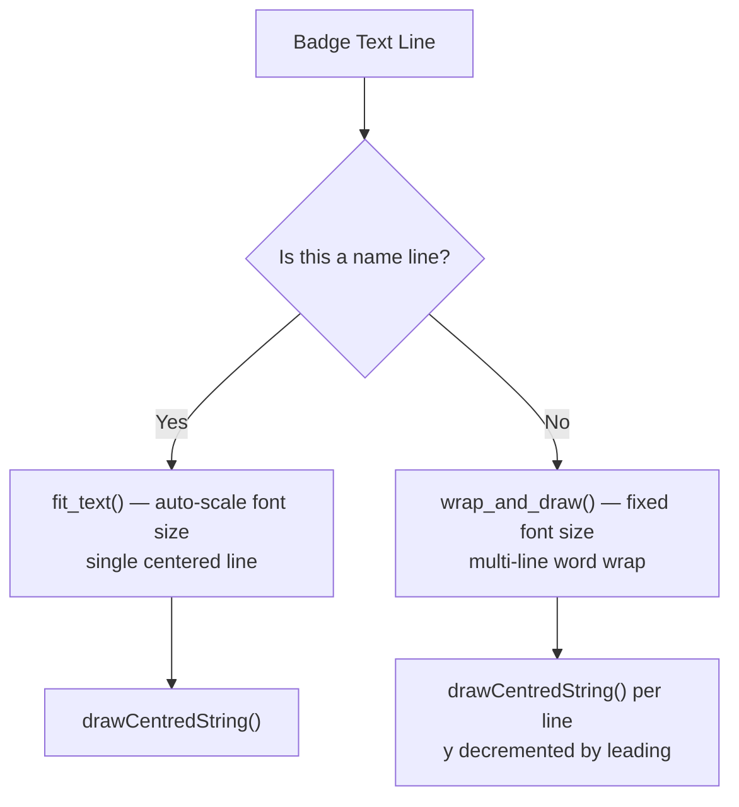
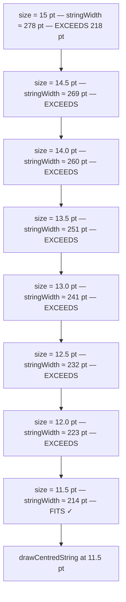

This page dissects the two text rendering primitives — **`fit_text()`** and **`wrap_and_draw()`** — that draw every piece of text on both badge formats. You will learn how font sizes are dynamically scaled to prevent overflow, how long lines are broken into multiple centered lines, and which ReportLab built-in fonts are used where. Understanding these functions is essential before attempting any layout customisation covered in [Adjusting Layout Constants: Font Sizes, Circle Radius, and Line Spacing](23-adjusting-layout-constants-font-sizes-circle-radius-and-line-spacing).

## The Two Rendering Primitives

The badge generator delegates all text drawing to two helper functions defined in the "Text helpers" section of [generate_badges.py](generate_badges.py#L189-L220). Neither function relies on external font files — every face is a ReportLab Type 1 built-in, which means the generator works identically across operating systems without shipping any `.ttf` or `.otf` assets.



### `fit_text()` — Single-Line Auto-Scaling

The `fit_text()` function handles **name lines only**. It starts at a `max_size` and decrements by 0.5 pt on each iteration until the measured string width fits within `max_w`. This guarantees the name never overflows its badge cell, even for exceptionally long names with alumni year suffixes like `"Charlotte Huntington-Wellesley '71, '98 & '04"`.

```python
def fit_text(c_obj, text, x, y, max_w, font_name, max_size=14, min_size=7):
    size = max_size
    while size >= min_size:
        c_obj.setFont(font_name, size)
        if c_obj.stringWidth(text, font_name, size) <= max_w:
            break
        size -= 0.5
    c_obj.drawCentredString(x, y, text)
    return size
```

Sources: [generate_badges.py](generate_badges.py#L190-L199)

Key behavioural details: the function **always draws text** — even if the minimum size is reached and the string technically still exceeds `max_w`, the loop exits at `min_size` and draws anyway. The returned `size` value is currently unused by callers but could be leveraged for downstream layout adjustments. The `stringWidth()` call uses ReportLab's internal glyph metrics, so width calculation is deterministic and font-file-independent.

### `wrap_and_draw()` — Greedy Word Wrapping with Fixed Font Size

The `wrap_and_draw()` function handles **type/school lines** and **occupation lines**. It splits the input into words and greedily accumulates each word onto the current line, flushing to a new line only when adding the next word would exceed `max_w`. Each completed line is drawn centered, and the function returns the updated `y` coordinate so the caller can position subsequent text below without overlap.

```python
def wrap_and_draw(c_obj, text, x, y, max_w, font_name, font_size, leading):
    words = text.split()
    line = ""
    lines = []
    for w in words:
        test = f"{line} {w}".strip()
        if c_obj.stringWidth(test, font_name, font_size) <= max_w:
            line = test
        else:
            if line:
                lines.append(line)
            line = w
    if line:
        lines.append(line)
    for ln in lines:
        c_obj.drawCentredString(x, y, ln)
        y -= leading
    return y
```

Sources: [generate_badges.py](generate_badges.py#L201-L220)

The algorithm is a classic greedy word-wrap (also called "first-fit"): it prefers keeping words on the current line as long as possible, only breaking when forced. This means lines are ragged-right (varied lengths) but the visual result is acceptable because every line is drawn centered within the badge cell. The returned `y` value is critical in the adhesive format where the occupation line uses `next_y - 6` rather than a fixed offset, ensuring wrapped type lines never collide with the occupation text below.

Sources: [generate_badges.py](generate_badges.py#L525-L534)

## Font Management: Built-In Type 1 Faces Only

The generator uses exactly **two font faces** from ReportLab's built-in Type 1 library. No custom fonts are loaded, no `registerFont()` calls exist, and no font files are bundled in the repository. This design choice trades typographic flexibility for zero-setup cross-platform portability.

| Font Face | ReportLab Name | Usage | Weight |
|---|---|---|---|
| **Helvetica** | `"Helvetica"` | Type/school lines, occupation lines, "Meet & Greet 2026" label, school labels on blank badges | Regular |
| **Helvetica Bold** | `"Helvetica-Bold"` | Attendee name lines (both badge formats) | Bold |

Sources: [generate_badges.py](generate_badges.py#L425-L437), [generate_badges.py](generate_badges.py#L500-L534)

The `textwrap` module imported at [line 12](generate_badges.py#L12) is **not used** anywhere in the codebase — the custom `wrap_and_draw()` function replaced it entirely, likely because ReportLab's `stringWidth()` requires the font name and size as arguments, which Python's standard `textwrap` module cannot provide.

## Per-Format Rendering Parameters

Each badge format applies the two primitives with different font sizes, maximum widths, and line leading values. The table below maps every text element to its exact rendering configuration, making it straightforward to predict how any given input string will appear on the badge.

### Paper Badge Format (6-Up WCSU Template)

| Text Element | Primitive | Font | Max Size | Min Size | Max Width | Leading |
|---|---|---|---|---|---|---|
| Attendee name | `fit_text()` | Helvetica-Bold | 14 pt | 8 pt | 250 pt (`TEXT_AREA_WIDTH`) | — |
| Type / school | `wrap_and_draw()` | Helvetica | 12 pt (fixed) | — | 250 pt | 14 pt |
| Occupation | `wrap_and_draw()` | Helvetica | 11 pt (fixed) | — | 250 pt | 13 pt |

The text area width of 250 pt provides generous horizontal room within the paper badge cell, which measures approximately 288 pt wide after accounting for the template's built-in margins. The 20 pt `LINE_LEADING` constant ([line 48](generate_badges.py#L48)) spaces the baselines of the name and type lines, with a 1 pt additional gap before the occupation line.

Sources: [generate_badges.py](generate_badges.py#L421-L437), [generate_badges.py](generate_badges.py#L48-L49)

### Adhesive Badge Format (Avery 5395, 8-Up)

| Text Element | Primitive | Font | Max Size | Min Size | Max Width | Leading |
|---|---|---|---|---|---|---|
| "Meet & Greet 2026" | Direct `drawCentredString` | Helvetica | 9 pt (fixed) | — | — | — |
| Attendee name | `fit_text()` | Helvetica-Bold | 15 pt | 7 pt | 218 pt (`AVERY_TEXT_W`) | — |
| Type / school | `wrap_and_draw()` | Helvetica | 11 pt (fixed) | — | 218 pt | 13 pt |
| Occupation | `wrap_and_draw()` | Helvetica | 10 pt (fixed) | — | 218 pt | 12 pt |

The adhesive format is significantly tighter: 218 pt maximum width versus 250 pt for paper, and font sizes are 1–2 pt smaller across the board to fit within the 3-3/8″ × 2-1/3″ Avery cells. The name can auto-scale down to 7 pt (vs 8 pt minimum for paper) because the Avery badge height is more constrained at 167.976 pt versus the paper badge's ~216 pt.

Sources: [generate_badges.py](generate_badges.py#L493-L534), [generate_badges.py](generate_badges.py#L62-L65)

## How Auto-Scaling Works: Step-by-Step Example

Consider rendering the name `"Dr. Elizabeth Huntington-Wellesley '71"` on an adhesive badge. The `fit_text()` call at [line 500](generate_badges.py#L500) sets `max_size=15`, `min_size=7`, `max_w=218`, and `font_name="Helvetica-Bold"`. The function executes the following loop:



The 0.5 pt decrement step provides fine-grained control — names that barely exceed the maximum width shrink just enough rather than dropping a full point. For a short name like `"Jane Doe '71"`, the loop breaks immediately at 15 pt since the string width (≈ 118 pt) fits comfortably within 218 pt. This means most badges display names at the maximum size, with scaling kicking in only for the edge cases documented in [Known Edge Cases: Long Names, Duplicate Entries, Multi-Line Occupations, and Ambiguous Majors](26-known-edge-cases-long-names-duplicate-entries-multi-line-occupations-and-ambiguous-majors).

Sources: [generate_badges.py](generate_badges.py#L190-L199)

## How Word Wrapping Works: Dynamic Line Count

The `wrap_and_draw()` function produces a variable number of lines depending on input length. Each line is independently centered, and the caller receives the final `y` position to prevent overlap with the next text element. This dynamic return value is particularly important in the adhesive format:

```python
# Type/school line — may wrap to 2 lines
next_y = wrap_and_draw(c, badge["type"], cx, type_y,
                        AVERY_TEXT_W, "Helvetica", 11, 13)

# Occupation — positioned relative to actual type-line bottom, not a fixed y
occ_y = next_y - 6
wrap_and_draw(c, badge["occ"], cx, occ_y,
              AVERY_TEXT_W, "Helvetica", 10, 12)
```

If the type string `"Student · Ancell School of Business"` wraps to two lines, `next_y` will be 13 pt lower than `type_y`, and the occupation line shifts down accordingly. If the type fits on one line, the occupation moves up to fill the space. This adaptive layout prevents text collision regardless of how many lines the type or occupation strings require.

Sources: [generate_badges.py](generate_badges.py#L525-L534)

In contrast, the paper format uses a **fixed offset** for the occupation line (`occ_y = type_y - LINE_LEADING - 1`), which works because the paper badge's taller cell provides more vertical headroom. However, this means a very long type string that wraps to two or more lines could potentially overlap the occupation text on paper badges — a trade-off documented in the edge cases page.

Sources: [generate_badges.py](generate_badges.py#L429-L437)

## Text Colour Assignments by Format and Element

Each text element uses a specific colour that balances readability against the badge's visual design. The colour assignments differ between formats because the adhesive badge renders the name in white against the coloured header band, while the paper badge renders all text in dark colours against a white background.

| Text Element | Adhesive Format | Paper Format |
|---|---|---|
| "Meet & Greet 2026" | `white` | *(not shown — part of template PNG)* |
| Attendee name | `white` (inverted on colour band) | `#1B3A6B` (WCSU Navy) |
| Type / school | `#1B3A6B` (WCSU Navy) | `#1B3A6B` (WCSU Navy) |
| Occupation | `#444444` (dark gray) | `#333333` (near-black) |

Sources: [generate_badges.py](generate_badges.py#L494-L534), [generate_badges.py](generate_badges.py#L422-L437)

## Occupation Text Pre-Processing

Before the occupation string reaches `wrap_and_draw()`, the `build_badge_data()` function at [line 373](generate_badges.py#L373) performs normalisation that directly affects the word-wrapping behaviour:

1. **Newline collapse** — all `\n` characters are replaced with spaces, preventing unintended line breaks inside the word wrapper.
2. **Multi-role truncation** — if the occupation contains numbered roles (`"1) CEO"`, `"2) Board Member"`), only the first role segment is retained.
3. **Length cap** — the final string is truncated to 85 characters, which is well within what `wrap_and_draw()` can fit in 2–3 lines at 10–11 pt.

```python
title_clean = " ".join(title.replace("\n", " ").split())
for sep in ["\n", "  ", "1)", "2)"]:
    title_clean = title_clean.split(sep)[0].strip()
occ_line = title_clean[:85] if title_clean else ""
```

This pre-processing ensures that messy CSV data (multi-line cells, multiple roles pasted into one field) produces clean, predictable badge output without surprising mid-word breaks.

Sources: [generate_badges.py](generate_badges.py#L372-L377)

## Quick Reference: All Layout Constants Affecting Text

These are the constants you would modify to change text behaviour across both formats. For step-by-step customisation guidance, see [Adjusting Layout Constants: Font Sizes, Circle Radius, and Line Spacing](23-adjusting-layout-constants-font-sizes-circle-radius-and-line-spacing).

| Constant | Value | Scope | Controls |
|---|---|---|---|
| `LINE_LEADING` | 20 pt | Paper badge | Baseline gap between name, type, and occupation lines |
| `TEXT_AREA_WIDTH` | 250 pt | Paper badge | Maximum horizontal width for all wrapped text |
| `AVERY_TEXT_W` | 218 pt | Adhesive badge | Maximum horizontal width for all wrapped text |
| `AVERY_HEADER_H` | 52 pt | Adhesive badge | Height of coloured band containing the name |

Sources: [generate_badges.py](generate_badges.py#L48-L49), [generate_badges.py](generate_badges.py#L62-L65)

## Next Steps

- To change font sizes, leading values, or text area widths, read [Adjusting Layout Constants: Font Sizes, Circle Radius, and Line Spacing](23-adjusting-layout-constants-font-sizes-circle-radius-and-line-spacing).
- To understand how the name string is assembled (including alumni year suffixes that affect `fit_text()` width), see [Name Line Assembly with Alumni Year Suffixes](19-name-line-assembly-with-alumni-year-suffixes).
- To see how the type/school string is composed before it enters `wrap_and_draw()`, read [Registration Type Display Logic: Name, School, and Occupation Formatting](20-registration-type-display-logic-name-school-and-occupation-formatting).
- For documented failure modes involving very long names or multi-line occupations, consult [Known Edge Cases: Long Names, Duplicate Entries, Multi-Line Occupations, and Ambiguous Majors](26-known-edge-cases-long-names-duplicate-entries-multi-line-occupations-and-ambiguous-majors).