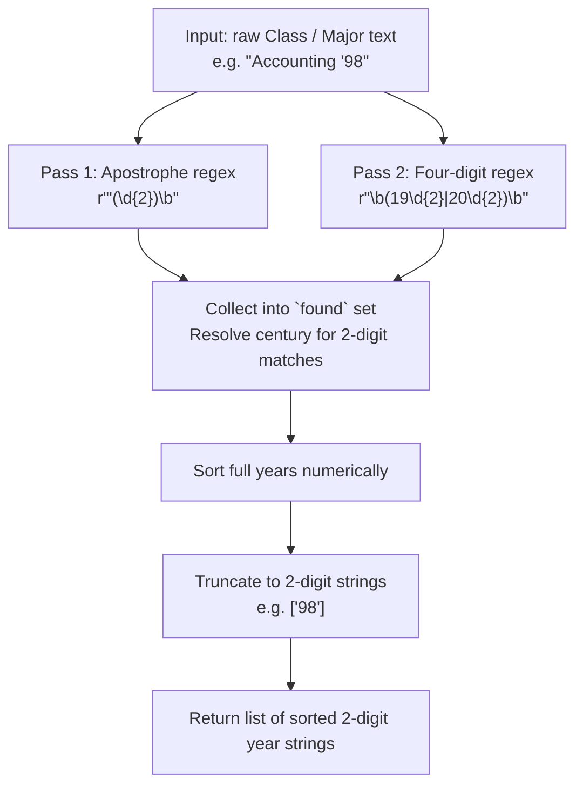
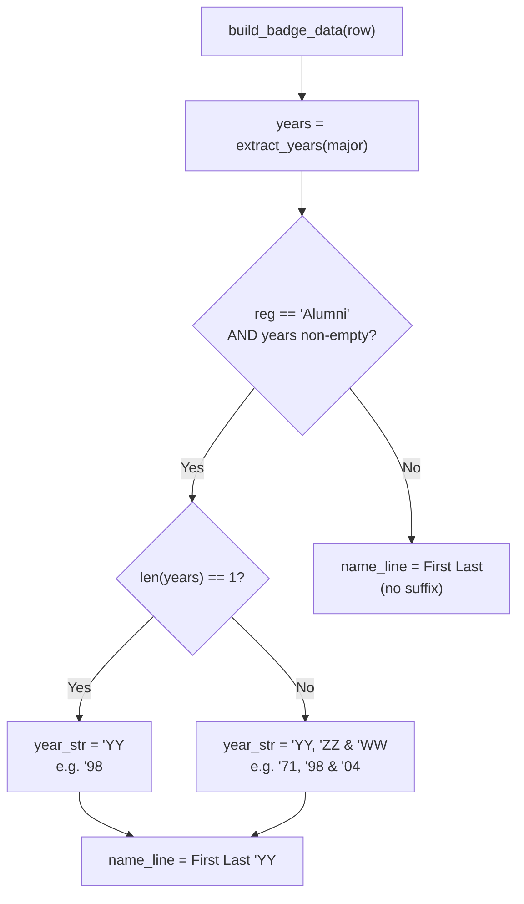

When alumni register for the WCSU Meet & Greet, their graduation year is embedded directly in the **Class / Major** CSV column — not as a separate field. The badge generator must parse this free-text field, extract one or more graduation years, and append them to the attendee's name on the printed badge. This page explains the dual-format regex engine that handles both shorthand apostrophe style (`'71`) and full four-digit notation (`1971`), along with the century-resolution heuristic and multi-year formatting rules that produce the final name-line suffix.

Sources: [generate_badges.py](generate_badges.py#L174-L187)

## The Data Origin: Years Live Inside the Major Field

Graduation years do not occupy a dedicated CSV column. Instead, they are embedded within the **Class / Major** field, which serves a dual purpose: it provides the major text for [school color detection](11-keyword-based-school-assignment-algorithm-and-priority-rules) *and* carries the year information for alumni badges. A typical alumni row might contain a value like `'71`, `Biology '98`, `1971`, or even `'71 & '98` for a double-degree alumna. The extraction function receives the raw content of this cell as a single string and must reliably pull out the year tokens regardless of surrounding text.

This dual-purpose design means the year extractor and the school detector both consume the same field but operate independently — the extractor runs *before* the badge data is assembled, and its results are only applied when the registration type is `"Alumni"`.

Sources: [generate_badges.py](generate_badges.py#L346-L356)

## The `extract_years` Function: Architecture and Regex Strategy

The extraction engine is a single function, `extract_years(text)`, defined at [lines 175–187](generate_badges.py#L175-L187). It uses a two-pass strategy with distinct regular expressions, collecting matches into a `set` to automatically deduplicate overlapping hits from both patterns.



The two regex patterns serve complementary purposes and are applied sequentially to the same input string:

**Pass 1 — Apostrophe-style format** (`r"'(\d{2})\b"`): Matches a literal apostrophe followed by exactly two digits and a word boundary. This captures conventional alumni shorthand like `'71`, `'98`, `'04`. The `\b` anchor is critical — it prevents partial matches inside longer digit sequences (e.g., `'1234` would not match because `12` is not followed by a word boundary after the second digit). The captured group (the two digits) is then resolved to a full four-digit year using the century heuristic described below.

**Pass 2 — Four-digit format** (`r"\b(19\d{2}|20\d{2})\b"`): Matches complete four-digit years in the 1900s or 2000s range, bounded by word boundaries on both sides. This handles explicit entries like `1971`, `1998`, or `2024`. Word boundaries prevent false positives from phone numbers, ZIP codes, or other numeric strings that happen to contain matching digit patterns.

Sources: [generate_badges.py](generate_badges.py#L175-L187)

## Century Resolution: The Two-Digit Threshold

When Pass 1 captures a two-digit year from apostrophe notation, the function must decide whether `'71` means **1971** or **2071**. The resolution rule is a simple threshold comparison on [line 184](generate_badges.py#L184):

```python
f"20{y:02d}" if y <= 26 else f"19{y:02d}"
```

Two-digit values from `00` through `26` are mapped to the 2000s (`2000`–`2026`), while values `27` through `99` are mapped to the 1900s (`1927`–`1999`). The threshold of **26** was chosen because the event is the **WCSU Meet & Greet 2026** — it assumes no one attending has graduated after 2026, making the earliest plausible future-date collision unlikely. For the 1900s side, WCSU was founded in 1903, so all realistic alumni years from `27` onward correctly resolve to the 20th century.

| Two-digit input | Resolved year | Rationale |
|:---:|:---:|---|
| `'71` | 1971 | 71 > 26 → 1900s |
| `'98` | 1998 | 98 > 26 → 1900s |
| `'04` | 2004 | 04 ≤ 26 → 2000s |
| `'26` | 2026 | 26 ≤ 26 → 2000s (event year) |
| `'27` | 1927 | 27 > 26 → 1900s |

After both passes populate the `found` set with full four-digit year strings (e.g., `{"1971", "1998"}`), the function sorts them numerically and truncates each back to a two-digit string (`["71", "98"]`) for display. This sort-then-truncate approach ensures that the final display order is chronological regardless of which format the years were originally written in.

Sources: [generate_badges.py](generate_badges.py#L182-L187)

## Integration with Badge Data Assembly

The extracted years are consumed by [`build_badge_data()`](generate_badges.py#L338-L385), which assembles the complete badge record for each registrant. Year suffixes are applied **only** when two conditions are simultaneously true: the registration type is `"Alumni"` **and** at least one year was successfully extracted.



The formatting rules for the year suffix, implemented at [lines 350–354](generate_badges.py#L350-L354), follow a natural-language pattern:

- **Single year**: `'71` — plain apostrophe-prefixed two-digit year.
- **Two years**: `'71 & '98` — comma and ampersand joining.
- **Three or more years**: `'71, '98 & '04` — commas between all but the last, which uses an ampersand. This is the Oxford-comma-adjacent list format.

The final `name_line` string becomes `"{first} {last} {year_str}"` (e.g., `Lois '71 & '98`). This name line is then passed to the [text rendering engine](17-text-rendering-auto-scaling-names-word-wrapping-and-font-management) where `fit_text()` auto-scales it to fit within the badge's text area. For alumni with multiple years, the longer name string may trigger smaller font sizes — the auto-scaling system handles this seamlessly.

Sources: [generate_badges.py](generate_badges.py#L346-L356)

## Format Support Matrix

The following table summarizes every input pattern the extraction engine can handle, along with the expected output and any caveats:

| Input pattern | Example(s) | Pass that matches | Output | Notes |
|---|---|---|---|---|
| Apostrophe + 2 digits | `'71`, `'98`, `'04` | Pass 1 | `['71']`, `['98']`, `['04']` | Primary alumni format |
| Apostrophe + 2 digits with text | `Biology '98`, `MBA '15` | Pass 1 | `['98']`, `['15']` | Major text is ignored; digits extracted |
| Full 4-digit year | `1971`, `2024` | Pass 2 | `['71']`, `['24']` | Explicit year notation |
| Multiple apostrophe years | `'71 & '98`, `'71, '98 & '04` | Pass 1 (multiple matches) | `['71', '98']`, `['71', '98', '04']` | Set deduplication prevents duplicates |
| Mixed formats | `'71 & 1998` | Both passes | `['71', '98']` | Merged and sorted chronologically |
| Apostrophe in name (no digits) | `D'andria` | Neither | `[]` | No match — digits required after apostrophe |
| Year-like string in major | `2019`, `2020` | Pass 2 | `['19', '20']` | Would produce year suffix for Alumni |

Sources: [generate_badges.py](generate_badges.py#L175-L187)

## Safe Coexistence with Apostrophes in Names

A notable design concern is the apostrophe-style regex (`r"'(\d{2})\b"`) and its interaction with names like `O'Connor` or `D'andria` that appear in the same CSV. The regex is deliberately strict: it requires exactly two digits *immediately following* the apostrophe. Since human names contain letters rather than digits after an apostrophe, no false match occurs. This safety is inherent to the regex pattern itself — no special-casing or look-behind assertions are needed.

However, there is an edge case worth noting: if the `Class / Major` field contains a bare year like `2019` (with no major text), Pass 2 will extract it as `['19']`. For alumni registrants, this produces a `'19` suffix on the badge name — which may be the intended behavior if the year *is* the only data available. For non-alumni registrants, the extracted years are simply ignored since the suffix-attachment logic gates on `reg == "Alumni"`.

Sources: [generate_badges.py](generate_badges.py#L182-L183)

## Next Steps

- **[Name Line Assembly with Alumni Year Suffixes](19-name-line-assembly-with-alumni-year-suffixes)** — How the year-bearing name string flows into both badge formats and interacts with auto-scaling.
- **[Text Rendering: Auto-Scaling Names, Word Wrapping, and Font Management](17-text-rendering-auto-scaling-names-word-wrapping-and-font-management)** — How `fit_text()` handles the longer name strings produced by year suffixes.
- **[Keyword-Based School Assignment Algorithm and Priority Rules](11-keyword-based-school-assignment-algorithm-and-priority-rules)** — How the same `Class / Major` field is simultaneously consumed for school color detection.
- **[Known Edge Cases: Long Names, Duplicate Entries, Multi-Line Occupations, and Ambiguous Majors](26-known-edge-cases-long-names-duplicate-entries-multi-line-occupations-and-ambiguous-majors)** — Broader catalog of edge cases including year-related scenarios.