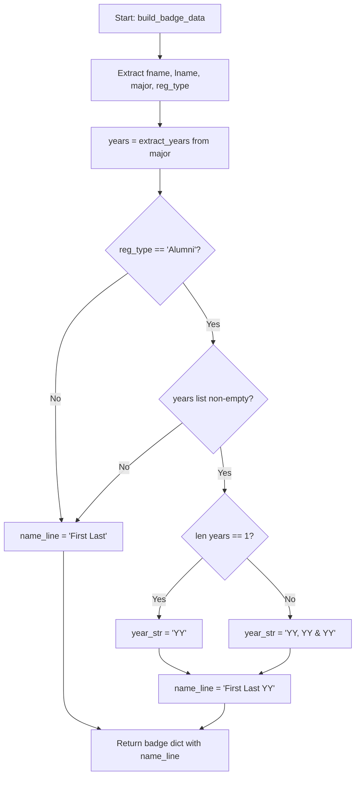

The name line is the most prominent text on every badge — it sits at the top of the colored header band on adhesive badges and directly below the colored circle on paper badges. For alumni attendees, this line also carries their graduation year as a suffix, creating the familiar `'71` / `'05` / `'23` convention instantly recognizable at alumni events. This page explains how the `build_badge_data()` function constructs the name line from raw CSV data, why alumni year suffixes are conditional on registration type, and how multi-year suffixes are formatted for double-degree graduates.

## The Assembly Entry Point: `build_badge_data()`

Every badge's visual content originates from `build_badge_data()`, which receives a single normalized CSV row and returns a dictionary containing the rendered `name`, `type`, `occ`, `color`, and `school` keys. The function begins by extracting five fields from the row: the registration type, first name, last name, class/major, organization, and occupation title. First and last names are immediately passed through `.strip().title()` to normalize capitalization regardless of how the registrant typed them — `helen` becomes `Helen`, `CHRISTOPHER` becomes `Christopher`, and `abby` becomes `Abby`. This ensures visual consistency across all badges without requiring any manual cleanup of the source CSV.

Sources: [generate_badges.py](generate_badges.py#L338-L344)

## The Two-Branch Name Line Decision Tree

The name line assembly follows a strict two-branch decision tree governed by two conditions: the registrant's **registration type** and whether the **`Class / Major` field contains any parseable graduation years**. The `extract_years()` function (documented in [Graduation Year Extraction: Apostrophe and Four-Digit Format Parsing](18-graduation-year-extraction-apostrophe-and-four-digit-format-parsing)) scans the major text for both apostrophe-style (`'71`, `'98`) and four-digit (`1971`, `1998`) year patterns, returning a sorted list of two-digit strings like `['71', '98']`. If the registration type is `"Alumni"` **and** that list is non-empty, the year suffix branch executes. In all other cases — Students, Faculty/Staff, Community guests, and alumni whose major field contains no recognizable year — the name line is simply `"{First} {Last}"` with no suffix at all.



This design means a Student whose major field says `"Psychology, Fall 26'"` receives no year suffix on their badge — only alumni get the apostrophe-year treatment. Similarly, an alumni who listed their major as simply `"Computer Science"` without any year also receives a plain name. The suffix is never applied to Faculty/Staff or Community registrations regardless of what the major field contains.

Sources: [generate_badges.py](generate_badges.py#L346-L356)

## Year Suffix Formatting Rules

When the Alumni+years branch activates, the formatting depends on how many distinct graduation years were extracted:

**Single year** produces a straightforward apostrophe prefix. A registrant with `Class / Major` = `"MBA 2007"` yields the name line `Helen Curtin '07`. The two-digit year `07` is extracted from the four-digit `2007`, then prepended with an apostrophe character.

**Multiple years** use a specific punctuation pattern designed for readability: all years except the last are comma-separated, and an ampersand joins the final year. For two years like `'71` and `'98`, the result is `'71 & '98`. For three or more years, the pattern becomes `'71, '98 & '04`. This mirrors common alumni convention for multi-degree holders and is implemented by joining `years[:-1]` with `", "` and concatenating `f" & '{years[-1]}"` to the result.

The following table demonstrates how real-world CSV data maps to badge name lines:

| Registration Type | Class / Major (raw) | Years Extracted | Badge Name Line |
|---|---|---|---|
| Alumni | `MBA 2007` | `['07']` | `Helen Curtin '07` |
| Alumni | `2020 Business Administration` | `['20']` | `Sam Furniss '20` |
| Alumni | `2009/JLA -Legal Studies` | `['09']` | `Carlos Valenzuela '09` |
| Alumni | `Class of 2024 Digital & Interactive Marketing` | `['24']` | `Brandon Rigdon '24` |
| Alumni | `1993 Computer Science` | `['93']` | `Matthew Augustine '93` |
| Alumni | `Secondary Ed English 2025` | `['25']` | `Erin Lowenadler '25` |
| Alumni | `Computer Science` | `[]` (no year found) | `Leonard Prytalski` |
| Student | `Psychology, Fall 26'` | `['26']` | `Salaya Smith` (suffix skipped) |
| Student | `2026 / Accounting` | `['26']` | `Madeline Arias` (suffix skipped) |
| Faculty/Staff | *(empty)* | `[]` | `Tom Zarecki` |
| Community | *(empty)* | `[]` | `Guest` (fallback first name) |

Sources: [generate_badges.py](generate_badges.py#L346-L354), [generate_badges.py](generate_badges.py#L175-L187)

## How the Name Line Reaches the PDF

Once `name_line` is constructed by `build_badge_data()`, it is passed into the PDF rendering pipeline as the `badge["name"]` value. Both badge formats render it using `fit_text()`, which automatically scales the font size downward (from a maximum of 14–15pt down to a minimum of 7–8pt depending on badge format) until the entire name line fits within the available text width. This is critical because alumni year suffixes add 3–4 characters to every name, and multi-year suffixes can add significantly more — e.g., `"Matthew Augustine '71, '98 & '04"` is 32 characters. The auto-scaling ensures these longer names remain legible without overflowing the badge boundary.

On **paper badges**, the name is drawn in `Helvetica-Bold` at navy color (`#1B3A6B`) with a maximum of 14pt, constrained to `TEXT_AREA_WIDTH = 250pt`. On **adhesive badges**, the name is drawn in white `Helvetica-Bold` against the colored header band with a maximum of 15pt, constrained to `AVERY_TEXT_W = 218pt`. The slightly wider text area on paper badges compensates for the absence of a color band background — the name sits in open white space below the colored circle.

Sources: [generate_badges.py](generate_badges.py#L420-L424), [generate_badges.py](generate_badges.py#L468-L470)

## Interaction with Deduplication and Normalization

The name line assembly happens *after* CSV normalization and deduplication, so it operates on clean data. The `_normalize_row()` function collapses N/A-like sentinel values to empty strings, meaning a `Class / Major` of `"N/A"` or `"TBD"` becomes `""` — `extract_years("")` correctly returns an empty list, so no year suffix is generated. Similarly, `_clean()` is called with `fallback="Guest"` for the first name field, ensuring that even entirely blank rows produce a readable `"Guest"` name line rather than crashing or rendering a blank badge.

The deduplication step in `load_registrants()` uses email as the primary key and `first_last` concatenation as fallback. Since `build_badge_data()` applies `.title()` *after* deduplication, two rows with the same email but different casing (e.g., `"helen"` vs `"HELEN"`) are correctly deduplicated before the name line is ever constructed.

Sources: [generate_badges.py](generate_badges.py#L270-L273), [generate_badges.py](generate_badges.py#L319-L336)

## Where This Fits in the Badge Data Pipeline

The name line assembly occupies a specific position in the overall badge data construction flow, sitting between data normalization and school detection within `build_badge_data()`. The school detection engine ([Keyword-Based School Assignment Algorithm and Priority Rules](11-keyword-based-school-assignment-algorithm-and-priority-rules)) and the registration type display logic ([Registration Type Display Logic: Name, School, and Occupation Formatting](20-registration-type-display-logic-name-school-and-occupation-formatting)) operate on the same row data to produce the remaining badge lines. Understanding the name line assembly independently is valuable because it is the one piece that transforms the same CSV data differently depending on registration type — the year suffix is the only element that creates visual asymmetry between alumni and non-alumni badges.

```mermaid
flowchart LR
    subgraph "build_badge_data(row)"
        A[Normalize names<br/>.strip().title()] --> B[extract_years from major]
        B --> C{Alumni + years?}
        C -- Yes --> D[Append year suffix<br/>'YY or 'YY, YY & YY]
        C -- No --> E[Plain name]
        D --> F[name_line]
        E --> F
        F --> G[detect_school → color + label]
        G --> H[Format type_str by reg_type]
        H --> I[Clean + truncate occupation]
    end
    F --> J["badge dict → PDF renderers"]
    G --> J
    H --> J
    I --> J
```

Sources: [generate_badges.py](generate_badges.py#L338-L375)

## Next Steps

To understand the full picture of how each badge cell is populated, continue reading these related pages in sequence:

- **Upstream**: [Graduation Year Extraction: Apostrophe and Four-Digit Format Parsing](18-graduation-year-extraction-apostrophe-and-four-digit-format-parsing) covers how `extract_years()` parses the `Class / Major` field to produce the year list consumed by the name line assembler.
- **Downstream**: [Registration Type Display Logic: Name, School, and Occupation Formatting](20-registration-type-display-logic-name-school-and-occupation-formatting) explains how the second and third lines of each badge are constructed from the same row data.
- **Cross-cutting**: [Text Rendering: Auto-Scaling Names, Word Wrapping, and Font Management](17-text-rendering-auto-scaling-names-word-wrapping-and-font-management) documents the `fit_text()` and `wrap_and_draw()` functions that ensure name lines with long suffixes still fit within the badge cell.
- **Edge cases**: [Known Edge Cases: Long Names, Duplicate Entries, Multi-Line Occupations, and Ambiguous Majors](26-known-edge-cases-long-names-duplicate-entries-multi-line-occupations-and-ambiguous-majors) covers situations where name lines may produce unexpected results, such as alumni with exceptionally long names combined with multi-year suffixes.