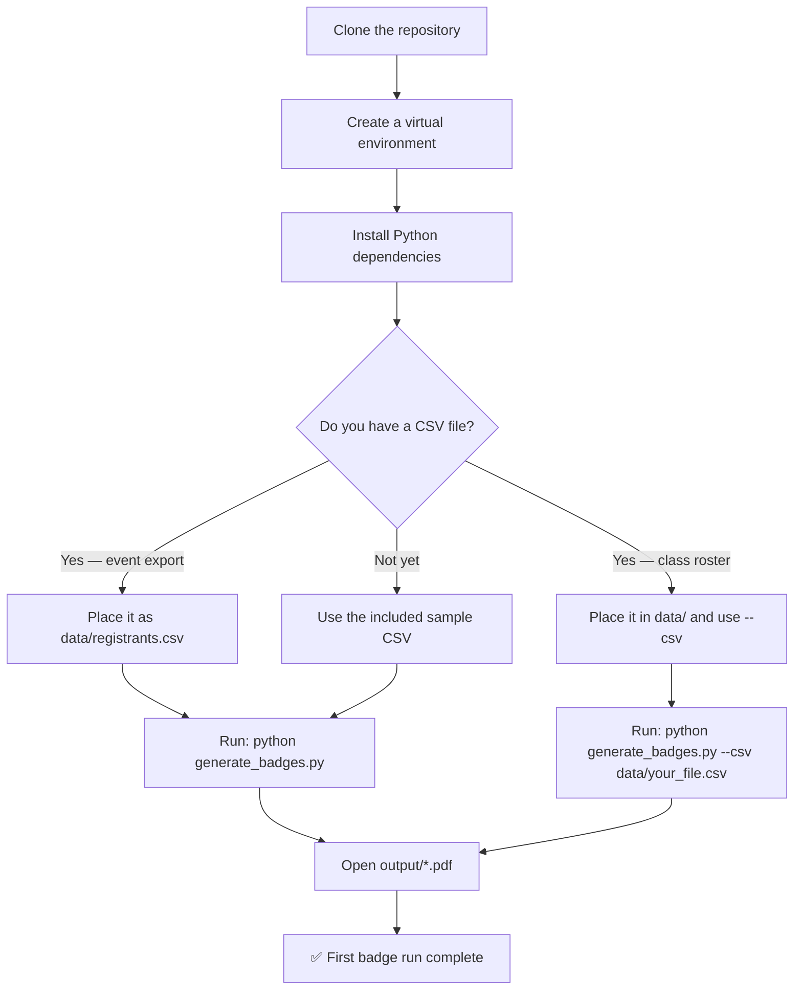

This page walks you through setting up your environment from a fresh clone to generating your first badge PDF in under five minutes. No prior experience with the codebase is needed — just a working Python installation and a CSV file of attendee data. By the end, you'll have a print-ready PDF with color-coded name badges and know exactly which workflow to follow for your specific event scenario.



## Prerequisites

Before you begin, verify you have a compatible Python version. The project requires **Python 3.10 through 3.13**, with 3.13 recommended. Python 3.14 and newer are not yet supported by all dependencies in [requirements.txt](requirements.txt#L1-L7). Open a terminal (PowerShell on Windows, Terminal on macOS/Linux) and run:

```bash
python --version        # Windows (or py --version)
python3 --version       # macOS / Linux
```

If the output shows a version in the 3.10–3.13 range, you're ready to proceed. If it shows 3.14 or higher, install Python 3.13 from [python.org](https://www.python.org/downloads/) and use the version-specific launcher (e.g., `py -3.13` on Windows) as shown in the setup steps below.

| Requirement | Details |
|---|---|
| **Python** | 3.10–3.13 (3.13 recommended) |
| **Disk space** | ~200 MB for dependencies + templates |
| **No GPU required** | PDF rendering is CPU-only |

Sources: [requirements.txt](requirements.txt#L1-L7), [README.md](README.md#L70-L72)

## Step 1 — Clone or Download the Repository

If you haven't already, clone the repository to your local machine. All template assets — the WCSU badge template PDF, the Avery 5395 reference PDF, and the WCSU Alumni Association logo — are committed to the repository, so everything works immediately after cloning.

```bash
# HTTPS
git clone https://github.com/tupacalypse187/wcsu-badge-generator.git

# Navigate into the project folder
cd wcsu-badge-generator
```

The initial project structure looks like this. The `data/` directory contains sample CSV files you can use for testing, and the `output/` directory will be created automatically on your first run.

```
wcsu-badge-generator/
├── generate_badges.py          ← Main script you'll run
├── convert_classlist.py        ← Companion utility (optional for now)
├── requirements.txt            ← Dependencies to install in Step 3
│
├── template/
│   ├── badge_template.pdf      ← Paper badge template (committed)
│   └── wcsu_aa_logo.png        ← WCSU AA logo (committed)
│
├── docs/
│   └── Avery5395AdhesiveNameBadges.pdf  ← Avery template (committed)
│
├── data/
│   └── Class List ACC 306.csv  ← Sample class roster (try this first!)
│
└── output/                     ← Generated PDFs appear here
```

Sources: [CLAUDE.md](CLAUDE.md#L14-L32), [.gitignore](.gitignore#L1-L49)

## Step 2 — Create and Activate a Virtual Environment

Using a virtual environment keeps this project's dependencies isolated from other Python projects on your system. It's a best practice even if you only run one Python tool.

**On Windows (PowerShell):**

```powershell
# Create the virtual environment
python -m venv .venv

# Activate it
.venv\Scripts\Activate.ps1
```

> If you see an execution policy error when activating, run this once to allow local scripts:
> `Set-ExecutionPolicy -ExecutionPolicy RemoteSigned -Scope CurrentUser`

**On macOS / Linux:**

```bash
# Create the virtual environment
python3 -m venv .venv

# Activate it
source .venv/bin/activate
```

After activation, your terminal prompt will show `(.venv)` at the beginning, confirming the environment is active. To deactivate later, simply type `deactivate`.

Sources: [README.md](README.md#L77-L97)

## Step 3 — Install Dependencies

With the virtual environment active, install the six packages listed in [requirements.txt](requirements.txt#L1-L7):

```bash
pip install -r requirements.txt
```

The five key packages and their roles:

| Package | Role in Badge Generation |
|---|---|
| **reportlab** | Draws text, colored shapes, and images onto PDF pages |
| **pypdfium2** | Renders template PDFs to high-resolution PNG backgrounds on first run |
| **Pillow** | Image handling — provides `ImageReader` for compositing the logo |
| **openpyxl** | Reads `.xlsx` class roster files (used by the companion converter) |
| **pypdf** | General PDF utilities |
| **pdfplumber** | Template measurement extraction (used during development) |

**Verify the installation** by importing the three critical packages:

```bash
python -c "import reportlab, pypdfium2, PIL; print('All dependencies ready')"
```

If this prints `All dependencies ready` without errors, your environment is fully set up. If any import fails, the error message will indicate which package needs attention — re-run `pip install -r requirements.txt` to resolve it.

Sources: [requirements.txt](requirements.txt#L1-L7), [generate_badges.py](generate_badges.py#L1-L6)

## Step 4 — Prepare Your CSV Data

The badge generator reads attendee data from CSV files. You have two options for a first run:

**Option A — Use the included sample CSV (fastest):** The repository ships with a sample class roster at [data/Class List ACC 306.csv](data/Class%20List%20ACC%2060.csv) containing 28 Ancell School of Business students. This is perfect for verifying your setup works end-to-end.

**Option B — Use your own event export:** Place your Google Sheets or Eventbrite CSV export as `data/registrants.csv`. The script auto-detects whether a file uses the "event export" format (columns like `Attendee (First Name)`) or a simpler "class roster" format (columns like `First Name`), so no manual reformatting is needed.

For your first run, **Option A is recommended** — it guarantees a working test without needing to export real data. Here's what the sample CSV looks like:

```csv
Last Name,First Name,Class / Major,Registration Options
Aguirre Calle,Romina,Ancell School of Business,Student
Anguizaca,Joel,Ancell School of Business,Student
Calise,Zachary,Ancell School of Business,Student
...
```

Sources: [data/Class List ACC 306.csv](data/Class%20List%20ACC%20306.csv#L1-L5), [generate_badges.py](generate_badges.py#L286-L338)

## Step 5 — Generate Your First Badge PDF

You're now ready to run the badge generator. The **default behavior** produces Avery 5395 adhesive badge labels (8 per page) from `data/registrants.csv`. For your first test, you'll point it at the sample CSV instead.

```bash
# Windows
python generate_badges.py --csv "data/Class List ACC 306.csv" --name FirstRun

# macOS / Linux
python3 generate_badges.py --csv "data/Class List ACC 306.csv" --name FirstRun
```

**What each flag does:**

| Flag | Value used | Effect |
|---|---|---|
| `--csv` | `data/Class List ACC 306.csv` | Reads this file instead of the default `data/registrants.csv` |
| `--name` | `FirstRun` | Saves output as `output/FirstRun.pdf` (`.pdf` added automatically) |
| `--type` | *(omitted)* | Uses default `adhesive` format (Avery 5395, 8-up) |

**Expected console output:**

```
  Class List ACC 306.csv: detected format 'classlist'
  Class List ACC 306.csv: 28 registrants added
Loaded 28 unique registrants
✓ Generated 4 pages for 28 adhesive badges → output/FirstRun.pdf
```

The script will also auto-generate the template background PNG (`template/avery_blank.png`) on this first run if it doesn't exist yet, which takes a few seconds. This step only happens once — subsequent runs skip it.

Sources: [generate_badges.py](generate_badges.py#L650-L665), [generate_badges.py](generate_badges.py#L770-L791)

## Step 6 — Verify and Open Your Output

Navigate to the `output/` directory and open the generated PDF:

```
output/
└── FirstRun.pdf    ← Your 4-page adhesive badge PDF
```

Each page contains 8 color-coded badges arranged in a 2-column × 4-row grid. The sample ACC 306 data produces badges with an **orange** header band (Ancell School of Business color) and white attendee names. The WCSU Alumni Association logo appears centered below each name, followed by the school label and registration type.

| What you should see | Why it matters |
|---|---|
| Orange header band on every badge | School detection correctly matched "Ancell School of Business" |
| White name text inside the colored band | Text rendering and font loading are working |
| WCSU AA logo below each name | Template compositing is functional |
| 4 pages of 8 badges (32 slots, 28 filled, 4 blank) | Grid layout math is correct |

If the PDF opens and badges look correct, your setup is fully verified. You're ready to generate badges from real event data.

Sources: [generate_badges.py](generate_badges.py#L98-L118), [generate_badges.py](generate_badges.py#L780-L785)

## Quick-Reference: Common First-Run Commands

These are the commands you'll use most often as a starting point. Copy and adapt whichever matches your scenario.

| Scenario | Command |
|---|---|
| **Test with sample data (adhesive)** | `python generate_badges.py --csv "data/Class List ACC 306.csv" --name FirstRun` |
| **Generate from real event CSV (adhesive)** | `python generate_badges.py` |
| **Generate from real event CSV (paper)** | `python generate_badges.py --type paper` |
| **Custom output filename** | `python generate_badges.py --name MeetGreet_March25` |
| **Merge two CSV files** | `python generate_badges.py --csv data/registrants.csv --csv "data/Class List ACC 306.csv" --name Combined` |
| **Print blank walk-in sheets (no CSV)** | `python generate_badges.py --blank` |

All output files land in the `output/` directory automatically. Use `--output` instead of `--name` if you need to specify a full path outside the project.

Sources: [generate_badges.py](generate_badges.py#L665-L710), [README.md](README.md#L240-L270)

## Troubleshooting Common Setup Issues

| Problem | Cause | Solution |
|---|---|---|
| `ModuleNotFoundError: No module named 'reportlab'` | Virtual environment not active or dependencies not installed | Activate `.venv`, then run `pip install -r requirements.txt` |
| `Python 3.14 is not supported` error from pip | Python version too new for one or more dependencies | Install Python 3.13 and use `py -3.13` (Windows) or `python3.13` (macOS) |
| Execution policy error on Windows PowerShell | Script execution blocked by default policy | Run `Set-ExecutionPolicy -ExecutionPolicy RemoteSigned -Scope CurrentUser`, then retry activation |
| `FileNotFoundError: data/registrants.csv` | No CSV in the default location | Either place your CSV as `data/registrants.csv` or use `--csv` to point to your file |
| `PermissionError` when writing output | Output directory or file is locked | Close any PDF viewer holding the file, or check folder write permissions |
| Gray badges instead of school colors | `Class / Major` field is blank or unrecognized | Update the major value in your CSV — see [Fixing Gray (Unmatched) Badges by Updating CSV Major Fields](25-fixing-gray-unmatched-badges-by-updating-csv-major-fields) |

Sources: [README.md](README.md#L77-L105), [requirements.txt](requirements.txt#L1-L7)

## Where to Go Next

You've successfully set up the environment and generated your first badge PDF. The next step depends on which badge format and workflow match your event needs:

**If you're preparing for the main Meet & Greet event:**
- [Generating Adhesive Badges from Google Sheets CSV](3-generating-adhesive-badges-from-google-sheets-csv) — Full walkthrough of the standard event-day workflow, including CSV export from Google Sheets and print settings for Avery 5395 labels

**If you prefer larger, cardstock-based badges:**
- [Generating Paper Badges on WCSU Branded Template](4-generating-paper-badges-on-wcsu-branded-template) — Step-by-step paper badge generation with cutting instructions and media recommendations

**If you need blank badges for walk-in registration:**
- [Preparing Blank Walk-In Badge Sheets for On-Site Registration](5-preparing-blank-walk-in-badge-sheets-for-on-site-registration) — One-command generation of pre-printed write-in sheets (no CSV required)

**If you want to understand what the script is doing under the hood:**
- [CLI Interface: All Command-Line Flags and Output Path Resolution](22-cli-interface-all-command-line-flags-and-output-path-resolution) — Complete reference for every flag, default behavior, and output path logic
- [CSV Format Reference: Event Registrant Export vs. Class Roster](8-csv-format-reference-event-registrant-export-vs-class-roster) — Detailed column-by-column specification for both supported CSV formats