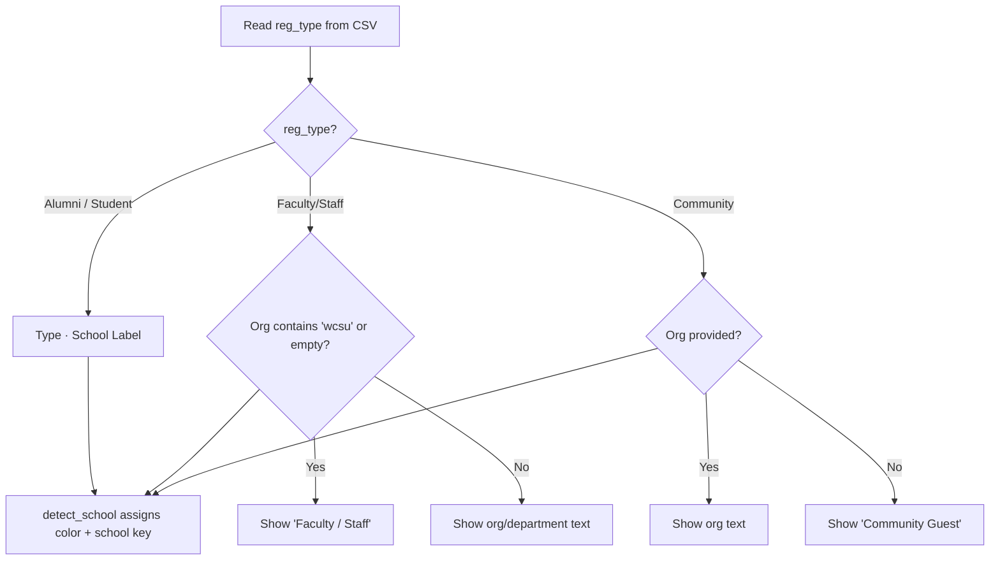

Every badge produced by the generator passes through a single construction function — `build_badge_data(row)` — that transforms a raw CSV row into a five-key dictionary consumed by both the paper and adhesive rendering pipelines. The function's core responsibility is deciding **what text appears on each badge line**, and that decision is driven entirely by the value in the `Registration Options` column. This page traces the conditional branching inside that function, explains the formatting rules for each registration type, and shows how the resulting dictionary flows into the two PDF generators.

## The Badge Data Dictionary: Shared Output Contract

`build_badge_data` returns a plain dictionary with five keys that both rendering functions consume identically. No registration-type-specific branching exists in the rendering code itself — all formatting variance is resolved upstream in the data construction stage.

Sources: [generate_badges.py](generate_badges.py#L379-L385)

| Key | Type | Purpose | Example Value |
|-----|------|---------|---------------|
| `name` | `str` | Full name with optional alumni year suffix | `"Jordan Martinez '18 & '22"` |
| `type` | `str` | Registration category + school/department/org | `"Alumni  ·  Ancell School of Business"` |
| `occ` | `str` | Occupation or position title (may be empty) | `"Senior Financial Analyst"` |
| `color` | `HexColor` | School-matched badge accent color | `HexColor("#E8702A")` |
| `school` | `str` | Internal school key used for color lookup | `"ancell"` |

This single-dictionary design means adding a new registration type requires changes only in `build_badge_data` and the school detection logic — the rendering pipelines remain untouched.

## Name Line Assembly: Year Suffixes for Alumni Only

The name line is the first decision branch in `build_badge_data`. The function extracts graduation years from the `Class / Major` field using `extract_years()` and applies them **only** when the registrant's type is exactly `"Alumni"`. All other registration types receive a plain `FirstName LastName` string.

Sources: [generate_badges.py](generate_badges.py#L347-L356)

The year formatting follows three patterns depending on how many distinct years are found:

| Years Found | Format | Example |
|-------------|--------|---------|
| 0 | `FirstName LastName` | `Jordan Martinez` |
| 1 | `FirstName LastName 'YY` | `Jordan Martinez '18` |
| 2+ | `FirstName LastName 'YY, 'YY & 'YY` | `Jordan Martinez '18, '20 & '22` |

For alumni with a single degree, the year is appended with an apostrophe prefix. For multi-degree alumni — someone who earned both an undergraduate and graduate degree from WCSU — all years except the last are comma-separated, with the final year introduced by an ampersand. The `extract_years` function handles both apostrophe-style years (`'71`) and four-digit formats (`1971`), normalizing them to two-digit strings internally. See [Name Line Assembly with Alumni Year Suffixes](19-name-line-assembly-with-alumni-year-suffixes) for full details on year parsing.

## Type Line Construction: The Registration-Type Switch

The second and most complex branch in `build_badge_data` determines what appears on the **middle line** of each badge — the `type` field. This is where the four registration categories diverge most sharply in their display logic.

Sources: [generate_badges.py](generate_badges.py#L358-L369)



### Alumni and Student: Registration Label with School Name

When `reg_type` is `"Alumni"` or `"Student"`, the type line concatenates the registration label with the resolved school name using an `·` (middle dot) separator and double-wide spacing:

```
Alumni  ·  Ancell School of Business
Student  ·  School of Arts & Sciences
```

The school label is sourced from the `SCHOOL_LABELS` dictionary, which maps each internal school key to its human-readable name. If `detect_school` returns the `"default"` key — meaning no school keywords matched — the school label is an empty string, and the separator is omitted, leaving just `"Alumni"` or `"Student"` alone.

Sources: [generate_badges.py](generate_badges.py#L363-L364), [generate_badges.py](generate_badges.py#L96-L104)

| School Key | Displayed Label | Resulting Type Line |
|------------|----------------|---------------------|
| `ancell` | `Ancell School of Business` | `Alumni  ·  Ancell School of Business` |
| `arts` | `School of Arts & Sciences` | `Student  ·  School of Arts & Sciences` |
| `visual` | `School of Visual & Performing Arts` | `Alumni  ·  School of Visual & Performing Arts` |
| `professional` | `School of Professional Studies` | `Student  ·  School of Professional Studies` |
| `default` | *(empty)* | `Alumni` or `Student` |

The school key is determined by `detect_school(major, org, reg_type)`, which applies keyword matching against the `Class / Major` and organization fields. Full details are in [Registration Type-Based Routing: Alumni, Student, Faculty, Community](12-registration-type-based-routing-alumni-student-faculty-community) and [Keyword-Based School Assignment Algorithm and Priority Rules](11-keyword-based-school-assignment-algorithm-and-priority-rules).

### Faculty/Staff: Department Override with WCSU Filter

Faculty and staff badges follow a fundamentally different pattern. Instead of showing a school name, the type line displays either the faculty member's **department or organization** or a generic `"Faculty / Staff"` fallback. This reflects the reality that faculty may belong to administrative units or interdisciplinary programs that don't map neatly to a school keyword.

Sources: [generate_badges.py](generate_badges.py#L365-L367)

The filtering logic works as follows:

1. If the `Community Business/Organization` field contains text **and** that text does not contain `"wcsu"` (case-insensitive), the org text is used directly as the type line.
2. If the org field is empty, or if it contains `"wcsu"` (e.g., `"WCSU Biology Department"` — which is redundant on a WCSU badge), the type line falls back to the literal string `"Faculty / Staff"`.

| Org Field Value | Contains "wcsu"? | Type Line Result |
|----------------|-------------------|-------------------|
| `Biology Department` | No | `Biology Department` |
| `(empty)` | N/A | `Faculty / Staff` |
| `WCSU Psychology Dept` | Yes | `Faculty / Staff` |
| `Western Connecticut State University` | Yes | `Faculty / Staff` |

The "wcsu" filter is a deliberate deduplication strategy — displaying `WCSU Biology Department` on a badge already branded with the WCSU Alumni Association logo would be redundant. Removing the institutional prefix leaves the department standing on its own.

Note that faculty **can** still receive a specific school color if their organization field contains a school name (e.g., `"Ancell"` maps to orange). This school detection happens in `detect_school()` **before** the type-line formatting, so the badge circle or header band reflects the correct school color even when the type line shows a department name.

Sources: [generate_badges.py](generate_badges.py#L141-L154)

### Community: Organization or Fallback Label

Community guests follow the simplest rule: if the `Community Business/Organization` field has content, it's displayed directly. If not, the type line becomes `"Community Guest"`.

Sources: [generate_badges.py](generate_badges.py#L369)

| Org Field Value | Type Line Result |
|----------------|-------------------|
| `Danbury Hospital` | `Danbury Hospital` |
| `(empty)` | `Community Guest` |
| `City of Danbury` | `City of Danbury` |

Unlike faculty, community guests have no WCSU filtering — the assumption is that an external organization name is meaningful context for networking purposes, and community registrants are unlikely to enter "WCSU" as their organization.

## Occupation Line: Cleaning, Truncation, and Fallback

The third badge line (`occ`) is populated from the `Occupation / Position Title` CSV column. This field undergoes a multi-step sanitization pipeline before being stored in the badge dictionary.

Sources: [generate_badges.py](generate_badges.py#L371-L377)

The cleaning process handles three common data-quality issues in sequence:

1. **Newline collapse** — Any newline characters are replaced with spaces, and consecutive whitespace is collapsed to a single space via `" ".join(text.replace("\n", " ").split())`.
2. **Multi-role extraction** — If the occupation text contains numbered role separators (`1)`, `2)`) or double-spaced gaps, only the first segment is kept. This handles registrants who list multiple roles in a single field.
3. **Length truncation** — The result is hard-capped at 85 characters, preventing overflow in both badge formats.

If the cleaned result is empty — either because no occupation was provided or it consisted entirely of N/A sentinels (collapsed to empty string by the earlier `_clean()` normalization), the `occ` field becomes an empty string, and the rendering functions simply skip drawing that line.

| Raw CSV Value | After Cleaning | Displayed |
|---------------|----------------|-----------|
| `Senior Financial\nAnalyst` | `Senior Financial Analyst` | `Senior Financial Analyst` |
| `1) CEO 2) Board Member` | `CEO` | `CEO` |
| `N/A` | *(empty)* | *(line omitted from badge)* |
| `Vice President of Operations and Strategic Planning, Northeast Division` | `Vice President of Operations and Strategic Planning, Northeast` | `Vice President of Operations and Strategic Planning, Northeast` |

## How Both Rendering Pipelines Consume the Dictionary

Once `build_badge_data` produces the five-key dictionary, the two PDF generators apply it to their respective layouts with type-specific styling. The key architectural point is that **no conditional logic exists in the rendering functions based on registration type** — they read the dictionary values blindly and render them.

Sources: [generate_badges.py](generate_badges.py#L409-L437), [generate_badges.py](generate_badges.py#L482-L534)

| Badge Line | Paper Format (6-up) | Adhesive Format (8-up) |
|------------|---------------------|------------------------|
| **Name** | 14pt Helvetica-Bold, navy (`#1B3A6B`), auto-scaled 8–14pt | 15pt Helvetica-Bold, white, inside colored header band, auto-scaled 7–15pt |
| **Type/School** | 12pt Helvetica, navy (`#1B3A6B`), word-wrapped at 14pt leading | 11pt Helvetica, navy (`#1B3A6B`), word-wrapped at 13pt leading |
| **Occupation** | 11pt Helvetica, dark gray (`#333333`), word-wrapped at 13pt leading | 10pt Helvetica, dark gray (`#444444`), word-wrapped at 12pt leading |
| **Color indicator** | Filled circle (24pt radius) with dark stroke | Full-width header band (52pt tall) |

Both formats use `wrap_and_draw()` for the type and occupation lines, which automatically breaks long text into multiple centered lines within the badge's text area width. The paper format allows 250pt of text width; the adhesive format allows 218pt. The return value from `wrap_and_draw` feeds into the next line's Y coordinate, preventing text overlap even when a type line wraps to multiple lines.

## Complete Example Walkthrough

The following table shows how a single CSV row transforms through the entire `build_badge_data` pipeline, demonstrating the interaction between school detection, year extraction, and type-line formatting.

**Input CSV row (event format):**

| Field | Value |
|-------|-------|
| `Attendee (First Name)` | `Jordan` |
| `Attendee (Last Name)` | `Martinez` |
| `Registration Options` | `Alumni` |
| `Class / Major` | `'18 Accounting` |
| `Community Business/Organization` | `Deloitte` |
| `Occupation / Position Title` | `Senior Financial Analyst` |

**Processing steps:**

1. `extract_years("'18 Accounting")` → `['18']`
2. `detect_school("'18 Accounting", "Deloitte", "Alumni")` → matches `"accounting"` in `ANCELL_KEYWORDS` → school key `"ancell"`
3. Name line: years present + Alumni → `"Jordan Martinez '18"`
4. Type line: Alumni + non-empty school label → `"Alumni  ·  Ancell School of Business"`
5. Occupation line: no cleaning needed, within 85 chars → `"Senior Financial Analyst"`
6. Color: `SCHOOL_COLORS["ancell"]` → `HexColor("#E8702A")` (WCSU Orange)

**Output dictionary:**

```python
{
    "name": "Jordan Martinez '18",
    "type": "Alumni  ·  Ancell School of Business",
    "occ": "Senior Financial Analyst",
    "color": HexColor("#E8702A"),
    "school": "ancell",
}
```

## Edge Cases and Fallback Behavior

Several edge cases in the type-line formatting are worth understanding for troubleshooting unexpected badge output.

Sources: [generate_badges.py](generate_badges.py#L338-L385)

**Alumni without graduation years** — If the `Class / Major` field contains a department name but no year (e.g., `"Biology Department"`), the name line falls through to the `else` branch and renders as plain `FirstName LastName`. The type line still shows the school assignment. This is expected: registrants who listed their major without a year are still alumni, they simply don't get the `'YY` suffix.

**Unmatched majors producing empty type lines** — When `detect_school` returns `"default"` (no keyword match), the school label resolves to `""`, and the `type_str` for Alumni/Student becomes just `"Alumni"` or `"Student"` without the school name. The badge color falls back to light gray (`#95A5A6`). See [Fixing Gray (Unmatched) Badges by Updating CSV Major Fields](25-fixing-gray-unmatched-badges-by-updating-csv-major-fields) for remediation steps.

**Registration type outside the four known values** — The `build_badge_data` function uses an `else` branch that catches any registration type not matching `"Alumni"`, `"Student"`, or `"Faculty/Staff"`. This means unexpected CSV values like `"Guest"`, `"Volunteer"`, or misspellings like `"Alumnus"` all fall through to the Community formatting path — displaying the org field or `"Community Guest"` as fallback. The school detection function has a similar default: anything not `"Faculty/Staff"` or `"Community"` proceeds to keyword matching, which may or may not assign a school color.

**Whitespace handling** — The `.strip()` calls on each field at the top of `build_badge_data` ensure that leading/trailing whitespace in CSV cells never produces malformed output. However, internal whitespace is preserved, so values like `"Jordan  Martinez"` (double space) would render as-is on the badge.

## Related Pages

- [Name Line Assembly with Alumni Year Suffixes](19-name-line-assembly-with-alumni-year-suffixes) — detailed coverage of the `extract_years` function and century-disambiguation logic
- [Registration Type-Based Routing: Alumni, Student, Faculty, Community](12-registration-type-based-routing-alumni-student-faculty-community) — how `detect_school` uses registration type as a routing signal before keyword matching
- [Keyword-Based School Assignment Algorithm and Priority Rules](11-keyword-based-school-assignment-algorithm-and-priority-rules) — the full keyword lists and priority ordering that determine the school key
- [Text Rendering: Auto-Scaling Names, Word Wrapping, and Font Management](17-text-rendering-auto-scaling-names-word-wrapping-and-font-management) — how the rendering pipelines consume the badge dictionary
- [Auto-Detection, Normalization, and N/A Sentinel Handling](9-auto-detection-normalization-and-n-a-sentinel-handling) — how raw CSV values are cleaned before reaching `build_badge_data`
- [Known Edge Cases: Long Names, Duplicate Entries, Multi-Line Occupations, and Ambiguous Majors](26-known-edge-cases-long-names-duplicate-entries-multi-line-occupations-and-ambiguous-majors) — additional edge cases beyond type-line formatting