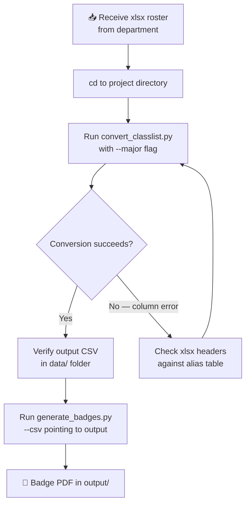
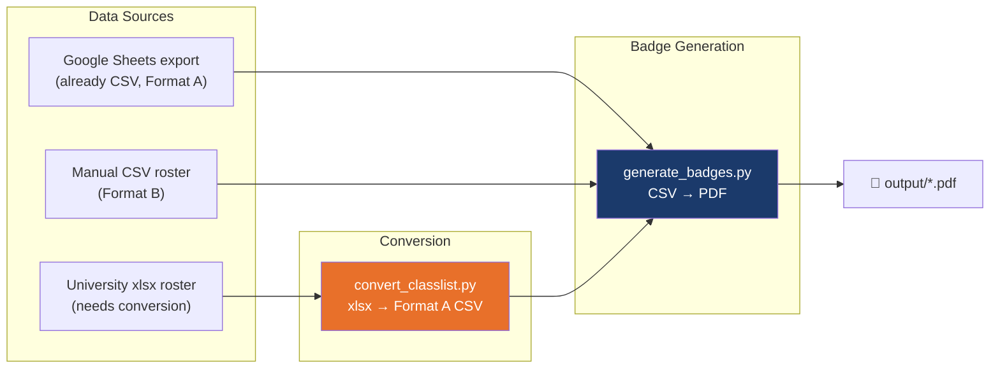

University class rosters arrive as `.xlsx` files from systems like Banner, and the badge generator only consumes `.csv`. The `convert_classlist.py` script bridges this gap — it reads any xlsx roster, recognizes flexible column names, fills in missing fields from command-line defaults, and produces a **Format A event-export CSV** that `generate_badges.py` accepts immediately without further editing. This page walks through every aspect of that conversion pipeline, from understanding what the tool expects to running your first successful conversion.

## When and Why You Need the Converter

The badge generator supports two CSV formats, but both are CSV — not xlsx. When the WCSU Alumni Association receives class rosters from academic departments, those files are almost always Excel spreadsheets (`.xlsx`). Rather than asking staff to manually export and reformat each file, the converter automates the entire process in a single command. It handles the three most common pain points automatically: different column naming conventions across departments, missing optional fields like email or organization, and the need to assign a registration type (Student, Faculty/Staff, etc.) to every row.

The converter always produces **Format A** output — the richer seven-column event-export layout — even when the input xlsx contains only two columns (first name and last name). This means you never have to worry about which format the badge generator expects; the converter's output is always immediately compatible.

Sources: [convert_classlist.py](convert_classlist.py#L1-L48), [generate_badges.py](generate_badges.py#L255-L272)

## The Conversion Pipeline at a Glance

The converter follows a straightforward four-stage pipeline. An xlsx file enters from the left, column headers are matched against a flexible alias dictionary, each data row is transformed into the canonical seven-column format, and a ready-to-use CSV file emerges on the right. The entire process runs synchronously in memory — no temporary files, no database, no network calls.


This pipeline is intentionally simple because it serves a specific, bounded purpose. If you need more complex transformations — merging multiple xlsx files, performing lookups, or conditional logic per row — you would edit the xlsx in Excel first and then run the converter on the cleaned-up file.

Sources: [convert_classlist.py](convert_classlist.py#L80-L167)

## Installing the Dependency

The converter requires **openpyxl** to read `.xlsx` files. This package is already listed in [requirements.txt](requirements.txt#L6-L6) alongside all other project dependencies, so if you've completed the [Quick Start: Environment Setup and First Badge Run](2-quick-start-environment-setup-and-first-badge-run) setup, you already have it installed. If not, install it with:

```bash
pip install openpyxl
```

The script performs a graceful check at startup — if openpyxl is missing, it prints a clear installation instruction and exits rather than crashing with an import error.

Sources: [convert_classlist.py](convert_classlist.py#L27-L29), [requirements.txt](requirements.txt#L6-L6)

## Input Requirements: What Your xlsx Must Contain

The converter has remarkably lenient input requirements. At minimum, your xlsx file needs **only two columns** — a first name column and a last name column — with a header row. Everything else is optional and filled from command-line defaults.

### Required Columns

Your xlsx must have a **header row** (the first row containing column names) and at least one column that the converter can recognize as a first name and one as a last name. The converter uses **case-insensitive, whitespace-trimmed matching** against a list of common aliases, so columns named `"First Name"`, `"FIRST NAME"`, `"first name  "`, `"firstname"`, `"fname"`, or `"Given Name"` are all recognized identically.

| Field | Accepted Column Name Aliases |
|---|---|
| **First Name** | `First Name`, `FirstName`, `First`, `Given Name`, `FName` |
| **Last Name** | `Last Name`, `LastName`, `Last`, `Surname`, `LName`, `Family Name` |

If the converter cannot find either column, it prints the headers it found and exits with an error, so you always know exactly what went wrong.

Sources: [convert_classlist.py](convert_classlist.py#L33-L36), [convert_classlist.py](convert_classlist.py#L88-L93)

### Optional Columns

If your xlsx contains additional columns beyond first and last name, the converter will use their values automatically. However, these are genuinely optional — if a column is absent, the corresponding CLI default is used instead. The table below shows every optional column the converter looks for, followed by the complete alias list.

| Field | Purpose | CLI Default (if column absent) |
|---|---|---|
| **Email** | Deduplication key in badge generator | Empty string |
| **Class / Major** | Drives school color detection on badge | Value from `--major` flag |
| **Occupation / Position Title** | Third text line on adhesive badges | Value from `--title` flag |
| **Organization** | Shown for Faculty/Staff and Community badges | Value from `--org` flag |

Sources: [convert_classlist.py](convert_classlist.py#L37-L40), [convert_classlist.py](convert_classlist.py#L96-L104)

### Complete Column Alias Reference

The converter recognizes a generous set of aliases for each optional field. This flexibility means that rosters exported from different university systems — Banner, Degree Works, Colleague, or manual spreadsheets — are all handled without modification.

| Target Field | Recognized Column Name Aliases |
|---|---|
| Email | `Email`, `E-Mail`, `Email Address` |
| Class / Major | `Major`, `Class`, `Class / Major`, `Program`, `Degree` |
| Occupation / Title | `Title`, `Occupation`, `Position`, `Job Title`, `Occupation / Position Title` |
| Organization | `Organization`, `Org`, `Company`, `Business`, `Department`, `Community Business/Organization` |

Matching is performed by converting each header to lowercase and stripping surrounding whitespace, then checking if it exactly equals any alias in the set. Column order in the xlsx does not matter.

Sources: [convert_classlist.py](convert_classlist.py#L33-L40)

## Understanding the Precedence: xlsx Column vs. CLI Flag

When an optional column exists in the xlsx **and** a corresponding CLI flag is provided, the xlsx value takes priority. More precisely: if the converter finds the column, it reads the value from each row; if that cell is empty or blank, it falls back to the CLI default. If the column does not exist at all, every row uses the CLI default.

This behavior is useful in practice. For example, a faculty roster might have an `Organization` column listing each professor's department, but no `Title` column. You can pass `--title "Professor"` on the command line, and every row gets "Professor" as the occupation while retaining the per-row organization values from the spreadsheet.

```
xlsx has Organization column?  →  use per-row value from xlsx
xlsx has Title column?         →  use per-row value from xlsx
No Title column in xlsx        →  use --title CLI default for every row
```

Sources: [convert_classlist.py](convert_classlist.py#L96-L104)

## Command-Line Interface: All Flags Explained

The converter uses Python's built-in `argparse` module with a positional input argument and five optional flags. The table below covers every flag, its default value, and when you'd use it.

```bash
python convert_classlist.py <input.xlsx> [options]
```

| Flag | Default | Description |
|---|---|---|
| `input` *(positional)* | *(required)* | Path to the input `.xlsx` file. |
| `--output PATH` | `data/registrants.csv` | Where to write the output CSV. The directory is created automatically if it doesn't exist. |
| `--reg-type TYPE` | `Student` | Value for the `Registration Options` column. Must be one of: `Student`, `Alumni`, `Faculty/Staff`, `Community`. |
| `--major MAJOR` | *(empty)* | Value for the `Class / Major` column when the xlsx doesn't have one. This directly controls the badge circle color — see the school color table below. |
| `--org ORG` | *(empty)* | Value for the `Community Business/Organization` column when the xlsx doesn't have one. |
| `--title TITLE` | *(empty)* | Value for the `Occupation / Position Title` column when the xlsx doesn't have one. |

If you omit `--major`, the converter prints a warning: `"⚠️ No --major specified — badge circles will be gray."` This is intentional — without a major, the badge generator cannot determine which school color to use, so every badge gets a gray (unmatched) circle. See [School Color Coding System and Visual Legend](7-school-color-coding-system-and-visual-legend) for the full color mapping.

Sources: [convert_classlist.py](convert_classlist.py#L131-L167)

## Major-to-School-Color Quick Reference

The `--major` flag (or the xlsx `Class / Major` column) is the primary input to the badge generator's school detection engine. Different major keywords map to different school colors. For a complete explanation of the detection algorithm, see [Keyword-Based School Assignment Algorithm and Priority Rules](11-keyword-based-school-assignment-algorithm-and-priority-rules). For the converter, here's the practical lookup table:

| WCSU School | Badge Color | Example `--major` Values |
|---|---|---|
| Ancell School of Business | 🟠 Orange | `Accounting`, `Finance`, `Marketing`, `Management`, `MIS` |
| School of Arts & Sciences | 🔵 Navy | `Biology`, `Psychology`, `Nursing`, `Computer Science` |
| School of Visual & Performing Arts | 🟣 Purple | `Graphic Design`, `Theatre`, `Music`, `Digital Interactive Media` |
| School of Professional Studies | 🟢 Green | `Education`, `Health Administration`, `Counseling` |
| Faculty/Staff | 🟡 Dark Gold | Use `--reg-type Faculty/Staff` instead of `--major` |
| Community | ⚪ Gray | Use `--reg-type Community` instead of `--major` |

The converter's docstring includes this exact table, so you can also view it by running `python convert_classlist.py --help`.

Sources: [convert_classlist.py](convert_classlist.py#L13-L35), [generate_badges.py](generate_badges.py#L85-L104)

## Output Format: Always Format A

Regardless of how sparse or rich your input xlsx is, the converter **always produces a seven-column CSV** in Format A (event registrant export) layout. This is the format that `generate_badges.py` auto-detects when it sees the header `Attendee (First Name)`.

| # | Output Column Header | Source |
|---|---|---|
| 1 | `Registration Options` | `--reg-type` flag (default: `Student`) |
| 2 | `Attendee (First Name)` | xlsx first name column |
| 3 | `Attendee (Last Name)` | xlsx last name column |
| 4 | `Class / Major` | xlsx column if present, otherwise `--major` flag |
| 5 | `Community Business/Organization` | xlsx column if present, otherwise `--org` flag |
| 6 | `Occupation / Position Title` | xlsx column if present, otherwise `--title` flag |
| 7 | `Email` | xlsx column if present, otherwise empty string |

The output file uses **UTF-8 with BOM** encoding (`utf-8-sig`), which is the same encoding `generate_badges.py` expects when reading CSVs. This ensures compatibility if you open the output in Excel and then re-save it.

### Example Output

After running the converter on an Accounting class roster, the resulting CSV looks like this:

```csv
Registration Options,Attendee (First Name),Attendee (Last Name),Class / Major,Community Business/Organization,Occupation / Position Title,Email
Student,Romina,Aguirre Calle,Accounting,,,
Student,Joel,Anguizaca,Accounting,,,
Student,Nataly,Berganza Duarte,Accounting,,,
```

Notice that the `Registration Options` column is filled with `"Student"` (from the `--reg-type` default), the `Class / Major` column has `"Accounting"` (from `--major`), and the three optional columns (Organization, Title, Email) are empty because no xlsx columns or CLI flags provided values for them. This is perfectly valid — the badge generator handles empty optional columns gracefully.

Sources: [convert_classlist.py](convert_classlist.py#L76-L104), [convert_classlist.py](convert_classlist.py#L106-L107)

## Step-by-Step Tutorial: Converting Your First Roster

This walkthrough demonstrates the complete end-to-end flow: converting an xlsx roster to CSV, then generating a badge PDF from it. The example uses a hypothetical ACC 306 Accounting class roster, but the steps are identical for any class or group.



### Step 1 — Place Your xlsx File

Copy or download the xlsx roster into the project's `data/` directory. The converter accepts any path, but keeping input files in `data/` is the project convention.

```
data/
├── ClassListACC306.xlsx    ← your new roster file
├── Class List ACC 306.csv  ← existing sample (for reference)
└── Manual Class List - MIS260.csv
```

### Step 2 — Run the Converter

Run the converter, specifying the input file and the major that determines badge color. For an Accounting class at the Ancell School of Business:

```bash
python convert_classlist.py data/ClassListACC306.xlsx --major "Accounting" --output data/acc306_badges.csv
```

**Expected output:**

```
✓ Converted 28 students → data/acc306_badges.csv
```

If some rows in the xlsx had blank first and last names, you'll see an additional line:

```
✓ Converted 28 students → data/acc306_badges.csv
  (skipped 2 blank rows)
```

The converter silently skips rows where **both** first and last name are empty. Rows with only one name filled are still included.

Sources: [convert_classlist.py](convert_classlist.py#L106-L107)

### Step 3 — Verify the Output CSV

Open `data/acc306_badges.csv` in a text editor or spreadsheet application. Confirm that:
- The header row matches Format A (starts with `Registration Options,Attendee (First Name)...`)
- First and last names are correctly populated
- The `Class / Major` column shows `"Accounting"`
- The `Registration Options` column shows `"Student"`

### Step 4 — Generate Badges from the Output

Now pass the converted CSV to the badge generator:

```bash
python generate_badges.py --csv data/acc306_badges.csv --name ACC306_Badges
```

The badge generator auto-detects Format A from the `Attendee (First Name)` header and produces an adhesive badge PDF with orange header bands (Ancell School of Business color). The output appears at `output/ACC306_Badges.pdf`.

Sources: [generate_badges.py](generate_badges.py#L769-L772)

## Common Scenarios and Example Commands

The converter is designed to handle a handful of recurring real-world scenarios. Here are the most common ones with ready-to-copy commands.

### Scenario A — Student Class Roster (Most Common)

A professor sends you an xlsx with student names and nothing else. Every student is in the same major/school.

```bash
python convert_classlist.py data/ClassListNUR201.xlsx --major "Nursing" --output data/nur201_badges.csv
```

All badges get the navy Arts & Sciences color because "Nursing" matches a keyword in `ARTS_KEYWORDS`.

### Scenario B — Faculty/Staff List

An xlsx containing faculty names, with an `Organization` column listing their departments.

```bash
python convert_classlist.py data/FacultyList.xlsx --reg-type Faculty/Staff --title "Professor" --output data/faculty_badges.csv
```

Here, `--reg-type Faculty/Staff` routes all badges to the dark gold color, `--title "Professor"` fills in the occupation line, and the Organization column (if present in the xlsx) provides per-row department names.

### Scenario C — Multiple Classes, Multiple Outputs

For events where several classes attend, convert each class roster separately and then combine them in the badge generator:

```bash
# Convert each class
python convert_classlist.py data/ACC306.xlsx --major "Accounting" --output data/acc306.csv
python convert_classlist.py data/NUR201.xlsx --major "Nursing" --output data/nur201.csv
python convert_classlist.py data/ENG101.xlsx --major "English" --output data/eng101.csv

# Generate badges from all three at once
python generate_badges.py --csv data/acc306.csv --csv data/nur201.csv --csv data/eng101.csv --name AllClasses
```

Deduplication runs across all three files — if a student is enrolled in more than one class, they appear only once in the final PDF.

Sources: [generate_badges.py](generate_badges.py#L302-L336), [convert_classlist.py](convert_classlist.py#L131-L167)

### Scenario D — Roster with Existing Major Column

If your xlsx already has a `Class / Major` or `Program` column with per-student values, you don't need `--major` at all. Each row's major drives its own badge color independently.

```bash
python convert_classlist.py data/MixedMajors.xlsx --output data/mixed_badges.csv
```

In this case, the converter reads each row's major value and passes it through to the CSV. The badge generator's keyword engine then assigns the appropriate school color per person. Some badges may be orange (Ancell), some navy (Arts & Sciences), etc., depending on the majors present.

Sources: [convert_classlist.py](convert_classlist.py#L99-L100)

## How Blank Rows and Missing Data Are Handled

The converter applies a few simple rules when processing each row of the xlsx:

| Condition | Behavior |
|---|---|
| Both First Name and Last Name are blank | Row is **skipped** (counted in the "skipped N blank rows" message) |
| Only one name is present | Row is **included** (the missing name becomes an empty string) |
| First/Last Name column not found at all | Script **exits with error**, showing the headers it did find |
| Optional column value is blank | CLI default is used instead |
| Entire xlsx is empty | Script **exits with error**: `"Error: xlsx file is empty."` |

These rules mean you don't need to clean up trailing blank rows or extra header rows in your xlsx before conversion — the converter handles them gracefully.

Sources: [convert_classlist.py](convert_classlist.py#L84-L87), [convert_classlist.py](convert_classlist.py#L106-L107)

## Troubleshooting Common Problems

| Problem | Cause | Solution |
|---|---|---|
| `"Error: could not find First Name / Last Name columns"` | Your xlsx headers don't match any known alias | Check the printed "Found headers" message and rename columns, or add an alias to `FIRST_NAME_ALIASES`/`LAST_NAME_ALIASES` in the script |
| `"Missing dependency: pip install openpyxl"` | openpyxl is not installed | Run `pip install openpyxl` or `pip install -r requirements.txt` |
| All badges are gray | No `--major` specified and no major column in xlsx | Add `--major "Your Major"` to the command |
| Output file is empty or has 0 rows | The xlsx has only a header row, or all data rows have blank names | Verify the xlsx actually contains data rows below the header |
| `"Error: xlsx file is empty."` | The xlsx has no rows at all (not even a header) | Open the file in Excel and confirm it's not corrupted |
| `FileNotFoundError` on input | The path to the xlsx is incorrect | Use an absolute path or verify the relative path from the project root |

Sources: [convert_classlist.py](convert_classlist.py#L27-L29), [convert_classlist.py](convert_classlist.py#L84-L87)

## Where This Fits in the Overall Workflow

The converter occupies a specific position in the badge generation pipeline — it sits between raw data acquisition and PDF rendering. Understanding this position helps clarify what the converter does and what it deliberately does not do.



The converter **does** handle: xlsx reading, column alias matching, row-level default filling, and Format A output generation.

The converter **does not** handle: PDF rendering (that's `generate_badges.py`), deduplication (that's `generate_badges.py`), school color detection (that's `generate_badges.py`), or merging multiple files (pass multiple `--csv` flags to `generate_badges.py` instead).

Sources: [convert_classlist.py](convert_classlist.py#L80-L167), [generate_badges.py](generate_badges.py#L302-L336)

## Extending the Converter

If your institution uses column names that don't match any of the built-in aliases, you can add them directly in the script. The alias sets are defined at the top of the file as plain Python sets of lowercase strings. For example, to add `"preferred name"` as a recognized first name alias:

```python
FIRST_NAME_ALIASES = {"first name", "firstname", "first", "given name", "fname",
                       "preferred name"}   # ← added
```

The same pattern applies to all six alias sets. No other code changes are needed — the `find_col()` function checks against whatever strings are in the set.

Sources: [convert_classlist.py](convert_classlist.py#L33-L40), [convert_classlist.py](convert_classlist.py#L43-L48)

## Next Steps

Now that you understand the converter, these related pages will help you complete your workflow:

- **[CSV Format Reference: Event Registrant Export vs. Class Roster](8-csv-format-reference-event-registrant-export-vs-class-roster)** — Deep dive into the two CSV formats the badge generator accepts, including the Format A output that this converter produces
- **[Generating Adhesive Badges from Google Sheets CSV](3-generating-adhesive-badges-from-google-sheets-csv)** — Complete walkthrough for the badge generation step that follows conversion
- **[School Color Coding System and Visual Legend](7-school-color-coding-system-and-visual-legend)** — Visual reference for the color each school maps to, including the gray default
- **[Fixing Gray (Unmatched) Badges by Updating CSV Major Fields](25-fixing-gray-unmatched-badges-by-updating-csv-major-fields)** — If your converted badges are gray, this page explains how to fix the major values
- **[Keyword-Based School Assignment Algorithm and Priority Rules](11-keyword-based-school-assignment-algorithm-and-priority-rules)** — How the badge generator translates major text into a school color key