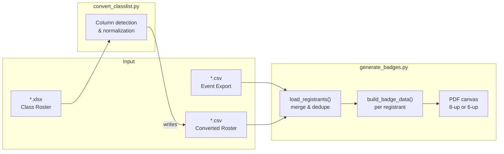
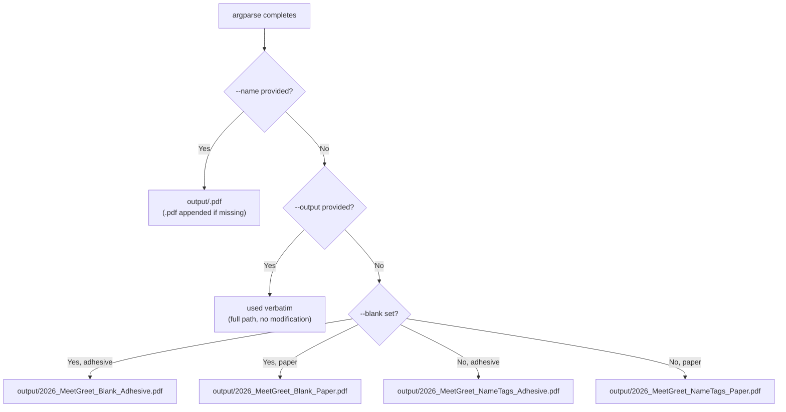

The badge generator exposes two independent Python CLI scripts — `generate_badges.py` (the main PDF renderer) and `convert_classlist.py` (a CSV preparation utility). Each script has its own argument parser with distinct flags and defaults, but they share a common design philosophy: sensible defaults that work for a single-file event workflow, with explicit overrides for batch or specialized use cases. This page catalogs every flag, documents the output path priority chain, and maps each invocation pattern to the resulting file location.

## Script Overview and Entry Points

The project ships two scripts that operate at different stages of the pipeline. `convert_classlist.py` transforms raw `.xlsx` class rosters into the CSV format the badge generator expects, while `generate_badges.py` reads one or more CSV files and produces a print-ready PDF. They are invoked independently and never call each other — you can use `generate_badges.py` alone if your data is already in CSV format.



Sources: [convert_classlist.py](convert_classlist.py#L1-L41), [generate_badges.py](generate_badges.py#L302-L336)

## `generate_badges.py` — Main Badge Generator Flags

This script uses Python's `argparse` with a `RawDescriptionHelpFormatter` that includes an inline CSV format reference in the `--help` epilog. All flags are optional — running the script with no arguments reads `data/registrants.csv` and produces an adhesive-format PDF at the default path.

| Flag | Arg Type | Default | Description |
|---|---|---|---|
| `--csv` | `PATH` (repeatable) | `data/registrants.csv` | Path to one or more registrant CSV files. Use multiple `--csv` flags to merge data from several sources — e.g., `--csv data/registrants.csv --csv data/faculty.csv`. Both event-export and class-roster formats can be mixed freely across files. Ignored when `--blank` is set. |
| `--type` | `adhesive` \| `paper` | `adhesive` | Selects the badge layout format. `adhesive` renders 8 badges per page on an Avery 5395 grid; `paper` renders 6 badges per page on the WCSU branded template. See [Understanding the Two Badge Formats: Avery 5395 Adhesive vs. WCSU Paper Template](6-understanding-the-two-badge-formats-avery-5395-adhesive-vs-wcsu-paper-template) for visual comparisons. |
| `--name` | `FILENAME` | *(none)* | A short filename (no directory) for the output PDF. The file is always saved inside the `output/` directory. A `.pdf` extension is appended automatically if omitted. Example: `--name ACC306_Badges` → `output/ACC306_Badges.pdf`. |
| `--output` | `PATH` | *(none)* | A **full** output path including the directory. This flag overrides `--name` and the default location entirely — the path is used verbatim. Useful when writing to an absolute location or a network share. |
| `--blank` | *(boolean)* | `False` | Switches from named-badge mode to blank walk-in sheet mode. Produces one page per school color (6 pages total) with colored headers or circles but no personal data. No CSV input is required. See [Preparing Blank Walk-In Badge Sheets for On-Site Registration](5-preparing-blank-walk-in-badge-sheets-for-on-site-registration) for usage details. |

Sources: [generate_badges.py](generate_badges.py#L689-L733)

### Mutual Exclusivity: `--csv` vs. `--blank`

The `--blank` flag bypasses CSV loading entirely. When `--blank` is active, any `--csv` arguments are silently ignored because the code enters the blank-sheet generation branch at line 761 without ever calling `load_registrants()`. Conversely, omitting `--blank` without providing a `--csv` flag causes the script to fall back to the single default path `data/registrants.csv` at line 776.

```python
# Simplified branching logic (lines 761–790)
if args.blank:
    # No CSV needed — renders one page per school
    generate_blank_…_pdf(template_png, output_pdf)
else:
    csv_paths = args.csv or [os.path.join(_here, "data", "registrants.csv")]
    registrants = load_registrants(csv_paths)
    generate_…_badges_pdf(registrants, template_png, output_pdf)
```

Sources: [generate_badges.py](generate_badges.py#L761-L790)

## `convert_classlist.py` — XLSX-to-CSV Converter Flags

This utility converts a WCSU class roster spreadsheet into the canonical CSV format that `generate_badges.py` expects. It requires exactly one positional argument (the input `.xlsx` path) and provides several optional flags to fill in metadata that may not exist in the source spreadsheet.

| Flag | Arg Type | Default | Description |
|---|---|---|---|
| `input` *(positional)* | `PATH` | *(required)* | Path to the input `.xlsx` class roster file. The file must contain at minimum `First Name` and `Last Name` columns (or recognized aliases). |
| `--output` | `PATH` | `data/registrants.csv` | Destination path for the generated CSV. The parent directory is created automatically if it does not exist. |
| `--reg-type` | `TYPE` | `Student` | Value written to the `Registration Options` column. Controls badge formatting behavior — use `Faculty/Staff` or `Community` for non-student groups. |
| `--major` | `MAJOR` | *(blank)* | Value written to the `Class / Major` column. This is the primary input to the school-color detection engine — see [Keyword-Based School Assignment Algorithm and Priority Rules](11-keyword-based-school-assignment-algorithm-and-priority-rules). If omitted, a warning is printed because badges will render with a gray (unmatched) circle. |
| `--org` | `ORG` | *(blank)* | Value written to the `Community Business/Organization` column. Displayed on badges for Faculty/Staff and Community registrants. |
| `--title` | `TITLE` | *(blank)* | Value written to the `Occupation / Position Title` column. Shown as the third text line on adhesive badges. |

The converter reads the xlsx with `openpyxl`, auto-detects column positions using a flexible alias system (e.g., `"First Name"`, `"firstname"`, `"fname"` all resolve to the first-name column), and writes a UTF-8-BOM CSV that `generate_badges.py` can consume immediately. If the source xlsx already contains a `Class / Major` column, those per-row values override the `--major` flag, which only serves as a fallback for files that lack that column.

Sources: [convert_classlist.py](convert_classlist.py#L53-L163)

## Output Path Resolution: Priority Chain

The most nuanced aspect of the CLI is how `generate_badges.py` decides where to write the final PDF. Three flags participate in a strict priority chain, and the resolution logic depends on both the **mode** (named vs. blank) and the **type** (adhesive vs. paper). The code lives in a single `if/elif/else` block at lines 740–756.



### Priority Rule: `--name` Wins Over `--output`

Despite being documented as separate flags, `--name` actually takes **higher precedence** than `--output`. This is a deliberate design choice — `--name` is the "quick shortcut" for everyday use, while `--output` is the "escape hatch" for absolute paths. Because the `if` chain checks `args.name` first at line 740, specifying both flags on the same command line results in `--name` winning silently. If you need an absolute path, use only `--output`.

```python
if args.name:                              # ← checked FIRST (line 740)
    fname = args.name if args.name.lower().endswith(".pdf") else f"{args.name}.pdf"
    output_pdf = os.path.join(_output_dir, fname)
elif args.output:                          # ← checked SECOND (line 743)
    output_pdf = args.output
else:                                      # ← default filenames (line 745)
    ...
```

Sources: [generate_badges.py](generate_badges.py#L740-L756)

### Default Filenames by Mode and Type

When neither `--name` nor `--output` is specified, the script constructs a filename that encodes both the event year and the generation mode. The `_output_dir` variable is resolved as `<script_directory>/output/` relative to the script's physical location on disk (line 737), using `os.path.dirname(os.path.abspath(__file__))`.

| Mode | `--type` | Default Output Path |
|---|---|---|
| Named badges | `adhesive` (default) | `output/2026_MeetGreet_NameTags_Adhesive.pdf` |
| Named badges | `paper` | `output/2026_MeetGreet_NameTags_Paper.pdf` |
| Blank walk-in sheets | `adhesive` (default) | `output/2026_MeetGreet_Blank_Adhesive.pdf` |
| Blank walk-in sheets | `paper` | `output/2026_MeetGreet_Blank_Paper.pdf` |

The `output/` directory is created automatically via `os.makedirs(..., exist_ok=True)` at line 759. This is necessary because `output/` is listed in `.gitignore` and may not exist after a fresh clone.

Sources: [generate_badges.py](generate_badges.py#L736-L759)

### Path Handling Edge Cases

The `.pdf` extension logic only applies to the `--name` flag. If you pass `--name Badges` the result is `output/Badges.pdf`. If you pass `--name Badges.pdf` the extension is already present so no duplication occurs — the check is `args.name.lower().endswith(".pdf")`. The `--output` flag, by contrast, performs no path manipulation at all — whatever string you provide is written to directly. This means you can use `--output` to write to any location, including paths outside the project directory, but you must include the `.pdf` extension yourself.

Sources: [generate_badges.py](generate_badges.py#L740-L744)

## Invocation Patterns: Common Workflows

The following table maps real-world scenarios to the exact command-line invocations and the resulting output paths. Each pattern uses the minimal set of flags for its goal.

| Scenario | Command | Resulting Output Path |
|---|---|---|
| **Default event run** — single CSV, adhesive badges | `python generate_badges.py` | `output/2026_MeetGreet_NameTags_Adhesive.pdf` |
| **Paper badges** — same CSV, different format | `python generate_badges.py --type paper` | `output/2026_MeetGreet_NameTags_Paper.pdf` |
| **Custom filename** — quick rename in output/ | `python generate_badges.py --name ACC306_Badges` | `output/ACC306_Badges.pdf` |
| **Absolute output path** — network share or desktop | `python generate_badges.py --output C:\Users\admin\Desktop\badges.pdf` | `C:\Users\admin\Desktop\badges.pdf` |
| **Multi-file merge** — event + faculty lists | `python generate_badges.py --csv data/registrants.csv --csv data/faculty.csv` | `output/2026_MeetGreet_NameTags_Adhesive.pdf` |
| **Blank walk-in sheets** — adhesive, no CSV | `python generate_badges.py --blank` | `output/2026_MeetGreet_Blank_Adhesive.pdf` |
| **Blank walk-in sheets** — paper format | `python generate_badges.py --blank --type paper` | `output/2026_MeetGreet_Blank_Paper.pdf` |
| **Class roster pipeline** — xlsx → CSV → PDF | `python convert_classlist.py data/ClassListACC306.xlsx --major Accounting --output data/acc306.csv`<br/>`python generate_badges.py --csv data/acc306.csv --name ACC306` | `data/acc306.csv` then `output/ACC306.pdf` |

Sources: [generate_badges.py](generate_badges.py#L654-L791), [convert_classlist.py](convert_classlist.py#L134-L163)

## Runtime Console Output

Both scripts produce structured console output that confirms what happened during execution. For `generate_badges.py`, the output follows this pattern:

```
  registrants.csv: detected format 'event'
  registrants.csv: 47 registrants added
Loaded 47 unique registrants
✓ Generated 6 pages for 47 adhesive badges → output/2026_MeetGreet_NameTags_Adhesive.pdf
```

When merging multiple CSV files, each file reports its detected format and the number of *new* (non-duplicate) registrants it contributed. The `load_registrants()` function at line 303 performs global deduplication across all files using email as the primary key, falling back to `first_last` when email is blank. For `convert_classlist.py`, the output is simpler:

```
✓ Converted 32 students → data/acc306.csv
  (skipped 2 blank rows)
```

If `--major` is omitted, an additional warning line appears before the conversion confirmation, reminding the user that badge circles will be gray without a school-matching major value.

Sources: [generate_badges.py](generate_badges.py#L303-L336), [convert_classlist.py](convert_classlist.py#L151-L155)

## Next Steps

- To understand what each badge format looks like and when to choose one over the other, see [Understanding the Two Badge Formats: Avery 5395 Adhesive vs. WCSU Paper Template](6-understanding-the-two-badge-formats-avery-5395-adhesive-vs-wcsu-paper-template).
- For the complete CSV column specifications that both scripts expect, see [CSV Format Reference: Event Registrant Export vs. Class Roster](8-csv-format-reference-event-registrant-export-vs-class-roster).
- For detailed instructions on generating blank walk-in sheets with `--blank`, see [Preparing Blank Walk-In Badge Sheets for On-Site Registration](5-preparing-blank-walk-in-badge-sheets-for-on-site-registration).
- For a walkthrough of the full two-step class roster pipeline, see [Class List Converter: Transforming Xlsx Rosters to Badge-Generator CSV](21-class-list-converter-transforming-xlsx-rosters-to-badge-generator-csv).