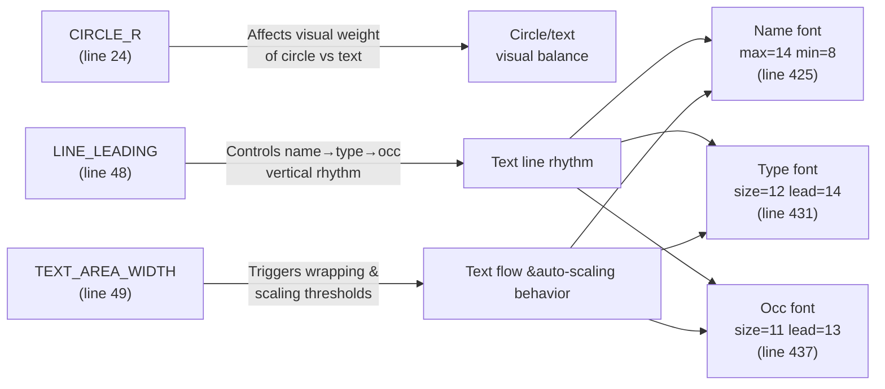

Every visual dimension on both badge formats is controlled by a small set of named constants at the top of [generate_badges.py](generate_badges.py#L18-L70) and inline numeric arguments passed to the rendering functions deeper in the file. This page provides a precise map of every adjustable value — where it lives, what it controls, and which neighboring constants you must co-adjust when you change it. The goal is to give you surgical confidence: change one number, regenerate the PDF, and know exactly what will shift on the page.

Before diving in, it is worth understanding that the constants fall into two categories. **Top-level named constants** (lines 18–70) are defined once and reused across multiple rendering paths — these are the best candidates for adjustment because a single edit propagates everywhere consistently. **Inline literals** appear inside the `generate_badges_pdf`, `generate_adhesive_badges_pdf`, `generate_blank_adhesive_pdf`, and `generate_blank_paper_pdf` functions — these control per-element details like specific font sizes and vertical offsets that were intentionally not promoted to module level. If you need a change that should apply to both named and blank badges, you will need to edit the inline values in multiple functions. For deeper understanding of how `fit_text` auto-scales and `wrap_and_draw` wraps text, see [Text Rendering: Auto-Scaling Names, Word Wrapping, and Font Management](17-text-rendering-auto-scaling-names-word-wrapping-and-font-management).

Sources: [generate_badges.py](generate_badges.py#L18-L70)

## Where Constants Live: Anatomical Overview

The following diagram shows the structural relationship between the constant definitions and the four rendering functions that consume them. Named constants at the top of the file feed into both formats, while inline literals within each function handle format-specific sizing details.

```mermaid
graph TD
    subgraph "Named Constants (lines 18–70)"
        NC_CIRCLE_R["CIRCLE_R = 24"]
        NC_LINE_LEAD["LINE_LEADING = 20"]
        NC_TEXT_W["TEXT_AREA_WIDTH = 250"]
        NC_AH["AVERY_HEADER_H = 52"]
        NC_ATW["AVERY_TEXT_W = 218"]
        NC_ALW["AVERY_LOGO_W = 185.0"]
        NC_ALH["AVERY_LOGO_H ≈ 53.8"]
        NC_SLOTS_P["BADGE_SLOTS (6 slots)"]
        NC_SLOTS_A["AVERY_SLOTS (8 slots)"]
    end

    subgraph "Paper Rendering (lines 388–442)"
        PR["generate_badges_pdf()"]
        PR_NAME["Name: fit_text max=14 min=8"]
        PR_TYPE["Type: wrap font=12 lead=14"]
        PR_OCC["Occ: wrap font=11 lead=13"]
        PR_STROKE["Circle stroke: 1.5pt"]
    end

    subgraph "Adhesive Rendering (lines 446–539)"
        AR["generate_adhesive_badges_pdf()"]
        AR_EVT["Event text: font=9 y=−13"]
        AR_NAME["Name: fit_text max=15 min=7 y=−33"]
        AR_TYPE["Type: wrap font=11 lead=13 gap=−14"]
        AR_OCC["Occ: wrap font=10 lead=12 gap=−6"]
        AR_LOGO_GAP["Logo gap: 10pt"]
    end

    NC_CIRCLE_R --> PR
    NC_LINE_LEAD --> PR
    NC_TEXT_W --> PR_NAME
    NC_TEXT_W --> PR_TYPE
    NC_TEXT_W --> PR_OCC
    NC_SLOTS_P --> PR

    NC_AH --> AR
    NC_ATW --> AR_NAME
    NC_ATW --> AR_TYPE
    NC_ATW --> AR_OCC
    NC_ALW --> AR
    NC_ALH --> AR
    NC_SLOTS_A --> AR
```

Sources: [generate_badges.py](generate_badges.py#L18-L83), [generate_badges.py](generate_badges.py#L388-L442), [generate_badges.py](generate_badges.py#L446-L539)

## Top-Level Named Constants

These are the primary knobs. They live in the constants block at the top of [generate_badges.py](generate_badges.py#L18-L70) and are referenced by name throughout the rendering code, making them the safest and most maintainable values to change.

### Shared Constants (Both Formats)

| Constant | Line | Default | Unit | Purpose |
|---|---|---|---|---|
| `PAGE_W` | 19 | `612` | pt | US Letter page width (fixed — do not change) |
| `PAGE_H` | 19 | `792` | pt | US Letter page height (fixed — do not change) |
| `CELL_W` | 20 | `306` | pt | Paper badge cell width (`PAGE_W / 2`) |
| `CELL_H` | 21 | `264` | pt | Paper badge cell height (`PAGE_H / 3`) |

Sources: [generate_badges.py](generate_badges.py#L18-L21)

### Paper Badge Constants (6-Up WCSU Template)

| Constant | Line | Default | Unit | Purpose |
|---|---|---|---|---|
| `CIRCLE_R` | 24 | `24` | pt | Radius of the colored school circle. Increasing moves the circle edges outward; decreasing tightens it. |
| `LINE_LEADING` | 48 | `20` | pt | Vertical distance between text baselines in the paper badge (name → type → occupation). A larger value spreads lines apart; a smaller value compresses them. |
| `TEXT_AREA_WIDTH` | 49 | `250` | pt | Maximum horizontal text width for all lines on paper badges. Controls when word-wrapping and font-scaling kick in. Derived from ~28pt padding on each side of the 306pt cell. |
| `BADGE_SLOTS` | 33–46 | 6 entries | — | Array of `{cx, cy, text_top_rl}` dictionaries defining the horizontal center, circle center Y, and first text baseline Y for each of the six badge positions. See [WCSU Paper Badge Layout: 6-Up Grid, Colored Circles, and Template Background](16-wcsu-paper-badge-layout-6-up-grid-colored-circles-and-template-background) for full coordinate documentation. |

Sources: [generate_badges.py](generate_badges.py#L24), [generate_badges.py](generate_badges.py#L33-L49)

### Adhesive Badge Constants (Avery 5395, 8-Up)

| Constant | Line | Default | Unit | Purpose |
|---|---|---|---|---|
| `AVERY_BADGE_W` | 62 | `243.0` | pt | Badge cell width (3-3/8 inches). Fixed by Avery die-cut dimensions. |
| `AVERY_BADGE_H` | 63 | `167.976` | pt | Badge cell height (2-1/3 inches). Fixed by Avery die-cut dimensions. |
| `AVERY_HEADER_H` | 64 | `52` | pt | Height of the colored school-color header band at the top of each adhesive badge. Increasing gives the name more room in the colored band but reduces white area below. |
| `AVERY_TEXT_W` | 65 | `218` | pt | Maximum text width for all lines on adhesive badges. Derived from `243 − 2 × 12.5` side margins. |
| `AVERY_LOGO_W` | 69 | `185.0` | pt | WCSU Alumni Association logo display width. Height is computed proportionally as `AVERY_LOGO_H ≈ 53.8`. |
| `AVERY_SLOTS` | 74–83 | 8 entries | — | Array of `{cx, cell_top}` dictionaries for each adhesive badge position. See [Avery 5395 Adhesive Badge Layout: 8-Up Grid Coordinates and Header Band Design](15-avery-5395-adhesive-badge-layout-8-up-grid-coordinates-and-header-band-design) for full coordinate documentation. |

Sources: [generate_badges.py](generate_badges.py#L62-L83)

## Inline Font Size and Spacing Values

The following values are **not** extracted as named constants — they appear as literal numbers inside each rendering function. This is an intentional design choice: each format has subtly different typographic needs, so the sizes are tuned independently. When adjusting these, you must edit each function that needs the change. The tables below map every inline typographic argument to its exact location.

### Paper Badge: `generate_badges_pdf()` (Lines 388–442)

| Element | Line | Font | Size (pt) | Leading (pt) | Notes |
|---|---|---|---|---|---|
| Circle stroke width | 418 | — | — | — | `setLineWidth(1.5)` — border thickness around the colored circle |
| Name | 424–425 | Helvetica-Bold | 14 max / 8 min | — | Auto-scales down from 14pt; minimum floor is 8pt via `fit_text` |
| Type / School line | 430–431 | Helvetica | 12 | 14 | Uses `wrap_and_draw`; wraps to second line if needed with 14pt leading |
| Occupation line | 436–437 | Helvetica | 11 | 13 | Uses `wrap_and_draw`; 13pt leading between wrapped lines |
| Type → Occ gap | 435 | — | — | — | `occ_y = type_y - LINE_LEADING - 1` — the extra `−1` adds a 1pt visual breathing gap |

Sources: [generate_badges.py](generate_badges.py#L418-L437)

### Adhesive Badge: `generate_adhesive_badges_pdf()` (Lines 446–539)

| Element | Line | Font | Size (pt) | Leading (pt) | Notes |
|---|---|---|---|---|---|
| "Meet & Greet 2026" | 495–496 | Helvetica | 9 | — | Y-offset from `cell_top`: 13pt. White text in header band. |
| Attendee name | 500–501 | Helvetica-Bold | 15 max / 7 min | — | Auto-scales from 15pt; floor 7pt. Y-offset: 33pt from cell_top. |
| Logo top gap | 512 | — | — | — | 10pt gap between header bottom and logo top edge |
| Type / School line | 523, 525–526 | Helvetica | 11 | 13 | 14pt gap below logo bottom. Uses `wrap_and_draw`. |
| Occupation line | 531, 533–534 | Helvetica | 10 | 12 | 6pt gap below type baseline. Uses `wrap_and_draw`. |

Sources: [generate_badges.py](generate_badges.py#L495-L534)

### Blank Badges: Walk-In Sheet Rendering

Blank badges use their own font sizes, separate from the named-badge functions. The school label that appears on blank badges uses a single fixed size without auto-scaling.

| Format | Function | Line | Font | Size (pt) | Y-offset |
|---|---|---|---|---|---|
| Adhesive | `generate_blank_adhesive_pdf()` | 604–605 | Helvetica | 10 | 14pt below logo bottom |
| Paper | `generate_blank_paper_pdf()` | 645–646 | Helvetica | 10 | 20pt below text top baseline |

Sources: [generate_badges.py](generate_badges.py#L604-L605), [generate_badges.py](generate_badges.py#L645-L646)

## Inter-Dependency Map: What Changes When You Change One Thing

Layout constants do not exist in isolation. Adjusting a single value often creates a cascade that requires co-adjustment of neighbors. The table below maps each common adjustment to its downstream effects so you can plan changes holistically rather than chasing symptoms.

### Paper Badge Dependency Chain

| You change | Effect on other elements | Co-adjustments to consider |
|---|---|---|
| `CIRCLE_R` larger | Circle visually encroaches into the text area below it; if `text_top_rl` in `BADGE_SLOTS` is too close to `cy`, text and circle may overlap | May need to push `text_top_rl` values down (increase the offset from `cy`) in `BADGE_SLOTS` entries |
| `CIRCLE_R` smaller | Circle looks thin relative to text; text may feel too far from the circle | Aesthetic judgment call — no functional co-adjustment needed unless text appears disconnected |
| `LINE_LEADING` larger | Type and occupation lines spread further apart; on long registrations or wrapped occupations, text may overflow the badge cell bottom edge | Verify total height: `CIRCLE_R` + gap + 3 lines × `LINE_LEADING` should stay well under `CELL_H` (264pt) |
| `LINE_LEADING` smaller | Lines compress; improves capacity for long names or multi-line occupations but reduces readability | Ensure the `−1` extra gap at line 435 still provides visual separation between type and occupation |
| `TEXT_AREA_WIDTH` larger | Text has more horizontal room before wrapping/scaling triggers; may push text into the cell margin zone | Must not exceed `CELL_W − 2 × margin` (≈306 − 2×28 = 250pt current) without risking text clipping at cell edges |
| Name `max_size` (14→16) | Larger names render bigger; more names will trigger downscaling on long entries | No co-adjustment needed — `fit_text` auto-scales; but verify that the tallest name still fits above the type line within the `LINE_LEADING` spacing |
| Name `min_size` (8→6) | Very long names shrink further instead of wrapping — more compact but potentially unreadable | If names become illegible, consider increasing `TEXT_AREA_WIDTH` or decreasing name `max_size` instead |

Sources: [generate_badges.py](generate_badges.py#L24-L49), [generate_badges.py](generate_badges.py#L418-L437)

### Adhesive Badge Dependency Chain

The adhesive format has a tighter vertical budget (≈116pt of white area after the 52pt header band), so spacing adjustments have more immediate overflow risk.

| You change | Effect on other elements | Co-adjustments to consider |
|---|---|---|
| `AVERY_HEADER_H` larger | More room for the name in the colored band; white area shrinks proportionally — logo, type, and occupation text get less vertical space | Decrease logo gap (line 512, currently 10pt) or reduce `AVERY_LOGO_W` to compress the logo and reclaim vertical room |
| `AVERY_HEADER_H` smaller | Less room for the event text and name in the band; white area expands — text below has more breathing room | Name y-offset (line 500, currently `−33`) may need to decrease to stay inside the band; event text y-offset (line 496, currently `−13`) may also need adjustment |
| `AVERY_TEXT_W` larger | Text flows wider before wrapping; only safe to increase if you are also reducing the side margins (currently 12.5pt each side of the 243pt cell) | Physical constraint: must not exceed `AVERY_BADGE_W − 2 × physical_margin` or text bleeds onto the adjacent badge |
| Logo gap (line 512) larger | Pushes logo down, which pushes type and occupation further toward the cell bottom edge — overflow risk in tight cells | Co-decrease type gap (line 523, currently 14pt) or occ gap (line 531, currently 6pt) to reclaim space |
| Name `max_size` (15→17) | Names in the header band render larger; long names with year suffixes are more likely to hit the `min_size` floor | Verify against `AVERY_TEXT_W` — a 17pt bold string "Christopher O'Sullivan '98 & '04" must fit within 218pt or will scale down aggressively |
| Occ gap (line 531) smaller | Occupation moves closer to type line — tighter but allows room for multi-line occupations | Minimum practical value is ~3pt; below that the baseline of the type line and the ascenders of the occupation line may visually collide |

Sources: [generate_badges.py](generate_badges.py#L495-L534)

## Step-by-Step: Common Adjustment Workflows

### Workflow 1: Increasing the Circle Radius

Useful if you want the school-color circle to be more prominent on paper badges.

**Before:** `CIRCLE_R = 24` → circle diameter = 48pt

1. Open [generate_badges.py](generate_badges.py#L24) and change `CIRCLE_R = 24` to your desired value (e.g., `30` for a 60pt diameter circle).
2. Verify the vertical fit: the circle top (`cy + CIRCLE_R`) must not overlap with the row above, and the circle bottom (`cy - CIRCLE_R`) must leave enough gap for `text_top_rl` (the first text baseline). Current values in `BADGE_SLOTS` place `text_top_rl` approximately 36pt below `cy`, so `CIRCLE_R = 30` still leaves a 6pt gap.
3. If you want text closer to the larger circle, reduce the `cy`-to-`text_top_rl` offset in each `BADGE_SLOTS` entry. The offset is currently `207 − 171 = 36pt` for rows 2 and 1, and `648 − 607 = 41pt` for row 0.
4. Regenerate and visually inspect. For blank badges, the same circle is rendered by [generate_blank_paper_pdf()](generate_badges.py#L638-L641), which also reads `CIRCLE_R`.

Sources: [generate_badges.py](generate_badges.py#L24), [generate_badges.py](generate_badges.py#L33-L46)

### Workflow 2: Tightening Line Spacing on Paper Badges

Useful when badges contain long occupation lines that wrap to two lines and risk overflowing the cell.

**Before:** `LINE_LEADING = 20` → 20pt between each text baseline

1. Open [generate_badges.py](generate_badges.py#L48) and decrease `LINE_LEADING` (e.g., from `20` to `17`).
2. This single change affects the gap between name, type, and occupation on every paper badge. The `−1` extra gap at [line 435](generate_badges.py#L435) still applies between type and occupation, preserving a small visual separator.
3. If lines now appear too tightly packed, adjust the individual font sizes in `wrap_and_draw` calls: increase the type font size at [line 431](generate_badges.py#L431) (currently 12) or the occupation font size at [line 437](generate_badges.py#L437) (currently 11) to improve readability while keeping the vertical spacing compact.

Sources: [generate_badges.py](generate_badges.py#L48), [generate_badges.py](generate_badges.py#L429-L437)

### Workflow 3: Adjusting Adhesive Header Band Height

Useful if you want a thicker or thinner colored band at the top of each Avery badge.

**Before:** `AVERY_HEADER_H = 52` → 52pt tall colored band

1. Open [generate_badges.py](generate_badges.py#L64) and change `AVERY_HEADER_H` to your desired value.
2. **If increasing** (e.g., to 62pt): the white area shrinks by the same amount. To prevent text overflow, reduce the logo gap at [line 512](generate_badges.py#L512) (currently 10pt) and/or the type gap at [line 523](generate_badges.py#L523) (currently 14pt). Each point recovered here gives one more point of breathing room below.
3. **If decreasing** (e.g., to 42pt): the name text and event text must still fit inside the band. The event text sits at `cell_top − 13` ([line 496](generate_badges.py#L496)) and the name at `cell_top − 33` ([line 500](generate_badges.py#L500)). With a 42pt band, the name baseline would be at 9pt from the band bottom — still feasible but tight. You may want to decrease the name y-offset (e.g., from `−33` to `−28`).
4. Blank adhesive badges at [generate_blank_adhesive_pdf()](generate_badges.py#L560-L610) also use `AVERY_HEADER_H`, so your change propagates automatically.

Sources: [generate_badges.py](generate_badges.py#L64), [generate_badges.py](generate_badges.py#L488-L534)

### Workflow 4: Changing Font Sizes for Better Readability

Because font sizes are inline literals, you must edit each rendering function individually. This workflow ensures consistency across all four badge types.

| Element | Paper named | Paper blank | Adhesive named | Adhesive blank |
|---|---|---|---|---|
| Name / header text | [L425](generate_badges.py#L425): `max_size=14, min_size=8` | N/A (no name) | [L501](generate_badges.py#L501): `max_size=15, min_size=7` | N/A (no name) |
| Event label | N/A | N/A | [L495](generate_badges.py#L495): `9` | [L591](generate_badges.py#L591): `9` |
| School label | [L431](generate_badges.py#L431): font `12` | [L645](generate_badges.py#L645): font `10` | [L525](generate_badges.py#L525): font `11` | [L604](generate_badges.py#L604): font `10` |
| Occupation | [L437](generate_badges.py#L437): font `11` | N/A | [L533](generate_badges.py#L533): font `10` | N/A |

When increasing font sizes, always verify against `TEXT_AREA_WIDTH` (paper) or `AVERY_TEXT_W` (adhesive) — larger fonts hit the wrap/scale threshold sooner, which means more names will be auto-scaled down. The net effect may be smaller text for borderline names even though you increased the target size. If this happens, increase the text area width constant as well.

Sources: [generate_badges.py](generate_badges.py#L425), [generate_badges.py](generate_badges.py#L431), [generate_badges.py](generate_badges.py#L437), [generate_badges.py](generate_badges.py#L495), [generate_badges.py](generate_badges.py#L501), [generate_badges.py](generate_badges.py#L525), [generate_badges.py](generate_badges.py#L533), [generate_badges.py](generate_badges.py#L591), [generate_badges.py](generate_badges.py#L604), [generate_badges.py](generate_badges.py#L645)

## Complete Quick-Reference: All Adjustable Values at a Glance

The following consolidated table lists every typographic and spacing value in the codebase, grouped by scope. Values marked with an asterisk (*) are top-level named constants; all others are inline literals requiring per-function edits.

| # | Value | Location | Default | Scope | Category |
|---|---|---|---|---|---|
| 1 | `CIRCLE_R`* | [L24](generate_badges.py#L24) | `24` | Paper (both named + blank) | Circle radius |
| 2 | Circle stroke width | [L418](generate_badges.py#L418), [L640](generate_badges.py#L640) | `1.5` | Paper (both named + blank) | Circle stroke |
| 3 | `LINE_LEADING`* | [L48](generate_badges.py#L48) | `20` | Paper named | Line spacing |
| 4 | Type→Occ extra gap | [L435](generate_badges.py#L435) | `1` | Paper named | Line spacing |
| 5 | `TEXT_AREA_WIDTH`* | [L49](generate_badges.py#L49) | `250` | Paper named | Text width |
| 6 | Paper name max/min | [L425](generate_badges.py#L425) | `14 / 8` | Paper named | Font size |
| 7 | Paper type font/lead | [L431](generate_badges.py#L431) | `12 / 14` | Paper named | Font size |
| 8 | Paper occ font/lead | [L437](generate_badges.py#L437) | `11 / 13` | Paper named | Font size |
| 9 | Blank paper label font | [L645](generate_badges.py#L645) | `10` | Paper blank | Font size |
| 10 | Blank paper label y-offset | [L646](generate_badges.py#L646) | `20` | Paper blank | Vertical position |
| 11 | `AVERY_HEADER_H`* | [L64](generate_badges.py#L64) | `52` | Adhesive (both named + blank) | Header height |
| 12 | `AVERY_TEXT_W`* | [L65](generate_badges.py#L65) | `218` | Adhesive named | Text width |
| 13 | `AVERY_LOGO_W`* | [L69](generate_badges.py#L69) | `185.0` | Adhesive (both named + blank) | Logo width |
| 14 | Adhesive event font | [L495](generate_badges.py#L495) | `9` | Adhesive named | Font size |
| 15 | Adhesive event y-offset | [L496](generate_badges.py#L496) | `13` | Adhesive named | Vertical position |
| 16 | Adhesive name max/min | [L501](generate_badges.py#L501) | `15 / 7` | Adhesive named | Font size |
| 17 | Adhesive name y-offset | [L500](generate_badges.py#L500) | `33` | Adhesive named | Vertical position |
| 18 | Logo gap from header | [L512](generate_badges.py#L512) | `10` | Adhesive named | Spacing |
| 19 | Type gap from logo | [L523](generate_badges.py#L523) | `14` | Adhesive named | Spacing |
| 20 | Adhesive type font/lead | [L525](generate_badges.py#L525) | `11 / 13` | Adhesive named | Font size |
| 21 | Occ gap from type | [L531](generate_badges.py#L531) | `6` | Adhesive named | Spacing |
| 22 | Adhesive occ font/lead | [L533](generate_badges.py#L533) | `10 / 12` | Adhesive named | Font size |
| 23 | Blank adhesive event font | [L591](generate_badges.py#L591) | `9` | Adhesive blank | Font size |
| 24 | Blank adhesive event y-off | [L592](generate_badges.py#L592) | `13` | Adhesive blank | Vertical position |
| 25 | Blank adhesive label font | [L604](generate_badges.py#L604) | `10` | Adhesive blank | Font size |
| 26 | Blank adhesive label y-off | [L605](generate_badges.py#L605) | `14` | Adhesive blank | Vertical position |

## Testing and Validation Strategy

After any constant change, regenerate the PDF and perform a systematic visual check. The recommended approach is to use the `--blank` flag to produce a quick single-page-per-school test set (6 pages) rather than waiting for a full registrant run.

1. Generate blank paper badges: `python generate_badges.py --type paper --blank --name test_paper` — visually confirm circle size and label placement.
2. Generate blank adhesive badges: `python generate_badges.py --type adhesive --blank --name test_adhesive` — confirm header band height and label position.
3. Run with a small CSV containing edge-case entries (long names, multi-year alumni, wrapped occupations): `python generate_badges.py --csv data/registrants.csv --name test_full`.
4. Open the output PDFs at 100% zoom (not fit-to-page) to verify actual point sizes match your intent.
5. For adhesive badges, print a single test page on plain paper and overlay it on an actual Avery 5395 sheet against a light source to verify alignment has not shifted.

If text overflows the badge boundary, work backward through the dependency chain: first try increasing `LINE_LEADING` or decreasing font sizes, then check `TEXT_AREA_WIDTH`/`AVERY_TEXT_W`, and finally consider adjusting slot positions in `BADGE_SLOTS` or `AVERY_SLOTS` (see [WCSU Paper Badge Layout: 6-Up Grid, Colored Circles, and Template Background](16-wcsu-paper-badge-layout-6-up-grid-colored-circles-and-template-background) and [Avery 5395 Adhesive Badge Layout: 8-Up Grid Coordinates and Header Band Design](15-avery-5395-adhesive-badge-layout-8-up-grid-coordinates-and-header-band-design) for coordinate reference). For known text-length edge cases, see [Known Edge Cases: Long Names, Duplicate Entries, Multi-Line Occupations, and Ambiguous Majors](26-known-edge-cases-long-names-duplicate-entries-multi-line-occupations-and-ambiguous-majors).