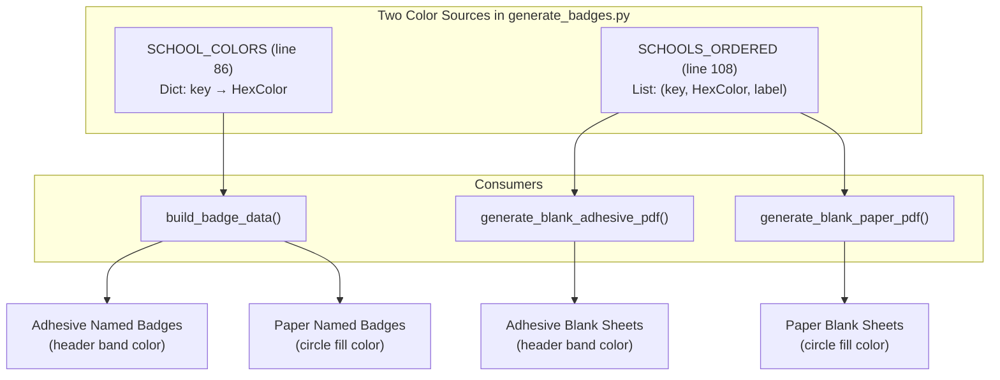
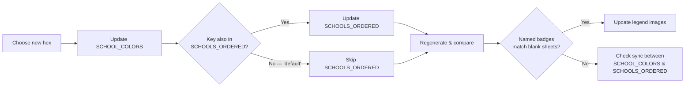

The badge generator uses a school-color mapping that is defined in two separate locations within a single file. Changing a hex value in one place but forgetting the other produces a subtle but visible bug: **named badges** will render with the new color while **blank walk-in sheets** continue using the old color. This page covers the complete procedure for modifying existing colors, adding entirely new school entries, and verifying that every rendering path reflects your changes.

## Where Colors Are Defined: The Two-Location Problem

School colors live in `generate_badges.py` at two distinct code blocks, both near the top of the file. The first is the `SCHOOL_COLORS` dictionary, which maps string keys to `HexColor` objects. This is the primary lookup table used by `build_badge_data()` for every named badge.

Sources: [generate_badges.py](generate_badges.py#L86-L94)

```python
SCHOOL_COLORS = {
    "ancell":       HexColor("#E8702A"),   # WCSU Orange
    "arts":         HexColor("#1B3A6B"),   # WCSU Navy
    "visual":       HexColor("#8E44AD"),   # Purple
    "professional": HexColor("#27AE60"),   # Forest Green
    "faculty":      HexColor("#D4AC0D"),   # Dark Gold
    "community":    HexColor("#7F8C8D"),   # Gray
    "default":      HexColor("#95A5A6"),   # Light gray (fallback)
}
```

The second location is `SCHOOLS_ORDERED`, a list of tuples used exclusively by the blank walk-in sheet generators. Each tuple embeds a **separate** `HexColor()` call rather than referencing `SCHOOL_COLORS`.

Sources: [generate_badges.py](generate_badges.py#L108-L115)

```python
SCHOOLS_ORDERED = [
    ("ancell",       HexColor("#E8702A"), "Ancell School of Business"),
    ("arts",         HexColor("#1B3A6B"), "School of Arts & Sciences"),
    ("visual",       HexColor("#8E44AD"), "School of Visual & Performing Arts"),
    ("professional", HexColor("#27AE60"), "School of Professional Studies"),
    ("faculty",      HexColor("#D4AC0D"), "Faculty / Staff"),
    ("community",    HexColor("#7F8C8D"), "Community Guest"),
]
```

These two structures serve different consumers. `SCHOOL_COLORS` is consulted at line 361 inside `build_badge_data()` whenever a named badge is assembled. `SCHOOLS_ORDERED` is iterated directly at lines 575 and 627 by `generate_blank_adhesive_pdf()` and `generate_blank_paper_pdf()` respectively, producing one page per school for walk-in registration. If you change a hex value in `SCHOOL_COLORS` but not in `SCHOOLS_ORDERED`, the mismatch will be invisible in named-badge output but obvious on blank sheets.

Sources: [generate_badges.py](generate_badges.py#L361), [generate_badges.py](generate_badges.py#L575), [generate_badges.py](generate_badges.py#L627)



## Current Color Reference Table

Before making any changes, confirm the current mapping. The table below reflects the shipped values and includes the `default` fallback for completeness, even though it does not appear in `SCHOOLS_ORDERED`.

| Key | School Name | Hex Code | Visual | Category | In SCHOOLS_ORDERED |
|---|---|---|---|---|---|
| `ancell` | Ancell School of Business | `#E8702A` | 🟠 | Academic school | ✅ |
| `arts` | School of Arts & Sciences | `#1B3A6B` | 🔵 | Academic school | ✅ |
| `visual` | School of Visual & Performing Arts | `#8E44AD` | 🟣 | Academic school | ✅ |
| `professional` | School of Professional Studies | `#27AE60` | 🟢 | Academic school | ✅ |
| `faculty` | Faculty / Staff | `#D4AC0D` | 🟡 | Non-academic | ✅ |
| `community` | Community Guest | `#7F8C8D` | ⬜ | Non-academic | ✅ |
| `default` | *(no label)* | `#95A5A6` | 🔘 | Fallback | ❌ |

Sources: [generate_badges.py](generate_badges.py#L86-L115)

The `default` entry is intentionally absent from `SCHOOLS_ORDERED` because walk-in attendees always declare a specific school at the registration desk. A "light gray" blank sheet would serve no purpose.

## Procedure: Changing an Existing School Color

Use this procedure when you want to update the hex value of a school that already exists in both dictionaries — for example, if WCSU updates its official Ancell orange from `#E8702A` to a slightly different shade.



### Step 1: Edit SCHOOL_COLORS

Open `generate_badges.py` and locate the `SCHOOL_COLORS` dictionary at line 86. Replace the `HexColor()` argument with your new hex code. Hex codes are standard CSS-style 6-digit values without the `#` prefix inside `HexColor()`, though ReportLab also accepts them with `#`.

**Before:**
```python
"ancell": HexColor("#E8702A"),   # WCSU Orange
```

**After (example — making Ancell a brighter orange):**
```python
"ancell": HexColor("#FF6B1A"),   # WCSU Orange (updated 2026)
```

Sources: [generate_badges.py](generate_badges.py#L86-L94)

### Step 2: Edit SCHOOLS_ORDERED (for all keys except "default")

Locate the `SCHOOLS_ORDERED` list at line 108 and update the `HexColor()` call for the same key. The hex string **must be identical** to what you used in Step 1.

**Before:**
```python
("ancell", HexColor("#E8702A"), "Ancell School of Business"),
```

**After:**
```python
("ancell", HexColor("#FF6B1A"), "Ancell School of Business"),
```

Sources: [generate_badges.py](generate_badges.py#L108-L115)

If the key is `"default"`, skip this step entirely — `default` does not appear in `SCHOOLS_ORDERED` and only affects unmatched registrants in named badge runs.

### Step 3: Verify with a Test Run

Generate both a named-badge PDF and a blank-sheet PDF for the same badge type, then visually compare the color on each.

| Command | What to Check |
|---|---|
| `python generate_badges.py --type adhesive --name test_adhesive` | Header band color on named badges |
| `python generate_badges.py --type adhesive --blank --name test_blank_adhesive` | Header band color on blank walk-in sheets |
| `python generate_badges.py --type paper --name test_paper` | Circle fill color on named badges |
| `python generate_badges.py --type paper --blank --name test_blank_paper` | Circle fill color on blank walk-in sheets |

If the named badges show the new color but the blank sheets show the old color, you missed updating `SCHOOLS_ORDERED`. Go back to Step 2.

### Step 4: Update Static Legend Images (Optional)

The `docs/` directory contains two pre-rendered legend PNG files that are **not** auto-generated by the script. These serve as visual references for event organizers and are committed to the repository.

| File | What It Shows |
|---|---|
| `docs/badge_color_legend.png` | Colored circles (paper badge style) |
| `docs/badge_color_legend_adhesive.png` | Colored header bands (adhesive badge style) |

Sources: [CLAUDE.md](CLAUDE.md#L24)

If you maintain these images for documentation purposes, update them manually using any image editor. Replace the color swatch for the affected school with your new hex value.

## Procedure: Adding a New School Color Entry

If WCSU establishes a new school or you want to distinguish a sub-category (for example, splitting "Community" into "Community — Sponsor" and "Community — Guest"), you need to add entries to three locations in `generate_badges.py` and optionally update the keyword detection logic.

### Step 1: Add the Key to SCHOOL_COLORS

Append a new entry to the `SCHOOL_COLORS` dictionary. Choose a short, lowercase key that does not collide with existing keys.

```python
SCHOOL_COLORS = {
    # ... existing entries ...
    "sponsor":      HexColor("#E74C3C"),   # Red — Community sponsors
}
```

Sources: [generate_badges.py](generate_badges.py#L86-L94)

### Step 2: Add the Key to SCHOOL_LABELS

Add a matching entry to `SCHOOL_LABELS` so the badge displays a human-readable name on the type line.

```python
SCHOOL_LABELS = {
    # ... existing entries ...
    "sponsor":      "Community Sponsor",
}
```

Sources: [generate_badges.py](generate_badges.py#L96-L104)

### Step 3: Add the Tuple to SCHOOLS_ORDERED

If you want blank walk-in sheets generated for this category, append a tuple to `SCHOOLS_ORDERED`. The order in this list determines the page order in the blank-sheet PDF.

```python
SCHOOLS_ORDERED = [
    # ... existing entries ...
    ("sponsor", HexColor("#E74C3C"), "Community Sponsor"),
]
```

Sources: [generate_badges.py](generate_badges.py#L108-L115)

If this new category should **not** have a blank walk-in sheet (analogous to how `default` is excluded), skip this step.

### Step 4: Wire Up Detection Logic

The new color will only appear on badges if `detect_school()` returns your new key for some set of registrants. You have three wiring options depending on what triggers the color assignment:

| Trigger Mechanism | Where to Edit | When to Use |
|---|---|---|
| **Registration type routing** | `detect_school()` function (lines 141–172), add a new `if reg_type == ...` branch | The CSV `Registration Options` column will contain a distinct value like `"Sponsor"` |
| **Keyword matching** | Add a new keyword list (e.g. `SPONSOR_KEYWORDS`) and a matching loop inside `detect_school()` | The color should activate based on words found in the `Class / Major` or `Organization` fields |
| **Organization name match** | Add an explicit `if "keyword" in txt` check early in `detect_school()`, before the registration-type checks | A specific organization name in the CSV should trigger this color regardless of other fields |

Sources: [generate_badges.py](generate_badges.py#L141-L172)

For the keyword-matching approach, follow the full procedure documented in [Extending Keyword Lists and Adding New School Mappings](13-extending-keyword-lists-and-adding-new-school-mappings), which covers priority ordering and edge cases.

## Impact Scope: What Changes When You Edit Colors

Understanding exactly which output artifacts are affected by each color source prevents half-updated states. The table below maps every edit location to its downstream consumers.

| Edit Location | Lines Affected | Consumers | Badge Types Affected |
|---|---|---|---|
| `SCHOOL_COLORS` | 86–94 | `build_badge_data()` → `generate_badges_pdf()`, `generate_adhesive_badges_pdf()` | Named paper badges, named adhesive badges |
| `SCHOOLS_ORDERED` | 108–115 | `generate_blank_adhesive_pdf()`, `generate_blank_paper_pdf()` | Blank walk-in sheets (both formats) |
| `SCHOOL_LABELS` | 96–104 | `build_badge_data()` (type string assembly) | Named badges only (label text, not color) |
| Static PNG legends | `docs/` | Documentation only | No PDF output |

Sources: [generate_badges.py](generate_badges.py#L361), [generate_badges.py](generate_badges.py#L575), [generate_badges.py](generate_badges.py#L627)

Note that `SCHOOL_LABELS` controls the text displayed on the badge (e.g., "Ancell School of Business") but has no effect on the visual color. If you only want to rename a school label without changing its color, edit `SCHOOL_LABELS` and `SCHOOLS_ORDERED` (which embeds the label string) but leave `SCHOOL_COLORS` untouched.

## Common Mistakes and Troubleshooting

| Symptom | Root Cause | Fix |
|---|---|---|
| Named badges have the new color but blank sheets show the old color | Updated `SCHOOL_COLORS` but forgot `SCHOOLS_ORDERED` | Edit `SCHOOLS_ORDERED` at line 108 with the same hex code |
| New school key shows gray (default color) on badges | Key exists in `SCHOOL_COLORS` but `detect_school()` never returns it | Add detection logic in `detect_school()` or update keyword lists |
| Blank sheet page count did not change after adding a new entry | New tuple was appended to `SCHOOLS_ORDERED` but the `--blank` flag was not used | Run with `--blank` to regenerate walk-in sheets |
| Type line on badge is blank for the new key | Entry missing from `SCHOOL_LABELS` | Add matching key to `SCHOOL_LABELS` at line 96 |
| `HexColor` raises a `ValueError` | Invalid hex string (e.g., `#GGG` or missing `#`) | Use a valid 6-digit hex code: `#RRGGBB` format |

Sources: [generate_badges.py](generate_badges.py#L15) (HexColor import)

For badge recipients who appear gray despite having a valid major, the issue is typically in the keyword detection logic rather than the color dictionaries. See [Fixing Gray (Unmatched) Badges by Updating CSV Major Fields](25-fixing-gray-unmatched-badges-by-updating-csv-major-fields) for a targeted troubleshooting walkthrough.

## HexColor Format Reference

ReportLab's `HexColor` constructor, imported from `reportlab.lib.colors` at line 15, accepts several string formats:

| Format | Example | Supported |
|---|---|---|
| `#RRGGBB` (6-digit with hash) | `HexColor("#E8702A")` | ✅ Preferred |
| `#RGB` (3-digit shorthand) | `HexColor("#F00")` | ✅ Expands to `#FF0000` |
| `RRGGBB` (6-digit without hash) | `HexColor("E8702A")` | ✅ Accepted |
| `0xRRGGBB` | `HexColor("0xE8702A")` | ❌ Raises ValueError |
| CSS named colors | `HexColor("orange")` | ❌ Use `reportlab.lib.colors.orange` instead |

Sources: [generate_badges.py](generate_badges.py#L15)

All shipped colors use the `#RRGGBB` format with the hash prefix. Maintain this convention for consistency when adding or editing entries.

## Complete Edit Checklist

Use this checklist when making any color changes to ensure nothing is missed. Every item maps to a specific line range in `generate_badges.py`.

- [ ] `SCHOOL_COLORS` — updated hex value or added new key (line 86–94)
- [ ] `SCHOOL_LABELS` — updated display name or added new key (line 96–104)
- [ ] `SCHOOLS_ORDERED` — updated hex value or added new tuple (line 108–115)
- [ ] `detect_school()` — added routing logic for new keys (line 141–172)
- [ ] Keyword lists — added new list or extended existing list if needed (line 118–139)
- [ ] Regenerated named badges (`--type adhesive` and `--type paper`)
- [ ] Regenerated blank sheets (`--blank` for both types)
- [ ] Verified named-badge colors match blank-sheet colors
- [ ] Updated `docs/badge_color_legend.png` and `docs/badge_color_legend_adhesive.png` if maintaining visual docs