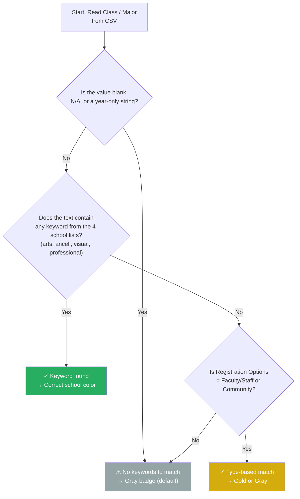

You generated your badge PDF and spotted a registrant whose badge has a light gray circle or header band instead of one of the four WCSU school colors. That gray isn't a bug — it's the badge generator's way of telling you that the `Class / Major` column for that person didn't contain any recognizable keyword. This page walks you through diagnosing which registrants are affected, understanding why the match failed, and fixing it by editing the CSV data itself (no code changes required).

Sources: [generate_badges.py](generate_badges.py#L86-L94)

## What a Gray Badge Means

Every registrant's badge color is decided by a function called `detect_school()`. It takes the `Class / Major` value from the CSV, combines it with the `Community Business/Organization` field, lowercases everything, and then checks for specific keywords like `"biology"`, `"business"`, `"graphic design"`, and `"education"`. If **none** of the four keyword lists contain a match, the function returns the string `"default"` — and `"default"` maps to a light gray color (`#95A5A6`) with no school name displayed on the badge. The badge is still perfectly valid and readable; it just lacks the school-specific color and label that makes the event visually organized.

Sources: [generate_badges.py](generate_badges.py#L141-L172)

## Common Causes of Gray Badges

Gray badges typically arise from one of five situations. Understanding which one you're dealing with makes the fix straightforward.

| Cause | Example CSV Value | Why It Fails | Fix Difficulty |
|-------|------------------|--------------|----------------|
| **Blank or N/A major** | `Class / Major` is empty, `N/A`, `TBD`, or `-` | The cleaned text is an empty string — no keywords can match | ★☆☆ Edit CSV |
| **Year only, no discipline** | `Class / Major = "2024"` or `"'24"` | A bare year contains no school-related keyword | ★☆☆ Edit CSV |
| **Discipline not in any keyword list** | `Class / Major = "Hospitality Management"` | The keyword lists don't include `"hospitality"` | ★★☆ Edit CSV or add keyword |
| **Misspelled or unusual wording** | `Class / Major = "Buisness Admin"` | `"buisness"` doesn't match `"business"` | ★☆☆ Fix spelling in CSV |
| **Registration type doesn't trigger Faculty/Community** | `reg_type = "Guest"` instead of `"Community"` | Only `"Faculty/Staff"` and `"Community"` shortcut past keywords | ★★☆ Fix reg type in CSV |

Sources: [generate_badges.py](generate_badges.py#L153-L156), [generate_badges.py](generate_badges.py#L244-L246)

## The Detection Flow: Where Gray Happens

The following diagram shows the exact path a registrant takes through the school detection logic. The gray badge result lives at the very bottom — it only fires if every tier above fails to produce a match. This flowchart is simplified from the full five-tier chain documented in [Keyword-Based School Assignment Algorithm and Priority Rules](11-keyword-based-school-assignment-algorithm-and-priority-rules), but captures the essentials for troubleshooting.



The key insight is that for Alumni and Student registrants, the `Class / Major` field is the **only** path to a school color. Faculty and Community registrants have a shortcut through their registration type, so their `Class / Major` field matters less. If an Alumni or Student has a blank or unrecognizable major, there is nothing else for the algorithm to latch onto.

Sources: [generate_badges.py](generate_badges.py#L141-L172)

## Step-by-Step: Finding and Fixing Gray Badges in the CSV

The most reliable fix for a one-off gray badge is to update the `Class / Major` cell in your source CSV so it contains a recognizable keyword. This requires no changes to the Python code and works immediately on the next run. Follow these steps in order.

### Step 1 — Identify Which Registrants Are Gray

Open the generated badge PDF and scan for any badges with a light gray circle (paper format) or light gray header band (adhesive format). Note down the names of the affected registrants. Alternatively, if you have Python available, you can run a quick diagnostic script that prints every registrant whose school resolves to `"default"`:

```python
# Quick diagnostic — save as check_gray.py and run in the project root
import csv, os

# Paste the keyword lists and detect_school function from generate_badges.py
# (lines 118-172), then add:

csv_path = "data/registrants.csv"
with open(csv_path, encoding="utf-8-sig") as f:
    for row in csv.DictReader(f):
        major = (row.get("Class / Major") or "").strip()
        org = (row.get("Community Business/Organization") or "").strip()
        reg = (row.get("Registration Options") or "").strip()
        school = detect_school(major, org, reg)
        if school == "default":
            name = f"{row.get('Attendee (First Name)', '')} {row.get('Attendee (Last Name)', '')}"
            print(f"  ⚠ GRAY: {name.strip()} — major='{major}' — reg='{reg}'")
```

This prints every unmatched registrant along with their raw `Class / Major` value so you can see exactly what text the algorithm is working with.

Sources: [generate_badges.py](generate_badges.py#L338-L385)

### Step 2 — Look Up the Correct School for the Discipline

Once you know which `Class / Major` values are failing, determine which WCSU school each discipline belongs to. The following table maps common gray-badge culprits to their correct school and a keyword you can use to fix the match.

| Actual Major / Field | Correct WCSU School | Keyword That Will Match |
|---------------------|---------------------|------------------------|
| Hospitality Management | Ancell School of Business | `"business"` or `"management"` |
| Social Media Marketing | Ancell School of Business | `"marketing"` |
| Pre-Med / Pre-Law | School of Arts & Sciences | `"science"` or `"justice"` |
| Health Sciences | School of Arts & Sciences | `"science"` |
| Data Analytics | School of Arts & Sciences | `"science"` or `"applied"` |
| Athletic Training | School of Professional Studies | `"education"` or add `"athletic training"` to `PROFESSIONAL_KEYWORDS` |
| Media Arts | School of Visual & Performing Arts | `"arts "` (with trailing space) |
| Special Education | School of Professional Studies | `"education"` |

For the full keyword catalog covering every discipline currently recognized, see the complete reference tables in [Keyword-Based School Assignment Algorithm and Priority Rules](11-keyword-based-school-assignment-algorithm-and-priority-rules).

Sources: [generate_badges.py](generate_badges.py#L118-L139)

### Step 3 — Edit the CSV `Class / Major` Cell

Open your CSV file in a spreadsheet editor (Google Sheets, Excel, or LibreOffice Calc). Find each affected registrant's row and update the `Class / Major` column to include a keyword that maps to the correct school. The keyword doesn't need to be the *only* text in the cell — the algorithm searches for substrings, so you can keep the existing value and append or insert the keyword anywhere.

**Example fix — a registrant whose major says `"2024"` only:**

| Column | Before (gray) | After (correct color) |
|--------|--------------|---------------------|
| `Class / Major` | `2024` | `Biology '24` |

**Example fix — a registrant whose major has an unrecognized discipline:**

| Column | Before (gray) | After (correct color) |
|--------|--------------|---------------------|
| `Class / Major` | `Hospitality Management '15` | `Business — Hospitality Management '15` |

**Example fix — a registrant with a blank major:**

| Column | Before (gray) | After (correct color) |
|--------|--------------|---------------------|
| `Class / Major` | `N/A` | `Computer Science` |

In each case, the fix works because the algorithm converts the `Class / Major` text to lowercase and checks whether any keyword is a substring. `"Business — Hospitality Management '15"` lowered becomes `"business — hospitality management '15"`, which contains the ANCELL keyword `"business"` — so the badge turns orange.

Sources: [generate_badges.py](generate_badges.py#L141-L143)

### Step 4 — Re-Generate the Badge PDF

Save your edited CSV and re-run the badge generator. The command is the same one you used originally — the script will re-read the updated CSV and produce a new PDF with the corrected colors.

```bash
python generate_badges.py --csv data/registrants.csv
```

Open the new PDF and verify that the previously gray badges now display the correct school color and school name. For details on specifying output filenames or choosing between adhesive and paper formats, see [CLI Interface: All Command-Line Flags and Output Path Resolution](22-cli-interface-all-command-line-flags-and-output-path-resolution).

Sources: [generate_badges.py](generate_badges.py#L774-L791)

## When Editing the CSV Isn't Enough: Adding Keywords to the Code

If you find that the same unrecognized discipline appears for **multiple** registrants, editing each CSV cell individually becomes tedious. In that case, the better approach is to add the discipline as a new keyword to the appropriate keyword list in `generate_badges.py`. This is a one-time code change that permanently fixes the issue for all current and future CSVs. The complete procedure — including how to choose the right keyword list, avoid false-positive matches, and validate your change — is documented in [Extending Keyword Lists and Adding New School Mappings](13-extending-keyword-lists-and-adding-new-school-mappings).

The short version is: open `generate_badges.py`, find the keyword list for the target school (lines 118–139), and append your new lowercase keyword. Then re-run the generator. The four keyword lists and their line locations are summarized below for quick reference.

| School | Keyword List | Line Range | School Color |
|--------|-------------|------------|-------------|
| Ancell School of Business | `ANCELL_KEYWORDS` | [118–122](generate_badges.py#L118-L122) | Orange |
| School of Arts & Sciences | `ARTS_KEYWORDS` | [123–130](generate_badges.py#L123-L130) | Navy |
| School of Visual & Performing Arts | `VISUAL_KEYWORDS` | [131–135](generate_badges.py#L131-L135) | Purple |
| School of Professional Studies | `PROFESSIONAL_KEYWORDS` | [136–139](generate_badges.py#L136-L139) | Forest Green |

Sources: [generate_badges.py](generate_badges.py#L118-L139)

## Quick-Reference Troubleshooting Table

Use this table as a fast lookup when you encounter a gray badge. Match the symptom to the most likely cause and apply the corresponding fix.

| Symptom | Likely Cause | Quick Fix |
|---------|-------------|-----------|
| Gray badge, `Class / Major` is blank or `N/A` in the CSV | No text to match against | Enter a discipline keyword in the `Class / Major` cell |
| Gray badge, `Class / Major` contains only a year like `'24` | Year string has no school keyword | Prefix the year with a discipline: `Biology '24` |
| Gray badge, `Class / Major` has a valid major but wrong spelling | Keyword lists use exact substrings | Fix the spelling: `Buisness` → `Business` |
| Gray badge, `Class / Major` has a valid WCSU major not in any list | Keyword lists don't cover every discipline | Add the keyword to the appropriate list (see above) or append a known keyword to the CSV cell |
| Gray badge for Faculty/Staff, but org field has school name | Tier 1 org checks are case-sensitive after lowering — should work | Verify the org field doesn't contain only `"WCSU"` without a school name; `"Faculty/Staff"` type already assigns gold |
| Gray badge for a Community guest | Community registration type **should** produce gray — this is expected | If you want a different color, change `Registration Options` to a matching school keyword |