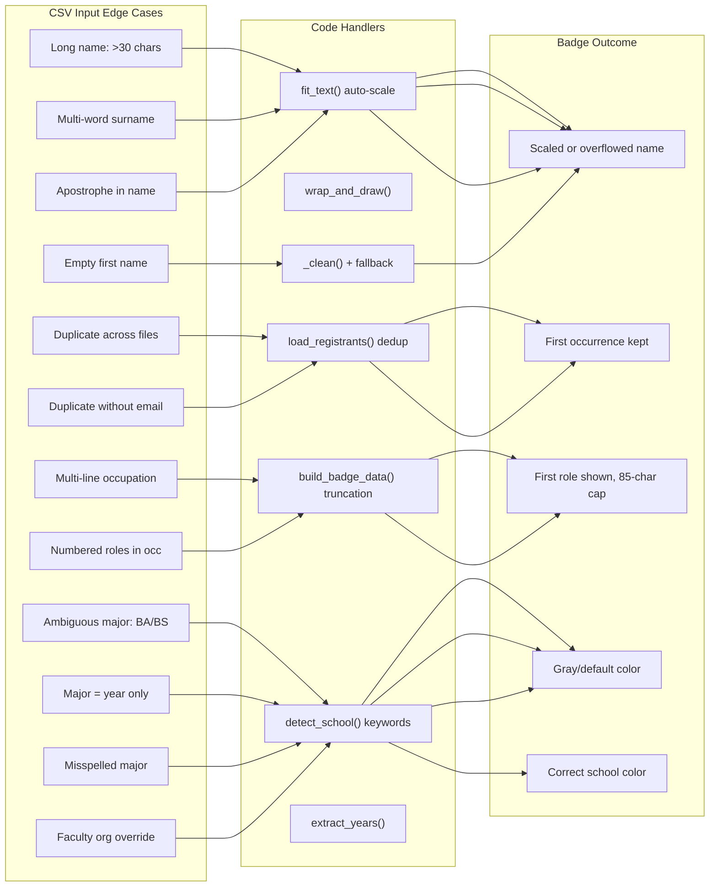
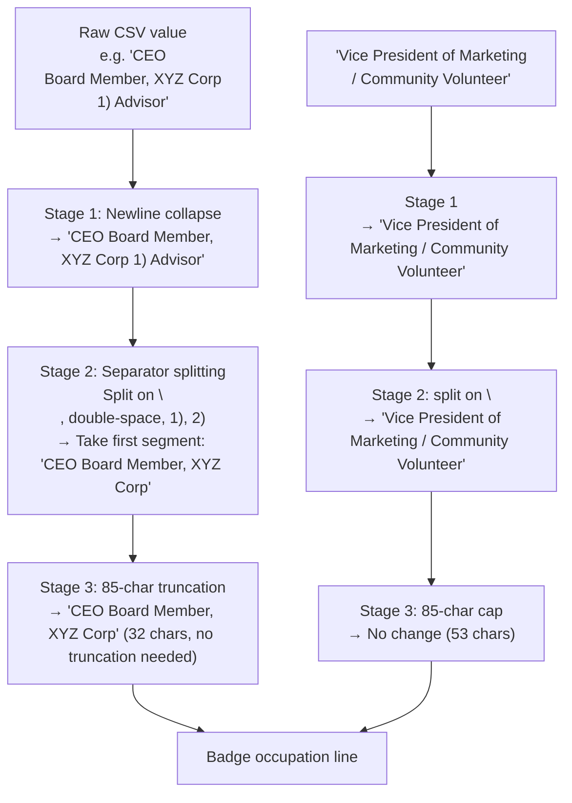

This page catalogs every non-obvious input scenario the badge generator must handle — from overlong strings that stress the auto-scaling renderer to ambiguous CSV values that produce unexpected school color assignments. For each edge case, the document identifies the exact code path that processes it, the observable behavior on the final badge, and the recommended remediation when the default behavior is insufficient. The four major categories — **long names**, **duplicate entries**, **multi-line occupations**, and **ambiguous majors** — cover the vast majority of real-world data quality issues encountered during WCSU Meet & Greet print runs.



## Long Names: Auto-Scaling Limits and Overflow Behavior

The badge generator uses `fit_text()` to render every attendee name as a single centered line, automatically shrinking the font from a maximum size down to a configurable minimum. This works well for names up to roughly 30–35 characters (including spaces and alumni year suffixes), but exceptionally long names will hit the floor of the scaling loop and render at the minimum size regardless of whether the text still exceeds the available width.

### The Two Critical Width Thresholds

Each badge format imposes a different maximum text width, which determines how many characters fit before scaling begins:

| Format | Max Width Constant | Value | Effective Capacity (14pt Bold) | Min Font Size |
|--------|-------------------|-------|-------------------------------|---------------|
| Paper (6-up) | `TEXT_AREA_WIDTH` | 250 pt | ~30–32 characters | 8 pt |
| Adhesive (8-up) | `AVERY_TEXT_W` | 218 pt | ~26–28 characters | 7 pt |

The adhesive format is the tighter constraint. A name like `"Christopher Psichopaidas '24"` (30 characters) will already require scaling on an adhesive badge at the default 15pt bold starting size, and would render at approximately 11pt. The same name fits comfortably on a paper badge at the full 14pt size.

Sources: [generate_badges.py](generate_badges.py#L48-L49), [generate_badges.py](generate_badges.py#L62-L65)

### When Auto-Scaling Reaches Its Floor

The `fit_text()` function always draws text — even when the minimum font size is reached and the string still exceeds the maximum width. This is an intentional design trade-off: showing an oversized name at a very small font is preferable to silently dropping the name entirely. The practical implication is that a name exceeding approximately 50 characters at 7pt Helvetica Bold will visually overflow its badge cell on an adhesive badge, potentially overlapping the school header band boundary.

For the detailed algorithm and step-by-step scaling example, see [Text Rendering: Auto-Scaling Names, Word Wrapping, and Font Management](17-text-rendering-auto-scaling-names-word-wrapping-and-font-management).

Sources: [generate_badges.py](generate_badges.py#L190-L199)

### Special Characters in Names: Apostrophes and Multi-Word Surnames

The codebase does not perform any special sanitization of name characters beyond `.title()` casing in `build_badge_data()`. Real WCSU registrant data includes names with apostrophes (e.g., `"D'andria"`) and multi-word surnames (e.g., `"Aguirre Calle"`, `"De La Cruz Solorzano"`). These pass through the pipeline unchanged:

1. The CSV reader preserves them as-is in the raw row string.
2. `_normalize_row()` applies `_clean()` which only strips whitespace and collapses N/A sentinels — no character filtering.
3. `build_badge_data()` calls `.strip().title()` which lowercases the interior of the string but preserves apostrophes (e.g., `"D'andria"` becomes `"D'Andria"`).

The `.title()` transform on multi-word surnames is generally correct — `"De La Cruz Solorzano"` becomes `"De La Cruz Solorzano"` since "De", "La", and "Cruz" are already title-cased. However, some culturally specific casing patterns (like "de la Cruz") would be incorrectly capitalized. This is an accepted trade-off since ReportLab's `drawCentredString()` does not support mixed-casing logic.

Sources: [generate_badges.py](generate_badges.py#L338-L341), [generate_badges.py](generate_badges.py#L358-L363)

### Empty First Names: The "Guest" Fallback

When a registrant's first name cell is blank or contains only an N/A sentinel, the `_normalize_row()` function substitutes `"Guest"` as a fallback. This ensures every badge has *some* name text rather than an empty badge cell. The last name is not similarly protected — a blank last name produces a badge showing only `"Guest"` without any surname.

Sources: [generate_badges.py](generate_badges.py#L274-L285)

## Duplicate Entries: First-Occurrence-Wins and the Cross-Format Gap

The deduplication system in `load_registrants()` processes all CSV files sequentially through a single `seen` set, but the two-tier key strategy (email first, name fallback) introduces a subtle cross-format gap that can produce unexpected duplicate badges when mixing event exports with class rosters.

Sources: [generate_badges.py](generate_badges.py#L317-L336)

### The Duplicate Resolution Matrix

| Scenario | Key Generated | First File Wins? | Silent or Logged? |
|----------|--------------|-----------------|-------------------|
| Same email in two event exports | `jane@example.com` | ✅ Yes | Silent — no warning printed |
| Same name in two class rosters (no email) | `jane_doe` | ✅ Yes | Silent |
| Same person in event export (has email) and class roster (no email) | `jane@example.com` vs `jane_doe` | ❌ **No** — both keys are different | N/A — no collision detected |
| Two different people named "Jane Doe" in class rosters | `jane_doe` | ⚠️ First wins, second dropped | Silent — false positive collision |
| Corrected submission with same email as original | `jane@example.com` | ⚠️ Original (possibly wrong) wins | Silent — correction is lost |

The cross-format gap (row 3) is the most consequential scenario. If you run `--csv data/registrants.csv --csv data/acc306_badges.csv`, a student who appears in both files will receive *two badges* because the event export uses their email as the key while the class roster uses their name. For a complete discussion of this architecture and mitigation strategies, see [Deduplication Strategy Across Multiple CSV Files](10-deduplication-strategy-across-multiple-csv-files).

Sources: [generate_badges.py](generate_badges.py#L326-L333)

### File Order Matters: First-Occurrence-Wins Policy

Because deduplication uses a strict first-occurrence-wins policy with no field-level merging, the order of `--csv` arguments directly affects badge data quality. If a registrant appears in two event exports — first with an incomplete major field and later with a corrected one — the earlier (incorrect) record wins. Always place the most authoritative CSV first on the command line.

```
# Correct: richer data source first
python generate_badges.py --csv data/registrants.csv --csv data/acc306_badges.csv

# Risky: class roster first, event export second
python generate_badges.py --csv data/acc306_badges.csv --csv data/registrants.csv
```

Sources: [generate_badges.py](generate_badges.py#L330-L333)

## Multi-Line Occupations: Normalization, Truncation, and Role Selection

Registrant data frequently contains messy occupation fields — multi-line cells pasted from LinkedIn, numbered role lists, or slash-separated job titles. The `build_badge_data()` function applies a deterministic normalisation pipeline before the occupation string reaches the badge renderer.

Sources: [generate_badges.py](generate_badges.py#L372-L377)

### The Three-Stage Normalization Pipeline



Stage 1 collapses all newlines into spaces and collapses consecutive whitespace using `" ".join(text.replace("\n", " ").split())`. This produces a clean single-line string regardless of how many line breaks were in the original cell.

Stage 2 iterates through a fixed separator list — `"\n"`, `"  "` (double space), `"1)"`, `"2)"` — and takes the first segment from each split. The separators are applied sequentially, meaning the string is first split on newline (no-op after Stage 1), then on double space, then on `"1)"`, then on `"2)"`. Only the *last* matching split determines the final value, which means `"CEO  CTO"` (double-space separated) becomes `"CEO"`, and `"1) President\n2) Board Member"` becomes `"President"` after the `"1)"` split.

Stage 3 applies a hard 85-character truncation. At 10pt Helvetica on a 218pt-wide adhesive badge, 85 characters wraps to approximately 3 lines — which fits within the available vertical space below the logo and school line. On a paper badge with 250pt width, it wraps to approximately 2 lines.

Sources: [generate_badges.py](generate_badges.py#L372-L377)

### What the Pipeline Does NOT Handle

The normalisation pipeline has a few intentional limitations:

- **Slash-separated roles** like `"Marketing Director / Community Volunteer"` are NOT split — both roles render on the badge, wrapped by `wrap_and_draw()`. Only newline and numbered-role separators trigger the first-segment extraction.
- **Semicolon-separated roles** like `"Professor; Department Chair"` are similarly NOT split.
- **Very long unbroken words** (e.g., a URL pasted into the occupation field) will not be hyphenated by the word wrapper — they render on a single line and may overflow the badge cell.

If you need to control which occupation appears on a badge, the most reliable approach is to edit the CSV cell directly rather than relying on the automatic normalisation.

Sources: [generate_badges.py](generate_badges.py#L372-L377)

## Ambiguous Majors: When the Keyword Engine Produces Gray

The school detection engine in `detect_school()` relies entirely on substring matching between the cleaned `Class / Major` field and four keyword lists. When no keyword matches, the function returns `"default"`, producing a light gray badge. This section catalogues the specific patterns that lead to ambiguous or incorrect school assignments.

Sources: [generate_badges.py](generate_badges.py#L141-L172)

### The Ambiguity Taxonomy

| Ambiguity Category | Example CSV Values | Result | Why |
|-------------------|-------------------|--------|-----|
| **Degree prefix only** | `"BA"`, `"BS"`, `"MA"`, `"MBA"` | Gray (except `"MBA"` → Ancell, `"BBA"` → Ancell) | Only `"mba"` and `"bba"` appear in ANCELL_KEYWORDS |
| **Year-only** | `"2024"`, `"'24"`, `"1999"` | Gray | Years contain no school-related keyword |
| **Unrecognized discipline** | `"Hospitality Management"`, `"Athletic Training"` | Gray | Keyword lists don't cover every WCSU program |
| **Misspelling** | `"Buisness Admin"`, `"Psycology"` | Gray | Substring matching is literal — `"buisness"` ≠ `"business"` |
| **Overly broad match** | `"Liberal Arts"` | Arts & Sciences (navy) ✓ | `"liberal arts"` is in ARTS_KEYWORDS — usually correct |
| **Overly broad match** | `"Science Education"` | Professional Studies (green) | `"education"` in PROFESSIONAL_KEYWORDS checked before `"science"` in ARTS_KEYWORDS |
| **Generic term** | `"Administration"` | Gray | No keyword list contains the bare word `"administration"` (only `"health administration"`) |

Sources: [generate_badges.py](generate_badges.py#L118-L139), [generate_badges.py](generate_badges.py#L153-L156)

### Keyword Priority Creates Silent Overriding

The keyword lists are checked in a fixed priority order: VISUAL → PROFESSIONAL → ANCELL → ARTS. This means a major like `"Art Education"` matches `"art "` in VISUAL_KEYWORDS and produces a purple badge, even though the `"education"` keyword would suggest Professional Studies (green). The first match wins, and subsequent lists are never consulted.

| Major Text | Matches First In | Assigned School | Expected School |
|-----------|-----------------|-----------------|-----------------|
| `"Art Education"` | VISUAL: `"arts "` | Visual & Performing Arts (purple) | Debatable — depends on program |
| `"Music Business"` | VISUAL: `"music"` | Visual & Performing Arts (purple) | Likely Ancell (orange) |
| `"Dance Education"` | VISUAL: `"dance"` | Visual & Performing Arts (purple) | Likely Professional Studies (green) |
| `"Science Education"` | PROFESSIONAL: `"education"` | Professional Studies (green) | Likely Arts & Sciences (navy) |

These priority-driven assignments are correct for the majority of WCSU programs but can produce unexpected results for interdisciplinary majors. The resolution is either to edit the CSV `Class / Major` cell to include a more specific keyword, or to reorder the keyword lists in `generate_badges.py` if the interdisciplinary program is common. For the full keyword priority specification, see [Keyword-Based School Assignment Algorithm and Priority Rules](11-keyword-based-school-assignment-algorithm-and-priority-rules).

Sources: [generate_badges.py](generate_badges.py#L153-L161)

### Faculty Organizational Overrides: When the Org Field Steals the Color

For Faculty/Staff registrants, the detection logic performs an early org-field check *before* the generic `"Faculty/Staff"` type assignment. If the `Community Business/Organization` field contains specific school names, the faculty member receives that school's color instead of the default dark gold:

| Org Field Content | Matched By | Assigned Color |
|------------------|-----------|---------------|
| `"Ancell School of Business"` | `"ancell" in txt` | Orange |
| `"School of Professional Studies"` | `"professional studies" in txt` | Forest Green |
| `"Dean's Office"` | `"dean" in txt` | Forest Green |
| `"Visual Arts Department"` | `"visual" in txt` | Purple |
| `"WCSU Biology Department"` | No org match → type check → `"Faculty/Staff"` | Dark Gold |
| `"WCSU"` (no school name) | No org match → type check → `"Faculty/Staff"` | Dark Gold |

The `"dean"` keyword mapping to Professional Studies is worth noting — a Dean of the Ancell School would receive green (Professional Studies) rather than orange (Ancell) if their org field says `"Dean, Ancell School"` because the `"ancell"` check runs *first* and would correctly assign orange. However, a dean whose org field says simply `"Dean's Office"` without a school name receives green unconditionally.

Sources: [generate_badges.py](generate_badges.py#L144-L152)

## Additional Edge Cases

### Alumni Year Extraction: The 2026 Boundary

The `extract_years()` function uses a hardcoded boundary of 26 to distinguish 1900s from 2000s graduation years: years where the two-digit value is ≤ 26 are interpreted as 20xx, and years > 26 are interpreted as 19xx. This means that for the 2026 event, any alumnus who graduated in 2026 (encoded as `'26`) is correctly interpreted. However, an alumnus from 1926 (encoded as `'26`) would also be interpreted as 2026 — which is acceptable since 1926 graduates are extremely unlikely to attend. Post-2026, the boundary value in the code must be updated to prevent misinterpreting future graduation years.

Sources: [generate_badges.py](generate_badges.py#L175-L184)

### Multi-Year Alumni: The Ampersand Assembly

Alumni with multiple degrees (e.g., `'71 & '98`) have all years extracted and formatted as `"First Last '71 & '98"` for two degrees, or `"First Last '71, '85 & '04"` for three or more. The year extraction handles both apostrophe-style (`'71`) and four-digit-style (`1971`) formats in the same field, and even mixed formats within a single cell. However, years embedded in unrelated text (e.g., a class year in a job title like `"Manager since 2015"`) would also be extracted and appended to the name line — although this is unlikely in practice since the extraction runs against the `Class / Major` field, not the occupation field.

Sources: [generate_badges.py](generate_badges.py#L175-L184), [generate_badges.py](generate_badges.py#L364-L370)

### Blank Rows in CSV Files

Both `load_registrants()` (for event exports) and `convert_classlist.py` (for xlsx conversions) silently skip rows where both first and last names are blank after cleaning. This prevents empty rows at the end of a spreadsheet from generating blank badges. The skip counter is reported in the converter's console output but not in `load_registrants()`.

Sources: [generate_badges.py](generate_badges.py#L326-L329), [convert_classlist.py](convert_classlist.py#L98-L101)

## Quick-Reference Troubleshooting Table

| Symptom | Root Cause | Resolution |
|---------|-----------|------------|
| Name renders very small or overflows badge cell | Name exceeds ~30 chars (adhesive) or ~35 chars (paper) | Abbreviate in CSV or adjust `min_size` constant |
| Same person gets two badges when merging event + class roster CSVs | Cross-format dedup gap: email key ≠ name key | Consolidate into single Format A CSV with emails |
| Corrected registrant data not reflected on badge | First-occurrence-wins; corrected CSV is second | Reorder `--csv` arguments or edit the first CSV |
| Occupation shows only first role from a multi-role cell | Stage 2 separator splitting takes first segment | Edit CSV to contain only the desired role |
| Badge is light gray despite having a valid major | Major text doesn't contain any recognized keyword | Add a keyword to the CSV cell or to the code's keyword list |
| Faculty member has wrong school color | Org field triggers early school override | Edit org field or ensure it contains the full school name |
| Alumni name shows unexpected graduation year | Year boundary hardcoded at 26 | Update the boundary constant in `extract_years()` |

## Next Steps

- For detailed text rendering mechanics including how `fit_text()` and `wrap_and_draw()` process strings, see [Text Rendering: Auto-Scaling Names, Word Wrapping, and Font Management](17-text-rendering-auto-scaling-names-word-wrapping-and-font-management).
- For the complete deduplication architecture and cross-format mitigation strategies, see [Deduplication Strategy Across Multiple CSV Files](10-deduplication-strategy-across-multiple-csv-files).
- For step-by-step instructions on fixing gray badges by updating CSV data or adding keywords, see [Fixing Gray (Unmatched) Badges by Updating CSV Major Fields](25-fixing-gray-unmatched-badges-by-updating-csv-major-fields).
- For adjusting layout constants that control name scaling thresholds, see [Adjusting Layout Constants: Font Sizes, Circle Radius, and Line Spacing](23-adjusting-layout-constants-font-sizes-circle-radius-and-line-spacing).
- For the full school detection algorithm and keyword priority specification, see [Keyword-Based School Assignment Algorithm and Priority Rules](11-keyword-based-school-assignment-algorithm-and-priority-rules).