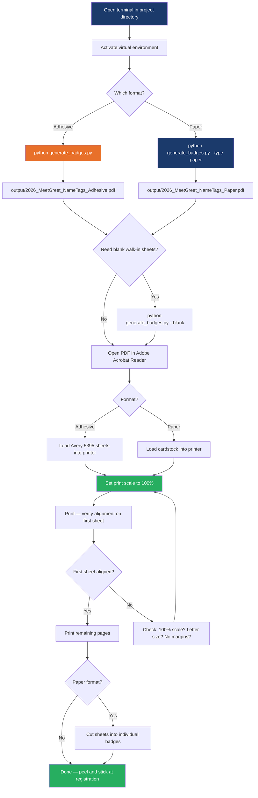

When event day arrives, the only thing standing between your freshly generated PDFs and a stack of real, wearable name badges is a printer and the right media. This guide covers every practical decision you need to make at that moment: which physical material to load, what print dialog settings to use, and how many badges you get per sheet — so you can print with confidence and avoid costly alignment mistakes.

This page is a **practical companion** to the generation workflows. If you haven't generated your PDFs yet, start with [Generating Adhesive Badges from Google Sheets CSV](3-generating-adhesive-badges-from-google-sheets-csv) or [Generating Paper Badges on WCSU Branded Template](4-generating-paper-badges-on-wcsu-branded-template). If you also need blank hand-write sheets for walk-in attendees, see [Preparing Blank Walk-In Badge Sheets for On-Site Registration](5-preparing-blank-walk-in-badge-sheets-for-on-site-registration).

## Choosing the Right Badge Format and Media

Your format decision — adhesive or paper — determines everything downstream: the physical media you purchase, how many badges fit on each sheet, whether you need scissors, and how long printing takes. Both formats produce a standard US Letter (8.5" × 11") PDF page, but the similarities end there.

| Decision factor | Avery 5395 Adhesive | WCSU Paper Template |
|---|---|---|
| **CLI flag** | `--type adhesive` (or omit) | `--type paper` |
| **Physical media** | Avery 5395 adhesive label sheets | Letter-size cardstock (65–80 lb) |
| **Badges per sheet** | 8 (2 columns × 4 rows) | 6 (2 columns × 3 rows) |
| **Individual badge size** | 3-3/8" × 2-1/3" | 4-1/4" × 3-2/3" |
| **Post-print work** | Peel and stick — zero cutting | Cut along template grid lines |
| **Badge visibility** | Smaller, lapel-style | Larger, more prominent |
| **Best suited for** | High-volume events, quick check-in | Formal events, prominent display |
| **Blank walk-in sheets** | 6 pages × 8 = 48 total blanks | 6 pages × 6 = 36 total blanks |

The **adhesive format is the default** because it eliminates post-print labor — no cutting, no sorting, just peel and apply. If your event expects more than ~100 attendees and check-in speed matters, adhesive is the clear choice. The paper format produces larger, more visually prominent badges with the WCSU branded template background, making it better suited for formal gatherings where the badge doubles as a keepsake.

Sources: [generate_badges.py](generate_badges.py#L1-L10), [README.md](README.md#L10-L30)

## Understanding Per-Sheet Badge Counts

The number of badges on each printed page is fixed by the grid layout — it's not something you configure. The script fills pages sequentially from top to bottom, left to right, and automatically spills onto additional pages when needed. Understanding this fill order helps you predict how many sheets of media to load.

### Adhesive Format: 8 Badges Per Sheet

The Avery 5395 adhesive layout uses a **2 × 4 grid** — two columns and four rows. Each badge occupies a 243 × 167.976 pt cell (3-3/8" × 2-1/3"). The fill order on the physical sheet is:

```
┌──────────┐ ┌──────────┐
│ Badge 1  │ │ Badge 2  │   ← Row 0 (top)
├──────────┤ ├──────────┤
│ Badge 3  │ │ Badge 4  │   ← Row 1
├──────────┤ ├──────────┤
│ Badge 5  │ │ Badge 6  │   ← Row 2
├──────────┤ ├──────────┤
│ Badge 7  │ │ Badge 8  │   ← Row 3 (bottom)
└──────────┘ └──────────┘
```

If you have 175 registrants, the script produces ⌈175 / 8⌉ = **22 pages**. The last page holds only 175 − (21 × 8) = **7 badges**, leaving one slot empty in the bottom-right corner.

### Paper Format: 6 Badges Per Sheet

The WCSU paper template uses a **2 × 3 grid** — two columns and three rows. Each badge cell is 306 × 264 pt (4-1/4" × 3-2/3"), noticeably larger than adhesive badges. The fill order:

```
┌──────────────┐ ┌──────────────┐
│   Badge 1    │ │   Badge 2    │   ← Row 0 (top)
├──────────────┤ ├──────────────┤
│   Badge 3    │ │   Badge 4    │   ← Row 1
├──────────────┤ ├──────────────┤
│   Badge 5    │ │   Badge 6    │   ← Row 2 (bottom)
└──────────────┘ └──────────────┘
```

The same 175 registrants produce ⌈175 / 6⌉ = **30 pages** for paper format. The last page has 175 − (29 × 6) = **1 badge** — a significant amount of wasted cardstock on the final sheet. This is one reason adhesive labels can be more economical at scale.

Sources: [generate_badges.py](generate_badges.py#L62-L83), [generate_badges.py](generate_badges.py#L33-L46), [generate_badges.py](generate_badges.py#L410-L411), [generate_badges.py](generate_badges.py#L470-L471)

### Quick Page Count Estimator

Use this table to estimate how many sheets of media you need before hitting print. Round up to the nearest whole number and add 1–2 extra sheets as a safety margin for printer jams or misprints.

| Registrant count | Adhesive pages (÷8) | Paper pages (÷6) | Extra sheets to buy |
|---|---|---|---|
| 10 | 2 | 2 | +2 each |
| 25 | 4 | 5 | +2 each |
| 50 | 7 | 9 | +3 each |
| 75 | 10 | 13 | +3 each |
| 100 | 13 | 17 | +4 each |
| 150 | 19 | 25 | +5 each |
| 200 | 25 | 34 | +5 each |
| 300 | 38 | 50 | +8 each |

For blank walk-in sheets, remember that you get **6 pages total** regardless of format — one page per school color. That's 48 blank adhesive badges (6 pages × 8) or 36 blank paper badges (6 pages × 6).

Sources: [generate_badges.py](generate_badges.py#L410-L411), [generate_badges.py](generate_badges.py#L470-L471), [generate_badges.py](generate_badges.py#L106-L115)

## Print Dialog Settings: The Critical Scale Rule

There is exactly one print setting that matters, and getting it wrong will ruin every sheet: **you must print at 100% scale**. The generator produces PDFs with pixel-perfect positioning designed to align with the physical Avery label cutouts and the WCSU template grid. Any scaling — even 98% or 102% — will shift every badge off its target position.

### Universal Print Settings (Both Formats)

| Setting | Correct value | Why it matters |
|---|---|---|
| **Scale** | **100%** or "Actual Size" | Badge coordinates are hardcoded in PDF points; any scaling breaks alignment |
| **Fit to page** | **OFF** / unchecked | This silently shrinks the page, misaligning adhesive labels |
| **Shrink oversized pages** | **OFF** | Your PDF is already exactly letter-size; no shrinking needed |
| **Page size** | Letter (8.5" × 11") | Must match US Letter — A4 will add margins and shift content |
| **Orientation** | Portrait | Both formats use portrait (taller than wide) |
| **Color mode** | Color (not grayscale) | School color coding is meaningless in black and white |
| **Quality / DPI** | Highest available | Colors and text sharpness benefit from maximum resolution |

### How to Set 100% Scale in Common Applications

**Adobe Acrobat Reader (recommended):**
1. File → Print (Ctrl+P)
2. Set "Page Sizing & Handling" to **Size**
3. Confirm the "Actual Size" radio button is selected
4. Verify no "Custom Scale" percentage appears

**Microsoft Edge (built-in PDF viewer):**
1. Ctrl+P to open print dialog
2. Under "Scale", select **100%** — do NOT select "Fit to page"
3. Set Margins to **None** or **Minimum**

**Google Chrome:**
1. Ctrl+P to open print dialog
2. Under "Layout", find "Margins" → select **None**
3. Uncheck "Headers and footers"
4. Confirm scale shows **100%**

**Firefox:**
1. Ctrl+P to open print dialog
2. Under "Scale", select **100%**
3. Uncheck "Print headers and footers"

The internal rendering pipeline uses a 3× scale factor when converting template PDFs to PNG backgrounds — `ensure_template_png()` calls `pdf[page_index].render(scale=3.0)` via pypdfium2. This ensures the background images are high-resolution before they're composited into the final PDF. However, this internal rendering scale has no effect on your print dialog — your output PDF is always a standard US Letter page that should print at 100%.

Sources: [generate_badges.py](generate_badges.py#L543-L557), [generate_badges.py](generate_badges.py#L415-L416), [generate_badges.py](generate_badges.py#L475-L476)

## Media Purchasing Guide

### Avery 5395 Adhesive Labels

Purchase the exact product number: **Avery 5395** (white adhesive name badge labels). These are widely available from office supply stores and online retailers. Each pack contains multiple sheets, and each sheet has 8 labels.

| Specification | Detail |
|---|---|
| **Product** | Avery 5395 White Adhesive Name Badge Labels |
| **Labels per sheet** | 8 |
| **Label dimensions** | 3-3/8" × 2-1/3" |
| **Sheet size** | 8.5" × 11" (US Letter) |
| **Printer compatibility** | Laser and inkjet |
| **Adhesive type** | Permanent |
| **Typical pack size** | 160 labels (20 sheets) or 400 labels (50 sheets) |

**Important:** Do not substitute with a "similar" label size. The generator's coordinates are measured directly from the Avery 5395 PDF template ([docs/Avery5395AdhesiveNameBadges.pdf](docs/Avery5395AdhesiveNameBadges.pdf)) with column centers at 171pt and 441pt, and row top edges at 751.5, 570.05, 388.55, and 207.1 pt. Even a 1/16" difference in label position will cause visible misalignment.

Sources: [generate_badges.py](generate_badges.py#L60-L61), [generate_badges.py](generate_badges.py#L74-L83), [generate_badges.py](generate_badges.py#L543-L557)

### Paper Template: Cardstock Recommendations

For the paper format, you need **letter-size cardstock** — standard printer paper is too flimsy for a wearable badge. The weight you choose affects both durability and print quality.

| Cardstock weight | Thickness feel | Durability | Cost | Recommendation |
|---|---|---|---|---|
| 65 lb (176 gsm) | Light cardstock | Adequate for one event | Low | Budget option |
| 80 lb (216 gsm) | Medium cardstock | Good — resists bending | Medium | **Recommended** |
| 110 lb (300 gsm) | Heavy cardstock | Excellent — near-rigid | Higher | Premium / keepsake |

**Printer compatibility warning:** Heavy cardstock (100 lb+) may not feed correctly through all printers, especially inkjet models with curved paper paths. Test one sheet before committing to a full run. Laser printers with straight-through rear feed trays generally handle heavy stock best.

After printing, you'll need to cut each sheet into 6 individual badges along the template grid lines. The template background includes visual guide lines for this purpose. A paper cutter (guillotine-style) is much faster than scissors for batch cutting.

Sources: [README.md](README.md#L220-L222), [generate_badges.py](generate_badges.py#L18-L19)

## Print Day Workflow: Step by Step

This flowchart captures the complete print-day sequence from generating the PDF to having physical badges ready at the registration table. The decision point is your format choice — everything after that follows a fixed procedure.



### Pre-Print Checklist

Before you commit to printing 20+ sheets of labels or cardstock, run through this checklist. Most alignment problems trace back to one of these items.

| Step | Check | How to verify |
|---|---|---|
| 1 | **PDF is freshly generated** | Re-run the script from the latest CSV export — never print a stale PDF |
| 2 | **Output file opens correctly** | Open the PDF and confirm badges are visible and properly colored |
| 3 | **Page size is Letter** | In your PDF viewer, check File → Properties → Page Size: should be 8.5" × 11" |
| 4 | **Print scale is 100%** | In print dialog, confirm "Actual Size" or "100%" — no "Fit to page" |
| 5 | **Margins are None/Minimum** | Any added margins will shift the content off the label grid |
| 6 | **Color printing is enabled** | Grayscale mode defeats the entire school-color system |
| 7 | **Correct media is loaded** | Avery 5395 sheets for adhesive, cardstock for paper |
| 8 | **Printer paper tray is set to Letter** | Some printers default to A4 or auto-detect incorrectly |

Sources: [generate_badges.py](generate_badges.py#L761-L791), [generate_badges.py](generate_badges.py#L407-L442)

## Troubleshooting Print Alignment Issues

If your printed badges don't align with the adhesive label cutouts or the template grid, the cause is almost always one of the settings below. Work through them in order — the most common culprit is print scale.

| Symptom | Most likely cause | Fix |
|---|---|---|
| Badges are shifted down or to the right | Print scale is less than 100%, or "Fit to page" is on | Set scale to exactly 100%; turn off all auto-fit options |
| Badges are shifted up or to the left | Printer is adding unrequested margins | Set margins to "None" or "Minimum" in print dialog |
| Badges are slightly too large for labels | Custom zoom or browser print scaling | Use Adobe Acrobat Reader instead of a browser; verify 100% |
| Colors are washed out or gray | Printing in grayscale or draft mode | Switch to color mode and "Best" or "Normal" quality |
| Labels are peeling off or smudging | Wrong media (plain paper in adhesive job) | Verify Avery 5395 sheets are loaded; check printer type compatibility |
| Text appears blurry | Low DPI / draft quality setting | Increase print quality to "Best" or "Maximum DPI" |
| Only partial page prints | Page size set to A4 instead of Letter | Change paper size to US Letter (8.5" × 11") in printer properties |
| Cardstock jams in printer | Stock is too heavy for your printer's paper path | Use lighter cardstock (65–80 lb) or a printer with rear feed tray |

**The single most important rule:** if the first sheet doesn't align, **stop printing**. Fix the setting, reprint that single sheet, and verify before continuing. Wasting one sheet of Avery labels is manageable; wasting an entire pack is not.

For deeper troubleshooting of badge content issues (wrong colors, missing names, gray badges), see [Fixing Gray (Unmatched) Badges by Updating CSV Major Fields](25-fixing-gray-unmatched-badges-by-updating-csv-major-fields) and [Known Edge Cases: Long Names, Duplicate Entries, Multi-Line Occupations, and Ambiguous Majors](26-known-edge-cases-long-names-duplicate-entries-multi-line-occupations-and-ambiguous-majors).

Sources: [generate_badges.py](generate_badges.py#L62-L83), [generate_badges.py](generate_badges.py#L415-L416)

## Summary: What to Remember on Print Day

Keep this mental model with you. The badge generator does all the complex work — school detection, name formatting, layout math, PDF rendering. Your only job at the printer is to not undo that work.


**Three numbers to memorize:**
- **8 badges per sheet** (adhesive) — buy Avery 5395, divide registrant count by 8 for page count
- **6 badges per sheet** (paper) — buy letter cardstock, divide registrant count by 6 for page count
- **100% scale** — the single setting that makes or breaks alignment

**One setting to never touch:** "Fit to page." Leave it off, unchecked, and disabled. Every other setting on this page flows from that single decision.