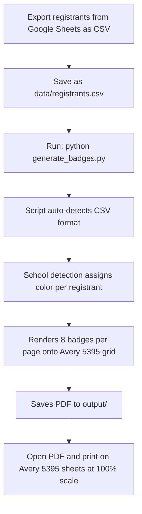
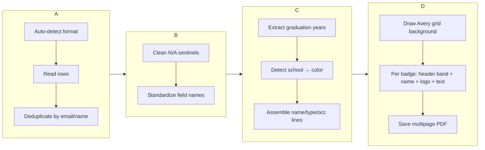

This page is your complete walkthrough for producing **Avery 5395 adhesive name badge labels** from a CSV export of your event registration data. Adhesive is the default badge format — each sheet holds 8 peel-and-stick badges (2 columns × 4 rows) sized 3-3/8" × 2-1/3", so there's no cutting required after printing. By the end of this page you'll understand how to export your data from Google Sheets, run the generator, and interpret the output.

This page assumes you have already completed the environment setup described in [Quick Start: Environment Setup and First Badge Run](2-quick-start-environment-setup-and-first-badge-run). If you haven't installed dependencies or activated your virtual environment yet, start there and come back.



## Step 1 — Export Your Registration Data from Google Sheets

The badge generator reads attendee information from a CSV file. If you collect registrations through a Google Form connected to a Google Sheet (which is the standard setup for WCSU Alumni Association events), exporting is straightforward.

Open your registration Google Sheet, then go to **File → Download → Comma-separated values (.csv)**. This downloads a `.csv` file with all registrant responses as plain text — one row per person, one column per form field.

Save (or move) this downloaded file into the project's `data/` directory, replacing any previous export:

```
wcsu-badge-generator/
├── data/
│   └── registrants.csv          ← Your Google Sheets export goes here
├── generate_badges.py           ← The script you'll run next
└── output/                      ← Generated PDFs appear here
```

The script expects the file at `data/registrants.csv` by default, so using this exact name means you can run the generator with no extra flags. For the full details on what columns are expected and how the two CSV formats differ, see [CSV Format Reference: Event Registrant Export vs. Class Roster](8-csv-format-reference-event-registrant-export-vs-class-roster).

Sources: [generate_badges.py](generate_badges.py#L686-L690), [README.md](README.md#L112-L121)

## Step 2 — Understand the Expected CSV Columns

The generator auto-detects which CSV format you're using based on the column headers in the first row. For a Google Sheets event registration export, the columns are typically:

| Column | Required? | What it contains | Used for |
|---|---|---|---|
| `Attendee (First Name)` | ✅ Yes | First name | Displayed on the badge |
| `Attendee (Last Name)` | ✅ Yes | Last name | Displayed on the badge |
| `Registration Options` | ✅ Yes | `Alumni`, `Student`, `Faculty/Staff`, or `Community` | Determines badge formatting rules |
| `Class / Major` | ✅ Yes | Major, department, or graduation year text | School color detection + alumni year suffix |
| `Email` | Optional | Email address | Deduplication (preferred over name) |
| `Community Business/Organization` | Optional | Organization name | Displayed on community/faculty badges |
| `Occupation / Position Title` | Optional | Job title | Third text line on the badge |

The four required columns are the minimum needed. The optional columns can be left blank — the script handles missing values gracefully by collapsing N/A-like entries (such as `N/A`, `None`, `-`, or `TBD`) to empty strings during normalization. This process is explained in detail on [Auto-Detection, Normalization, and N/A Sentinel Handling](9-auto-detection-normalization-and-n-a-sentinel-handling).

Here's a simplified example of what your CSV might look like:

```csv
Attendee (First Name),Attendee (Last Name),Registration Options,Class / Major,Email,Community Business/Organization,Occupation / Position Title
Maria,Gonzalez,Alumni,Communications '15,maria@example.com,,Marketing Manager
James,O'Brien,Alumni,Accounting '12 & '18M,james@example.com,,Senior Accountant
Dr. Sarah,Kim,Faculty/Staff,Professional Studies,sarah.kim@wcsu.edu,Dean of Students,Faculty
David,Chen,Community,,,,Attendee
```

Sources: [generate_badges.py](generate_badges.py#L286-L338), [CLAUDE.md](CLAUDE.md#L237-L258)

## Step 3 — Run the Badge Generator

With your CSV in place and your virtual environment activated, run the generator. The default behavior is to produce adhesive badges — you don't need any extra flags.

**On Windows (PowerShell):**

```powershell
python generate_badges.py
```

**On macOS / Linux:**

```bash
python3 generate_badges.py
```

**Expected console output:**

```
  registrants.csv: detected format 'event'
  registrants.csv: 175 registrants added
Loaded 175 unique registrants
✓ Generated 22 pages for 175 adhesive badges → output/2026_MeetGreet_NameTags_Adhesive.pdf
```

Here's what each line tells you: the script detected the "event" CSV format from the column headers, loaded 175 unique registrants (after deduplication by email), and produced a 22-page PDF with 175 adhesive badges — 8 per page across 21 full pages plus a partial 22nd page. The output file is saved to `output/2026_MeetGreet_NameTags_Adhesive.pdf`.

On your very first run, you may see an additional message about rendering the template background PNG from the Avery PDF source. This is a one-time step that takes a few seconds and does not repeat on subsequent runs. The process is described on [Template Auto-Rendering: PDF-to-PNG Conversion via pypdfium2](14-template-auto-rendering-pdf-to-png-conversion-via-pypdfium2).

Sources: [generate_badges.py](generate_badges.py#L730-L791), [generate_badges.py](generate_badges.py#L473-L476)

## Step 4 — Understand What Happens Behind the Scenes

When you run the command, the script executes a pipeline of four stages. Understanding this pipeline helps you diagnose issues and know where to look for deeper configuration.



**Stage 1 — CSV Loading and Deduplication:** The script reads your CSV, detects the format (event vs. class roster), normalizes every row into a standard internal dictionary, and deduplicates globally. If you provide multiple CSV files, the same person won't appear twice even if they exist in both files — deduplication uses email as the primary key and falls back to first+last name. See [Deduplication Strategy Across Multiple CSV Files](10-deduplication-strategy-across-multiple-csv-files) for details.

**Stage 2 — School Detection:** Each registrant's `Class / Major` and `Community Business/Organization` fields are scanned for keyword matches that assign one of four WCSU school colors, plus special colors for faculty and community guests. For alumni, graduation years like `'15` or `2018` are extracted from the major field and appended to the name as a suffix (e.g., "Maria Gonzalez '15"). The full algorithm is documented on [Keyword-Based School Assignment Algorithm and Priority Rules](11-keyword-based-school-assignment-algorithm-and-priority-rules).

**Stage 3 — Badge Data Assembly:** For each registrant, the script constructs a badge data dictionary containing the formatted name line, school/type label, occupation text, and the hex color for the school. This is the single source of truth that the PDF renderer consumes.

**Stage 4 — PDF Rendering:** The generator creates a ReportLab canvas, draws the Avery 5395 template background (with cut guide outlines), and fills each of the 8 badge slots per page with a colored header band, white name text, the WCSU Alumni Association logo, and the school/occupation text lines below. Each page accommodates exactly 8 badges; if your total isn't a multiple of 8, the last page will have fewer badges with the remaining slots left blank. The layout geometry is fully documented on [Avery 5395 Adhesive Badge Layout: 8-Up Grid Coordinates and Header Band Design](15-avery-5395-adhesive-badge-layout-8-up-grid-coordinates-and-header-band-design).

Sources: [generate_badges.py](generate_badges.py#L340-L380), [generate_badges.py](generate_badges.py#L436-L530), [CLAUDE.md](CLAUDE.md#L33-L55)

## Step 5 — Verify the Output

Open the generated PDF from the `output/` directory. Each page should display 8 adhesive badges in a 2-column × 4-row grid, matching the Avery 5395 label layout. Here's what to check on each badge:

| Element | Where it appears | What to look for |
|---|---|---|
| **Colored header band** | Top 52pt of each badge cell | Should match the registrant's WCSU school (orange for Ancell, navy for Arts & Sciences, etc.) |
| **"Meet & Greet 2026"** | White text, top of header band | Should read exactly "Meet & Greet 2026" in 9pt Helvetica |
| **Attendee name** | White bold text, lower part of header band | Should include graduation year suffix for alumni (e.g., "Maria Gonzalez '15") |
| **WCSU AA logo** | Centered, below header band | The WCSU Alumni Association logo should be clearly visible |
| **School/type line** | Navy text, below logo | Shows "Student · School Name" or "Alumni · School Name" |
| **Occupation line** | Dark gray text, bottom area | Shows the job title or organization if provided |

If any badges appear with a **light gray** header band instead of a school color, it means the school detection algorithm couldn't match the registrant's major or organization to any WCSU school. This is the `"default"` fallback color. To fix these, update the `Class / Major` field in your CSV to use a more recognizable keyword (e.g., "Biology" instead of "Bio"), or check [Fixing Gray (Unmatched) Badges by Updating CSV Major Fields](25-fixing-gray-unmatched-badges-by-updating-csv-major-fields) for a step-by-step troubleshooting guide.

The full color legend for all school assignments is available on [School Color Coding System and Visual Legend](7-school-color-coding-system-and-visual-legend).

Sources: [generate_badges.py](generate_badges.py#L460-L530), [generate_badges.py](generate_badges.py#L120-L138)

## Customizing the Run with Command-Line Flags

The default command (`python generate_badges.py`) works well for a standard event run, but several flags let you customize the output without editing any code. Here are the flags most relevant to adhesive badge generation:

| Flag | Default value | What it does |
|---|---|---|
| *(none)* | `data/registrants.csv` | Path to the CSV file — use `--csv` for a custom path or multiple files |
| `--type adhesive` | `adhesive` | Badge format — `adhesive` for Avery 5395 (default), `paper` for the WCSU template |
| `--name FILENAME` | `2026_MeetGreet_NameTags_Adhesive.pdf` | Custom output filename saved to `output/` (`.pdf` added if omitted) |
| `--output PATH` | `output/2026_MeetGreet_NameTags_Adhesive.pdf` | Full output path (overrides `--name` and default) |
| `--blank` | *(off)* | Generate blank walk-in sheets instead of named badges (6 pages, one per school) |

### Using a custom CSV path

If your registration export has a different filename, use `--csv` to point the script at it:

```bash
python generate_badges.py --csv "data/March_25_Export.csv"
```

### Merging multiple CSV files

If you have more than one registration list — for example, a main event list plus a separate class roster — use multiple `--csv` flags. The script merges all files and deduplicates globally:

```bash
python generate_badges.py --csv "data/registrants.csv" --csv "data/Class List ACC 306.csv" --name Merged_Badges
```

This produces `output/Merged_Badges.pdf` containing unique registrants from both files. The script reports per-file counts in the console so you can verify the merge worked correctly.

### Custom output filename

Use `--name` to give the output PDF a descriptive filename. This is saved automatically into the `output/` directory:

```bash
python generate_badges.py --name "March25_Final"
# → output/March25_Final.pdf
```

### Generating blank walk-in sheets

For attendees who register on-site, generate pre-printed blank adhesive badges with the school color header band and logo but no name — ready for hand-writing at the registration table:

```bash
python generate_badges.py --blank --name "WalkIn_Adhesive"
# → output/WalkIn_Adhesive.pdf (6 pages — one per school color)
```

For the complete reference of every CLI flag and how output paths are resolved, see [CLI Interface: All Command-Line Flags and Output Path Resolution](22-cli-interface-all-command-line-flags-and-output-path-resolution).

Sources: [generate_badges.py](generate_badges.py#L654-L728), [generate_badges.py](generate_badges.py#L730-L791)

## Step 6 — Print Your Badges

Once you're satisfied with the PDF output, print the badges onto **Avery 5395 adhesive name badge labels**. These are widely available from office supply stores and online retailers.

| Setting | Value | Why it matters |
|---|---|---|
| **Media** | Avery 5395 adhesive labels (8 per sheet) | Must match the badge grid dimensions exactly |
| **Scale** | **100%** (Actual Size) | Do NOT use "Fit to page" or "Shrink to fit" — this misaligns the badges with the label edges |
| **Color** | Full color | School colors are essential for the visual coding system |
| **Orientation** | Portrait (US Letter) | The Avery template uses standard letter-size pages |

After printing, simply peel each badge from the backing and stick it onto the attendee's clothing. No cutting or lamination is needed. For detailed print-day guidance including printer-specific tips and troubleshooting, see [Print Day Guide: Media Selection, Scale Settings, and Per-Sheet Counts](27-print-day-guide-media-selection-scale-settings-and-per-sheet-counts).

> **Always regenerate from the latest CSV export** before printing. Registration data changes frequently in the days before an event, and re-running the generator takes only a few seconds.

Sources: [README.md](README.md#L132-L142), [generate_badges.py](generate_badges.py#L12-L14)

## Quick Troubleshooting

Here are the most common issues you might encounter and their fixes:

| Problem | Likely cause | Fix |
|---|---|---|
| `FileNotFoundError` for the CSV | Wrong path or missing file | Ensure the file exists at the path you specified; check spelling and file extension |
| All badges are light gray | CSV uses different column headers | Verify your CSV has `Attendee (First Name)` (not `First Name`) for event exports; see [CSV Format Reference](8-csv-format-reference-event-registrant-export-vs-class-roster) |
| Names appear as "Guest" | Empty first name fields in the CSV | Fill in first names in the source data; the script uses "Guest" as a fallback |
| Alumni names missing graduation year | No year pattern in the `Class / Major` field | Ensure the field contains `'YY` (e.g., `'15`) or a four-digit year (e.g., `2015`); see [Graduation Year Extraction](18-graduation-year-extraction-apostrophe-and-four-digit-format-parsing) |
| Badges don't align when printed | Print scale is not 100% | Reprint at Actual Size with no scaling; see the Print Day Guide above |
| Duplicate badges for the same person | Two CSV files have overlapping entries | The script deduplicates by email — ensure the `Email` column is consistently filled across files |

For additional edge cases including long names, multi-line occupations, and ambiguous majors, see [Known Edge Cases: Long Names, Duplicate Entries, Multi-Line Occupations, and Ambiguous Majors](26-known-edge-cases-long-names-duplicate-entries-multi-line-occupations-and-ambiguous-majors).

Sources: [generate_badges.py](generate_badges.py#L300-L338), [generate_badges.py](generate_badges.py#L164-L182)

## What's Next

Now that you've generated your adhesive badges, here are the recommended next steps depending on your needs:

- **Switch to the paper badge format** if you prefer cardstock badges with the WCSU branded template background: [Generating Paper Badges on WCSU Branded Template](4-generating-paper-badges-on-wcsu-branded-template)
- **Understand how school colors are assigned** to each registrant and how to customize the keyword lists: [Keyword-Based School Assignment Algorithm and Priority Rules](11-keyword-based-school-assignment-algorithm-and-priority-rules)
- **Convert an `.xlsx` class roster** from a different format into a CSV the badge generator can read: [Class List Converter: Transforming Xlsx Rosters to Badge-Generator CSV](21-class-list-converter-transforming-xlsx-rosters-to-badge-generator-csv)
- **Prepare blank walk-in sheets** for on-site registration so every school color is covered: [Preparing Blank Walk-In Badge Sheets for On-Site Registration](5-preparing-blank-walk-in-badge-sheets-for-on-site-registration)