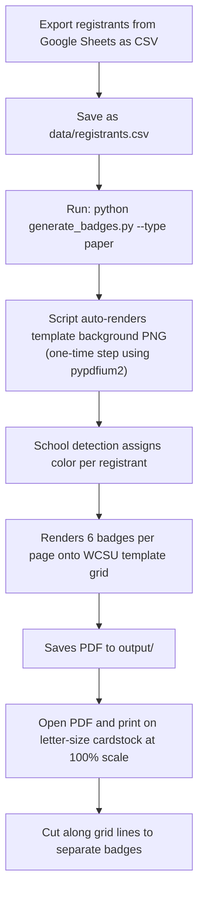
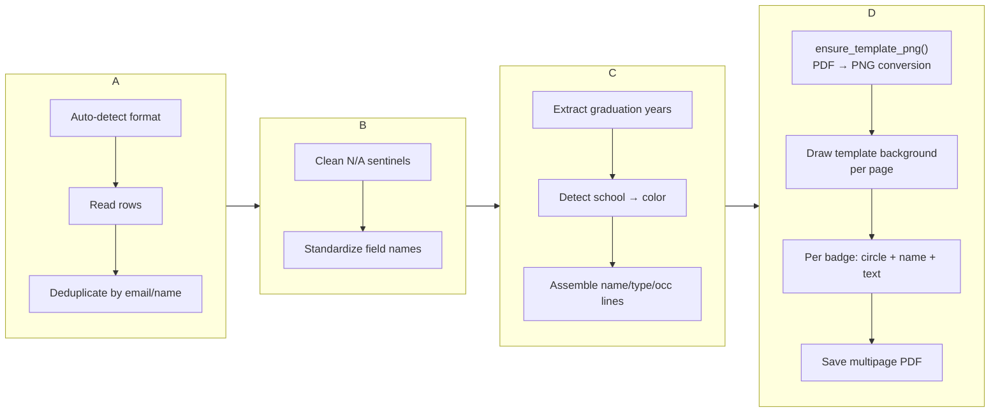

This page walks you through producing **6-up paper name badges** on the official WCSU branded template — a larger, more formal alternative to the adhesive labels. Each sheet holds 6 badges (2 columns × 3 rows) sized 4-1/4" × 3-2/3", designed to print on letter-size cardstock and be cut along the grid lines. The WCSU Alumni Association logo is baked directly into the template background, so every badge arrives pre-branded without any extra setup.

This page assumes you have already completed the environment setup described in [Quick Start: Environment Setup and First Badge Run](2-quick-start-environment-setup-and-first-badge-run). If you haven't installed dependencies or activated your virtual environment yet, start there and come back. For the adhesive workflow (the default format), see [Generating Adhesive Badges from Google Sheets CSV](3-generating-adhesive-badges-from-google-sheets-csv).



## How Paper Badges Differ from Adhesive Badges

Before running the command, it's helpful to understand what makes the paper format distinct. The two formats share the same CSV input and school detection logic, but they differ in layout, visual design, and printing requirements. Here's a side-by-side comparison of what changes when you switch from adhesive to paper:

| Feature | Adhesive (default) | Paper (`--type paper`) |
|---|---|---|
| **Physical media** | Avery 5395 peel-and-stick labels | Letter-size cardstock (65–80 lb) |
| **Badges per sheet** | 8 (2 cols × 4 rows) | 6 (2 cols × 3 rows) |
| **Badge size** | 3-3/8" × 2-1/3" | 4-1/4" × 3-2/3" |
| **School color indicator** | Full-width colored header band | Colored circle |
| **Logo placement** | Drawn by script per badge | Baked into template background |
| **Cutting required** | No — peel and stick | Yes — cut along grid lines |
| **Template source** | `docs/Avery5395AdhesiveNameBadges.pdf` | `template/badge_template.pdf` |
| **Default output filename** | `2026_MeetGreet_NameTags_Adhesive.pdf` | `2026_MeetGreet_NameTags_Paper.pdf` |

The paper format gives you larger badges with more readable text and the WCSU branding already embedded in the background — a good choice for formal events where attendees wear pinned badges rather than adhesive labels. The trade-off is the manual cutting step after printing.

Sources: [generate_badges.py](generate_badges.py#L1-L10), [README.md](README.md#L9-L24)

## Step 1 — Ensure Your CSV Data Is in Place

The paper badge generator reads the exact same CSV data as the adhesive workflow. No changes to your registration export are needed. Place your Google Sheets export as `data/registrants.csv` (or use a custom path with `--csv`). Both CSV formats are supported — the auto-detection logic handles event exports and class rosters identically regardless of badge type.

```
wcsu-badge-generator/
├── data/
│   └── registrants.csv          ← Your registration data goes here
├── template/
│   ├── badge_template.pdf       ← WCSU branded template (already committed)
│   ├── wcsu_aa_logo.png         ← Logo (already committed)
│   └── template_blank.png       ← Auto-generated on first run (gitignored)
├── generate_badges.py           ← The script you'll run
└── output/                      ← Generated PDFs appear here
```

If you've already generated adhesive badges from the same CSV, you don't need to change anything about the data — just add `--type paper` to your command. The CSV column requirements and the school detection algorithm are format-agnostic. For full column details, see [CSV Format Reference: Event Registrant Export vs. Class Roster](8-csv-format-reference-event-registrant-export-vs-class-roster).

Sources: [generate_badges.py](generate_badges.py#L222-L243), [generate_badges.py](generate_badges.py#L774-L778)

## Step 2 — Run the Generator with `--type paper`

With your CSV in place and your virtual environment activated, run the generator with the `--type paper` flag. This single flag is the only difference from the adhesive workflow.

**On Windows (PowerShell):**

```powershell
python generate_badges.py --type paper
```

**On macOS / Linux:**

```bash
python3 generate_badges.py --type paper
```

**Expected console output:**

```
Rendering template from badge_template.pdf (page 1)...
✓ Saved template_blank.png
  registrants.csv: detected format 'event'
  registrants.csv: 175 registrants added
Loaded 175 unique registrants
✓ Generated 29 pages for 175 badges → output/2026_MeetGreet_NameTags_Paper.pdf
```

Here's what each line tells you: on your first paper badge run, the script renders the WCSU template PDF into a PNG background image (a one-time step that takes a few seconds and does not repeat). It then detects your CSV format, loads and deduplicates registrants, and produces a 29-page PDF with 175 badges — 6 per page across 28 full pages plus a partial 29th page. The output is saved to `output/2026_MeetGreet_NameTags_Paper.pdf`.

The first-run template rendering message (`Rendering template from badge_template.pdf...`) only appears when `template/template_blank.png` doesn't exist or is zero bytes. On subsequent runs, the cached PNG is reused. If you ever replace the template PDF with an updated design, simply delete the PNG file — it will regenerate automatically on the next run.

Sources: [generate_badges.py](generate_badges.py#L543-L557), [generate_badges.py](generate_badges.py#L786-L790)

## Step 3 — Understand the Paper Badge Layout

Each paper badge page is a standard US Letter (612 × 792 points). The template background already contains the WCSU Alumni Association logo and the badge grid layout. The script overlays three text elements and one colored circle onto each of the 6 badge positions per page.

Here's the visual structure of each badge cell:

```
┌─────────────────────────────────────────────┐
│           (WCSU AA logo in background)       │
│                                             │
│                  ⬤  ← Colored circle         │
│             (24pt radius, school color)      │
│                                             │
│            First Last '15  ← Name line       │
│          Alumni · School Name  ← Type line   │
│           Occupation Title   ← Occ line      │
│                                             │
└─────────────────────────────────────────────┘
```

The 6 badge slots are arranged in a 2-column × 3-row grid, ordered top-to-bottom then left-to-right:

| Slot | Position | Column center X | Circle center Y | Text baseline Y |
|---|---|---|---|---|
| 0 | Top, Left | 162 pt | 621 pt | 585 pt |
| 1 | Top, Right | 450 pt | 621 pt | 585 pt |
| 2 | Mid, Left | 162 pt | 395 pt | 358 pt |
| 3 | Mid, Right | 450 pt | 395 pt | 358 pt |
| 4 | Bottom, Left | 162 pt | 185 pt | 144 pt |
| 5 | Bottom, Right | 450 pt | 185 pt | 144 pt |

Each badge occupies a cell of 306 × 264 points (exactly half the page width by one-third the page height). The actual badge content area is slightly narrower — approximately 288 points — to account for the template's built-in margins of about 17.7 points on each side. The maximum text width is set to 250 points, giving roughly 28 points of padding within the content area.

Sources: [generate_badges.py](generate_badges.py#L19-L46), [generate_badges.py](generate_badges.py#L388-L442)

## Step 4 — Verify the Output

Open the generated PDF from the `output/` directory. Each page should display 6 paper badges in a 2-column × 3-row grid over the WCSU branded background. Here's what to check on each badge:

| Element | Where it appears | What to look for |
|---|---|---|
| **WCSU AA logo** | Background of entire page | Should be visible in every badge cell, centered in the template |
| **Colored circle** | Upper area of each badge cell | Should match the registrant's WCSU school (orange for Ancell, navy for Arts & Sciences, etc.) |
| **Attendee name** | Bold navy text, below circle | Should include graduation year suffix for alumni (e.g., "Maria Gonzalez '15") |
| **School/type line** | Navy text, below name | Shows format like "Alumni · School of Arts & Sciences" or "Student · Ancell School of Business" |
| **Occupation line** | Dark gray text, bottom area | Shows the job title or organization if provided in the CSV |

If any badges display a **light gray circle** (`#95A5A6`) instead of a school color, it means the school detection algorithm couldn't match the registrant's `Class / Major` field to any WCSU school. This is the `"default"` fallback. To fix these, update the `Class / Major` value in your CSV to include a recognizable keyword and re-run. For troubleshooting guidance, see [Fixing Gray (Unmatched) Badges by Updating CSV Major Fields](25-fixing-gray-unmatched-badges-by-updating-csv-major-fields).

The full color legend for all school assignments is available on [School Color Coding System and Visual Legend](7-school-color-coding-system-and-visual-legend).

Sources: [generate_badges.py](generate_badges.py#L415-L437), [generate_badges.py](generate_badges.py#L86-L94)

## Step 5 — Print and Cut

Paper badges require one extra step compared to adhesive labels — cutting — but they produce a more substantial, professional-looking badge.

1. Open `output/2026_MeetGreet_NameTags_Paper.pdf`
2. Load **letter-size cardstock** (65–80 lb weight recommended) into your printer
3. Print at **100% scale** — do not select "fit to page" or "shrink to fit" in your print dialog, as this will misalign the badges with the template grid
4. Use a paper cutter or scissors to separate the 6 badges along the grid lines

> **Tip:** If you're printing large batches, a guillotine paper cutter is significantly faster than scissors and produces cleaner edges. The template grid lines serve as your cutting guides.

Sources: [README.md](README.md#L367-L373)

## Customizing the Run with Command-Line Flags

The paper badge generator supports all the same command-line flags as the adhesive workflow. Here are the combinations most relevant to paper badge generation:

| Command | What it does |
|---|---|
| `python generate_badges.py --type paper` | Standard paper run with `data/registrants.csv` |
| `python generate_badges.py --type paper --csv "data/custom.csv"` | Use a different CSV file |
| `python generate_badges.py --type paper --name "March25_Paper"` | Custom output filename → `output/March25_Paper.pdf` |
| `python generate_badges.py --type paper --blank` | Generate blank walk-in paper badge sheets (6 pages, one per school) |
| `python generate_badges.py --type paper --csv data/a.csv --csv data/b.csv` | Merge multiple CSV files into one paper PDF |

### Using a custom CSV path

If your registration export has a different filename, use `--csv` to point the script at it:

```bash
python generate_badges.py --type paper --csv "data/March_25_Export.csv"
```

### Merging multiple CSV files

If you have more than one registration list, use multiple `--csv` flags. The script merges all files and deduplicates globally — the same person won't appear twice even if they're listed in multiple files:

```bash
python generate_badges.py --type paper --csv "data/registrants.csv" --csv "data/Class List ACC 306.csv" --name Merged_Paper
```

This produces `output/Merged_Paper.pdf` containing unique registrants from both files. The console output reports per-file counts so you can verify the merge.

### Custom output filename

Use `--name` to give the output PDF a descriptive filename. The file is saved automatically into the `output/` directory:

```bash
python generate_badges.py --type paper --name "March25_Final"
# → output/March25_Final.pdf
```

### Generating blank walk-in paper badge sheets

For attendees who register on-site, generate pre-printed blank paper badges with the colored circle and school label but no name — ready for hand-writing at the registration table. No CSV is needed:

```bash
python generate_badges.py --type paper --blank
```

This produces `output/2026_MeetGreet_Blank_Paper.pdf` — 6 pages with 6 blank badges each (36 total), one page per school color in this order: Ancell (orange) → Arts & Sciences (navy) → Visual & Performing Arts (purple) → Professional Studies (green) → Faculty/Staff (gold) → Community (gray). For the full walkthrough of blank sheet generation, see [Preparing Blank Walk-In Badge Sheets for On-Site Registration](5-preparing-blank-walk-in-badge-sheets-for-on-site-registration).

Sources: [generate_badges.py](generate_badges.py#L654-L791), [generate_badges.py](generate_badges.py#L613-L651)

## What Happens Behind the Scenes

When you run the paper badge command, the script executes a four-stage pipeline that is identical in logic to the adhesive workflow but routes through a different rendering function at the final stage. Understanding this pipeline helps you diagnose issues and know where to look if something needs adjustment.



**Stage 1 — CSV Loading and Deduplication:** The script reads your CSV file(s), detects the format (event export or class roster), normalizes every row into a standard internal dictionary, and deduplicates globally by email address (falling back to first+last name when no email is present). This stage is completely format-agnostic — the same code runs whether you're generating adhesive or paper badges.

**Stage 2 — School Detection:** Each registrant's `Class / Major` and `Community Business/Organization` fields are scanned for keyword matches that assign one of four WCSU school colors, plus special colors for faculty and community guests. For alumni, graduation years like `'15` or `2018` are extracted and appended to the name line. This logic is shared across both badge formats.

**Stage 3 — Badge Data Assembly:** For each registrant, the script constructs a badge data dictionary containing the formatted name line, school/type label, occupation text, and the hex color for the assigned school. This dictionary is the single source of truth that the PDF renderer consumes.

**Stage 4 — PDF Rendering (paper-specific):** This is where the two formats diverge. The `generate_badges_pdf()` function creates a ReportLab canvas sized to US Letter, draws the WCSU template background image (a pre-rendered PNG from `template/badge_template.pdf`), and fills each of the 6 badge slots with a colored circle (24pt radius with a dark stroke), the attendee name in bold navy Helvetica (auto-scaled from 14pt down to 8pt to fit), a school/type line, and an occupation line. Pages are accumulated until all badges are placed, then the PDF is saved.

Sources: [generate_badges.py](generate_badges.py#L302-L385), [generate_badges.py](generate_badges.py#L388-L442), [generate_badges.py](generate_badges.py#L543-L557)

## One-Time Template Rendering Explained

On your first run with `--type paper`, you'll notice an extra message in the console:

```
Rendering template from badge_template.pdf (page 1)...
✓ Saved template_blank.png
```

This is the `ensure_template_png()` function at work. It converts the committed source PDF (`template/badge_template.pdf`) into a high-resolution PNG image (`template/template_blank.png`) at 3× scale using the **pypdfium2** library. This PNG is then drawn as the full-page background on every output page.

The function performs a safety check before rendering: it verifies that the PNG file both exists and has a non-zero file size. If either check fails, it re-renders from the source PDF. This means if you accidentally delete `template_blank.png` or if the file gets corrupted, it will regenerate automatically on the next run without any manual intervention.

The caching behavior has an important practical benefit: if you update the WCSU template design in the future (by replacing `template/badge_template.pdf` with a new version), simply delete `template/template_blank.png` and re-run the generator — the new design will be picked up automatically. No code changes needed.

Sources: [generate_badges.py](generate_badges.py#L543-L557), [CLAUDE.md](CLAUDE.md#L31-L51)

## Next Steps

Now that you know how to generate paper badges, here are the logical next pages to explore based on what you need:

- **[Understanding the Two Badge Formats: Avery 5395 Adhesive vs. WCSU Paper Template](6-understanding-the-two-badge-formats-avery-5395-adhesive-vs-wcsu-paper-template)** — a deeper architectural comparison of both formats, including coordinate systems and design rationale
- **[WCSU Paper Badge Layout: 6-Up Grid, Colored Circles, and Template Background](16-wcsu-paper-badge-layout-6-up-grid-colored-circles-and-template-background)** — the full technical specification of the paper layout for anyone who needs to modify positioning or sizing
- **[Preparing Blank Walk-In Badge Sheets for On-Site Registration](5-preparing-blank-walk-in-badge-sheets-for-on-site-registration)** — how to generate pre-printed blank paper badges for walk-in attendees
- **[Print Day Guide: Media Selection, Scale Settings, and Per-Sheet Counts](27-print-day-guide-media-selection-scale-settings-and-per-sheet-counts)** — everything you need to know for printing day, including media recommendations and troubleshooting print alignment