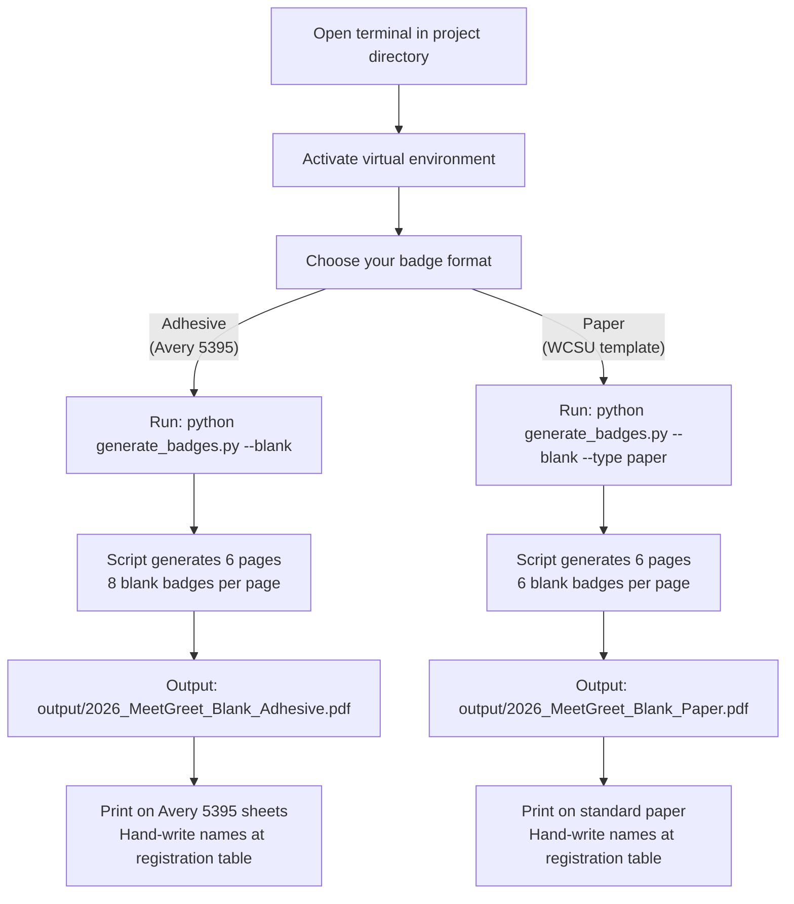
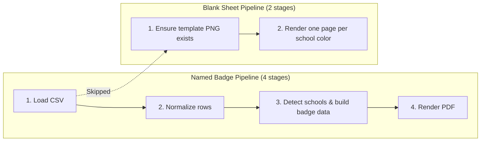

Not every attendee registers in advance. At any WCSU Alumni Association event, a handful of guests will walk in on the day — alumni who forgot to RSVP, faculty members who heard about the event that morning, or community members attending on a colleague's invitation. Rather than turning these guests away or handwriting badges on loose paper, the badge generator includes a **blank sheet mode** that pre-prints color-coded badge templates with the school identifier and logo already in place, leaving only the attendee's name to be filled in by hand at the registration table. This page walks you through generating those blank sheets in both badge formats.

This page assumes you have already completed the environment setup described in [Quick Start: Environment Setup and First Badge Run](2-quick-start-environment-setup-and-first-badge-run). If you haven't installed dependencies or activated your virtual environment yet, start there and come back.



## What Blank Walk-In Sheets Look Like

Blank sheets are print-ready PDFs where every badge slot is pre-decorated with the visual elements that normally require the generator's full pipeline — colored school indicators, the event title, the WCSU Alumni Association logo, and the school name label — but with the **attendee name area left empty** for hand-writing. The generator produces exactly **one page per WCSU school category**, giving your registration volunteers a pre-sorted stack they can flip through when a walk-in arrives.

There are two blank sheet variants, matching the two badge formats:

| Feature | Adhesive Blank Sheets | Paper Blank Sheets |
|---|---|---|
| **Badge format** | Avery 5395 peel-and-stick labels | WCSU branded paper template |
| **Badges per page** | 8 (2 columns × 4 rows) | 6 (2 columns × 3 rows) |
| **School indicator** | Full-width colored header band (52pt) | Colored circle with dark border |
| **Event text** | "Meet & Greet 2026" in white | None (event title is on template background) |
| **Logo** | WCSU Alumni Association logo below header | Already part of template background |
| **School label** | Printed below logo in navy text | Printed below circle in navy text |
| **Name area** | Blank white space in header band | Blank white space below circle |
| **Total pages generated** | 6 (one per school) | 6 (one per school) |

Each page is dedicated to a single school color. This means your registration volunteers can grab the correct sheet based on the walk-in attendee's affiliation — the Ancell page for business alumni, the Arts & Sciences page for biology graduates, and so on — without any guesswork about which color to use.

Sources: [generate_badges.py](generate_badges.py#L559-L611), [generate_badges.py](generate_badges.py#L613-L651)

## The Six School Categories in a Blank Sheet Set

The blank sheet generator uses a fixed ordered list of six school categories defined in `SCHOOLS_ORDERED`. This list intentionally **excludes the `"default"` (light gray) category** — walk-in sheets only cover the six real WCSU affiliations that registration volunteers would actually assign. The pages are generated in this consistent order, so the first page is always Ancell orange and the last page is always community gray.

| Page order | School key | School name | Color | Hex code | Who it's for |
|---|---|---|---|---|---|
| 1 | `ancell` | Ancell School of Business | Orange | `#E8702A` | Business, accounting, finance, MBA alumni |
| 2 | `arts` | School of Arts & Sciences | Navy | `#1B3A6B` | Biology, chemistry, nursing, psychology, CS alumni |
| 3 | `visual` | School of Visual & Performing Arts | Purple | `#8E44AD` | Graphic design, theater, music, film alumni |
| 4 | `professional` | School of Professional Studies | Forest Green | `#27AE60` | Education, counseling, health administration alumni |
| 5 | `faculty` | Faculty / Staff | Dark Gold | `#D4AC0D` | WCSU faculty and staff members |
| 6 | `community` | Community Guest | Gray | `#7F8C8D` | Non-WCSU guests, family members, vendors |

This ordering matters because it determines the page sequence in the output PDF. If you print the entire PDF double-sided, the Ancell sheet will be on the first page and the Community sheet on the last page — a predictable layout that makes it easy for volunteers to find the right sheet quickly.

Sources: [generate_badges.py](generate_badges.py#L106-L115)

## Generating Blank Adhesive Sheets (Default)

The adhesive format is the default for blank sheet generation, matching the default behavior for named badges. Each page produces 8 blank Avery 5395 badges on the standard 2×4 grid, with the colored school header band, "Meet & Greet 2026" text, WCSU AA logo, and school label pre-printed.

With your virtual environment activated, run:

```powershell
# Windows (PowerShell)
python generate_badges.py --blank
```

```bash
# macOS / Linux
python3 generate_badges.py --blank
```

**Expected console output:**

```
✓ Generated 6 pages of blank adhesive badges → output/2026_MeetGreet_Blank_Adhesive.pdf
```

The output is saved automatically to `output/2026_MeetGreet_Blank_Adhesive.pdf`. If the Avery template background PNG (`template/avery_blank.png`) doesn't exist yet, the script will render it first from `docs/Avery5395AdhesiveNameBadges.pdf` — this is the same one-time step that occurs on the first named badge run, described in [Template Auto-Rendering: PDF-to-PNG Conversion via pypdfium2](14-template-auto-rendering-pdf-to-png-conversion-via-pypdfium2).

**What each blank adhesive badge contains:**

```
┌──────────────────────────────────────┐
│  ████████████████████████████████████│  ← School-color header band (52pt)
│  ████  Meet & Greet 2026  (white) ████│
│  ████  [blank — write name here] ████│
│  ████████████████████████████████████│
│                                      │
│         [WCSU AA Logo]               │  ← 185×54pt, centered
│                                      │
│      Ancell School of Business       │  ← Navy text, 10pt
│                                      │
└──────────────────────────────────────┘
```

The name field area inside the colored header band is completely empty, providing a white surface for volunteers to write the walk-in attendee's name with a marker or pen. The school label beneath the logo confirms which affiliation the badge represents, so volunteers can verify they grabbed the correct sheet.

Sources: [generate_badges.py](generate_badges.py#L560-L610), [generate_badges.py](generate_badges.py#L761-L768)

## Generating Blank Paper Sheets

The paper format produces blank badges on the WCSU branded template background. Each page holds 6 badges (2 columns × 3 rows), with the colored school circle and school label pre-printed. The template background already includes the WCSU Alumni Association logo, so it doesn't need to be drawn separately.

Add the `--type paper` flag alongside `--blank`:

```powershell
# Windows (PowerShell)
python generate_badges.py --blank --type paper
```

```bash
# macOS / Linux
python3 generate_badges.py --blank --type paper
```

**Expected console output:**

```
✓ Generated 6 pages of blank paper badges → output/2026_MeetGreet_Blank_Paper.pdf
```

**What each blank paper badge contains:**

```
┌────────────────────────────────┐
│   [WCSU AA Logo — on template] │
│                                │
│         ┌─────┐                │
│         │ ●   │ ← Colored      │
│         │circle│   circle with │
│         └─────┘   dark border  │
│                                │
│     [blank — write name here]  │
│                                │
│   Ancell School of Business    │  ← Navy text, 10pt
│                                │
└────────────────────────────────┘
```

The school label is positioned 20pt below where the first text line would normally appear, leaving generous space above for hand-writing the attendee's name directly below the colored circle.

Sources: [generate_badges.py](generate_badges.py#L613-L651), [generate_badges.py](generate_badges.py#L769-L773)

## Customizing the Output Filename

By default, blank sheets are saved with descriptive filenames that include the format and mode:

| Mode | Default filename |
|---|---|
| Blank adhesive | `output/2026_MeetGreet_Blank_Adhesive.pdf` |
| Blank paper | `output/2026_MeetGreet_Blank_Paper.pdf` |

Use `--name` to assign a custom filename (saved automatically to the `output/` directory):

```bash
python generate_badges.py --blank --name "WalkIn_Badges"
# → output/WalkIn_Badges.pdf
```

Use `--output` to specify a complete path outside the project:

```bash
python generate_badges.py --blank --output "C:\Users\chady\Desktop\Blank_Badges.pdf"
```

These flags work identically for both adhesive and paper formats, and they follow the same resolution priority as named badge generation: `--name` takes precedence over `--output` only in the sense that `--output` overrides `--name` if both are provided. In practice, you'll use one or the other, not both.

Sources: [generate_badges.py](generate_badges.py#L740-L756), [generate_badges.py](generate_badges.py#L723-L733)

## Complete Command Reference for Blank Sheets

All flag combinations for blank sheet generation are summarized below. No CSV file is needed regardless of which flags you use — the `--blank` flag bypasses the entire CSV loading pipeline.

| Command | Format | Output location |
|---|---|---|
| `python generate_badges.py --blank` | Adhesive (default) | `output/2026_MeetGreet_Blank_Adhesive.pdf` |
| `python generate_badges.py --blank --type paper` | Paper | `output/2026_MeetGreet_Blank_Paper.pdf` |
| `python generate_badges.py --blank --name WalkIn` | Adhesive + custom name | `output/WalkIn.pdf` |
| `python generate_badges.py --blank --type paper --name WalkIn` | Paper + custom name | `output/WalkIn.pdf` |
| `python generate_badges.py --blank --output C:\path\to\file.pdf` | Adhesive + custom path | `C:\path\to\file.pdf` |

A few things to note about how the `--blank` flag interacts with other flags: the `--csv` flag is **ignored** when `--blank` is active (blank sheets don't need registrant data), and the `--type` flag selects the badge format exactly as it does for named badges. The `--blank` flag is a simple boolean switch — there are no additional parameters or modes to configure.

Sources: [generate_badges.py](generate_badges.py#L723-L733), [generate_badges.py](generate_badges.py#L761-L773)

## How the Blank Sheet Pipeline Differs from Named Badges

Understanding what the `--blank` flag skips helps clarify why no CSV is needed and why the process is faster. The named badge pipeline has four stages — CSV loading, row normalization, school detection, and PDF rendering. The blank sheet pipeline skips the first three entirely and goes straight to rendering.



The blank pipeline uses `SCHOOLS_ORDERED` — a hardcoded list of `(key, color, label)` tuples — instead of running the keyword-based school detection algorithm. Each tuple directly provides the hex color and display label needed to draw the header band or circle, so there's no CSV parsing, no N/A sentinel cleaning, no deduplication, and no graduation year extraction. The only shared step is `ensure_template_png()`, which renders the background PNG from the source PDF if it doesn't already exist. This is the same auto-rendering step described in [Template Auto-Rendering: PDF-to-PNG Conversion via pypdfium2](14-template-auto-rendering-pdf-to-png-conversion-via-pypdfium2).

Sources: [generate_badges.py](generate_badges.py#L106-L115), [generate_badges.py](generate_badges.py#L542-L557)

## Printing and Using Blank Sheets at Your Event

Once you have the blank PDF, print it on the appropriate media for your chosen format. For adhesive badges, use Avery 5395 label sheets; for paper badges, use standard US Letter (8.5" × 11") paper. Detailed printing instructions including scale settings and per-sheet badge counts are covered in [Print Day Guide: Media Selection, Scale Settings, and Per-Sheet Counts](27-print-day-guide-media-selection-scale-settings-and-per-sheet-counts).

For the registration table setup, keep these tips in mind:

| Tip | Details |
|---|---|
| **Print extras** | Print 2–3 full sets (12–18 pages) so you don't run out of any school color |
| **Organize by school** | Separate the 6 pages into labeled dividers or folders for quick access |
| **Use permanent markers** | Fine-tip Sharpies or similar markers write cleanly on both adhesive and paper surfaces |
| **Pre-label divider tabs** | Mark each divider with the school name and color swatch for volunteer reference |
| **Stash a backup set** | Keep a sealed backup set in case the main supply is damaged or depleted |

The six-page structure means you can quickly identify which sheet to pull when a walk-in arrives. For example, if a guest says "I graduated from the business school," the volunteer reaches for the orange (Ancell) page, peels off a badge, writes the name, and hands it over — the entire process takes under 30 seconds.

Sources: [generate_badges.py](generate_badges.py#L559-L651), [CLAUDE.md](CLAUDE.md#L63-L68)

## Next Steps

Now that you can generate both named and blank badge sheets, here are logical next pages to explore based on your needs:

- **Choose your badge format wisely** — If you haven't decided between adhesive and paper, [Understanding the Two Badge Formats: Avery 5395 Adhesive vs. WCSU Paper Template](6-understanding-the-two-badge-formats-avery-5395-adhesive-vs-wcsu-paper-template) compares them side-by-side.
- **Fix unmatched school colors** — If some of your named badges appear in the wrong color or gray, [School Color Coding System and Visual Legend](7-school-color-coding-system-and-visual-legend) explains the full color mapping and [Fixing Gray (Unmatched) Badges by Updating CSV Major Fields](25-fixing-gray-unmatched-badges-by-updating-csv-major-fields) shows how to resolve them.
- **Dive deeper into the pipeline** — To understand exactly how the school detection engine works, see [Keyword-Based School Assignment Algorithm and Priority Rules](11-keyword-based-school-assignment-algorithm-and-priority-rules).
- **Prepare for print day** — When it's time to produce the final output, [Print Day Guide: Media Selection, Scale Settings, and Per-Sheet Counts](27-print-day-guide-media-selection-scale-settings-and-per-sheet-counts) covers everything you need to know about physical printing.