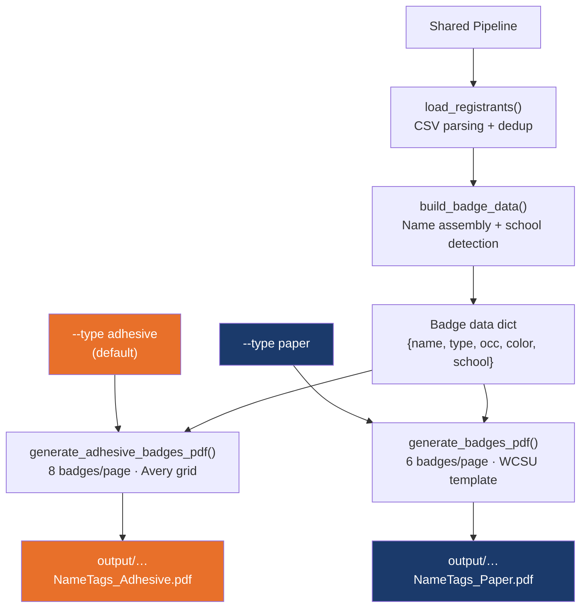
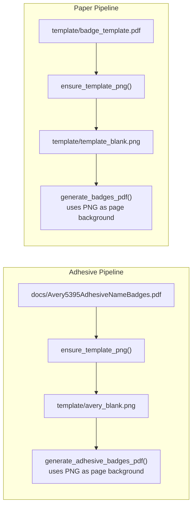
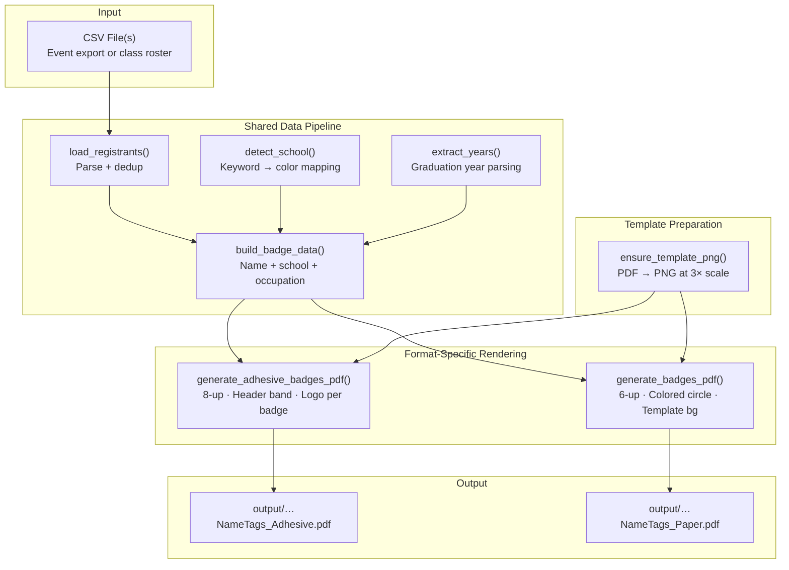

This badge generator produces two completely different print-ready badge formats from the same underlying CSV data. Each format has its own grid layout, visual design language, rendering function, and physical printing requirements. Understanding how they differ — and how they share common plumbing — is the key to confidently choosing the right format for any event scenario.

## The Two Formats at a Glance

Before diving into internals, here is the essential question every user asks first: **which format should I use?** The answer depends entirely on your event logistics — specifically, whether you want to peel-and-stick convenience or prefer a larger, more prominent paper badge.

| Feature | Avery 5395 Adhesive (default) | WCSU Paper Template |
|---|---|---|
| **CLI flag** | `--type adhesive` (or omit) | `--type paper` |
| **Labels per sheet** | 8 (2 columns × 4 rows) | 6 (2 columns × 3 rows) |
| **Individual badge size** | 3-3/8" × 2-1/3" (243 × 168 pt) | 4-1/4" × 3-2/3" (306 × 264 pt) |
| **Printing media** | Avery 5395 adhesive label sheets | Letter-size cardstock |
| **Post-print step** | Peel and stick onto clothing | Cut along template grid lines |
| **School color display** | Full-width colored header band at top | Colored circle with dark border |
| **Logo placement** | Per-badge WCSU AA logo (185×54 pt) | Embedded in template background |
| **Template source** | `docs/Avery5395AdhesiveNameBadges.pdf` | `template/badge_template.pdf` |
| **Rendering function** | `generate_adhesive_badges_pdf()` | `generate_badges_pdf()` |
| **Max text width** | 218 pt | 250 pt |
| **Best for** | High-volume events, quick check-in | Formal events, larger readable badges |

Sources: [generate_badges.py](generate_badges.py#L1-L83), [generate_badges.py](generate_badges.py#L446-L539), [generate_badges.py](generate_badges.py#L388-L442)

## How Format Selection Works in the CLI

Both formats consume the same CSV data and share the entire data pipeline — CSV loading, deduplication, school detection, name assembly, and badge data construction. The **only point of divergence** is the rendering stage, triggered by the `--type` flag. This is a classic strategy pattern: the upstream logic stays identical, and only the final drawing function changes.



The `--type` argument is parsed in the `__main__` block and resolves to one of two rendering paths. When `adhesive` is selected (lines 780–785), the system renders the Avery template background from `docs/Avery5395AdhesiveNameBadges.pdf`, loads the WCSU AA logo, and calls `generate_adhesive_badges_pdf()`. When `paper` is selected (lines 786–790), it renders the WCSU template from `template/badge_template.pdf` and calls `generate_badges_pdf()`. Both paths also support blank walk-in badge generation via the `--blank` flag, which routes to `generate_blank_adhesive_pdf()` or `generate_blank_paper_pdf()` respectively.

Sources: [generate_badges.py](generate_badges.py#L706-L713), [generate_badges.py](generate_badges.py#L761-L791)

## Adhesive Format: Inside the 8-Up Avery 5395 Layout

The Avery 5395 adhesive format is designed to print directly onto commercially available label sheets ([Avery 5395](https://www.avery.com/templates/5395)). Each sheet holds **8 labels** arranged in a 2×4 grid. The individual label dimensions are precisely 3-3/8" × 2-1/3" (243 × 167.976 PDF points). The grid coordinates were extracted directly from the PDF template using measurement tools — this is why they appear as precise decimal values rather than round numbers.

### Visual Structure of a Single Adhesive Badge

Each adhesive badge is divided into two horizontal zones: a **colored header band** at the top and a **white content area** below.

```
┌──────────────────────────────────────┐
│  ████ School Color Header (52pt) ████│  ← "Meet & Greet 2026" (white, 9pt)
│                                      │  ← Attendee name (white bold, ~15pt)
├──────────────────────────────────────┤
│                                      │
│       [WCSU AA Logo 185×54pt]        │  ← Centered in white area
│                                      │
│   Student · Ancell School of Business│  ← 11pt navy text
│   Senior Accountant                  │  ← 10pt dark gray text
│                                      │
└──────────────────────────────────────┘
```

The header band spans the full width of the badge cell and uses the attendee's **school color** as its fill. All text within the header is white — the event title "Meet & Greet 2026" at 9pt and the attendee's name in bold at approximately 15pt (auto-scaled down if the name is long). Below the colored band, the WCSU Alumni Association logo appears centered, followed by the school/registration-type line and occupation title.

Sources: [generate_badges.py](generate_badges.py#L446-L539), [generate_badges.py](generate_badges.py#L62-L83)

### Grid Coordinate System

The `AVERY_SLOTS` list defines 8 position dictionaries, each containing `cx` (horizontal center) and `cell_top` (top edge of the badge cell, in ReportLab's bottom-left coordinate system). The slots are ordered top-to-bottom, left-to-right — matching the physical order on the label sheet.

| Position | Column | `cx` (pt) | `cell_top` (pt) |
|---|---|---|---|
| Row 0, Col 0 | Left | 171 | 751.5 |
| Row 0, Col 1 | Right | 441 | 751.5 |
| Row 1, Col 0 | Left | 171 | 570.05 |
| Row 1, Col 1 | Right | 441 | 570.05 |
| Row 2, Col 0 | Left | 171 | 388.55 |
| Row 2, Col 1 | Right | 441 | 388.55 |
| Row 3, Col 0 | Left | 171 | 207.1 |
| Row 3, Col 1 | Right | 441 | 207.1 |

Sources: [generate_badges.py](generate_badges.py#L74-L83)

## Paper Format: Inside the 6-Up WCSU Template Layout

The paper format uses a **pre-branded WCSU template** that includes the university's visual identity directly in the background. Each sheet holds **6 badges** in a 2×3 grid. Each badge cell is 306 × 264 pt (approximately 4-1/4" × 3-2/3"), noticeably larger than the adhesive badges — which means more room for text and a more prominent visual presence when worn.

### Visual Structure of a Single Paper Badge

Unlike the adhesive format, the paper badge places its school color inside a **circle** rather than a header band. The template background already contains the WCSU Alumni Association logo, so no per-badge logo drawing is needed.

```
┌──────────────────────────────────────┐
│                                      │
│              ◉ (color circle)        │  ← 24pt radius, dark border
│                                      │
│         First Last '98              │  ← Navy, bold, 14pt max
│   Student · School of Arts & Sciences│  ← Navy, 12pt
│   Senior Accountant                  │  ← Dark gray, 11pt
│                                      │
│    [WCSU AA Logo in template bg]     │
│                                      │
└──────────────────────────────────────┘
```

The colored circle (24pt radius with a 1.5pt dark stroke) sits above the text block and serves as the school-color indicator. The name appears in navy bold, the school/type line in navy regular, and the occupation in dark gray — all centered within the badge cell.

Sources: [generate_badges.py](generate_badges.py#L388-L442), [generate_badges.py](generate_badges.py#L33-L46)

### Grid Coordinate System

The `BADGE_SLOTS` list defines 6 position dictionaries with three values each: `cx` (horizontal center), `cy` (vertical center of the colored circle), and `text_top_rl` (baseline for the first text line below the circle). Note that rows are numbered bottom-up in the source code (row 0 = bottom, row 2 = top) but the physical reading order is top-to-bottom.

| Position | Column | `cx` (pt) | `cy` (pt) | `text_top_rl` (pt) |
|---|---|---|---|---|
| Top, Left | Left | 162 | 621 | 585 |
| Top, Right | Right | 450 | 621 | 585 |
| Mid, Left | Left | 162 | 395 | 358 |
| Mid, Right | Right | 450 | 395 | 358 |
| Bot, Left | Left | 162 | 185 | 144 |
| Bot, Right | Right | 450 | 185 | 144 |

Sources: [generate_badges.py](generate_badges.py#L33-L46)

## The Template Rendering Pipeline

Both formats share an identical template preparation step. Before any badges are drawn, the system must produce a high-resolution PNG image of the blank template sheet. This is handled by `ensure_template_png()`, which uses the `pypdfium2` library to render a source PDF page at 3× scale (for crisp output) and saves it as a PNG file.



The function performs a simple existence-and-size check: if the PNG already exists and is not zero bytes, it skips rendering entirely. This means the conversion only happens once per clone — on first run. If you ever need to update the template, simply replace the source PDF and delete the corresponding PNG; it will regenerate automatically on the next run.

| Format | Source PDF | Output PNG | Cached at |
|---|---|---|---|
| Adhesive | `docs/Avery5395AdhesiveNameBadges.pdf` | `template/avery_blank.png` | `gitignored` |
| Paper | `template/badge_template.pdf` | `template/template_blank.png` | `gitignored` |

Sources: [generate_badges.py](generate_badges.py#L543-L557), [generate_badges.py](generate_badges.py#L762-L773)

## How School Colors Appear in Each Format

Both formats use the exact same `SCHOOL_COLORS` dictionary and the same `detect_school()` algorithm to determine which color an attendee receives. The difference is purely visual — **how** that color is displayed on the badge.

In the **adhesive format**, the school color fills a full-width rectangular header band (52pt tall) at the top of each badge. The name and event title are rendered in white text directly on top of this band. This creates a bold, high-contrast color stripe that is immediately visible even from a distance.

In the **paper format**, the school color fills a circular badge (24pt radius) positioned above the text block. The circle has a thin dark stroke border. This is a subtler, more refined visual treatment that complements the pre-branded template background.

For attendees whose school cannot be determined from their CSV data, the `default` color (`#95A5A6`, light gray) is used. Both formats display this identically to any other school color — the gray header band or gray circle signals "unmatched" and serves as a visual cue that the CSV's `Class / Major` field may need updating.

Sources: [generate_badges.py](generate_badges.py#L86-L94), [generate_badges.py](generate_badges.py#L141-L172), [generate_badges.py](generate_badges.py#L416-L419), [generate_badges.py](generate_badges.py#L488-L491)

## Shared vs. Format-Specific Layout Constants

A critical architectural observation: the two formats use **completely independent** sets of layout constants. There is no shared sizing between them. Understanding which constants belong to which format prevents confusion when customizing layouts.

| Constant | Format | Value | Purpose |
|---|---|---|---|
| `CELL_W` / `CELL_H` | Paper | 306 / 264 pt | Badge cell dimensions |
| `CIRCLE_R` | Paper | 24 pt | School-color circle radius |
| `TEXT_AREA_WIDTH` | Paper | 250 pt | Max text width within badge |
| `LINE_LEADING` | Paper | 20 pt | Vertical spacing between text lines |
| `BADGE_SLOTS` | Paper | 6 entries | Circle center + text baseline positions |
| `AVERY_BADGE_W` / `AVERY_BADGE_H` | Adhesive | 243 / 167.976 pt | Badge cell dimensions |
| `AVERY_HEADER_H` | Adhesive | 52 pt | Colored header band height |
| `AVERY_TEXT_W` | Adhesive | 218 pt | Max text width within badge |
| `AVERY_LOGO_W` / `AVERY_LOGO_H` | Adhesive | 185 / 53.8 pt | Logo dimensions per badge |
| `AVERY_SLOTS` | Adhesive | 8 entries | Cell center + top-edge positions |

All of these constants are defined at the top of [generate_badges.py](generate_badges.py) and can be modified for customization — see [Adjusting Layout Constants: Font Sizes, Circle Radius, and Line Spacing](23-adjusting-layout-constants-font-sizes-circle-radius-and-line-spacing) for guidance.

Sources: [generate_badges.py](generate_badges.py#L18-L83), [generate_badges.py](generate_badges.py#L62-L70)

## Blank Walk-In Sheets: Same Two Formats, No Names

Both formats support a **blank badge mode** activated with the `--blank` CLI flag. This generates one full page per school color (6 pages total, covering all real school categories) with the visual branding intact but no attendee names — the name area is left empty for hand-writing at the registration desk.

In adhesive blank mode, each badge still shows the colored header band, the "Meet & Greet 2026" title, and the WCSU AA logo, with the school label printed below the logo instead of a name. In paper blank mode, each badge shows the colored circle and the school label below the text area. Both are essential for handling unexpected walk-in attendees.

Sources: [generate_badges.py](generate_badges.py#L559-L651), [generate_badges.py](generate_badges.py#L723-L733)

## Putting It All Together

The following diagram shows how every component fits together, from CSV input through shared data construction to format-specific rendering:



Sources: [generate_badges.py](generate_badges.py#L338-L385), [generate_badges.py](generate_badges.py#L543-L557)

## Next Steps

Now that you understand the architectural distinction between the two formats, you can explore any of these related topics based on your needs:

- **To generate your first adhesive badges**: [Generating Adhesive Badges from Google Sheets CSV](3-generating-adhesive-badges-from-google-sheets-csv)
- **To generate paper badges instead**: [Generating Paper Badges on WCSU Branded Template](4-generating-paper-badges-on-wcsu-branded-template)
- **To prepare hand-write blanks for walk-ins**: [Preparing Blank Walk-In Badge Sheets for On-Site Registration](5-preparing-blank-walk-in-badge-sheets-for-on-site-registration)
- **To understand how school colors are assigned**: [School Color Coding System and Visual Legend](7-school-color-coding-system-and-visual-legend)
- **To customize layout sizes and spacing**: [Adjusting Layout Constants: Font Sizes, Circle Radius, and Line Spacing](23-adjusting-layout-constants-font-sizes-circle-radius-and-line-spacing)
- **To see the detailed adhesive grid math**: [Avery 5395 Adhesive Badge Layout: 8-Up Grid Coordinates and Header Band Design](15-avery-5395-adhesive-badge-layout-8-up-grid-coordinates-and-header-band-design)
- **To see the detailed paper grid math**: [WCSU Paper Badge Layout: 6-Up Grid, Colored Circles, and Template Background](16-wcsu-paper-badge-layout-6-up-grid-colored-circles-and-template-background)