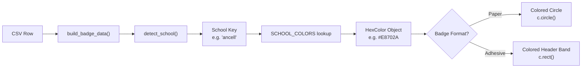
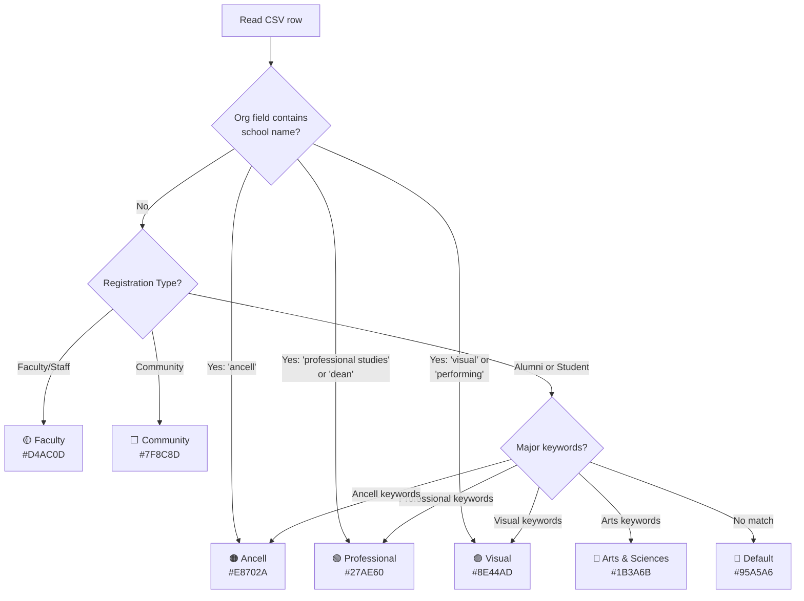

Every badge generated by this project carries a color that communicates the attendee's WCSU school affiliation at a glance. Whether you see an orange circle on a paper badge or a colored header band on an adhesive label, that color was chosen by a deterministic detection engine inside `generate_badges.py`. This page explains the complete color system: which colors map to which schools, how those colors appear on each badge format, and where the visual legend images live in the repository.

## The Seven School Colors

The color system is defined in a single Python dictionary called `SCHOOL_COLORS`, which maps a short string key to a ReportLab `HexColor` object. There are seven entries in total: four academic schools, two non-academic attendee categories, and one fallback for unmatched records.

Sources: [generate_badges.py](generate_badges.py#L86-L94)

| Key | Full Name | Hex Code | Visual Color | Category |
|---|---|---|---|---|
| `ancell` | Ancell School of Business | `#E8702A` | 🟠 Orange | Academic school |
| `arts` | School of Arts & Sciences | `#1B3A6B` | 🔵 Navy | Academic school |
| `visual` | School of Visual & Performing Arts | `#8E44AD` | 🟣 Purple | Academic school |
| `professional` | School of Professional Studies | `#27AE60` | 🟢 Forest Green | Academic school |
| `faculty` | Faculty / Staff | `#D4AC0D` | 🟡 Dark Gold | Non-academic |
| `community` | Community Guest | `#7F8C8D` | ⬜ Gray | Non-academic |
| `default` | *(no label)* | `#95A5A6` | 🔘 Light Gray | Fallback |

A companion dictionary, `SCHOOL_LABELS`, stores the human-readable school name for each key. The `default` key maps to an empty string because unmatched badges intentionally show no school label — just the light gray color as a silent signal that the major field didn't match any keyword list.

Sources: [generate_badges.py](generate_badges.py#L96-L104)

### Why "default" Is Not the Same as "community"

It's easy to confuse `community` and `default` since both produce grayish badges, but they are triggered by completely different conditions. The **community** color (`#7F8C8D`, medium gray) is assigned when the registration type column explicitly says `"Community"` — the attendee is a known community guest. The **default** color (`#95A5A6`, light gray) is a safety net for Alumni or Student records whose `Class / Major` field contains no recognizable keyword. If you spot a light gray badge in your output, it means the detection engine couldn't determine which school that person belongs to, and you should review their CSV row. See [Fixing Gray (Unmatched) Badges by Updating CSV Major Fields](25-fixing-gray-unmatched-badges-by-updating-csv-major-fields) for troubleshooting steps.

Sources: [generate_badges.py](generate_badges.py#L141-L172)

## How Colors Flow from Detection to PDF

The color for each badge is determined through a three-stage pipeline: detection, lookup, and rendering. Understanding this pipeline demystifies why a particular badge ends up a certain color and where to intervene if you want to change it.



**Stage 1 — Detection.** The `detect_school()` function receives the registrant's `Class / Major`, `Community Business/Organization`, and `Registration Options` values. It checks for explicit organizational matches first (like `"ancell"` appearing in the organization field), then registration type routing (Faculty/Staff or Community), and finally keyword matching against the major text. If nothing matches, it returns the string `"default"`.

Sources: [generate_badges.py](generate_badges.py#L141-L172)

**Stage 2 — Lookup.** Inside `build_badge_data()`, the school key returned by `detect_school()` is used to fetch both the color and the label from their respective dictionaries: `color = SCHOOL_COLORS.get(school, SCHOOL_COLORS["default"])`. The `.get()` with a fallback ensures that even if an unexpected key somehow slips through, the badge still renders in the default light gray rather than crashing.

Sources: [generate_badges.py](generate_badges.py#L359-L361)

**Stage 3 — Rendering.** The resolved `color` object is then drawn onto the PDF. The rendering method differs between the two badge formats, but the color object itself is identical regardless of format. This means changing a hex value in `SCHOOL_COLORS` affects both paper and adhesive output simultaneously.

Sources: [generate_badges.py](generate_badges.py#L416-L419)

## How Colors Appear on Each Badge Format

The same school color is expressed differently depending on which badge format you selected. This is a deliberate design choice: each format has different visual real estate, so the color is applied where it makes the strongest visual impact.

### Paper Badges — Colored Circle

On the WCSU paper template, each badge has a **filled circle** (24-point radius) positioned above the attendee's name. The circle is filled with the school color and outlined with a dark stroke (`#1a1a1a`, 1.5pt width). The result is a bold, unmistakable color indicator that works well at conversational distance.

Sources: [generate_badges.py](generate_badges.py#L415-L419)

### Adhesive Badges — Colored Header Band

On Avery 5395 adhesive labels, the color fills a **full-width header band** (52pt tall) at the top of each badge cell. All text inside the band — the event title "Meet & Greet 2026" and the attendee's name — is rendered in white, creating high contrast against the colored background. Below the band, the school and occupation text appears in standard dark colors.

Sources: [generate_badges.py](generate_badges.py#L488-L501)

| Element | Paper Badge (6-up) | Adhesive Badge (8-up) |
|---|---|---|
| **Color element** | Filled circle (24pt radius) | Full-width header band (52pt tall) |
| **Color fill** | School hex color | School hex color |
| **Outline/stroke** | `#1a1a1a`, 1.5pt | None (edge-to-edge) |
| **Text inside color** | None | White (event title + name) |
| **Text below color** | Name, school, occupation | Logo, school, occupation |

## Visual Legend Images in the Repository

The project includes pre-rendered legend images in the `docs/` directory. These are static PNG files — they are **not** generated by the Python script. They serve as quick visual references for event organizers checking printouts or verifying color assignments.

Sources: [CLAUDE.md](CLAUDE.md#L24)

| File | Description |
|---|---|
| [docs/badge_color_legend.png](docs/badge_color_legend.png) | Legend showing all six school colors as **colored circles** (matching the paper badge style) |
| [docs/badge_color_legend_adhesive.png](docs/badge_color_legend_adhesive.png) | Legend showing all six school colors as **header bands** (matching the adhesive badge style) |

Note that both legend images display only six colors — the four academic schools plus Faculty and Community. The `default` (light gray) fallback is intentionally excluded from the legend because it represents a data quality issue rather than a real attendee category.

## Blank Walk-In Sheets and the Ordered School List

When you generate blank walk-in sheets using the `--blank` flag, the script produces one page per school color. The order of these pages is controlled by a separate constant, `SCHOOLS_ORDERED`, which is a list of tuples containing the school key, color, and label.

Sources: [generate_badges.py](generate_badges.py#L108-L115)

```python
SCHOOLS_ORDERED = [
    ("ancell",       HexColor("#E8702A"), "Ancell School of Business"),
    ("arts",         HexColor("#1B3A6B"), "School of Arts & Sciences"),
    ("visual",       HexColor("#8E44AD"), "School of Visual & Performing Arts"),
    ("professional", HexColor("#27AE60"), "School of Professional Studies"),
    ("faculty",      HexColor("#D4AC0D"), "Faculty / Staff"),
    ("community",    HexColor("#7F8C8D"), "Community Guest"),
]
```

This list intentionally **excludes the `"default"` entry**. Walk-in attendees will always be asked which school they belong to, so there's no need for an "unknown" blank sheet. The page order — Ancell, Arts, Visual, Professional, Faculty, Community — matches the sequence attendees encounter at the registration table, making it easy for volunteers to flip to the right sheet quickly.

Sources: [generate_badges.py](generate_badges.py#L575-L577)

## Changing School Colors

If you need to adjust any school color (for example, to better match updated WCSU branding), you only need to edit the `SCHOOL_COLORS` dictionary in `generate_badges.py`. Each value is a standard CSS-style hex string passed to ReportLab's `HexColor()` constructor, so any 6-digit hex code works.

However, if you change colors, you should also update `SCHOOLS_ORDERED` since it contains its own `HexColor()` calls — these two locations must stay in sync. The full procedure for making changes is documented in [Changing School Colors in the SCHOOL_COLORS Dictionary](24-changing-school-colors-in-the-school_colors-dictionary).

Sources: [generate_badges.py](generate_badges.py#L86-L115)

## Quick Reference: From CSV to Badge Color

The following diagram summarizes the complete decision flow that determines which color appears on any given badge. This is useful when you're trying to understand why a specific registrant received a particular color, or when debugging gray badges that should have matched a school.



For the full keyword lists that drive the "Major keywords?" decision, see [Keyword-Based School Assignment Algorithm and Priority Rules](11-keyword-based-school-assignment-algorithm-and-priority-rules). For the registration type routing logic, see [Registration Type-Based Routing: Alumni, Student, Faculty, Community](12-registration-type-based-routing-alumni-student-faculty-community).

## Next Steps

Now that you understand the color system, these related pages will help you work with it in practice:

- **[Keyword-Based School Assignment Algorithm and Priority Rules](11-keyword-based-school-assignment-algorithm-and-priority-rules)** — deep dive into the keyword lists that drive color assignment
- **[Changing School Colors in the SCHOOL_COLORS Dictionary](24-changing-school-colors-in-the-school_colors-dictionary)** — step-by-step guide for customizing colors
- **[Fixing Gray (Unmatched) Badges by Updating CSV Major Fields](25-fixing-gray-unmatched-badges-by-updating-csv-major-fields)** — troubleshooting when attendees get the wrong color
- **[Extending Keyword Lists and Adding New School Mappings](13-extending-keyword-lists-and-adding-new-school-mappings)** — how to add new keywords or entirely new school entries