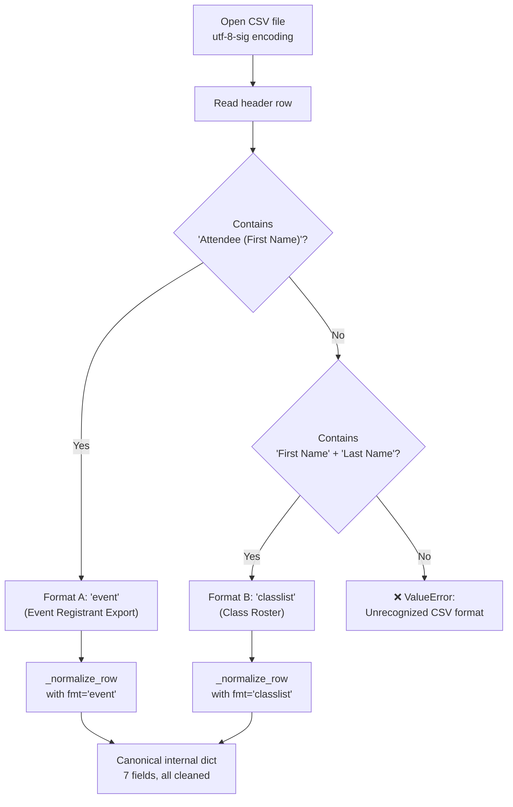
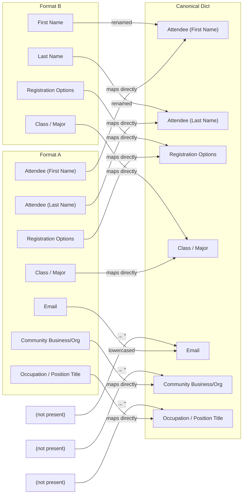

Every badge PDF begins with CSV data. The badge generator accepts **two distinct CSV layouts** and auto-detects which one you're providing based purely on its column headers — no flags or configuration needed. This page documents both formats, explains how they're detected and normalized, and shows how to combine them in a single run. Understanding these formats is the foundation for everything else in the data pipeline, so this is the right starting point before moving into [Auto-Detection, Normalization, and N/A Sentinel Handling](9-auto-detection-normalization-and-n-a-sentinel-handling) or [Deduplication Strategy Across Multiple CSV Files](10-deduplication-strategy-across-multiple-csv-files).

Sources: [generate_badges.py](generate_badges.py#L222-L272)

## How the Generator Reads Your CSV

When you run `generate_badges.py`, the very first thing it does after parsing command-line arguments is open your CSV file and inspect its header row. The function `_detect_format()` examines the column names and returns either `'event'` or `'classlist'` — a single string label that drives all subsequent processing. There is no file extension check, no magic-number detection, and no user prompting. The header row is the single source of truth.

The detection logic is straightforward: if the headers contain the exact string `"Attendee (First Name)"`, the file is classified as an **event registrant export** (Format A). Otherwise, if it contains both `"First Name"` and `"Last Name"`, it's classified as a **class roster** (Format B). If neither pattern matches, the generator raises a `ValueError` with a clear message listing the columns it found and the two patterns it expected.

Sources: [generate_badges.py](generate_badges.py#L261-L272)



## Format A: Event Registrant Export

This is the **richer** of the two formats, designed to match exports from event registration platforms like Google Sheets or Eventbrite. It carries seven columns — four required and three optional. The distinguishing feature is its parenthesized column names: `Attendee (First Name)` and `Attendee (Last Name)`.

### Column Specification

| Column Header | Required | Data Type | Purpose |
|---|---|---|---|
| `Attendee (First Name)` | ✅ Yes | Text | Person's first name. Becomes part of the badge name line. If blank after cleaning, defaults to `"Guest"`. |
| `Attendee (Last Name)` | ✅ Yes | Text | Person's last name. Displayed after the first name on the badge. |
| `Registration Options` | ✅ Yes | Enum | Must be one of four exact values: `Alumni`, `Student`, `Faculty/Staff`, or `Community`. Controls school detection priority and badge text formatting. |
| `Class / Major` | ✅ Yes | Text | For alumni, contains major and optionally graduation years (e.g., `"BA English '98"`). For students, contains their school or major (e.g., `"Ancell School of Business"`). Drives school color detection and year extraction. |
| `Email` | No | Text | Used as the primary deduplication key. Lowercased during normalization. If two rows share the same email, only the first is kept. |
| `Community Business/Organization` | No | Text | Organization or department name. Displayed on badges for Community and Faculty/Staff registrants. Also used as a secondary input to school detection (e.g., `"Ancell"` in this field routes to the Ancell school). |
| `Occupation / Position Title` | No | Text | Job title or role. Rendered as the third text line on the badge. Multi-line entries are collapsed to the first segment. |

Sources: [generate_badges.py](generate_badges.py#L225-L235)

### Example Row

```
Attendee (First Name),Attendee (Last Name),Registration Options,Class / Major,Email,Community Business/Organization,Occupation / Position Title
Jane,Smith,Alumni,BA Psychology '05,jane.smith@email.com,WCSU Foundation,Director of Development
```

### Key Behaviors for Format A

The normalization function `_normalize_row()` processes every cell through `_clean()`, which strips whitespace and collapses common "not available" sentinels (`N/A`, `NA`, `None`, `-`, `TBD`, etc.) into empty strings. Name fields receive special treatment: the first name falls back to `"Guest"` if entirely blank, so a badge is never produced with a missing name. The email field is lowercased to ensure case-insensitive deduplication. All other optional fields default to empty strings if missing or blank.

Sources: [generate_badges.py](generate_badges.py#L274-L300)

## Format B: Class Roster

This is a **simplified** format designed for class rosters exported from university systems, grade books, or manually created spreadsheets. It requires only four columns and deliberately omits the optional fields that Format A supports. The distinguishing feature is its plain column names: `First Name` and `Last Name` without parentheses.

### Column Specification

| Column Header | Required | Data Type | Purpose |
|---|---|---|---|
| `First Name` | ✅ Yes | Text | Person's first name. Falls back to `"Guest"` if blank. |
| `Last Name` | ✅ Yes | Text | Person's last name. |
| `Registration Options` | ✅ Yes | Enum | Same four values as Format A. For class lists, this is almost always `"Student"`. |
| `Class / Major` | ✅ Yes | Text | School name, major, or program. This is the primary field for school color detection. |

**No other columns are expected or processed.** Fields like Email, Organization, and Occupation are automatically set to empty strings during normalization. If you need those fields, use Format A instead.

Sources: [generate_badges.py](generate_badges.py#L236-L242), [generate_badges.py](generate_badges.py#L291-L300)

### Example Row

This is the exact format of the sample class roster files shipped in the repository:

```
Last Name,First Name,Class / Major,Registration Options
Aguirre Calle,Romina,Ancell School of Business,Student
```

Note that in the sample files, the columns appear in the order `Last Name, First Name, ...` — column **order does not matter** because the parser reads by header name, not by position.

Sources: [data/Class List ACC 306.csv](data/Class%20List%20ACC%20306.csv#L1-L2)

### Key Behaviors for Format B

During normalization, the classlist format maps its plain column names to the same internal keys used by Format A: `First Name` becomes `Attendee (First Name)`, `Last Name` becomes `Attendee (Last Name)`, while `Registration Options` and `Class / Major` map directly. The three missing fields — `Email`, `Community Business/Organization`, and `Occupation / Position Title` — are hard-coded to empty strings. This means **class roster entries cannot be deduplicated by email** (they use `firstname_lastname` as the dedup key instead), and their badges will not display an organization or occupation line.

Sources: [generate_badges.py](generate_badges.py#L291-L300)

## Side-by-Side Comparison

The following table highlights every practical difference between the two formats at a glance:

| Aspect | Format A (Event Export) | Format B (Class Roster) |
|---|---|---|
| **Detection trigger** | Header contains `Attendee (First Name)` | Header contains `First Name` + `Last Name` |
| **Total columns** | 7 (4 required + 3 optional) | 4 (all required) |
| **Name columns** | `Attendee (First Name)`, `Attendee (Last Name)` | `First Name`, `Last Name` |
| **Email deduplication** | ✅ Yes (primary dedup key) | ❌ No (falls back to name-based key) |
| **Organization on badge** | ✅ Shown for Community/Faculty | ❌ Always blank |
| **Occupation on badge** | ✅ Third text line | ❌ Always blank |
| **Column order matters** | No — read by header name | No — read by header name |
| **Typical source** | Google Sheets, Eventbrite export | University class roster, grade book |
| **Conversion tool** | N/A (native format) | [convert_classlist.py](21-class-list-converter-transforming-xlsx-rosters-to-badge-generator-csv) for xlsx → CSV |

Sources: [generate_badges.py](generate_badges.py#L274-L300)

## Internal Normalization: Both Formats Become One

Regardless of which format you provide, every row is converted into the **same canonical dictionary** with seven keys. This is what the rest of the pipeline — school detection, badge data construction, PDF rendering — works with. The normalization step is a one-way mapping: your CSV format goes in, a standardized dict comes out.



This design means you can freely mix both formats in a single badge generation run. For example, you might combine a Google Sheets event export with two class roster CSVs, and the generator handles the merging, deduplication, and normalization transparently.

Sources: [generate_badges.py](generate_badges.py#L274-L300)

## Encoding and File Handling

CSV files are opened with `encoding="utf-8-sig"`, which handles UTF-8 with an optional BOM (Byte Order Mark). This is important because exports from Google Sheets and Excel frequently include a BOM prefix, and using plain `utf-8` would leave an invisible `\ufeff` character attached to the first column header — causing format detection to fail. The `-sig` variant strips the BOM automatically.

The parser uses Python's built-in `csv.DictReader`, which reads the first row as headers and returns each subsequent row as an `OrderedDict` keyed by those headers. This means your CSV must have a header row — data files without headers are not supported.

Sources: [generate_badges.py](generate_badges.py#L318-L322)

## Mixing Multiple CSV Files in One Run

You can pass multiple `--csv` flags to combine registrants from several sources. The generator processes each file sequentially, auto-detecting its format independently. This means you can mix Format A and Format B files freely:

```bash
python generate_badges.py \
  --csv data/registrants.csv \
  --csv data/acc306_badges.csv \
  --csv "data/Class List ACC 306.csv" \
  --output output/combined_badges.pdf
```

Deduplication happens globally across all files — the same person won't appear twice even if present in multiple CSVs. When Email is available (Format A), it serves as the primary dedup key. When it's not (Format B), the generator falls back to a composite key of `firstname_lastname` (both lowercased).

Sources: [generate_badges.py](generate_badges.py#L302-L336), [generate_badges.py](generate_badges.py#L689-L696)

## Getting an Xlsx File Into the Pipeline

If your starting data is an `.xlsx` file (such as a university class roster exported from Banner or a similar system), you'll use the companion script `convert_classlist.py` to transform it into a Format A CSV that the badge generator can consume. This converter recognizes flexible column name aliases — for example, `First Name`, `Firstname`, `Given Name`, and `fname` are all accepted as the first-name column.

The converter always produces Format A output (with all seven columns), even when the input xlsx has only two columns. Missing fields are filled from command-line defaults (`--reg-type`, `--major`, `--org`, `--title`), so the resulting CSV is immediately usable by `generate_badges.py` without further editing. The full conversion workflow is documented in [Class List Converter: Transforming Xlsx Rosters to Badge-Generator CSV](21-class-list-converter-transforming-xlsx-rosters-to-badge-generator-csv).

Sources: [convert_classlist.py](convert_classlist.py#L53-L104), [convert_classlist.py](convert_classlist.py#L96-L104)

## Quick Reference: Building a CSV from Scratch

If you're creating a CSV manually (for example, for a small event or testing), follow this checklist:

1. **Save as CSV with UTF-8 encoding** — Excel's "CSV UTF-8 (Comma delimited)" option works well
2. **Include a header row** as the very first line — no blank rows above it
3. **Match column names exactly** — copy from the tables above; spacing and parentheses matter
4. **Use exact values for `Registration Options`** — only `Alumni`, `Student`, `Faculty/Staff`, or `Community`
5. **Place graduation years in `Class / Major`** for alumni using apostrophe format: `'98`, `'71 & '05`
6. **Leave unknown cells blank** — avoid typing `N/A`, `None`, or `-` since these are automatically treated as blank anyway

For the complete story on how blank and sentinel values are handled, continue to [Auto-Detection, Normalization, and N/A Sentinel Handling](9-auto-detection-normalization-and-n-a-sentinel-handling). To understand how duplicate entries across multiple files are resolved, see [Deduplication Strategy Across Multiple CSV Files](10-deduplication-strategy-across-multiple-csv-files).