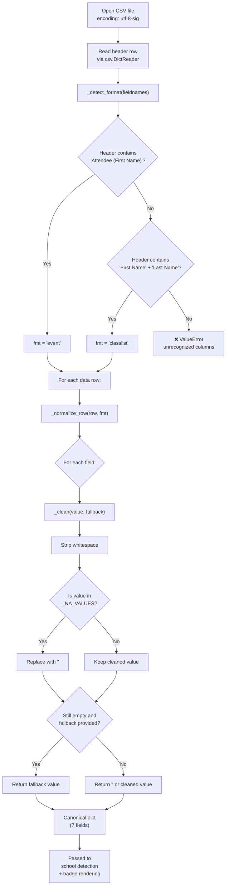
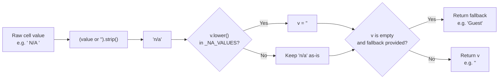
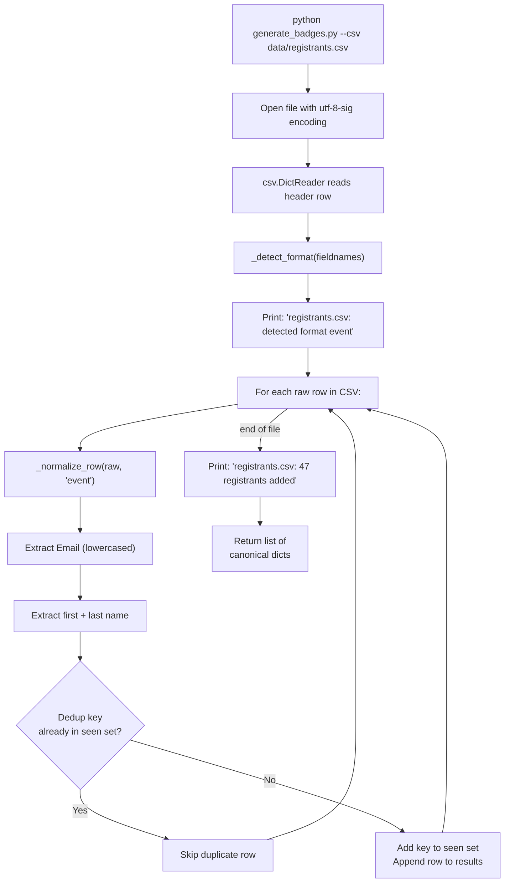

When you feed a CSV file into the badge generator, three things happen before any badge is rendered: the file is **auto-detected** as one of two formats, every cell value is **normalized** through a cleaning pipeline, and any placeholder or sentinel text is **collapsed to an empty string**. These three stages form the front door of the data pipeline — they determine whether the rest of the system receives clean, predictable data or chokes on unexpected input. This page explains exactly how each stage works, what values get caught, and what you can expect the generator to do automatically versus what requires manual attention in your CSV.

Sources: [generate_badges.py](generate_badges.py#L222-L300)

## The Three-Stage Pipeline at a Glance

Every CSV row passes through the same sequence: format detection happens once per file when the header row is read, then normalization and sentinel handling run on every single data row. The flow is unidirectional — your raw CSV goes in, a canonical dictionary comes out, and the downstream badge-building code never sees the original CSV format or cell contents again.



Sources: [generate_badges.py](generate_badges.py#L261-L300)

## Stage 1: CSV Format Auto-Detection

The generator supports exactly two CSV layouts, and it distinguishes between them by inspecting the **column headers** — not the file extension, not the data content, and not any configuration flag. This means you can name your file anything you like; what matters is the text in row 1.

The detection function `_detect_format()` receives the list of header names from `csv.DictReader`, normalizes them by stripping whitespace, and then checks for two specific patterns in this priority order:

1. If the header set contains the exact string `Attendee (First Name)` → classified as **Format A (`"event"`)** — an event registrant export from Google Sheets or Eventbrite
2. Otherwise, if the header set contains both `First Name` and `Last Name` → classified as **Format B (`"classlist"`)** — a class roster or simple list
3. If neither pattern matches → a `ValueError` is raised with a helpful message listing the columns that were found, so you can fix your header row

Sources: [generate_badges.py](generate_badges.py#L261-L272)

### Detection Rules in Detail

The comparison is case-sensitive and looks for the **full header string** (after stripping whitespace). Here's what this means in practice:

| Your Header | Detected As | Why |
|---|---|---|
| `Attendee (First Name)` | Format A ✅ | Exact match to the trigger string |
| `Attendee (first name)` | **Not detected** ❌ | Comparison is case-sensitive |
| `Attendee(First Name)` | **Not detected** ❌ | No space before parenthesis — extra space matters |
| ` First Name ` | Format B ✅ | Whitespace is stripped before comparison |
| `First Name` (without `Last Name`) | **Not detected** ❌ | Both must be present for Format B |

**Important**: The check is not a substring match. The header `Registration First Name` would *not* trigger Format A detection, because it contains extra words around the trigger string. You need the header to be exactly `Attendee (First Name)`.

Sources: [generate_badges.py](generate_badges.py#L263-L267)

### What Happens on Detection Failure

If your CSV headers don't match either pattern, the generator stops immediately with a `ValueError` that prints the columns it found. For example:

```
ValueError: Unrecognized CSV format. Found columns: ['FirstName', 'LastName', 'Major']
Expected either 'Attendee (First Name)' (event export) or 'First Name' + 'Last Name' (class roster).
```

This is intentional — it's better to fail early with a clear error than to silently produce wrong badges. The fix is always to update your CSV header row to match one of the two supported formats. For the full column specifications, see [CSV Format Reference: Event Registrant Export vs. Class Roster](8-csv-format-reference-event-registrant-export-vs-class-roster).

Sources: [generate_badges.py](generate_badges.py#L268-L272)

## Stage 2: Row Normalization

Once the format is identified, every data row in the file passes through `_normalize_row()`, which converts the row into a **canonical seven-field dictionary**. This is the single most important function for understanding how the pipeline handles data uniformly — regardless of whether you provided Format A or Format B, the output is always the same structure.

Sources: [generate_badges.py](generate_badges.py#L274-L300)

### The Canonical Dictionary Structure

Every normalized row becomes a Python dictionary with these exact seven keys:

| Internal Key | Source (Format A) | Source (Format B) | Special Processing |
|---|---|---|---|
| `Attendee (First Name)` | `Attendee (First Name)` | `First Name` | Fallback to `"Guest"` if empty |
| `Attendee (Last Name)` | `Attendee (Last Name)` | `Last Name` | No fallback (can be empty) |
| `Registration Options` | `Registration Options` | `Registration Options` | No fallback |
| `Class / Major` | `Class / Major` | `Class / Major` | No fallback |
| `Email` | `Email` | *(not present)* | Set to `""`; lowercased |
| `Community Business/Organization` | `Community Business/Organization` | *(not present)* | Set to `""` |
| `Occupation / Position Title` | `Occupation / Position Title` | *(not present)* | Set to `""` |

Notice that Format B's `First Name` column is **renamed** to `Attendee (First Name)` internally, and its three missing optional fields are filled with empty strings. This means downstream code (school detection, badge rendering, deduplication) never needs to know which format the original CSV used — it always works with the same dictionary shape.

Sources: [generate_badges.py](generate_badges.py#L281-L300)

### The Name Fallback: Why First Names Become "Guest"

The first name field receives special treatment via a `fallback` parameter. If the cleaned first name is empty — whether because the cell was blank, contained an N/A sentinel, or was missing entirely — the value is replaced with the string `"Guest"`. This prevents badges from rendering with a completely blank name line, which would be confusing on a printed badge.

The last name field does **not** receive this fallback. If the last name is empty after cleaning, it remains an empty string, so a badge might display as "Guest " (with a trailing space). This asymmetry is deliberate — a first name of "Guest" is enough to make the badge usable, while forcing a fallback last name would be misleading.

Sources: [generate_badges.py](generate_badges.py#L283-L284), [generate_badges.py](generate_badges.py#L248-L259)

### Email Lowercasing

When the `Email` field is present (Format A), its value is lowercased during normalization using `.lower()`. This is critical for deduplication, which uses the email as a primary key — without lowercasing, `Jane.Smith@email.com` and `jane.smith@email.com` would be treated as two different people. The lowercasing happens inside `_normalize_row()` rather than later in the pipeline, ensuring the canonical dictionary always contains a normalized email value.

Sources: [generate_badges.py](generate_badges.py#L289)

## Stage 3: N/A Sentinel Handling

This is the stage that handles the messiest part of real-world CSV data: placeholder values that humans enter to indicate "this field doesn't apply" or "I don't know yet." The `_clean()` function is the gatekeeper — it decides whether a cell value represents real data or should be treated as blank.

Sources: [generate_badges.py](generate_badges.py#L248-L259)

### The Sentinel Value Set

The generator maintains a hardcoded set called `_NA_VALUES` that contains every string pattern recognized as "no value." Any cell whose trimmed content (ignoring case) matches one of these patterns is replaced with an empty string. The full set contains 14 entries:

| Sentinel Pattern | What It Catches | Common Source |
|---|---|---|
| `n/a` | The most common placeholder | Manual data entry, form defaults |
| `na` | Abbreviated version | Quick data entry |
| `n.a.` | Punctuated variant | Formal records |
| `n.a` | Partially punctuated variant | Inconsistent punctuation |
| `none` | Python-style null | Programmatic exports |
| `null` | Database-style null | System exports, API responses |
| `-` | Single dash | Excel "leave blank" convention |
| `--` | Double dash | Emphasized "empty" |
| `---` | Triple dash | Some form systems |
| `not available` | Written out | Descriptive data entry |
| `not applicable` | Written out | Formal forms, surveys |
| `unknown` | Written out | Uncertain data |
| `tbd` | "To be determined" | Events with pending information |
| `tba` | "To be announced" | Events with pending information |

Sources: [generate_badges.py](generate_badges.py#L245-L246)

### How _clean() Works Step by Step

The `_clean()` function performs exactly three operations in sequence, with no regex involved — it uses Python's set membership for the sentinel check, which makes it both fast and easy to understand:



Step 1 — **Null-safe extraction**: The expression `(value or "").strip()` handles two edge cases. If the cell is genuinely empty (Python `None` or an empty string), the `or ""` prevents a `NoneType` error on `.strip()`. If the cell has leading or trailing whitespace — which is extremely common in CSV exports from Excel and Google Sheets — `.strip()` removes it.

Step 2 — **Sentinel check**: The trimmed value is lowercased and checked against the `_NA_VALUES` set. Set lookup in Python is O(1) on average, so this is efficient even with thousands of rows. If the value matches any sentinel, it's replaced with an empty string.

Step 3 — **Fallback resolution**: If the value is now empty (either it was empty to begin with, or it was a sentinel), the function checks whether a `fallback` was provided. This is how name fields get their `"Guest"` default. For all other fields, the fallback defaults to `""`, so an empty or N/A cell simply becomes an empty string in the canonical dictionary.

Sources: [generate_badges.py](generate_badges.py#L248-L259)

### What _clean() Does NOT Catch

The sentinel handling is intentionally conservative. Here are values that pass through unchanged and why:

| Value | Result | Why It Passes Through |
|---|---|---|
| `N/A - check back later` | **Kept as-is** | Only exact matches are caught; extra text prevents the match |
| `TBD: Finance` | **Kept as-is** | The sentinel must be the entire cell value |
| `na` | **Collapsed to `""`** | Exact match (case-insensitive) |
| `banana` | **Kept as-is** | Only the 14 defined sentinels are matched |
| `NaN` | **Kept as-is** | Not in the sentinel set (this is a pandas concept, not a CSV convention) |
| ` ` (space only) | **Collapsed to `""`** | Whitespace stripping leaves empty string |

The key principle is: **the entire cell value must match a sentinel pattern** after whitespace is stripped. If there's any additional text, it's treated as real data. This prevents false positives where someone might write `N/A - see notes` and have their actual note lost.

Sources: [generate_badges.py](generate_badges.py#L256-L258)

### The Effect on Badge Rendering

Understanding what happens after sentinels are collapsed helps explain the visual result on the printed badge. The badge construction function `build_badge_data()` calls `.strip()` on every field from the canonical dictionary, so even if an empty string slips through, it won't cause errors. Here's what you'll see on the badge for different input scenarios:

| CSV Cell Value | After _clean() | What Appears on Badge |
|---|---|---|
| `Director of Development` | `Director of Development` | "Director of Development" (third line) |
| `N/A` | `""` | Nothing — the occupation line is simply omitted |
| `TBD` | `""` | Nothing — treated as "not yet known" |
| ` ` (whitespace only) | `""` | Nothing |
| *(empty cell)* | `""` | Nothing |
| `CEO` | `CEO` | "CEO" (third line) |

For the **first name** specifically, the behavior is different due to the `"Guest"` fallback:

| CSV Cell Value | After _clean() | What Appears on Badge |
|---|---|---|
| `Jane` | `Jane` | "Jane Smith" |
| `N/A` | `"Guest"` (fallback) | "Guest Smith" |
| *(empty cell)* | `"Guest"` (fallback) | "Guest Smith" |

Sources: [generate_badges.py](generate_badges.py#L338-L344), [generate_badges.py](generate_badges.py#L248-L259)

## The Complete Pipeline: From File to Canonical Dict

Putting all three stages together, here's the exact sequence that plays out inside `load_registrants()` when you run the generator. This function handles one or more CSV files and produces a single list of normalized, deduplicated registrant dictionaries.



A few important details about how the pipeline handles multiple files and mixed formats:

- **Each file is detected independently**. You can pass a Format A file and a Format B file in the same `--csv` invocation, and each will be correctly identified and normalized
- **Deduplication is global across all files**. If the same person appears in two different CSVs, they'll only produce one badge. The dedup key is email when available, falling back to `firstname_lastname` (both lowercased)
- **The `seen` set persists across files**. This means the order of `--csv` arguments matters — if a person appears in both files, the version from the *first* file listed wins

Sources: [generate_badges.py](generate_badges.py#L302-L336)

## Practical Guide: Preparing Your CSV

Knowing how the pipeline works helps you avoid common issues. Here are the rules of thumb distilled into actionable guidance:

### DO

✅ **Match header names exactly** — copy the column names from the format tables. The parenthesized format `Attendee (First Name)` for event exports and the plain `First Name` / `Last Name` for class rosters are the only supported header patterns.

✅ **Use any of the 14 sentinel values** when a field doesn't apply — `N/A`, `TBD`, `-`, and all others in the set are automatically recognized and will produce a clean blank on the badge.

✅ **Mix formats freely** — you can combine event exports and class rosters in a single run with multiple `--csv` flags.

✅ **Leave cells truly empty** — an empty cell works just as well as `N/A`. Both produce the same result.

Sources: [generate_badges.py](generate_badges.py#L245-L259), [generate_badges.py](generate_badges.py#L261-L272)

### DON'T

❌ **Don't add extra text to sentinel values** — `N/A - pending` will be treated as literal text and could appear on the badge. Use either `N/A` alone or leave the cell empty.

❌ **Don't rely on case insensitivity for headers** — `attendee (first name)` will fail detection. The header must be `Attendee (First Name)` with this exact capitalization.

❌ **Don't worry about column order** — the parser reads by header name, not position. `Last Name` can come before `First Name`, or `Email` can be anywhere in the file.

❌ **Don't use `NaN` as a placeholder** — this is a pandas/NumPy convention and is not in the badge generator's sentinel set. Use `N/A` or leave the cell empty instead.

Sources: [generate_badges.py](generate_badges.py#L256-L258), [generate_badges.py](generate_badges.py#L263-L267)

## Extending the Sentinel Set

If your organization uses additional placeholder values not covered by the default set, you can extend `_NA_VALUES` by editing the constant near the top of the CSV pipeline section in `generate_badges.py`. The set is defined on a single line using Python's set literal syntax:

```python
# Current definition (line 245-246 in generate_badges.py)
_NA_VALUES = {"n/a", "na", "n.a.", "n.a", "none", "null", "-", "--", "---",
              "not available", "not applicable", "unknown", "tbd", "tba"}
```

To add new sentinels, simply append them to the set:

```python
_NA_VALUES = {"n/a", "na", "n.a.", "n.a", "none", "null", "-", "--", "---",
              "not available", "not applicable", "unknown", "tbd", "tba",
              "pending", "not provided", "no response"}
```

All values must be **lowercase** because the comparison in `_clean()` lowercases the input before checking membership. The set lookup is case-insensitive by design — `N/A`, `n/a`, `N/a`, and `Na` all match.

Sources: [generate_badges.py](generate_badges.py#L245-L246), [generate_badges.py](generate_badges.py#L257)

## Next Steps

Now that you understand how data flows from CSV through detection, normalization, and sentinel handling into the canonical dictionary, these related topics explore what happens next in the pipeline:

- **[CSV Format Reference: Event Registrant Export vs. Class Roster](8-csv-format-reference-event-registrant-export-vs-class-roster)** — the full column specification for both supported formats, with example rows and a side-by-side comparison table
- **[Deduplication Strategy Across Multiple CSV Files](10-deduplication-strategy-across-multiple-csv-files)** — how the `seen` set works across files, why email is preferred over name-based keys, and what happens when the same person appears in multiple CSVs
- **[Keyword-Based School Assignment Algorithm and Priority Rules](11-keyword-based-school-assignment-algorithm-and-priority-rules)** — how the cleaned `Class / Major` field feeds into school color detection after normalization is complete