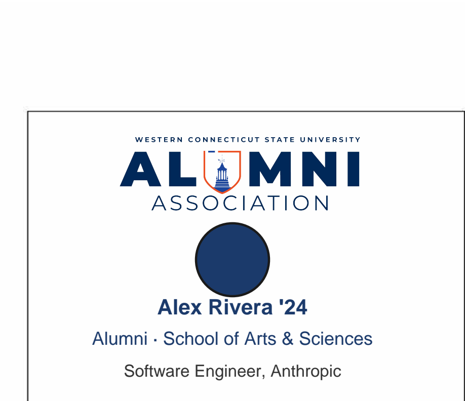
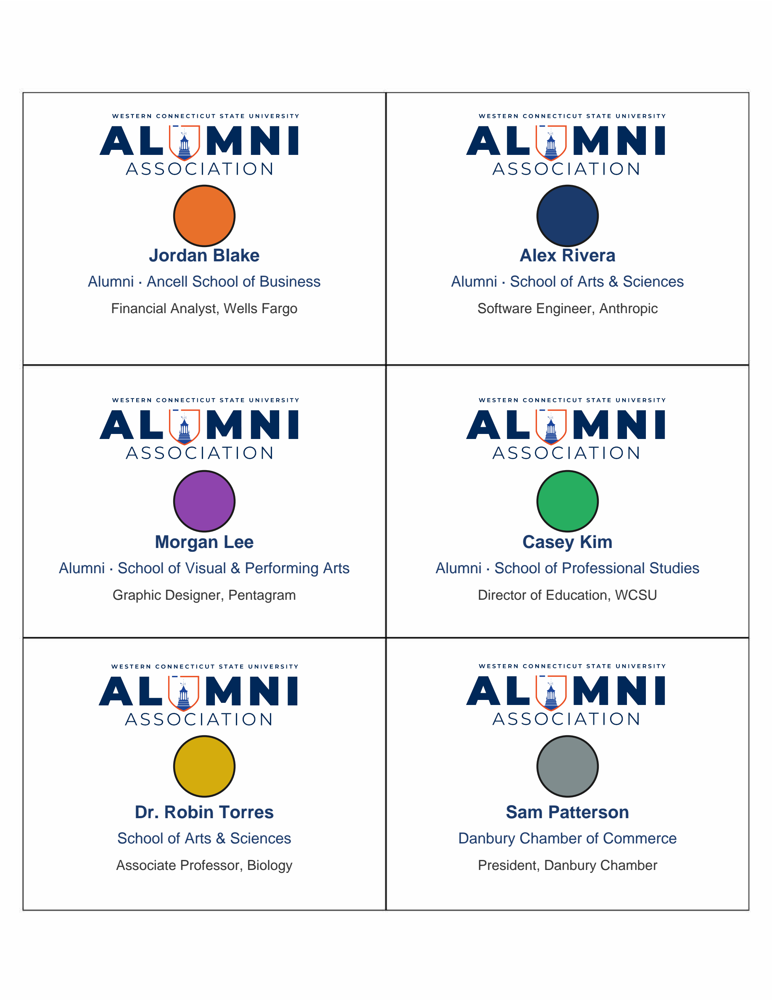

# 🎓 WCSU Alumni Meet & Greet — Name Badge Generator

> **Event:** WCSU Alumni Association Meet & Greet · March 25, 2026
> **Venue:** Western Connecticut State University, Danbury, CT
> **Output:** Print-ready PDF — 6 badges per page, color-coded by WCSU school

---

## 📛 Example Badge



---

## 🎨 Color Legend

Each badge displays a colored circle identifying the attendee's WCSU school affiliation:

| Color | School / Group | Hex |
|---|---|---|
| 🟠 **Orange** | Ancell School of Business | `#E8702A` |
| 🔵 **Navy** | School of Arts & Sciences | `#1B3A6B` |
| 🟣 **Purple** | School of Visual & Performing Arts | `#8E44AD` |
| 🟢 **Green** | School of Professional Studies | `#27AE60` |
| 🟡 **Dark Gold** | Faculty / Staff | `#D4AC0D` |
| ⬜ **Gray** | Community Guest / Unknown | `#7F8C8D` |



School assignment is **automatically detected** from the registrant's `Class / Major` and `Community Business/Organization` fields in the CSV. See [School Detection Logic](#-school-detection-logic) for details.

---

## 📁 Project Structure

```
wcsu-badge-generator/
├── generate_badges.py                        # 🐍 Main badge generation script
├── convert_classlist.py                      # 🔄 Converts xlsx class rosters to badge CSV format
├── requirements.txt                          # 📦 Python dependencies
├── README.md                                 # 📖 This file
├── CLAUDE.md                                 # 🤖 AI assistant context file
├── .gitignore
│
├── template/
│   ├── badge_template.pdf                    # 🖼  Single-page blank badge template (committed, ~140 KB)
│   └── template_blank.png                    # 🖼  Auto-generated on first run (gitignored)
│
├── data/
│   └── registrants.csv                       # 📋 Registrant export from Google Sheets (gitignored — PII)
│
├── output/
│   └── 2026_MeetGreet_NameTags.pdf           # ✅ Generated badge PDF — print this (gitignored)
│
└── docs/
    ├── sample_badge.png                      # 🖼  Example badge (for README)
    └── badge_color_legend.png                # 🖼  Color legend grid (for README)
```

---

## ⚙️ Prerequisites

- Python 3.10–3.13 (Python 3.14+ is not yet supported by all dependencies)
- `pip` / `venv`
- `template/badge_template.pdf` is committed to the repo — no manual template setup needed
- `openpyxl` is required only if using `convert_classlist.py` (included in `requirements.txt`)

> **Note:** `template/template_blank.png` is auto-generated from `badge_template.pdf` on first run. The `output/` folder is also created automatically if missing.

---

## 🐍 Setup — macOS

```bash
# 1. Navigate to the project folder
cd path/to/wcsu-badge-generator

# 2. Create a virtual environment
python3 -m venv .venv

# 3. Activate the virtual environment
source .venv/bin/activate

# 4. Install dependencies
pip install -r requirements.txt

# 5. Verify setup
python3 -c "import reportlab, pypdfium2, PIL, openpyxl; print('✅ All dependencies ready')"
```

> **To deactivate** when done: `deactivate`

---

## 🪟 Setup — Windows 11

> **Important:** On Windows, `python` and `python3` may point to different installed versions. Run `python --version` first. If it shows **3.14 or higher**, use the Python Launcher (`py -3.11`) to create your venv instead — see the note below.

```powershell
# 1. Open PowerShell and navigate to the project folder
cd C:\path\to\wcsu-badge-generator

# 2. Check your Python version
python --version

# 3. Create a virtual environment
#    If python --version shows 3.10–3.13, use:
python -m venv .venv
#    If python --version shows 3.14+, use the Python Launcher to target 3.11/3.12/3.13:
#    py -3.11 -m venv .venv

# 4. Activate the virtual environment
.venv\Scripts\Activate.ps1

# If you get an execution policy error, run this first (once):
# Set-ExecutionPolicy -ExecutionPolicy RemoteSigned -Scope CurrentUser

# 5. Install dependencies
pip install -r requirements.txt

# 6. Verify setup
python -c "import reportlab, pypdfium2, PIL, openpyxl; print('All dependencies ready')"
```

> **To deactivate** when done: `deactivate`

> **Tip:** To find which Python your system is using, run `where python` in PowerShell (the Windows equivalent of `which`).

---

## 🚀 Workflow 1 — Standard Event Run (Google Sheets CSV)

This is the main workflow for the Meet & Greet event registration list.

### Step 1 — Export the latest registrant data

1. Open the Google Sheet: [WCSU Meet & Greet 2026 Registration](YOUR_GOOGLE_SHEET_URL)
2. Go to **File → Download → Comma-separated values (.csv)**
3. Save/replace the file as `data/registrants.csv`

### Step 2 — Generate badges

```bash
# macOS / Linux
python3 generate_badges.py

# Windows (PowerShell)
python generate_badges.py
```

**Expected output:**
```
Loaded 175 unique registrants
✓ Generated 30 pages for 175 badges → output/2026_MeetGreet_NameTags.pdf
```

### Step 3 — Print

1. Open `output/2026_MeetGreet_NameTags.pdf`
2. Print on **letter-size cardstock** (8.5" × 11")
3. Cut along the grid lines — 6 badges per sheet

> ⚠️ **Always regenerate from the latest CSV export** — the script replaces the full PDF each run, so old badges are never left in.

---

## 📋 Workflow 2 — Ad-hoc Class Roster from xlsx

Use this when you receive a class list as an Excel file (e.g. from a professor or department) and need badges for those students only.

### Step 1 — Convert the xlsx to badge CSV format

```bash
# macOS / Linux
python3 convert_classlist.py data/ClassListACC306.xlsx \
  --major "Accounting" \
  --output data/acc306_badges.csv

# Windows (PowerShell — use backtick ` for line continuation)
python convert_classlist.py data/ClassListACC306.xlsx `
  --major "Accounting" `
  --output data/acc306_badges.csv
```

**The `--major` flag controls the badge circle color.** Pass the right major so students get the correct school color. If you're unsure, leave it off — badges will show gray rather than a wrong color.

| School | Example `--major` values |
|---|---|
| 🟠 Ancell (Orange) | `Accounting`, `Finance`, `Marketing`, `Management`, `MIS` |
| 🔵 Arts & Sciences (Navy) | `Biology`, `Psychology`, `Nursing`, `Computer Science` |
| 🟣 Visual & Performing Arts (Purple) | `Graphic Design`, `Theatre`, `Music`, `Digital Interactive Media` |
| 🟢 Professional Studies (Green) | `Education`, `Health Administration`, `Counseling` |
| 🟡 Faculty/Staff (Dark Gold) | Use `--reg-type Faculty/Staff` instead of `--major` |

**Other useful flags:**
```bash
# macOS / Linux
python3 convert_classlist.py data/FacultyList.xlsx \
  --reg-type "Faculty/Staff" \
  --org "School of Arts & Sciences" \
  --output data/faculty_badges.csv

# Windows (PowerShell)
python convert_classlist.py data/FacultyList.xlsx `
  --reg-type "Faculty/Staff" `
  --org "School of Arts & Sciences" `
  --output data/faculty_badges.csv
```

### Step 2 — Generate badges for that CSV only

```bash
# macOS / Linux
python3 generate_badges.py \
  --csv data/acc306_badges.csv \
  --output output/ACC306_NameTags.pdf

# Windows (PowerShell)
python generate_badges.py `
  --csv data/acc306_badges.csv `
  --output output/ACC306_NameTags.pdf
```

The xlsx must have `First Name` and `Last Name` columns (header row required, column order doesn't matter). Any additional columns like `Email` are used automatically if present.

---

## 🗂 Workflow 3 — Combine Multiple CSVs into One PDF

Pass `--csv` multiple times to merge registrant lists from different sources into a single badge PDF. Duplicates are automatically removed across all files (matched by email, or first+last name if no email).

### Example: event registrants + a class roster

```bash
# macOS / Linux
python3 generate_badges.py \
  --csv data/registrants.csv \
  --csv data/acc306_badges.csv \
  --output output/Combined_NameTags.pdf

# Windows (PowerShell)
python generate_badges.py `
  --csv data/registrants.csv `
  --csv data/acc306_badges.csv `
  --output output/Combined_NameTags.pdf
```

**Expected output:**
```
  registrants.csv: 175 registrants
  acc306_badges.csv: 28 registrants
Loaded 203 unique registrants
✓ Generated 34 pages for 203 badges → output/Combined_NameTags.pdf
```

### Example: multiple class rosters combined

```bash
# macOS / Linux
python3 convert_classlist.py data/ClassListACC306.xlsx --major "Accounting" --output data/acc306.csv
python3 convert_classlist.py data/ClassListNUR201.xlsx --major "Nursing"    --output data/nur201.csv
python3 generate_badges.py \
  --csv data/acc306.csv \
  --csv data/nur201.csv \
  --output output/MultiClass_NameTags.pdf

# Windows (PowerShell)
python convert_classlist.py data/ClassListACC306.xlsx --major "Accounting" --output data/acc306.csv
python convert_classlist.py data/ClassListNUR201.xlsx --major "Nursing"    --output data/nur201.csv
python generate_badges.py `
  --csv data/acc306.csv `
  --csv data/nur201.csv `
  --output output/MultiClass_NameTags.pdf
```

---

## 🏫 School Detection Logic

The script keyword-matches the `Class / Major` and `Community Business/Organization` CSV fields to assign a school. The matching priority is:

1. **Exact org match** — if `"Ancell"` appears in the org field → Ancell
2. **Visual & Performing Arts** — graphic design, theater, DIMA, dance, music, film…
3. **Professional Studies** — education, MHA, health administration, counseling…
4. **Ancell School of Business** — accounting, finance, management, MBA, BBA, MIS…
5. **School of Arts & Sciences** — biology, psychology, history, nursing, BSN, cybersecurity…
6. **Faculty/Staff** — any Faculty/Staff registrant not matched to a specific school
7. **Community Guest** — any Community registrant
8. **Default (gray)** — if no keyword matches (ambiguous major like `"BA"` or `"2019"`)

### 🛠 Fixing an Unmatched Badge

If a registrant's circle is gray but you know their school, update their `Class / Major` in the CSV:

| Scenario | Fix |
|---|---|
| Major entered as just `"BA"` | Change to `"BA English"` or specific field |
| Only a graduation year entered (e.g. `"2019"`) | Add the major: `"2019 / Nursing"` |
| Typo like `"buisness"` | Correct to `"Business"` |
| Medical secretary / healthcare | Change to `"Health Sciences"` |

Then re-run the generator — no other changes needed.

---

## 🖨 Print Tips

- Use **cardstock** (65–80 lb) for sturdiness
- Print at **100% scale** — do not "fit to page"
- Each badge is **3" × 2.2"** when cut from letter paper (6-up layout)
- The template includes **cut lines** (thin grid borders on each page)

---

## 🤖 Regenerating with Claude / AI

This project was originally built using [Claude in Cowork mode](https://claude.ai). The `CLAUDE.md` file provides full project context so Claude can pick up where it left off — including updating the script, adjusting colors, fixing school mappings, or regenerating from a fresh CSV.

To resume work with Claude, simply open this project folder in Cowork and reference `CLAUDE.md`.
