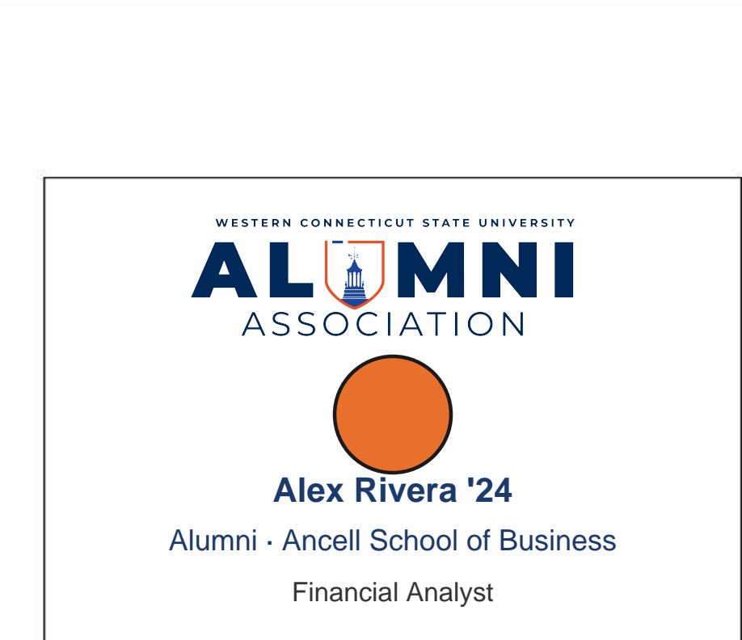

# 🎓 WCSU Alumni Meet & Greet — Name Badge Generator

> **Event:** WCSU Alumni Association Meet & Greet · March 25, 2026
> **Venue:** Western Connecticut State University, Danbury, CT
> **Output:** Print-ready PDF — color-coded by WCSU school affiliation

---

## 📛 Badge Formats

Two formats are supported, selected with the `--type` flag. **Adhesive is the default.**

### Adhesive (default) — Avery 5395, 8-up

Print directly onto [Avery 5395](https://www.avery.com/templates/5395) adhesive name badge labels (3-3/8" × 2-1/3", 8 per sheet). Peel and stick — no cutting needed.


### Paper — WCSU Template, 6-up

Print on letter-size cardstock and cut along the grid lines. Uses the branded WCSU badge template background.



---

## 🎨 Color Legend

Each badge header (adhesive) or circle (paper) is color-coded to the attendee's WCSU school affiliation, auto-detected from their `Class / Major` field:

| Color | School / Group | Hex |
|---|---|---|
| 🟠 **Orange** | Ancell School of Business | `#E8702A` |
| 🔵 **Navy** | School of Arts & Sciences | `#1B3A6B` |
| 🟣 **Purple** | School of Visual & Performing Arts | `#8E44AD` |
| 🟢 **Green** | School of Professional Studies | `#27AE60` |
| 🟡 **Dark Gold** | Faculty / Staff | `#D4AC0D` |
| ⬜ **Gray** | Community Guest / Unknown | `#7F8C8D` |


---

## 📁 Project Structure

```
wcsu-badge-generator/
├── generate_badges.py                        # 🐍 Main badge generation script
├── requirements.txt                          # 📦 Python dependencies
├── README.md                                 # 📖 This file
├── CLAUDE.md                                 # 🤖 AI assistant context file
├── .gitignore
│
├── template/
│   ├── badge_template.pdf                    # 🖼  Paper badge template, single page (committed, ~140 KB)
│   ├── wcsu_aa_logo.png                      # 🖼  WCSU Alumni Association logo (committed)
│   ├── template_blank.png                    # 🖼  Auto-generated from badge_template.pdf on first run (gitignored)
│   └── avery_blank.png                       # 🖼  Auto-generated from Avery PDF on first run (gitignored)
│
├── docs/
│   ├── Avery5395AdhesiveNameBadges.pdf       # 📄  Avery 5395 blank template (committed)
│   ├── sample_badge.png                      # 🖼  Example adhesive badge (for README)
│   ├── sample_badge_paper.png                # 🖼  Example paper badge (for README)
│   └── badge_color_legend.png                # 🖼  Color legend grid — all 6 schools (for README)
│
├── data/
│   └── registrants.csv                       # 📋 Registrant export from Google Sheets (gitignored — PII)
│
└── output/
    ├── 2026_MeetGreet_NameTags_Adhesive.pdf  # ✅ Adhesive output — print on Avery 5395 (gitignored)
    └── 2026_MeetGreet_NameTags_Paper.pdf     # ✅ Paper output — print on cardstock (gitignored)
```

---

## ⚙️ Prerequisites

- Python 3.10–3.13 required — **3.13 recommended** (Python 3.14+ not yet supported by all dependencies)
- `pip` / `venv`
- `template/badge_template.pdf` and `template/wcsu_aa_logo.png` are committed — no manual setup needed
- Template PNGs (`template_blank.png`, `avery_blank.png`) are auto-generated on first run

---

## 🐍 Setup — macOS

```bash
# 1. Navigate to the project folder
cd path/to/wcsu-badge-generator

# 2. Create a virtual environment
python3 -m venv .venv

# 3. Activate the virtual environment
source .venv/bin/activate

# 4. Install dependencies
pip install -r requirements.txt

# 5. Verify setup
python3 -c "import reportlab, pypdfium2, PIL; print('✅ All dependencies ready')"
```

> **To deactivate** when done: `deactivate`

---

## 🪟 Setup — Windows 11

> **Important:** On Windows, `python` may point to a newer version than what this project supports. Run `python --version` first. If it shows **3.14 or higher**, use the Python Launcher to target 3.13 explicitly — see step 3 below.

```powershell
# 1. Open PowerShell and navigate to the project folder
cd C:\path\to\wcsu-badge-generator

# 2. Check your Python version
python --version

# 3. Create a virtual environment
#    If python --version shows 3.10–3.13, use:
python -m venv .venv
#    If python --version shows 3.14+, target 3.13 explicitly:
#    py -3.13 -m venv .venv

# 4. Activate the virtual environment
.venv\Scripts\Activate.ps1
# If you get an execution policy error, run this first (once):
# Set-ExecutionPolicy -ExecutionPolicy RemoteSigned -Scope CurrentUser

# 5. Install dependencies
pip install -r requirements.txt

# 6. Verify setup
python -c "import reportlab, pypdfium2, PIL; print('All dependencies ready')"
```

> **To deactivate** when done: `deactivate`
> **Tip:** To find which Python your system is using: `where python`

---

## 🚀 Workflow 1 — Standard Event Run (adhesive, Google Sheets CSV)

This is the main workflow for the Meet & Greet event. Produces Avery 5395 adhesive labels by default.

### Step 1 — Export the latest registrant data

1. Open the Google Sheet: [WCSU Meet & Greet 2026 Registration](YOUR_GOOGLE_SHEET_URL)
2. Go to **File → Download → Comma-separated values (.csv)**
3. Save/replace the file as `data/registrants.csv`

### Step 2 — Generate adhesive badges (default)

```bash
# macOS / Linux
python3 generate_badges.py

# Windows (PowerShell)
python generate_badges.py
```

**Expected output:**
```
  registrants.csv: detected format 'event'
  registrants.csv: 175 registrants added
Loaded 175 unique registrants
✓ Generated 22 pages for 175 adhesive badges → output/2026_MeetGreet_NameTags_Adhesive.pdf
```

### Step 3 — Print

1. Open `output/2026_MeetGreet_NameTags_Adhesive.pdf`
2. Load **Avery 5395** adhesive name badge sheets into your printer
3. Print at **100% scale** — do not "fit to page"
4. Peel and apply — no cutting needed

> ⚠️ **Always regenerate from the latest CSV export** before printing.

---

## 🖨 Workflow 2 — Paper Badges (WCSU branded template)

Use `--type paper` to generate the WCSU-branded 6-up paper badge layout instead.

```bash
# macOS / Linux
python3 generate_badges.py --type paper

# Windows (PowerShell)
python generate_badges.py --type paper
```

Output: `output/2026_MeetGreet_NameTags_Paper.pdf`

Print on **letter-size cardstock** (65–80 lb) and cut along the grid lines. Each badge is approximately 4-1/4" × 3-2/3".

---

## 📋 Workflow 3 — Class Roster CSV

If you have a class list CSV (e.g. exported from a grade book or registrar system), pass it directly — no conversion step needed. The script auto-detects the format.

**Class roster CSV required columns:**

| Column | Notes |
|---|---|
| `First Name` | Student first name |
| `Last Name` | Student last name |
| `Registration Options` | Usually `Student` |
| `Class / Major` | Used for school color detection (e.g. `Ancell School of Business`) |

```bash
# macOS / Linux — adhesive (default)
python3 generate_badges.py \
  --csv "data/Class List ACC 306 - Sheet1.csv" \
  --name ACC306_Badges

# macOS / Linux — paper format
python3 generate_badges.py \
  --csv "data/Class List ACC 306 - Sheet1.csv" \
  --name ACC306_Badges_Paper \
  --type paper

# Windows (PowerShell)
python generate_badges.py `
  --csv "data/Class List ACC 306 - Sheet1.csv" `
  --name ACC306_Badges
```

Output goes to `output/ACC306_Badges.pdf` (`.pdf` extension added automatically).

---

## 🗂 Workflow 4 — Combine Multiple CSVs

Pass `--csv` multiple times to merge sources into one PDF. Duplicates are removed automatically (matched by email, or first+last name if no email).

```bash
# macOS / Linux
python3 generate_badges.py \
  --csv data/registrants.csv \
  --csv "data/Class List ACC 306 - Sheet1.csv" \
  --name Combined_Badges

# Windows (PowerShell)
python generate_badges.py `
  --csv data/registrants.csv `
  --csv "data/Class List ACC 306 - Sheet1.csv" `
  --name Combined_Badges
```

Both `event` and `classlist` CSV formats can be freely mixed.

---

## 🏷 CSV Format Reference

Two layouts are auto-detected by their column headers.

### Format A — Event registrant export (e.g. Google Sheets / Eventbrite)

| Column | Required | Notes |
|---|---|---|
| `Attendee (First Name)` | ✅ | |
| `Attendee (Last Name)` | ✅ | |
| `Registration Options` | ✅ | `Alumni` / `Student` / `Faculty/Staff` / `Community` |
| `Class / Major` | ✅ | Used for school color detection and graduation year |
| `Email` | optional | Used for deduplication (preferred over name) |
| `Community Business/Organization` | optional | Shown on badge for community/faculty guests |
| `Occupation / Position Title` | optional | Third line on badge |

### Format B — Class roster / simple list

| Column | Required | Notes |
|---|---|---|
| `First Name` | ✅ | |
| `Last Name` | ✅ | |
| `Registration Options` | ✅ | Usually `Student` |
| `Class / Major` | ✅ | e.g. `Ancell School of Business` |

> Cells containing `N/A`, `NA`, `None`, `-`, `TBD`, or similar values are automatically treated as blank.

---

## 🎛 All Command-Line Options

```
python3 generate_badges.py [options]

--csv PATH        Path to a registrant CSV. Repeat for multiple files.
                  Default: data/registrants.csv

--type TYPE       Badge format: adhesive (default) or paper
                    adhesive → Avery 5395, 8-up, 3-3/8"×2-1/3"
                    paper    → WCSU template, 6-up, 4-1/4"×3-2/3"

--name FILENAME   Output filename — saved to output/ automatically.
                  .pdf extension added if omitted.
                  Example: --name ACC306  → output/ACC306.pdf

--output PATH     Full output path (overrides --name and default location).
```

**Default output filenames** (when neither `--name` nor `--output` is given):
- Adhesive: `output/2026_MeetGreet_NameTags_Adhesive.pdf`
- Paper: `output/2026_MeetGreet_NameTags_Paper.pdf`

Run `python3 generate_badges.py --help` for the full reference including CSV column details.

---

## 🏫 School Detection Logic

The script keyword-matches the `Class / Major` and `Community Business/Organization` fields to assign a school. Matching priority:

1. **Exact org match** — if `"Ancell"` appears in the org field → Ancell
2. **Visual & Performing Arts** — graphic design, theater, DIMA, dance, music, film…
3. **Professional Studies** — education, MHA, health administration, counseling…
4. **Ancell School of Business** — accounting, finance, management, MBA, BBA, MIS…
5. **School of Arts & Sciences** — biology, psychology, history, nursing, BSN, cybersecurity…
6. **Faculty/Staff** — any Faculty/Staff registrant not matched to a specific school
7. **Community Guest** — any Community registrant
8. **Default (gray)** — no keyword match (e.g. ambiguous major like `"BA"` or `"2019"`)

### Fixing an Unmatched Badge

If a badge shows gray, update `Class / Major` in the CSV and re-run:

| Scenario | Fix |
|---|---|
| Major entered as just `"BA"` | Change to `"BA English"` or specific field |
| Only a graduation year (e.g. `"2019"`) | Add major: `"2019 / Nursing"` |
| Typo like `"buisness"` | Correct to `"Business"` |
| Healthcare role | Change to `"Health Sciences"` |

---

## 🖨 Print Tips

| Format | Media | Scale | Per sheet |
|---|---|---|---|
| **Adhesive** | Avery 5395 adhesive name badge labels | 100% — do NOT fit to page | 8 labels |
| **Paper** | Letter cardstock, 65–80 lb | 100% — do NOT fit to page | 6 badges (cut along lines) |

---

## 🤖 Regenerating with Claude / AI

This project was originally built using [Claude in Cowork mode](https://claude.ai). The `CLAUDE.md` file provides full project context so Claude can pick up where it left off — including updating the script, adjusting colors, fixing school mappings, or regenerating from a fresh CSV.

To resume work with Claude, simply open this project folder in Cowork and reference `CLAUDE.md`.
